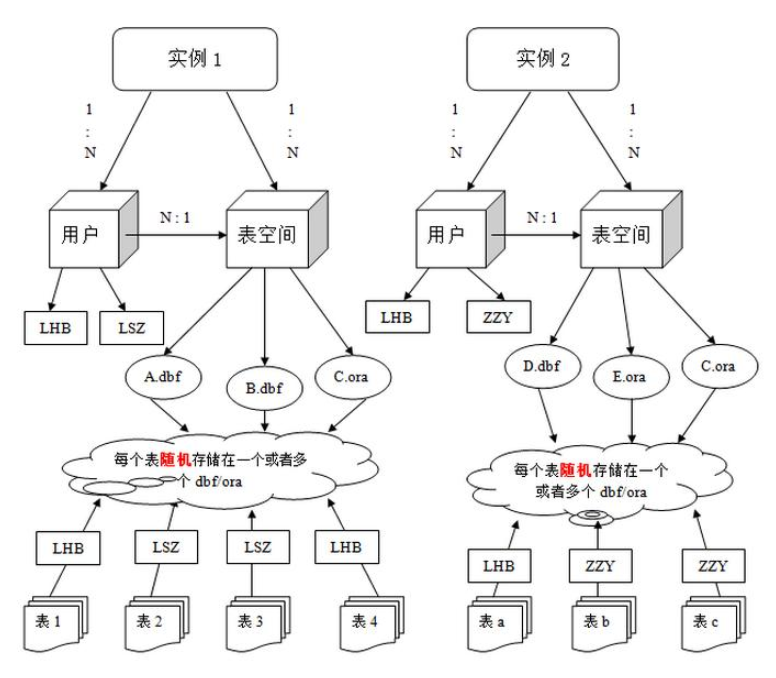
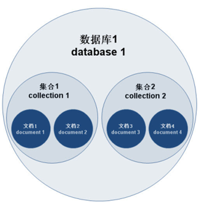
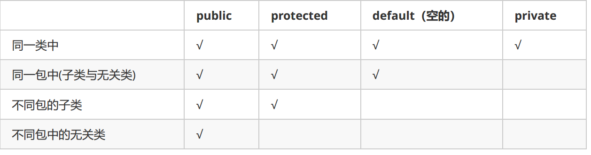

#  1.String :字符串

​    包含功能:字符串对象;提供了两个String比较,长度,内容,顺序;是否包含指定char数据;String长度,根据索引查找char,或根据char查找索引,
    返回byte char数组的String形式,删除String前后的空白;是否满足指定前缀\后缀;按符号拆分String返回String数组,替换指定的字符
    按开始索引和结束索引提取,新的字符串,转换大小写;返回基本类型的String形式;

'**String拼接**

只要是使用"" 都是在堆中字符常量池字创建中,

使用 new 创建的字符串,要堆开辟一遍空间,再去字符常量找相对应的字符(诺没有则创建)

字符常量池在创建字符是,要在底层创建了byte类型并对ASC!!!编码表的数据/拼接就是byte数组;

字符串的拼接;

​	常量与常量拼接("a"+"b")

​		是先在字符常量池中创建(已创建则直接使用),然后在字符常量池拼接;

​	常量与变量 或 变量与变量 ((String a="a")+(String b="b"))

​		是先在堆中创建一个字符缓冲区(StringBuffer),在字符缓冲区进行拼接,然后返回一个String

**常用方法**

​        equals(Object anObject) 比较
        charAt(int index) 查找
        indexOf(int ch) (int ch, int fromIndex) (String str) (String str, int fromIndex) 查找 fromIndex为指定开始索引
        contains(CharSequence s)  包含
        copyValueOf(char[] data) (char[] data, int offset, int count)  转换为String
        endsWith(String suffix)  是否以指定的后缀结束  startsWith(String prefix)  是否以指定前缀开始。
        getChars(int srcBegin, int srcEnd, char[] dst, int dstBegin)  将字符从此字符串复制到目标字符数组。
        length() 长度
        split(String regex) 根据符号 拆分String   (String regex, int limit) limit 参数控制模式应用的次数
        toCharArray()  将此字符串转换为一个新的字符数组。
        getBytes()   将此字符串转换为一个新的字节数组。

​	contains(CharSequence s):当且仅当此字符串包含指定的 char 值序列时，返回 true。 

​		注:CharSequence类是String类的子类, 

# 2.Arrays    数组的工具类

​    数组的工具类,辅助数组
    包含功能:查找指定数组是否包含指定元素,截取,填充,复制,比较,替换,计算哈希码,排序,返回String形式

**常用方法**

​        sort(byte[] a) 升序 (byte[] a, int fromIndex, int toIndex) 指定范围 升序
        toString(T[] a)  返回String

# 3.Math   数学工具类

​    数学工具类
    包含功能:计算绝对值,反余弦,反正弦,反正切,转换坐标,立方根,上中下取整,三角余弦,e的次幂,等等,还有卡看不懂的

**常用方法**

​        abs(T a)  返回 T(基本数据) 值的绝对值。
        ceil(double a) 上取整
        floor(double a) 下取整
        round((double/float ) a) 四舍五入 (        floor(x+0.5)  )

# 4.Object 顶级父类

​    java中的顶级父类;所有类直接,间接继承这个类,Object包含的功能,Java所有类都可以直接调用
    包含功能;复制,比较,返回路径,哈希码,返回对象的字符串,对象自己启动垃圾回收器(自杀?),线程的停止,启动

**常用方法**

​        wait()  无线/指定毫秒,停止/无限停止执行该方法的线程,  在同步中使用,由同步锁或同步方法内的this调用;
        notify()    启动一个(按暂停顺序)在同步锁或同步方法内的this上无限\有限暂停的线程
        notifyAll()  启动全部在同步锁或同步方法内的this上无限\有限暂停的线程
        equals(Object obj)   比较
        getClass()  返回此 Object 的运行时类(路径)。
        hashCode()  返回该对象的哈希码值。

# 5.Objects Object的工具类

​    Object的工具类,辅助Object类操作
    包含功能,比较,哈希码

# 6.Date 时间对象

​    表示当前的时间,精确到毫秒; Java毫秒值开始的日期1970 年 1 月 1 日 00:00:00
    包含功能;比较日期前后,返回毫秒值;哈希码;偏移时间;返回特定格式的日期String形式

**常用方法**

​        getTime()  返回毫秒值
        setTime(long time)  从开始的日期偏移,以毫秒 为单位

# 7.DateFormat  抽象类

​    抽象类,专门格式化和解析日期或时间。
    包含功能;定义了日期很多的字段,不知道有什么用
    返回日期/时间格式器,解析指定格式的String,返回Date对象,返回时区,哈希码

**常用方法**

​    parse(String source)  从给定字符串的开始解析文本，以生成一个日期。
    format(Date date)   将一个 Date 格式化为日期/时间字符串


# 8.SimpleDateFormat 格式化时间类

DateFormat的子类,构造中要设置指定日期格式的String,

​    包含功能;主要就是格式化和解析日期或时间。
    时间格式规则; "yyyy.MM.dd G 'at' HH:mm:ss z"  ==  2001.07.04 AD at 12:08:56 PDT
                    y 年,M 年中的月,w 月份中的周数 ,D 年中的天数 ,d 月份中的天数 ,F 月份中的星期 ,
                    E星期中的天数 ,H 一天中的小时数（0-23）,m 小时中的分钟数 , s  分钟中的秒数
                    S 毫秒数 , z/z 时区,

**常用方法**

​        parse(String source)  从给定字符串的开始解析文本，以生成一个日期。
        format(Date date)   将一个 Date 格式化为日期/时间字符串。

# 9.calendar  万年历类

​    抽象类 万年类,可以将一个日期,解析成日期中药获取的 属性值
    包含功能; 偏移,判断日期前后,比较,返回给定日历字段的值,反转关于时间的来这里找

**常用字段**

​        年:
        YEAR 年, DAY_OF_YEAR 当前年中的天数,
        月:
        MONTH 月份(从0开始)   DATE  一个月中的某天, DAY_OF_WEEK_IN_MONTH 前月中的第几个星期,
        星期:
        DAY_OF_WEEK  一个星期中的某天。
        时间;
        HOUR 指示上午或下午的小时, HOUR_OF_DAY 指示一天中的小时 MINUTE 一小时中的分钟
        SECOND 一分钟中的秒 MILLISECOND 一秒中的毫秒。

**常用方法**

​        getInstance() 构造返回一个calendar对象,对象的时间是当前时间
        get(int field) 取出指定时间字段所代表的属性值;
        set 更改calendar对象的时间属性
        (int year, int month, int date, int hourOfDay, int minute)
        (int year, int month, int date, int hourOfDay, int minute, int second)
        year(年) month(月) date(月中的某天) hourOfDay(一天中的小时) minute(一小时中的分钟) second(一分钟中的秒)

# 10.StringBuilder

# 11.Systrm

# 12.基本类型包装类

​    1.int==Integer
    2.char==Character
    3.byte==Byte
    4.long==Long
    5.short==Short
    6.float==Float
    7.double==Double
    8.boolean==Boolean

# 13.集合

##     1.单列集合

###         1.Collction<泛型> 抽象类

​		单列集合的顶级父类,包含单列集合中,所有基本方法

​		功能包括集合的添加,集合类型整体添加,比较,包含, 哈希码,判断,移除两集合交集/并集的元素,返回迭代器,集合长度,返回数组形式

**常用方法**

​		add(E e)  addAll(Collection<? extends E> c)  添加

​		contains(Object o)  containsAll(Collection<?> c)  包含

​		equals(Object o) 比价

​		isEmpty()  不包换元素true

​		iterator()  返回集合的迭代器

​		remove(Object o)  删除集合中指定元素,

​		removeAll(Collection<?> c)   删除集合中包含指定集合中的所有元素

​		retainAll(Collection<?> c) 	 保留包含指定集合中的所有元素

​		size()  集合长度

​		toArray()  (T[] a)  返回集合的数组形式,会将返回的数组中的元素放入指定数组中


###         2.List<泛型> 接口

​			继承Collction,代表有序集合,有索引

​			功能包括:在Collction上 添加了索引;可通过索引进行操作;

​			常用方法;

###         3.AttayList<泛型>

​			继承List,以数组结构为基础,初始化为10 空间,当达到临界值是空间提升当前1.5倍

​			特定;改 查快,增 删慢;

**常用方法**

​		set(int index, E element)  替换;

​		remove(int index)  删除指定索引上的元素

​		get(int index)  取指定索引上的元素

​		indexOf(Object o) 指定元素在集合中第一次出现的索引 

​		 lastIndexOf(Object o)  指定元素在集合中最后一次出现的索引 

###         4.LinkedList<泛型>

​			继承List,以链表结构为基础,初始化为16 空间,当达到临界值(原大小的0.75)空间提升当前2倍

​			特定;改 查慢,增 删快;

​			由于是链表结构,增加了很多从头或从尾,添加,删除等操作;

​		常用方法;

​			

###         5.Set<泛型> 接口

###         6.HashSet<泛型>

###         7.LinkedHashSet<泛型>

### 	8.Collctions 单列集合辅助类

##     2.双列集合

###         1.Map<泛型,泛型>

###        2.HashMap<泛型,泛型>

###         3.LinkedHashMap<泛型,泛型>

###         4.Properties

# 14.异常

##     1.Exception 异常

##     2.Error 错误

# 15.多线程

##     1.Thread  线程类

​	方法:

​	public static Thread currentThread()   :返回执行这个方法的线程的对象/返回当前线程的对象

​	public static void yield()   暂停执行该方法的线程,让该线程放弃CPU的执行权,等待下次获得执行​

# 16.线程池

##     1.Executor  

##     2.ExecutorService

##     3.Executors

# 17.lambda表达式

# 18.File

# 19.IO流

##     1.字节流

###         1.字节输入流

####             1.InputStream	顶级父类

####             2.FileInputStream	基础

####             3.BufferedInputStream		缓冲

###         2.字节输出流

####             1.Outputstream	顶级父类

####             2.FileOutputStream	基础

####             3.BufferedOutputStream	缓冲

## 2.字符流

###     1.字符输入流

####         1.Reader		顶级父类

####         2.FileReader		基础

####         3.BufferedReader	缓冲

####         4.InputStreamReader	转换

### 2.字符输出流

####     1.Writer			顶级父类

####     2.FileWriter			基础

####     3.BufferedWriter	缓冲

####     4.OutputStreamWriter	转换

## 3.序列化

###         1.ObjectOutputStream 序列化流

###         2.ObjectOutputStream 反序列化流

### 3.Serializable	class版本号标记接口

transient 瞬态关键字,不用序列化

## 4.PrintStream	打印流

# 20.网络编程

​	三次握手

第一次握手：建立连接时，客户端发送syn包(syn=j)到服务器，并进入SYN_SEND状态，等待服务器确认；

第二次握手：服务器收到SYN包，必须确认客户的SYN（ack=j+1），同时自己也发送一个SYN包（syn=k）

​    即SYN+ACK包，此时服务器进入SYN_RECV状态；

第三次握手：客户端收到服务器的SYN＋ACK包，向服务器发送确认包ACK(ack=k+1)，

​    此包发送完毕，客户端和服务器进入ESTABLISHED状态，完成三次握手。

完成三次握手，客户端与服务器开始传送数据.

 	四次挥手

第一次挥手:客户端A发送一个FIN.用来关闭客户A到服务器B的数据传送

第二次挥手:服务器B收到这个FIN. 它发回一个ACK，确认序号为收到的序号+1。和SYN一样,一个FIN将占用一个序号

第三次挥手:服务器B关闭与客户端A的连接，发送一个FIN给客户端A

第四次挥手:客户端A发回ACK报文确认，并将确认序号设置为序号加1

##     1.服务端

###         1.ServerSocket

##     2.客服端

###         1.Socket

# 21.函数式接口  JDK1.8出现

## 1.comparable(排序)

内部比较器,在方法外,类中,主要用于在定义类时,让类的对象有默认排序规则;

**方法**

abstract  boolean  CompareTo(T e); this-e 升,e-this 降

## 2.comparator(排序)

外部比较器;在当数组,集合等容器,调用sort(排序)方法时,可以使用的自定义排序规则;

**方法**

abstract  boolean Compare(T e,T ee); e-ee 升,ee-e降

## 3.FileFilter(文件过滤)

过滤器:在方法类对传入的参数,进行条件判断;

**方法**

public abstract boolean accept(File f)  判断参数文件名是否满足条件


## 4.FilenameFilter(文件夹过滤)

过滤器;在方法类对传入的参数,进行条件判断;

**方法**

abstract  boolean accept(File dir,String name); 测试指定文件是否应该包含在某一文件列表中。 

dir - 被找到的文件所在的目录。 name - 文件的名称。


## 5.Supplier<T>(生产)

可生产一个泛型 类型的数据

**方法**

abstract  T get(), 方法类定义并返回一个T类型的参数

## 6.Consumer<T>(消费)

可对一个参数进行操作;

**方法**

abstract  void accept(T t);  

default Consumer<T>  andThen(Consumer<? super T> after); 

​	这是接口默认方法,先运行调用这个方法的接口的accept,再返回参数接口,返回的参数接口在调用accept方法

如;接口.andThen(接口2).accept(元素); 效果等同于,一个元素被两个接口调用;

## 7.Predicate<T>(判断)

可对一个参数进行条件判断;

**方法**

abstract  boolean test(T t)  设置条件判断;

default Predicate<T> and(Predicate<? super T> other)

​	两个判断接口的 与 操作

default Predicate<T> or(Predicate<? super T> other)

​	两个判断接口的 或 操作

static <T> Predicate<T> isEqual(Object targetRef)

​	boolean值相同则为 true,不同为false

default Predicate<T> negate()

​	boolean值取反

## 8.Function<T,R>(转换)

​	将T 类型 的参数,转换为R类型的返回值

**方法**

abstract R apply(T t)

default <V> Function<T,V> andThen(Function<? super R,? extends V> after)

​		这是接口默认方法,先运行调用这个方法的接口的apply,再返回参数接口,返回的参数接口在调用apply方法

​	如;接口.andThen(接口2).andThen(元素); 效果等同于,一个元素被两个接口调用;

default <V> Function<V,R> compose(Function<? super V,? extends T> before)

​		这是接口默认方法,先运行参数接口的apply方法,再返回调用接口,返回的调用接口在调用apply方法

​	如;接口.compose(接口2).accept(元素); 

## 9.Runnable  线程任务

线程运行的任务

**方法**

abstract void run(); 方法内写入线程任务代码

## 10.IntFunction<R>

创建数组

R apply(int value)  根据value 创建R类型的数组


# 22.Stream  管道流(加工流水线)

Stream流是利用函数式接口,对元素进行操作;

主要操作的对象:数组,集合,I/O channel,产生器 generator等容器;

操作原理,首先获取Stream流,然后设置工序(操作Stream内的方法),返回结果;

特性:Pipelining(返回本身/流水作业),内部迭代;

**方法**

​	'**过滤**

Stream<T>    filter(Predicate<? super T> predicate)

​	按条件过滤元素,返回过滤的元素流

​	'**截取**

Stream<T>   limit(long maxSize)

​	截取前maxSize个元素,返回截取的元素流

​	'**跳过**

Stream<T>   skip(long n)

​	跳过前n个元素,返回没有跳过的元素流

​	'**映射**

<R> Stream<R>     map(Function<? super T,? extends R> mapper)

​	映射(转换)元素,将当前的元素类型(?)映射成另一个元素类型(?),返回映射后的Stream流

​	'**合并**

static <T> Stream<T>   concat(Stream<? extends T> a,Stream<? extends T> b)

​	将两个Stream流,合并成一个Stream流,

​	'**排序**

Stream<T>   sorted ()   (Comparator<? super T> comparator)

​	将元素排序,返回排序后的Stream流

​	'**操作1**

Stream<T>    peek(Consumer<? super T> action)

​	操作Stream元素,返回操作之前的Stream流

​	'**操作2**

void   forEach(Consumer<? super T> action)

​	操作Stream元素,没有返回

​	'**个数**

long   count()

​	统计Stream流内有元素个数

​	'**返回集合**

collect(collectors.tolist());

​	返回list集合,包含Strean流中的元素

collect(collectors.toset());

​	返回set集合,包含Strean流中的元素

​	'**返回数组**

toarray()

​	返回数组,包含Strean流中的元素

# 23.反射机制

​	设计框架的灵魂

​	将一个类的各个组成部分封装一个个对象;这就是反射机制

​		好处:1.可以程序运行过程中,操作这些对象;

​			2.可以解耦,提高程序的可扩展性;(?)

## 	1.Class	字节码类

​			通过字节码类来获取类的Field(变量) Constructor(构造器) Method(方法) 等对象

​		构造(获取对象方法):

​			1.Class.forName(".class类型数据");{就是 类的路径加上类名}

​			2.类名.Class

​			3.对象名.getClass

​			'**方法**''

​			getAnnotation(Class<A> annotationClass)  ;获取定义在类名上指定的注释

​			getAnnotations() 	;获取在类名上所有的注释

​			getClassLoader()  ;返回该类的类加载器

​			getPackage()   获取此类的包。

​			getName()  获取此类的String 名称。

​			newInstance()   空参创建该类对象

​			'**Field**'

​			getField(String name) 	 获取Public修饰指定类中的变量。

​			getFields() 	获取Public修饰所有类中的变量。

​			getDeclaredField(String name)  获取指定类中的变量。

​			getDeclaredFields()  获取所有类中的变量。

​			'**Constructor**'

​			getConstructor(Class<?>... parameterTypes)  获取Public修饰指定类中的构造方法。

​			getConstructors() 		获取Public修饰所有类中的构造方法。

​			getDeclaredConstructor(Class<?>... parameterTypes)  获取指定类中的构造方法。

​			getDeclaredConstructors() ;获取所有类中的构造方法

​			'**Method**'

​			getMethod(String name, Class<?>... parameterTypes)  获取Public修饰指定类中的成员方法。

​			getMethods() 获取Public修饰所有类中的成员方法。

​			getDeclaredMethod(String name, Class<?>... parameterTypes)  获取指定类中的成员方法。

​			getDeclaredMethods()  	获取所有类中的成员方法

​			

## 	2.Field	变量类

​			通过Class类创建的对象;可以调用Class类中定义的类的成员变量

​		'**方法**'

​			getAnnotation(Class<T> annotationClass)   方法指定类型的注释

​			get(Object obj)  返回指定对象上此 Field 表示的字段的值。

​			set(Object obj, Object value)   将指定对象变量上此 Field 对象表示的字段设置为指定的新值。

​			getName() 获取此对象的String 名称。

​			setAccessible()  暴力反射;调用私有化的变量

## 	3.Constructor	构造类

​			通过Class类创建的对象;可以调用Class类中定义的类的构造方法

​		'**方法**'

​			equals(Object obj) 	比较指定对象是不是使用这个构造器创建的

​			newInstance()    创建对象,按获取构造器参数的形式,传参

​			setAccessible()  暴力反射;调用私有化的构造

## 	4.Method	方法类

​			通过Class类创建的对象;可以调用Class类中定义的类的成员方法

​		'**方法**'

​			getName()   获取此对象的String 名称

​			invoke(Object obj, Object... args)  传该方法对象的类的对象;传参方法需要的内容,调用方法

​			setAccessible()  暴力反射;调用私有化的方法

​			

## 	5.ClassLoader 类加载器类

​			将类加载入内存的工具;现

​		'**方法**'

​			getResourceAsStream(String name)  搜索指定文件返回流;多用于陪着文件

# 24.注解

​		JDK1.5之后出现的新特性

​		用于对向JVM说明代码

## 	1.JDK定义的注解

​			@Override  :检测被注解的方法是否是继承父类的

​			@Deprecated:标记方法已过时

​			@Suppresswarnings("all"):	压制所有警告

## 	2.测试注解

​			在使用测试的要求,包明"Test",方法名"Test+原方法名",方法无参数,无返回值			

​			@Test   标记的方法,能独立运行 org.junit.Assert;

​			@Before		标记方法在Test方法之前运行,一定运行,多用于开启资源

​			@After		标记方法在Test方法之后运行,一定运行,多用于关闭资源

## 	3.Assert断言类 

​			配合测试使用的类;断言:就是预判运行的结果,

## 4.元注解

# 25.MySQL 语法;

​	

​	Sql优化:sql

​		1.执行的顺序,控制where having 的条件  where 后面的条件的从一开始从基表中开始筛选,返回结果集,在分组,分组条件having ,having 后面尽量用聚合函数,不是聚合函数作为条件的跟在where 后面,

​		2.sql语句优化,多表查询改单表查询,

SELECT   u.name,
			  (SELECT   q.name   FROM    qqq q   WHERE q.id = u.id) 
FROM  USER u;

​		3.索引优化,在查询量大的字段上建立索引,触发索引提高查询效率,触发索引必须用引列中的原始值筛选

​		


​	命令行命令;

​		登录:mysql   -hIP(数据库所在的IP,在本机可省略) -u用户 -p密码

​		退出:exit

​		启动mysql服务;net start mysql

​		关闭mysql服务;net stop mysql

​		常用类型;

​			int 整数(4个byte)

​			double(总位数,小数位数)  浮点

​			varchar(m) ;字符串;m字符长度

​			time 时间 

​			date 日期

​			timestamp 时间错:默认当前日期时间  

​			ENUM(男,女,.....): 固定输入的值

​		事务

​			将多个sql语句当做一个整体

​			开启事务： start transaction;		

​			回滚：rollback;		

​			提交：commit;

​			修改	select @@autocommit;      set @@autocommit=1 (自动)or 0(手动);

​			特性:原子性,持久性,隔离性,一致性

​			

​		事务安全级别:

​			read uncommitted：读未提交
			read committed：读已提交
			repeatable read：可重复读
			serializable：串行化

​			修改	select @@tx_isolation;  	set global transaction isolation level  级别字符串;

​		锁:

​			在innoDB引擎,在语句后边增加 for update 则会对语句上锁,

​		当语句查询的是主键时,则是行级别的锁,否则是表级别的锁


命令行：

​		语法：

​			备份： mysqldump -u用户名 -p密码 数据库名称 > 保存的路径

​			还原：

​			登录数据库

​			创建数据库

​			使用数据库

​			执行文件。source 文件路径


			* mysql中忘记了root用户的密码？
				1. cmd -- > net stop mysql 停止mysql服务
					* 需要管理员运行该cmd
				2. 使用无验证方式启动mysql服务： mysqld --skip-grant-tables
				3. 打开新的cmd窗口,直接输入mysql命令，敲回车。就可以登录成功
				4. use mysql;
				5. update user set password = password('你的新密码') where user = 'root';
				6. 关闭两个窗口
				7. 打开任务管理器，手动结束mysqld.exe 的进程
				8. 启动mysql服务
				9. 使用新密码登录。
				重新安装呀！


## 1.DDL:操作数据库,表

操作库

查询

show databases;查询所有库

show create datdabase  库名;查询指定库

创建

create database 库名;创建库

create database if not(不) exists(存在) 库名;库名不存在则创建

create database 库名 character set 字符集;创建库指定字符集

修改

alter database 库名 character set 字符集;修改字符集

删除

drop database 库名;

drop database fi exists 库名;存在则删除

操作表

use 库名; 进入库

select database(); 查询进入库的名称

show tables;查询进入库中所有的表名称;

desc table 表名;查询表的结构

创建

create table 表名(字段列名1 字段类型1,.............字段列名n 字段类型n);创建表;后面括号前的语句不用加 " , " 

删除

drop table [if exists] 表名;删

复制

create table 新表名 like 被复制的表名;

修改

alter table 表名 rename to 新表名;修改表名

alter table 表名 character set 字符集;修改表的字符集

alter table 表名 add 字段列名 字段类型; 添加字段

alter table 表名 change 原列名 新字段列名 新字段类型;修改字段列名及类型 

alter table 表名 modify 原字段列名 新字段类型;修改 字段的类型

alter table 表名 drop 列名;删除字段列

## 2.DML:增删改表中的数据

添加

insert into表名(列名1.....列名n) values(值1......值n);

列名与值要一一对应,列名及列名的括号省略,则表示添加表中全字段的值

删除

delete from 表名 where 列名1=值;

删除表中列名1 等于值 的记录,诺不使用where 则删除表所有的记录

修改

update 表名 set 列名1=要改的值 where 列名2=值;

修改表中列名1 的值  并且等于列名2 的值的那些记录 

## 3.DQL:查询表中的数据

整体的语法;

'**select** 字段列表 '**from** 表明列表 '**where** 条件  '**group by** 分组字段  '**having**  分组之后条件 

'**order by** 排序列表(asc 升序   desc 降序)  '**limit** 分页限定;

​		条件运算符

​			< > <=  >= =(等于) <>(不等于)

​				字段 < 字段;

​			between  10 and 20; 在10-20之间,包含10 和20 ;

​				字段 between  10 and 20;

​			in(1,2,3,......n),等于括号中的数据 

​				字段 in(1,2,3,......n);

​			is null;为空  ;is not unll 不为空

​				字段 is null;

​			like ;模糊     

​				字段 like _(单字符模糊) /%(多字符模糊)

​			and(与)   or(或)    not(不)

​		函数

​			mysql replace 
			用法1.replace intoreplace into table (id,name) values('1','aa'),('2','bb') 
			此语句的作用是向表table中插入两条记录。 
			2.replace(object, search,replace) 
			把object中出现search的全部替换为replace select replace('www.163.com','w','Ww')--->WwW wWw.163.com 
			例：把表table中的name字段中的 aa替换为bbupdate table set name=replace(name,'aa','bb') 

​			distinct 字段 :去除重复

​			count(字段) 统计字段的个数

​			COUNT(DISTINCT 字段) 统计该字段去重后的个数

​			sum(字段) 求和

​	 		avg(字段) 平均

​			max(字段)最大值

​			min(字段)最小值

​			ifnull(字段,0);诺字段为null 则为0;

​			LAST() 函数返回指定的列中最后一个记录的值。

​			UCASE() 函数把字段的值转换为大写。

​			LCASE() 函数把字段的值转换为小写。

​			ROUND(要舍入的字段,规定要返回的小数位数)

​				函数用于把数值字段舍入为指定的小数位数。

​			LEN() 函数返回文本字段中值的长度


​			

​		约束

​			唯一; unique 	创建 放类型后面表示	添加 修改类型,在类型后面添加(保证字段中没有重复数据) 删除:alter table 表名drop index 列名;

​			非空;not null 创建  放类型后面表示 	添加 修改类型,在类型后面添加(保证字段中没有null数据) 删除修改类型不要加;

​			主键;primary key 创建 放类型后面表示 添加 修改类型,在类型后面添加(保证字段中数据为空并且唯一)  删除	alter table 表名 drop primary key;

​			primary key(字段1,字段2,....):联合主键,单独占一个列名位置

​			自增:auto_increment 创建  放类型和约束后面表示 	添加 修改类型,在类型后面添加(保证字段为数值类型) 删除修改类型不要加

​			默认;dafule  创建  放类型,约束,后面表示 	添加 修改类型,在类型后面添加(保证字段为数值类型) 删除修改类型不要加

​			外键;foreign key 

语法:[constraint 外键名称] foreign key (本表字段) references 主表名(字段);

​			创建  单独占一个列名位置, 添加 当列添加  删除 alter table 表名 drop foreign key 外键名称

​		多表查询

​		内连接;

​			1.使用where 取出无用数据

​			2.select 字段列表 from 表明1 [inner] join 表名2 on 条件

​		外连接

​			1.select 字段列表 from 表名1 left [outer] join 表名2 on 条件

​				表名1 中全部数据及表名2与表名1 有交集的数据

​			2.select 字段列表 from 表名1 rigth [outer] join 表名2 on 条件

​				表名2 中全部数据及表名1与表名2 有交集的数据

​		子查询:语句嵌套,嵌套的语句称为子查询

​			子查询结果单行单列:当做一个值判断;

​			子查询结果多行单列:当做一个集合判断;

​			子查询结果多行多列:当做一个表,并且起一个别名,进行操作;

##  	4.DCL:用户管理,权限管理

1. 管理用户
  1. 添加用户：
    * 语法：CREATE USER '用户名'@'主机名' IDENTIFIED BY '密码';
  2. 删除用户：
    * 语法：DROP USER '用户名'@'主机名';
  3. 修改用户密码：
UPDATE USER SET PASSWORD = PASSWORD('新密码') WHERE USER = '用户名';
UPDATE USER SET PASSWORD = PASSWORD('abc') WHERE USER = 'lisi';

SET PASSWORD FOR '用户名'@'主机名' = PASSWORD('新密码');
SET PASSWORD FOR 'root'@'localhost' = PASSWORD('123');

* mysql中忘记了root用户的密码？
  1. cmd -- > net stop mysql 停止mysql服务
    * 需要管理员运行该cmd

  2. 使用无验证方式启动mysql服务： mysqld --skip-grant-tables
  3. 打开新的cmd窗口,直接输入mysql命令，敲回车。就可以登录成功
  4. use mysql;
  5. update user set password = password('你的新密码') where user = 'root';
  6. 关闭两个窗口
  7. 打开任务管理器，手动结束mysqld.exe 的进程
  8. 启动mysql服务
  9. 使用新密码登录。

  4. 查询用户：
      -- 1. 切换到mysql数据库
      USE myql;
      -- 2. 查询user表
      SELECT * FROM USER;
  
    * 通配符： % 表示可以在任意主机使用用户登录数据库

2. 权限管理：
  1. 查询权限：
    -- 查询权限
    SHOW GRANTS FOR '用户名'@'主机名';
    SHOW GRANTS FOR 'lisi'@'%';

  2. 授予权限：
    -- 授予权限
    grant 权限列表 on 数据库名.表名 to '用户名'@'主机名';
    -- 给张三用户授予所有权限，在任意数据库任意表上

    GRANT ALL ON *.* TO 'zhangsan'@'localhost';

  3. 撤销权限：
    -- 撤销权限：
    revoke 权限列表 on 数据库名.表名 from '用户名'@'主机名';
    REVOKE UPDATE ON db3.`account` FROM 'lisi'@'%';


# 25.Oracle

​	1.Oracle结构

​			

## 	1.用户操作

--创建表空间
create tablespace yang    ----创建 表空间 名字
datafile 'c:\yang.dbf'    ----表空间数据保存 到路径
size 100m    ----大小为 Xm
autoextend on    ----自动扩容
next 10m;    ----每次扩容为 Xm

--删除表空间
drop tablespace yang;

--创建用户
create user XXXXX    ----创建 用户 名字
identified by XXXXX    ----指定用户的密码 密码
default tablespace yang;    ----关联 表空间 名字

--给用户授权
--oracle数据库中常用角色
connect--连接角色，基本角色
resource--开发者角色
dba--超级管理员角色
--给yang用户授予dba角色
grant dba to yang;

## 	2.表操作

--先删除表，再次创建表。效果等同于删除表中全部记录。
--在数据量大的情况下，尤其在表中带有索引的情况下，该操作效率高。
--索引可以提供查询效率，但是会影响增删改效率。
truncate table person;

## 3.函数

### 1.单行函数

---**字符函数**
select upper('yes') from dual;--YES
select lower('YES') from dual;--yes
----**数值函数**
select round(56.16, -2) from dual;---四舍五入，后面的参数表示保留的位数
select trunc(56.16, -1) from dual;---直接截取，不在看后面位数的数字是否大于5.
select mod(10, 3) from dual;---求余数
----**日期函数**
----查询出emp表中所有员工入职距离现在几天。
select sysdate-e.hiredate from emp e;
----**算出明天此刻**
select sysdate+1 from dual;
----查询出emp表中所有员工入职距离现在几月。
select months_between(sysdate,e.hiredate) from emp e;
----查询出emp表中所有员工入职距离现在几年。
select months_between(sysdate,e.hiredate)/12 from emp e;
----查询出emp表中所有员工入职距离现在几周。
select round((sysdate-e.hiredate)/7) from emp e;
----**转换函数**
---**日期转字符串**
select to_char(sysdate, 'fm yyyy-mm-dd hh24:mi:ss') from dual;
---**字符串转日期**
select to_date('2018-6-7 16:39:50', 'fm yyyy-mm-dd hh24:mi:ss') from dual;
----**通用函数**
---算出emp表中所有员工的年薪
----奖金里面有null值，如果null值和任意数字做算术运算，结果都是null。
select e.sal*12+nvl(e.comm, 0) from emp e;


### 2.多行函数

select count(1) from emp;---查询总数量
select sum(sal) from emp;---工资总和
select max(sal) from emp;---最大工资
select min(sal) from emp;---最低工资
select avg(sal) from emp;---平均工资


### 3.分组查询

---查询出每个部门的平均工资
---分组查询中，出现在group by后面的原始列，才能出现在select后面
---没有出现在group by后面的列，想在select后面，必须加上聚合函数。
---聚合函数有一个特性，可以把多行记录变成一个值。
select e.deptno, avg(e.sal)--, e.ename
from emp e
group by e.deptno;

---所有条件都不能使用别名来判断。
--比如下面的条件语句也不能使用别名当条件

----where是过滤分组前的数据，having是过滤分组后的数据。
---表现形式：where必须在group by之前，having是在group by之后。


### 4.oracle中的分页

---rownum行号：当我们做select操作的时候，
--每查询出一行记录，就会在该行上加上一个行号，
--行号从1开始，依次递增，不能跳着走。

----排序操作会影响rownum的顺序
select rownum, e.* from emp e order by e.sal desc
----如果涉及到排序，但是还要使用rownum的话，我们可以再次嵌套查询。
select rownum, t.* from(
select rownum, e.* from emp e order by e.sal desc) t;


----emp表工资倒叙排列后，每页五条记录，查询第二页。
----rownum行号不能写上大于一个正数。
select * from(
    select rownum rn, tt.* from(
          select * from emp order by sal desc
    ) tt where rownum<11
) where rn>5

## 	4.PL/Sql

### 0.条件表达式


---条件表达式
---条件表达式的通用写法，mysql和oracle通用
---给emp表中员工起中文名
select e.ename, 
       case e.ename
         when 'SMITH' then '曹贼'
           when 'ALLEN' then '大耳贼'
             when 'WARD' then '诸葛小儿'
               --else '无名'
                 end
from emp e;
---判断emp表中员工工资，如果高于3000显示高收入，如果高于1500低于3000显示中等收入，
-----其余显示低收入

select e.sal, 
       case 
         when e.sal>3000 then '高收入'
           when e.sal>1500 then '中等收入'
               else '低收入'
                 end
from emp e;

----oracle中除了起别名，都用单引号。

### 1.序列

----序列不真的属于任何一张表，但是可以逻辑和表做绑定。
----序列：默认从1开始，依次递增，主要用来给主键赋值使用。
----dual：虚表，只是为了补全语法，没有任何意义。
create sequence s_person;
select s_person.nextval from dual;

方法:  **currval**:返回当前的序列号  **nextval** :返回下一个的序列号


### 2.视图

---视图的概念：视图就是提供一个查询的窗口，所有数据来自于原表。

---查询语句创建表
create table emp as select * from scott.emp;
select * from emp;
---创建视图【必须有dba权限】
create view v_emp as select ename, job from emp;
---查询视图
select * from v_emp;
---修改视图[不推荐]
update v_emp set job='CLERK' where ename='ALLEN';
commit;
---创建只读视图
create view v_emp1 as select ename, job from emp with read only;
---视图的作用？
---第一：视图可以屏蔽掉一些敏感字段。
---第二：保证总部和分部数据及时统一。

缺点:影响查询效率

### 3.索引

--索引的概念：索引就是在表的列上构建一个二叉树
----达到大幅度提高查询效率的目的，但是索引会影响增删改的效率。     
---单列索引
---创建单列索引 
create index idx_ename on emp(ename);
---单列索引触发规则，条件必须是索引列中的原始值。
---单行函数，模糊查询，都会影响索引的触发。
select * from emp where ename='SCOTT'
---复合索引
---创建复合索引
create index idx_enamejob on emp(ename, job);
---复合索引中第一列为优先检索列
---如果要触发复合索引，必须包含有优先检索列中的原始值。
select * from emp where ename='SCOTT' and job='xx';---触发复合索引
select * from emp where ename='SCOTT' or job='xx';---不触发索引
select * from emp where ename='SCOTT';---触发单列索引。


### 4.声明方法

---pl/sql编程语言
---pl/sql编程语言是对sql语言的扩展，使得sql语言具有过程化编程的特性。
---pl/sql编程语言比一般的过程化编程语言，更加灵活高效。
---pl/sql编程语言主要用来编写存储过程和存储函数等。


---赋值操作可以使用:=也可以使用into查询语句赋值
declare
    i number(2) := 10;
    s varchar2(10) := '小明';
    ena emp.ename%type;---引用型变量
    emprow emp%rowtype;---记录型变量
begin
    dbms_output.put_line(i);
    dbms_output.put_line(s);
    select ename into ena from emp where empno = 7788;
    dbms_output.put_line(ena);
    select * into emprow from emp where empno = 7788;
    dbms_output.put_line(emprow.ename || '的工作为：' || emprow.job);
end;


---pl/sql中的if判断
---输入小于18的数字，输出未成年
---输入大于18小于40的数字，输出中年人
---输入大于40的数字，输出老年人
declare
  i number(3) := &ii;
begin
  if i<18 then
    dbms_output.put_line('未成年');
  elsif i<40 then
    dbms_output.put_line('中年人');
  else
    dbms_output.put_line('老年人');
  end if;
end;

### 5.pl/sql中的loop循环

---用三种方式输出1到10是个数字
---**while循环**
declare
  i number(2) := 1;
begin
  while i<11 loop
     dbms_output.put_line(i);
     i := i+1;
  end loop;  
end;
---exit循环
declare
  i number(2) := 1;
begin
  loop
    exit when i>10;
    dbms_output.put_line(i);
    i := i+1;
  end loop;
end;
---for循环
declare

begin
  for i in 1..10 loop
     dbms_output.put_line(i);  
  end loop;
end;

### 6.游标

：可以存放多个对象，多行记录。

---输出emp表中所有员工的姓名
declare
  cursor c1 is select * from emp;
  emprow emp%rowtype;
begin
  open c1;
     loop
         fetch c1 into emprow;
         exit when c1%notfound;
         dbms_output.put_line(emprow.ename);
     end loop;
  close c1;
end;


### 7.存储过程

--存储过程：存储过程就是提前已经编译好的一段pl/sql语言，放置在数据库端
--------可以直接被调用。这一段pl/sql一般都是固定步骤的业务。
----给指定员工涨100块钱
create or replace procedure p1(eno emp.empno%type)
is

begin
   update emp set sal=sal+100 where empno = eno;
   commit;
end;

select * from emp where empno = 7788;
----测试p1
declare

begin
  p1(7788);
end;

----通过存储函数实现计算指定员工的年薪
----存储过程和存储函数的参数都不能带长度
----存储函数的返回值类型不能带长度

----存储函数在调用的时候，返回值需要接收。


---out类型参数如何使用
---使用存储过程来算年薪
create or replace procedure p_yearsal(eno emp.empno%type, yearsal out number)
is
   s number(10);
   c emp.comm%type;
begin
   select sal*12, nvl(comm, 0) into s, c from emp where empno = eno;
   yearsal := s+c;
end;

----in和out类型参数的区别是什么？
---凡是涉及到into查询语句赋值或者:=赋值操作的参数，都必须使用out来修饰。


---存储过程和存储函数的区别
---语法区别：关键字不一样，
------------存储函数比存储过程多了两个return。
---本质区别：存储函数有返回值，而存储过程没有返回值。
----------如果存储过程想实现有返回值的业务，我们就必须使用out类型的参数。
----------即便是存储过程使用了out类型的参数，起本质也不是真的有了返回值，
----------而是在存储过程内部给out类型参数赋值，在执行完毕后，我们直接拿到输出类型参数的值。

----我们可以使用存储函数有返回值的特性，来自定义函数。
----而存储过程不能用来自定义函数。
----使用存储函数来实现提供一个部门编号，输出一个部门名称。


### 8.触发器

是制定一个规则，在我们做增删改操作的时候，
----只要满足该规则，自动触发，无需调用。
----语句级触发器：不包含有for each row的触发器。
----行级触发器：包含有for each row的就是行级触发器。
-----------加for each row是为了使用:old或者:new对象或者一行记录。

---行级别触发器
---不能给员工降薪
---raise_application_error(-20001~-20999之间, '错误提示信息');
create or replace trigger t2
before
update
on emp
for each row
declare

begin
  if :old.sal>:new.sal then
     raise_application_error(-20001, '不能给员工降薪');
  end if;
end;


触发器实现主键自增
---分析：在用户做插入操作的之前，拿到即将插入的数据，
------给该数据中的主键列赋值。
create or replace trigger auid
before(在语句之前执行)/alter(在语句之后执行)
insert
on person
for each row
declare

begin
  select s_person.nextval into :new.pid from dual;
end;
--查询person表数据
select * from person;
---使用auid实现主键自增
insert into person (pname) values ('a');
commit;
insert into person values (1, 'b');
commit;


# 26.JDBC ----Java数据库连接

​		**概念** ; sum公司为了在Java代码中统一的使用代码操作数据库,提供的一套接口,

​	接口的实现由数据库公司实现;只要使用Java多态的特性,操作接口,

​		这也可以是 Java 跨平台性的一种体现,编写一套Java操作数据库的代码,就可以操作多个数据库;

​	操作不同的数据库,唯一的差别就是需要加载操作对应的数据库的驱动类,(等同于JVM的系统版本)

​		注册驱动:Class.forName("com.mysql.jdbc.driver")(其中一种)

​		衔接数据库的排头:jdbc:mysql://localhost:3306/库名

​	常用JDBC对象:

​		'**DriverManager:数据的驱动管理对象**

​			static void registerDriver(Driver driver) ;

​			注册驱动 

​			static Connection getConnection(String url, String user, String password)  	

​			url:为衔接数据库的排头  user/password:账号密码

​			返回数据库的连接对象;

​		'**Connection:数据库的连接对象**

​			Statement  createStatement()  返回SQL语句执行对象

​			PreparedStatement  prepareStatement(String sql)   返回SQL语句执行对象

​			void  close() :释放资源

​			setAutoCommit(boolean autoCommit)   设置事务的提交方式 true 自动提交

​			int  getTransactionIsolation()     获取事务隔离级别

​			void commit()    提交

​			void rollback()    回滚

​		'**Statement:静态SQL执行对象**
			void close()  释放资源

​			 boolean execute(String sql)   执行任意sql语句

​			int executeUpdate(String sql)   执行DML DDL 语句 返回影响的行数

​			ResultSet executeQuery(String sql)    执行DQL 语句 返回结果集对象

​			Connection getConnection()   获取生成此 Statement 对象的 Connection 对象

​			int getFetchSize() 获取结果集合的行数

​		'**PreparedStatement:动态SQL执行对象**

​			为了防止SQL语句注入:语句中的变量 用 ? 表示

​			boolean execute(String sql)   执行任意sql语句

​			int executeUpdate(String sql)   执行DML DDL 语句 返回影响的行数

​			ResultSet executeQuery(String sql)    执行DQL 语句 返回结果集对象

​			ResultSetMetaData getMetaData()    获取包含有关 ResultSet 对象列信息的对象

​			setXXX(int s, xxxx x) 	XXXX为要放入的数据类型    s 表示第几个 ? 号	 x表示要放入的值

​		'**Resultset :DQL的结果集对象** 

​			ResultSetMetaData getMetaData()  检索此 ResultSet对象的列的数量，类型和属性。 

​			void close()  关闭资源

​			void refreshRow()   用数据库中最新的值刷新当前行。 

​			void afterLast()  将光标移动到最后一行之后

​			boolean isAfterLast()   检索光标是否在此 ResultSet对象中的最后一行之后。 

​			void beforeFirst()  将光标移动到第一行之前

​			boolean isBeforeFirst()   检索光标是否在此 ResultSet对象中的第一行之前。 

​			void deleteRow()   从此 ResultSet对象和底层数据库中删除当前行。

​			getXXXX(int columnIndex)    XXXX为要取数据的类型  columnIndex列数 从1开始

​			getXXXX(String columnLabel)  XXXX为要取数据的类型  columnLabel列名

​			void updateRow()   使用此 ResultSet对象的当前行的新内容更新底层数据库。 ?

​			void insertRow()   将插入行的内容插入到此 ResultSet对象中并进入数据库。 ?

​	'**ResultSetMetaData :结果集的数据(列名,列数,列的类型)**

​			int getColumnCount()  返回此 ResultSet对象中的列数。 

​			String getColumnName(int column)   获取指定列的名称。 

​			String getColumnTypeName(int column)  检索指定列的数据库的类型名称。

​			String getTableName(int column)   获取指定列的表名称。


# 27.JDBC ---数据库连接池

​		连接池就是几个容器,储存的是数据库连接的对象,这个为了连接对象的重复使用,

​		当系统初始化好后,容器被创建容,容器中会申请一些连接对象,当用户访问数据库时,会从容器中获取连接对象,用户访问玩之后,会将连接对象归还给容器;---------节约资源,用户访问高效,

​	'**1.DataSource :连接池的接口------第三方**'

​		方法:getconnection();获得一个连接对象,

​			注:从连接池中获得的对象,重写了cloes方法,调用后不再是关闭资源,而是归还连接对象给连接池

​	'**2.C3P0:连接池的类------第三方**'

​		combopooleddatasource()(String xx): 连接池对象 xx 是配置文件中指定配置的名字

​			方法:getconnection();获得一个连接对象,

​	'**3.Druid:连接池的类------第三方**'

​		配置文件为druid.properties.文件 需要.class加载器查找;

​		DruidDataSourceFactory.createdataSource(properties xx);连接池对象 xx 是properties 对象

​			方法:getconnection();获得一个连接对象,

​	'**4.SpringJDBC:Spring框架辅助JDBC应用类------第三方**' 

​		连接池包装类,简化了JDBC的开发,(简化了归还,释放,结果集对象,等操作)

​			JDBCTemplate(DataSource  xx);连接池包装类,创建需要连接池对象,

​		方法

​			int update(String sql,?..xx); 

​				增删改方法; ? 是SQL语句中的 ? 的值

​			Map<String,ojbect> queryForMap(String sql,?... xx) 

​				只能返回一行记录,用Map集合储存,? 是SQL语句中的 ? 的值,

​			List<Map<String,ojbect>> queryforList(String sql,?... xx)

​				返回一行记录,用Map集合储存,然后存储入List ,? 是SQL语句中的 ? 的值,

​			list<?>  query(String sql,Rowmapper<?>() x,?... xx)

​				使用自定义对象接收数据,将对象存入List中,Roemapper是接口,需要使用

​			实现类BeanPropertiesRowmapper<对象>(对象.class)

​			?    queryForObject(String sql,?.calss) 返回单个数据

​				应用于单个数据


# 228.前端

* JavaWeb：
  * 使用Java语言开发基于互联网的项目

* 软件架构：
  1. C/S: Client/Server 客户端/服务器端
    * 在用户本地有一个客户端程序，在远程有一个服务器端程序
    * 如：QQ，迅雷...
    * 优点：
      1. 用户体验好
    * 缺点：
      1. 开发、安装，部署，维护 麻烦
  2. B/S: Browser/Server 浏览器/服务器端
    * 只需要一个浏览器，用户通过不同的网址(URL)，客户访问不同的服务器端程序
    * 优点：
      1. 开发、安装，部署，维护 简单
    * 缺点：
      1. 如果应用过大，用户的体验可能会受到影响

      2. 对硬件要求过高

         

* B/S架构详解
  * 资源分类：
    1. 静态资源：
      * 使用静态网页开发技术发布的资源。
      * 特点：
        * 所有用户访问，得到的结果是一样的。
        * 如：文本，图片，音频、视频, HTML,CSS,JavaScript
        * 如果用户请求的是静态资源，那么服务器会直接将静态资源发送给浏览器。浏览器中内置了静态资源的解析引擎，可以展示静态资源
    2. 动态资源：
      * 使用动态网页及时发布的资源。
      * 特点：
        * 所有用户访问，得到的结果可能不一样。
        * 如：jsp/servlet,php,asp...
        * 如果用户请求的是动态资源，那么服务器会执行动态资源，转换为静态资源，再发送给浏览器B/S架构详解
          * 资源分类：
            1. 静态资源：
              * 使用静态网页开发技术发布的资源。
              * 特点：
                * 所有用户访问，得到的结果是一样的。
                * 如：文本，图片，音频、视频, HTML,CSS,JavaScript
                * 如果用户请求的是静态资源，那么服务器会直接将静态资源发送给浏览器。浏览器中内置了静态资源的解析引擎，可以展示静态资源
            2. 动态资源：
              * 使用动态网页及时发布的资源。
              * 特点：
                * 所有用户访问，得到的结果可能不一样。
                * 如：jsp/servlet,php,asp...
                * 如果用户请求的是动态资源，那么服务器会执行动态资源，转换为静态资源，再发送给浏览器

* 静态资源：
  * HTML：用于搭建基础网页，展示页面的内容
  * CSS：用于美化页面，布局页面
  * JavaScript：控制页面的元素，让页面有一些动态的效果

## 1.HTML


文件标签：构成html最基本的标签

html:html文档的根标签

head：头标签。用于指定html文档的一些属性。引入外部的资源

title：标题标签。

body：体标签

<!DOCTYPE html>：html5中定义该文档是html文档

文本标签：和文本有关的标签

注释：<!-- 注释内容 -->

<h1> to <h6>：标题标签

h1~h6:字体大小逐渐递减

p：段落标签

'br  换行标签   \r\n     >  <  

<hr>：展示一条水平线

属性：

color：颜色

width：宽度  

size：高度    height

align：对其方式

center：居中

left：左对齐

right：右对齐

<b>：字体加粗

<i>：字体斜体

<u>：字体下划线

<font>:字体标签

<center>:文本居中

属性：

color：颜色

size：大小

face：字体

属性定义：

color：-- 颜色

英文单词：red,green,blue

rgb(值1，值2，值3)：值的范围：0~255  如  rgb(0,0,255)

值1值2值3：值的范围：00~FF之间。如： #FF00FF

width： 宽度

height: 高度

数值：width='20' ,数值的单位，默认是 px(像素)

数值%：占比相对于父元素的比例


概念：是最基础的网页开发语言

Hyper Text Markup Language 超文本标记语言

超文本:

超文本是用超链接的方法，将各种不同空间的文字信息组织在一起的网状文本.

标记语言:

由标签构成的语言。<标签名称> 如 html，xml 

标记语言不是编程语言

快速入门：

语法：

html文档后缀名 .html 或者 .htm

标签分为

围堵标签：有开始标签和结束标签。如 <html> </html>

自闭和标签：开始标签和结束标签在一起。如 <br/>

标签可以嵌套：需要正确嵌套，不能你中有我，我中有你
错误：<a><b></a></b>
正确：<a><b></b></a>

在开始标签中可以定义属性。属性是由键值对构成，值需要用引号(单双都可)引起来

html的标签不区分大小写，但是建议使用小写。

代码：
<html>

<head>
	<title>title</title>
</head>

<body>
	<FONT color='red'>Hello World</font><br/>
	

<font color='green'>Hello World</font>

</body>
</html>


标签学习：

文件标签：构成html最基本的标签

* html:html文档的根标签
* head：头标签。用于指定html文档的一些属性。引入外部的资源
* title：标题标签。
* body：体标签
* <!DOCTYPE html>：html5中定义该文档是html文档

文本标签：和文本有关的标签

* 注释：<!-- 注释内容 -->

* <h1> to <h6>：标题标签
  * h1~h6:字体大小逐渐递减

* <p>：段落标签

* <br>：换行标签   \r\n     >  <  

* <hr>：展示一条水平线
  * 属性：
    * color：颜色
    * width：宽度  
    * size：高度    height
    * align：对其方式
      * center：居中
      * left：左对齐

      * right：右对齐

* <b>：字体加粗

* <i>：字体斜体

* <u>：字体下划线

* <font>:字体标签

* <center>:文本居中
  * 属性：
    * color：颜色
    * size：大小
    * face：字体

* 属性定义：
  * color：
    1. 英文单词：red,green,blue
    2. rgb(值1，值2，值3)：值的范围：0~255  如  rgb(0,0,255)
  * width：
  * height:
    1. 数值：width='20' ,数值的单位，默认是 px(像素)
    2. 数值%：占比相对于父元素的比例


3. 图片标签：
  * img：展示图片
    * 属性：
    	* src：指定图片的位置

  * 代码：
     <!--展示一张图片 img-->

      <!--
          相对路径
              * 以.开头的路径
                  * ./：代表当前目录  ./image/1.jpg
                  * ../:代表上一级目录
         -->

      

      
4. 列表标签：<ul>
    <li> 为其三大 </li>
    		</ul>
    * 有序列表：
    	* ol:
    		* li:
    * 无序列表：  
    	* ul:  
    		* li:
5. 链接标签：
  * a:定义一个超链接
  	* 属性：
  		* href：指定访问资源的URL(统一资源定位符)
  		* target：指定打开资源的方式
  			* _self:默认值，在当前页面打开
  			* _blank：在空白页面打开


	* 代码：
			 <!--超链接  a-->
	
		    <a href="http://www.yang.cn">点我</a>
		    <br>
		
		    <a href="http://www.yang.cn" target="_self">点我</a>
		    <br>
		    <a href="http://www.yang.cn" target="_blank">点我</a>
		
		    <br>
		
		    <a href="./5_列表标签.html">列表标签</a><br>
		    <a href="mailto:yang@yang.cn">联系我们</a>
		
		    <br>
		    <a href="http://www.yang.cn"></a>
	6. div 和span：(CSS)
		* div:每一个div占满一整行。块级标签
		* span：文本信息在一行展示，行内标签 内联标签
	
	7. 语义化标签：html5中为了提高程序的可读性，提供了一些标签。
		1. <header>：页眉
		2. <footer>：页脚

表格标签：

table：定义表格

width：宽度

border：边框

cellpadding：定义内容和单元格的距离

cellspacing：定义单元格之间的距离。如果指定为0，则单元格的线会合为一条、

bgcolor：背景色

align：对齐方式

tr：定义行

bgcolor：背景色

align：对齐方式

td：定义单元格

colspan：合并列

rowspan：合并行

th：定义表头单元格

<caption>：表格标题

<thead>：表示表格的头部分

<tbody>：表示表格的体部分

<tfoot>：表示表格的脚部分


### 表单：   提交数据的！

概念：用于采集用户输入的数据的。用于和服务器进行交互。

<form>：用于定义表单的。可以定义一个范围，范围代表采集用户数据的范围
     属性：
        action：指定提交数据的URL
        method:指定提交方式
            分类：一共7种，2种比较常用
               get：一般用于条件搜索，或者是简单查询
                    1. 请求参数会在地址栏中显示。会封装到请求行中(HTTP协议后讲解)。
                    2. 请求参数大小是有限制的。4000字符
                    3. 不太安全。
               post：用户注册
                    2. 请求参数不会再地址栏中显示。会封装在请求体中(HTTP协议后讲解)
                    2. 请求参数的大小没有限制。
                    3. 较为安全。

表单项中的数据要想被提交：必须指定其name属性

表单项标签：

1.<input>：可以通过type属性值，改变元素展示的样式

​	type属性：

​	text：文本输入框，默认值

​		属性:placeholder：指定输入框的提示信息，当输入框的内容发生变化，会自动清空提示信息	

​	password：密码输入框

​	radio:单选框

​		注意：

​		1.要想让多个单选框实现单选的效果，则多个单选框的name属性值必须一样。

​		2.一般会给每一个单选框提供value属性，指定其被选中后提交的值

​		3.checked属性，可以指定默认值

​	checkbox：复选框

​		注意：

​		1.一般会给每一个单选框提供value属性，指定其被选中后提交的值

​		2.checked属性，可以指定默认值

​	file：文件选择框

​	hidden：隐藏域，用于提交一些信息。

​	按钮：

​	submit：提交按钮。可以提交表单

​	button：普通按钮

​	image：图片提交按钮

​	src属性指定图片的路径	

​	<label>：指定输入项的文字描述信息

​		注意：

​		<label>的for属性一般会和 input 的 id属性值 对应。如果对应了，则点击label区域，会让input输入框	获取焦点。

2.<select>: 下拉列表

​		子元素：

​			option，指定列表项

3.<textarea>：文本域

​			cols：指定列数，每一行有多少个字符

​			rows：默认多少行。 


## 2.CSS

​	

概念： Cascading Style Sheets 层叠样式表

  * 层叠：多个样式可以作用在同一个html的元素上，同时生效

好处：

功能强大

将内容展示和样式控制分离

降低耦合度。解耦
让分工协作更容易
提高开发效率

CSS的使用：CSS与html结合方式

内联样式

​	在标签内使用style属性指定css代码

​	如：<div style="color:red;">hello css</div>

内部样式

​	在head标签内，定义style标签，style标签的标签体内容就是css代码

​	如：
	<style>
	    div{
	        color:blue;
	    }
	</style>
	<div>hello css</div>

  3. 外部样式

        定义css资源文件。

        在head标签内，定义link标签，引入外部的资源文件

        如：

        a.css文件：
        	div{
        	    color:green;
        	}
        	<link rel="stylesheet" href="css/a.css">
        	<div>hello css</div>
        	<div>hello css</div>

注意：

1.1,2,3种方式 css作用范围越来越大

2.1方式不常用，后期常用2,3

3.3种格式可以写为：
	<style>
		    @import "css/a.css";
	</style>

css语法：

​	格式：
		选择器 {
		属性名1:属性值1;
		属性名2:属性值2;
		...
	}

选择器:筛选具有相似特征的元素

注意：

​	每一对属性需要使用；隔开，最后一对属性可以不加；

选择器：筛选具有相似特征的元素

分类：

基础选择器

id选择器：选择具体的id属性值的元素.建议在一个html页面中id值唯一   

​	语法：#id属性值{}

元素选择器：选择具有相同标签名称的元素

​	语法： 标签名称{}

​	注意：id选择器优先级高于元素选择器

类选择器：选择具有相同的class属性值的元素。

​	语法：.class属性值{}

​	注意：类选择器选择器优先级高于元素选择器

扩展选择器：

选择所有元素：

​	语法： *{}

并集选择器：

​	选择器1,选择器2{}

子选择器：筛选选择器1元素下的选择器2元素

​	语法：  选择器1 选择器2{}

父选择器：筛选选择器2的父元素选择器1

​	语法：  选择器1 > 选择器2{}

属性选择器：选择元素名称，属性名=属性值的元素

​	语法：  元素名称[属性名="属性值"]{}

伪类选择器：选择一些元素具有的状态

​	语法： 元素:状态{}
		如： <a>
		状态：
		k：初始化的状态
		visited：被访问过的状态
		active：正在访问状态
		hover：鼠标悬浮状态

属性

字体、文本

* font-size：字体大小
* color：文本颜色
* text-align：对其方式
* line-height：行高 

背景

* background：设置背景颜色，或者图片

边框

* border：设置边框，符合属性    

尺寸

* width：宽度
* height：高度

盒子模型：控制布局


margin：外边距

padding：内边距

​	默认情况下内边距会影响整个盒子的大小

box-sizing: border-box;  设置盒子的属性，让width和height就是最终盒子的大小

float：浮动

​	left :左浮动

​	right :右浮动

## 3.JavaScript

​	概念：一门客户端脚本语言
		 运行在客户端浏览器中的。每一个浏览器都有JavaScript的解析引擎

​	脚本语言：不需要编译，直接就可以被浏览器解析执行了

​	功能:可以来增强用户和html页面的交互过程，可以来控制html元素，让页面有一些动态的效果，增强用户的体验。

​	组成:JavaScript = ECMAScript + JavaScript自己特有的东西(BOM+DOM)

​	1.基本语法

​		与html结合方式

​		1.内部JS：定义<script>，标签体内容就是js代码

​		2.外部JS：定义<script>，通过src属性引入外部的js文件

​			注意：

​			<script>可以定义在html页面的任何地方。但是定义的位置会影响执行顺序。

​			<script>可以定义多个。

​	2.数据类型：   var a =10;   Java是一门强类型的语言；JDK10.0  var a = 10;    

​		1.原始数据类型(基本数据类型)：

​			1.number：数字。 整数/小数/NaN(not a number 一个不是数字的数字类型)

​			2.string：字符串。 字符串  "abc" "a" 'abc'

​			3.boolean: true和false

​			4.null：一个对象为空的占位符

​			5.undefined：未定义。如果一个变量没有给初始化值，则会被默认赋值为undefined

​		2.引用数据类型：对象

​	3.变量

​		变量：一小块存储数据的内存空间

​		Java语言是强类型语言，而JavaScript是弱类型语言。

​		强类型：在开辟变量存储空间时，定义了空间将来存储的数据的数据类型。只能存储固定类型的数据

​		弱类型：在开辟变量存储空间时，不定义空间将来的存储数据类型，可以存放任意类型的数据。

​		语法：var 变量名 = 初始化值;

​		typeof运算符：获取变量的类型。

​			注：null运算后得到的是object

​	4.运算符:大体通Java

​		1.+ - 在运算是时,诺不是数字(number类型),会自动转换为数字(number)类型

​			String:可以字面值转换(必须由纯数字组成)

​			booleam:true为1  false为0;

​			其他类型的数据如String包含的字符,这回转换为NaN

​		2.在比较时,类型相同,直接比较,如:String 按字典顺序逐一比较直到有结果,或相等,类型不相同,则会先自动类型转换,再比较,( ===   表示不进行自动类型转换,直接比较)

​		3.其他类型转换为booleam类型;

​			nnumber:0为false 其他为true

​			String;为  "" 为false  其他为true

​			null undefined 都是为false

​			对象为 true

​		4.流程语句:大体同java

​			1.switch 

​				java中( )中能接收int short char byte 枚举(1.5JDK)  String(1.8JDk)

​				javaScript中能接收;可以接收任何类型

​		5.基本对象

​			1.function:函数(方法)对象( 同java中的方法 )

​			创建	1.var 名字 =new function(参数){方法体}

​					2.function 名字 (参数){方法体}

​					3.var 名字=new function (参数){方法体}

​			属性         length:参数的个数

​			特点	1.方法定义 的参数不用类型,有返回值就写 return 没有返回值就不用写

​					2.方法就一个对象,没有重载,名字相同会发生覆盖,与参数无关,只与方法名字有关

​					3.在方法中内置了一个隐藏的对象(数组 arguments ),存放了接收的参数;传入的参数都会存	入数组中,不管有没有定义参数,超过定义的参数,定义的参数,都会存入 arguments 中,定义的参数还可以根据定义的	名字调用;

​			2.Array :数组

​			创建	1.var 名字=new Array(元素列表);

​					2.var 名字=new Array(长度);

​					3.var 名字=[元素列表];

​			方法;	join(参数) :指点打印数组的分隔符,

​					push(参数) 添加元素,返回长度

​			属性	length,数组长度

​			特点	 存在的元素类型可变 长度可变   在定义的长度中.没有存储元素的位上;打印为 undefionde					

​			3.Booleam 布尔类型的封装类

​			4.Date;时间对象

​			创建	直接new

​			方法	tocalestring( )返回当前时间对象的本地String形式

​			5.Math 数学对象

​			创建	不用创建 Math.方法名

​			方法	random( ) 方法0-1之间的随机数,含0不含1,应用   random( )*max :0-max

​					ceil(x) 向上取整,      floor(x) 向下取整    round(x) 四舍五入	

​			属性	PI  :π 

​			6.Number 封装类

​			7.String 封装类

​			8.正则表达式对象(过滤/匹配/筛选)

​				规则 		

​					1.组成:单个字符[ ]:如"\[a] [ab]\[ a-z A-Z 0-9]

​					2.\d:单个数字字符  \w:单个字母字符[a-z A-Z 0-9]

​					3.量词符号:  ?:0次或1次  * :0次或多次   +:1次或多次  {m,n} m<=次数<=n

​					4.^ :开始 $:结束	表达式:/^\w{6,12}$/

​				创建,  var 名字=new RegExp("表达式")

​					var 名字=/表达式/

​				方法	Test(参数) 	验证指定的字符串是否符合正则定义的规范

​			9.Global:全局对象:直接方法名就能调用该对象的方法

​			方法	encodeURI():url编码   只针对于网址的中文
					decodeURI():url解码

​					encodeURIComponent():url编码,编码的字符更多  
					decodeURIComponent():url解码

​					parseInt():将字符串转为数字		         

​						逐一判断每一个字符是否是数字，直到不是数字为止，将前边数字部分转为number

​		    			isNaN():判断一个值是否是NaN		       

​						NaN六亲不认，连自己都不认。NaN参与的==比较全部问false

### 		BOM:

​		

1. 概念：Browser Object Model 浏览器对象模型
  * 将浏览器的各个组成部分封装成对象。

2. 组成：
  * Window：窗口对象
  * Navigator：浏览器对象
  * Screen：显示器屏幕对象
  * History：历史记录对象
  * Location：地址栏对象

3. Window：窗口对象
    1. 创建
    2. 方法
         1. 与弹出框有关的方法：
            alert()	显示带有一段消息和一个确认按钮的警告框。
            confirm()	显示带有一段消息以及确认按钮和取消按钮的对话框。
                * 如果用户点击确定按钮，则方法返回true
                * 如果用户点击取消按钮，则方法返回false
            prompt()	显示可提示用户输入的对话框。
                * 返回值：获取用户输入的值
         2. 与打开关闭有关的方法：
            close()	关闭浏览器窗口。
                * 谁调用我 ，我关谁
            open()	打开一个新的浏览器窗口
                * 返回新的Window对象
         3. 与定时器有关的方式
            setTimeout()	在指定的毫秒数后调用函数或计算表达式。
                * 参数：
                    1. js代码或者方法对象
                    2. 毫秒值
                * 返回值：唯一标识，用于取消定时器
            clearTimeout()	取消由 setTimeout() 方法设置的 timeout。

            setInterval()	按照指定的周期（以毫秒计）来调用函数或计算表达式。
            clearInterval()	取消由 setInterval() 设置的 timeout。

    3. 属性：
        1. 获取其他BOM对象：
            history
            location
            Navigator
            Screen:
        2. 获取DOM对象
            document
    4. 特点
        * Window对象不需要创建可以直接使用 window使用。 window.方法名();
        * window引用可以省略。  方法名();

    

4.Location：地址栏对象

1. 创建(获取)：
   1. window.location
   2. location
2. 方法：
   - reload()	重新加载当前文档。刷新
3. 属性
   - href	设置或返回完整的 URL。

5. History：历史记录对象
    1. 创建(获取)：
        1. window.history
        2. history

    2. 方法：
        * back()	        加载 history 列表中的前一个 URL。
           forward()	加载 history 列表中的下一个 URL。
            go(参数)  	加载 history 列表中的某个具体页面。
            * 参数： 
                * 正数：前进几个历史记录
                * 负数：后退几个历史记录
    3. 属性：
        * length	返回当前窗口历史列表中的 URL 数量。

### DOM

* 概念： Document Object Model 文档对象模型
  * 将标记语言文档的各个组成部分，封装为对象。可以使用这些对象，对标记语言文档进行CRUD的动态操作

* W3C DOM 标准被分为 3 个不同的部分：

  * 核心 DOM - 针对任何结构化文档的标准模型
    * Document：文档对象
    * Element：元素对象
    * Attribute：属性对象
    * Text：文本对象
    * Comment:注释对象

    * Node：节点对象，其他5个的父对象
  * XML DOM - 针对 XML 文档的标准模型
  * HTML DOM - 针对 HTML 文档的标准模型

* 核心DOM模型：
  * Document：文档对象
    1. 创建(获取)：在html dom模型中可以使用window对象来获取
      1. window.document
      2. document
    2. 方法：
      1. 获取Element对象：
        1. getElementById()	： 根据id属性值获取元素对象。id属性值一般唯一
            2. getElementsByTagName()：根据元素名称获取元素对象们。返回值是一个数组
            3. getElementsByClassName():根据Class属性值获取元素对象们。返回值是一个数组
            4. getElementsByName(): 根据name属性值获取元素对象们。返回值是一个数组
      2. 创建其他DOM对象：
         createAttribute(name)  创建拥有指定名称的属性结点,并返回新的Attr对象
           	createComment() 创建注释结点
           	createElement() 创建注释结点
           	createTextNode() 创建文本结点
    3. 属性
  * Element：元素对象
    1. 获取/创建：通过document来获取和创建
    2. 方法：
      1. removeAttribute(属性名)：删除属性
      2. setAttribute(属性名,属性值)：设置属性
  * Node：节点对象，其他5个的父对象
    * 特点：所有dom对象都可以被认为是一个节点
    * 方法：    超链接 href="javascript:void(0);"  ---- 阻止超链接跳转页面,保留点击功能
      * CRUD dom树：
        * appendChild()：向节点的子节点列表的结尾添加新的子节点。
           removeChild()	：删除（并返回）当前节点的指定子节点。
        * replaceChild()：用新节点替换一个子节点。
    * 属性：
      * parentNode 返回节点的父节点。

 HTML DOM
  1. 标签体的设置和获取：innerHTML
  2. 使用html元素对象的属性
  3. 控制元素样式
        1. 使用元素的style属性来设置
      如：
      	 //修改样式方式1
           div1.style.border = "1px solid red";
           div1.style.width = "200px";
           //font-size--> fontSize
           div1.style.fontSize = "20px";
    2. 提前定义好类选择器的样式，通过元素的className属性来设置其class属性值。

  	概念：某些组件被执行了某些操作后，触发某些代码的执行。	
  * 事件：某些操作。如： 单击，双击，键盘按下了，鼠标移动了
  * 事件源：组件。如： 按钮 文本输入框...
  * 监听器：代码。
  * 注册监听：将事件，事件源，监听器结合在一起。 当事件源上发生了某个事件，则触发执行某个监听器代码。
#### 事件

1.点击事件：

1. onclick：单击事件
2. ondblclick：双击事件

  2. 焦点事件
        1. onblur：失去焦点
        2. onfocus:元素获得焦点。

  3. 加载事件：
        1. onload：一张页面或一幅图像完成加载。

  4. 鼠标事件：
    1. onmousedown	鼠标按钮被按下。
    		. onmouseup	鼠标按键被松开。
    		. onmousemove	鼠标被移动。
    		. onmouseover	鼠标移到某元素之上。
    		. onmouseout	鼠标从某元素移开。

5. 键盘事件

   1. onkeydown	某个键盘按键被按下。	

   	. onkeyup		某个键盘按键被松开。

   	. onkeypress	某个键盘按键被按下并松

        

6. 选择和改变
    1. onchange	域的内容被改变。
      2. onselect	文本被选中。

    2. 表单事件：

      onsubmit	确认按钮被点击。

      onreset	        重置按钮被点击。d


# 29,Java EE Wbe

1. 软件架构
  2. C/S：客户端/服务器端
  3. B/S：浏览器/服务器端

4. 资源分类
  5. 静态资源：所有用户访问后，得到的结果都是一样的，称为静态资源.静态资源可以直接被浏览器解析
     * 如： html,css,JavaScript
  6. 动态资源:每个用户访问相同资源后，得到的结果可能不一样。称为动态资源。动态资源被访问后，需要先转换为静态资源，在返回给浏览器
    * 如：servlet/jsp,php,asp....		

7. 网络通信三要素
  8. IP：电子设备(计算机)在网络中的唯一标识。
  9. 端口：应用程序在计算机中的唯一标识。 0~65536
  10. 传输协议：规定了数据传输的规则
        1. 基础协议：
            1. tcp:安全协议，三次握手。 速度稍慢
            2. udp：不安全协议。 速度快

* 服务器：安装了服务器软件的计算机

* 服务器软件：接收用户的请求，处理请求，做出响应

* web服务器软件：接收用户的请求，处理请求，做出响应。
  * 在web服务器软件中，可以部署web项目，让用户通过浏览器来访问这些项目
  * web容器

* 常见的java相关的web服务器软件：
  * webLogic：oracle公司，大型的JavaEE服务器，支持所有的JavaEE规范，收费的。
  * webSphere：IBM公司，大型的JavaEE服务器，支持所有的JavaEE规范，收费的。
  * JBOSS：JBOSS公司的，大型的JavaEE服务器，支持所有的JavaEE规范，收费的。
  * Tomcat：Apache基金组织，中小型的JavaEE服务器，仅仅支持少量的JavaEE规范servlet/jsp。开源的，免费的。

* JavaEE：Java语言在企业级开发中使用的技术规范的总和，一共规定了13项大的规范

* Tomcat：web服务器软件
  1. 下载：http://tomcat.apache.org/
  2. 安装：解压压缩包即可。
    * 注意：安装目录建议不要有中文和空格
  3. 卸载：删除目录就行了
  4. 启动：
    * bin/startup.bat ,双击运行该文件即可

    * 访问：浏览器输入：http://localhost:8080 回车访问自己
           http://别人的ip:8080 访问别人

    * 可能遇到的问题：
      1. 黑窗口一闪而过：
        * 原因： 没有正确配置JAVA_HOME环境变量
        * 解决方案：正确配置JAVA_HOME环境变量

      2. 启动报错：
        3. 暴力：找到占用的端口号，并且找到对应的进程，杀死该进程

           ​	netstat -ano

        4. 温柔：修改自身的端口号

      * conf/server.xml
      * <Connector port="8888" protocol="HTTP/1.1"
             connectionTimeout="20000"
             redirectPort="8445" />
      * 一般会将tomcat的默认端口号修改为80。80端口号是http协议的默认端口号。
        * 好处：在访问时，就不用输入端口号
  5. 关闭：
    1. 正常关闭：
  * bin/shutdown.bat
  * ctrl+c

    2. 强制关闭：
      * 点击启动窗口的×
  6. 配置:
    * 部署项目的方式：
      1. 直接将项目放到webapps目录下即可。
        * /hello：项目的访问路径-->虚拟目录
        * 简化部署：将项目打成一个war包，再将war包放置到webapps目录下。
          * war包会自动解压缩

      2. 配置conf/server.xml文件
          在<Host>标签体中配置
          <Context docBase="D:\hello" path="/hehe" />
        * docBase:项目存放的路径
        * path：虚拟目录

      3. 在conf\Catalina\localhost创建任意名称的xml文件。在文件中编写
          <Context docBase="D:\hello" />
        * 虚拟目录：xml文件的名称

    * 静态项目和动态项目：
      * 目录结构
        * java动态项目的目录结构：
          -- 项目的根目录
          	-- WEB-INF目录：
          		-- web.xml：web项目的核心配置文件
          		-- classes目录：放置字节码文件的目录
          		-- lib目录：放置依赖的jar包

        * 将Tomcat集成到IDEA中，并且创建JavaEE的项目，部署项目。

           概念：运行在服务器端的小程序

## 1.Servlet

* Servlet就是一个接口，定义了Java类被浏览器访问到(tomcat识别)的规则。

* 将来我们自定义一个类，实现Servlet接口，复写方法。

* 快速入门：
  1. 创建JavaEE9=项目
  2. 定义一个类，实现Servlet接口
    * public class ServletDemo1 implements Servlet
  3. 实现接口中的抽象方法
  4. 配置Servlet
      在web.xml中配置：
      <!--配置Servlet -->
      <servlet>
          <servlet-name>demo1</servlet-name>
          <servlet-class>cn.yang.web.servlet.ServletDemo1</servlet-class>
      </servlet>

      <servlet-mapping>
          <servlet-name>demo1</servlet-name>
          <url-pattern>/demo1</url-pattern>
      </servlet-mapping>

* 执行原理：
  1. 当服务器接受到客户端浏览器的请求后，会解析请求URL路径，获取访问的Servlet的资源路径

  2. 查找web.xml文件，是否有对应的<url-pattern>标签体内容。

  3. 如果有，则在找到对应的<servlet-class>全类名

  4. tomcat会将字节码文件加载进内存，并且创建其对象

  5. 调用其方法

     *Servlet中的生命周期方法：

1. 被创建：执行init方法，只执行一次
    * Servlet什么时候被创建？
      * 默认情况下，第一次被访问时，Servlet被创建
      * 可以配置执行Servlet的创建时机。
        * 在<servlet>标签下配置
          1. 第一次被访问时，创建
                 * <load-on-startup>的值为负数
                   2. 在服务器启动时，创建
                    * <load-on-startup>的值为0或正整数
      * Servlet的init方法，只执行一次，说明一个Servlet在内存中只存在一个对Servlet是单例的
      	* 多个用户同时访问时，可能存在线程安全问题。
        * 解决：尽量不要在Servlet中定义成员变量。即使定义了成员变量，也不要对修改值
2. 提供服务：执行service方法，执行多次
  * 每次访问Servlet时，Service方法都会被调用一次。
3. 被销毁：执行destroy方法，只执行一次
  * Servlet被销毁时执行。服务器关闭时，Servlet被销毁
  * 只有服务器正常关闭时，才会执行destroy方法。
  * destroy方法在Servlet被销毁之前执行，一般用于释放资源

* Servlet3.0：
  * 好处：
    * 支持注解配置。可以不需要web.xml了。

  * 步骤：
    1. 创建JavaEE项目，选择Servlet的版本3.0以上，可以不创建web.xml
    2. 定义一个类，实现Servlet接口
    3. 复写方法
    4. 在类上使用@WebServlet注解，进行配置

IDEA与tomcat的相关配置

1. IDEA会为每一个tomcat部署的项目单独建立一份配置文件
  * 查看控制台的log：Using CATALINA_BASE:   "C:\Users\fqy\.IntelliJIdea2018.1\system\tomcat\_yang"

2. 工作空间项目    和     tomcat部署的web项目
  * tomcat真正访问的是“tomcat部署的web项目”，"tomcat部署的web项目"对应着"工作空间项目" 的web目录下的所有资源
  * WEB-INF目录下的资源不能被浏览器直接访问。
3. 断点调试：使用"小虫子"启动 dubug 启动

	. Servlet的体系结构	
    Servlet -- 接口
  	|
    GenericServlet -- 抽象类
  	|
    HttpServlet  -- 抽象类

  * GenericServlet：将Servlet接口中其他的方法做了默认空实现，只将service()方法作为抽象
    * 将来定义Servlet类时，可以继承GenericServlet，实现service()方法即可

  * HttpServlet：对http协议的一种封装，简化操作
    1. 定义类继承HttpServlet
    2. 复写doGet/doPost方法

7. Servlet相关配置
  1. urlpartten:Servlet访问路径
        1. 一个Servlet可以定义多个访问路径 ： @WebServlet({"/d4","/dd4","/ddd4"})
            2. 路径定义规则：
                  1. /xxx：路径匹配
                  2. /xxx/xxx:多层路径，目录结构
                  3. *.do：扩展名匹配

* 概念：Hyper Text Transfer Protocol 超文本传输协议
  * 传输协议：定义了，客户端和服务器端通信时，发送数据的格式
  * 特点：
    1. 基于TCP/IP的高级协议
    2. 默认端口号:80
    3. 基于请求/响应模型的:一次请求对应一次响应
    4. 无状态的：每次请求之间相互独立，不能交互数据

  * 历史版本：
    * 1.0：每一次请求响应都会建立新的连接
    * 1.1：复用连接

* 请求消息数据格式
  1. 请求行
      请求方式 请求url 请求协议/版本
    GET /login.html	HTTP/1.1

    * 请求方式：
      * HTTP协议有7中请求方式，常用的有2种
        * GET：
          1. 请求参数在请求行中，在url后。
          2. 请求的url长度有限制的
          3. 不太安全
        * POST：
          1. 请求参数在请求体中
          2. 请求的url长度没有限制的
          3. 相对安全
  2. 请求头：客户端浏览器告诉服务器一些信息
      请求头名称: 请求头值
    * 常见的请求头：
      1. User-Agent：浏览器告诉服务器，我访问你使用的浏览器版本信息
        * 可以在服务器端获取该头的信息，解决浏览器的兼容性问题

      2. Referer：http://localhost/login.html
        * 告诉服务器，我(当前请求)从哪里来？
          * 作用：
            1. 防盗链：
            2. 统计工作：
  3. 请求空行
      空行，就是用于分割POST请求的请求头，和请求体的。
  4. 请求体(正文)：
    * 封装POST请求消息的请求参数的

  * 字符串格式：
    POST /login.html	HTTP/1.1
    Host: localhost
    User-Agent: Mozilla/5.0 (Windows NT 6.1; Win64; x64; rv:60.0) Gecko/20100101 Firefox/60.0
    Accept: text/html,application/xhtml+xml,application/xml;q=0.9,*/*;q=0.8
    Accept-Language: zh-CN,zh;q=0.8,zh-TW;q=0.7,zh-HK;q=0.5,en-US;q=0.3,en;q=0.2
    Accept-Encoding: gzip, deflate
    Referer: http://localhost/login.html
    Connection: keep-alive
    Upgrade-Insecure-Requests: 1

    username=zhangsan	

* 响应消息数据格式

1. request对象和response对象的原理
  1. request和response对象是由服务器创建的。我们来使用它们
  2. request对象是来获取请求消息，response对象是来设置响应消息

      request对象继承体系结构：	
      ervletRequest		--	接口
      |	继承
      ttpServletRequest	-- 接口
      |	实现
      org.apache.catalina.connector.RequestFacade 类(tomcat)

## 2.ServletRequest功能
  1. 获取请求消息数据
        1. 获取请求行数据
  * GET /day14/demo1?name=zhangsan HTTP/1.1
  * 方法：
    1. 获取请求方式 ：GET
      * String getMethod()  

    2. (*)获取虚拟目录：/day14

      * String getContextPath()

    3. 获取Servlet路径: /demo1
      * String getServletPath()

    4. 获取get方式请求参数：name=zhangsan
      * String getQueryString()

    5. (*)获取请求URI：/day14/demo1
      * String getRequestURI():		/day14/demo1
      * StringBuffer getRequestURL()  :http://localhost/day14/demo1

         URL:统一资源定位符 ： http://localhost/day14/demo1	中华人民共和国
          URI：统一资源标识符 : /day14/demo1					共和国

    6. 获取协议及版本：HTTP/1.1
      * String getProtocol()

    7. 获取客户机的IP地址：
      * String getRemoteAddr()

2. 获取请求头数据
  * 方法：
    * (*)String getHeader(String name):通过请求头的名称获取请求头的值
    * Enumeration<String> getHeaderNames():获取所有的请求头名称

3. 获取请求体数据:
  * 请求体：只有POST请求方式，才有请求体，在请求体中封装了POST请求的请求参数
  * 步骤：
    1. 获取流对象
      *  BufferedReader getReader()：获取字符输入流，只能操作字符数据
      *  ServletInputStream getInputStream()：获取字节输入流，可以操作所有类型数据
             * 在文件上传知识点后讲解

    2. 再从流对象中拿数据

### 通用功能

  3. 获取请求参数通用方式：不论get还是post请求方式都可以使用下列方法来获取请求参数

        1. String getParameter(String name):根据参数名称获取参数值    username=zs&password=123

        2. String[] getParameterValues(String name):根据参数名称获取参数值的数组  hobby=xx&hobby=game

        3. Enumeration<String> getParameterNames():获取所有请求头的参数名称

        4. Map<String,String[]>  getParameterMap():获取所有参数的map集合

* 中文乱码问题：
     * get方式：tomcat 8 已经将get方式乱码问题解决了
     * post方式：会乱码
     * 解决：在获取参数前，设置request的编码request.setCharacterEncoding("utf-8");

   1.请求转发：一种在服务器内部的资源跳转方式

1. 步骤：

    1. 通过request对象获取请求转发器对象：RequestDispatcher getRequestDispatcher(String path)

    2. 使用RequestDispatcher对象来进行转发：forward(ServletRequest request, ServletResponse response) 
      2. 特点：
            1. 浏览器地址栏路径不发生变化
                2. 只能转发到当前服务器内部资源中。
                      3. 转发是一次请求
      3. 共享数据：
      * 域对象：一个有作用范围的对象，可以在范围内共享数据
      * request域：代表一次请求的范围，一般用于请求转发的多个资源中共享数据
      * 方法：
        1. void setAttribute(String name,Object obj):存储数据
        2. Object getAttitude(String name):通过键获取值
    3. 获取ServletContext：
      * ServletContext getServletContext()


## 3. BeanUtils工具类
* 用于封装JavaBean的
1. JavaBean：标准的Java类
  1. 要求：
        1. 类必须被public修饰
            2. 必须提供空参的构造器
                3. 成员变量必须使用private修饰
                    4. 提供公共setter和getter方法
  2. 功能：封装数据

2. 概念：
    成员变量：
  	属性：setter和getter方法截取后的产物
  		例如：getUsername() --> Username--> username
3. 方法：
  1. setProperty()
  2. getProperty()
  3. populate(Object obj , Map map):将map集合的键值对信息，封装到对应的JavaBean对象中


## 4.ServletResponse功能

​	1.HTTP协议(响应)

​		

1. 响应消息：服务器端发送给客户端的数据
  * 数据格式：
    1. 响应行
      2. 组成：协议/版本 响应状态码 状态码描述
      3. 响应状态码：服务器告诉客户端浏览器本次请求和响应的一个状态。
            1. 状态码都是3位数字 
                2. 分类：
                      1. 1xx：服务器就收客户端消息，但没有接受完成，等待一段					

                         时间后，发送1xx多状态码

                      2. 2xx：成功。代表：200

                      3. 3xx：重定向。代表：302(重定向)，304(访问缓存)

                      4. 4xx：客户端错误。
            			* 代表：
            					 * 404（请求路径没有对应的资源） 
            				 * 405：请求方式没有对应的doXxx方法
               	5. 5xx：服务器端错误。代表：500(服务器内部出现异常)
2. 响应头：
	1. 格式：头名称： 值
	2. 常见的响应头：
		1. Content-Type：服务器告诉客户端本次响应体数据格式以及编码格式
		2. Content-disposition：服务器告诉客户端以什么格式打开响应体数据
			* 值：
				* in-line:默认值,在当前页面内打开
				* attachment;filename=xxx：以附件形式打开响应体。文件下载
3. 响应空行
4. 响应体:传输的数据

	* 响应字符串格式
		HTTP/1.1 200 OK
		Content-Type: text/html;charset=UTF-8
		Content-Length: 101
		Date: Wed, 06 Jun 2018 07:08:42 GMT

		<html>
		  <head>
		    <title>$Title$</title>
		  </head>
		  <body>
		  hello , response
		  </body>
		</html>

### Response方法
* 功能：设置响应消息
1. 设置响应行
  1. 格式：HTTP/1.1 200 ok
  2. 设置状态码：setStatus(int sc) 
2. 设置响应头：setHeader(String name, String value) 

3. 设置响应体：
  * 使用步骤：
    1. 获取输出流
      * 字符输出流：PrintWriter getWriter()

      * 字节输出流：ServletOutputStream getOutputStream()

    2. 使用输出流，将数据输出到客户端浏览器
   * 案例：
       1. 完成重定向
           * 重定向：资源跳转的方式
           * 代码实现：
               //1. 设置状态码为302
               response.setStatus(302);
               //2.设置响应头location
               response.setHeader("location","/day15/responseDemo2");
               //简单的重定向方法
               response.sendRedirect("/day15/responseDemo2");
### 面试
  * 重定向的特点:redirect
    1. 地址栏发生变化
    2. 重定向可以访问其他站点(服务器)的资源
    3. 重定向是两次请求。不能使用request对象来共享数据

  * 转发的特点：forward
    1. 转发地址栏路径不变
    2. 转发只能访问当前服务器下的资源
    3. 转发是一次请求，可以使用request对象来共享数据

  * forward 和  redirect 区别

  * 路径写法：
    1. 路径分类
      1. 相对路径：通过相对路径不可以确定唯一资源
        * 如：./index.html
        * 不以/开头，以.开头路径
        
        * 规则：找到当前资源和目标资源之间的相对位置关系
          * ./：当前目录
          * ../:后退一级目录
      2. 绝对路径：通过绝对路径可以确定唯一资源
        * 如：http://localhost/day15/responseDemo2		/day15/responseDemo2
    * 以/开头的路径

    * 规则：判断定义的路径是给谁用的？判断请求将来从哪儿发出
      * 给客户端浏览器使用：需要加虚拟目录(项目的访问路径)
        * 建议虚拟目录动态获取：request.getContextPath()
        * <a> , <form> 重定向...
      * 给服务器使用：不需要加虚拟目录
        * 转发路径
    2. 服务器输出字符数据到浏览器
      * 步骤：
      	1. 获取字符输出流
      	2. 输出数据

      * 注意：
      	* 乱码问题：
      		1. PrintWriter pw = response.getWriter();获取的流的默认编码是ISO-8859-1
      		2. 设置该流的默认编码
      		3. 告诉浏览器响应体使用的编码

      		//简单的形式，设置编码，是在获取流之前设置
      		response.setContentType("text/html;charset=utf-8");
    3. 服务器输出字节数据到浏览器
      * 步骤：
      	1. 获取字节输出流
      	2. 输出数据

    4. 验证码
      1. 本质：图片

      2. 目的：防止恶意表单注册
## 5.BufferedImage验证码对象

​	构造

​		new bufferedimage(长(x),高(y),模式(bufferedimage的常量))

​	方法

​		Graphics getGraphics(); 获得画笔对象	

​	Graphics 方法

​		void setcolor(color的常量) 画笔的颜色

​		void fillRect(x,y,x1,y1)	填充背景色,参数为坐标

​		void drawRect(x,y,x1,y1) 画边框,参数为坐标

​		void drawString(char,x,y),画字符,x,y为坐标

​		void drawLine(x,y,x1,y1)划线,x,y,x1,y1为两点坐标

​	ImageIO.write(bufferedimage对象,"图片格式",response字节流)

## 6.ServletContext对象
1. 概念：代表整个web应用，可以和程序的容器(服务器)来通信
2. 获取：
	1. 通过request对象获取
		request.getServletContext();
	2. 通过HttpServlet获取
		this.getServletContext();
3. 功能：
	1. 获取MIME类型：
		* MIME类型:在互联网通信过程中定义的一种文件数据类型
			* 格式： 大类型/小类型   text/html		image/jpeg

		* 获取：String getMimeType(String file)  
	2. 域对象：共享数据
		1. setAttribute(String name,Object value)
		2. getAttribute(String name)
		3. removeAttribute(String name)

		* ServletContext对象范围：所有用户所有请求的数据
	3. 获取文件的真实(服务器)路径
    1. 方法：String getRealPath(String path)  
                String b = context.getRealPath("/b.txt");//web目录下资源访问
                System.out.println(b);
                String c = context.getRealPath("/WEB-INF/c.txt");//WEB-INF目录下的资源访问
                System.out.println(c);

            String a = context.getRealPath("/WEB-INF/classes/a.txt");//src目录下的资源访问
            System.out.println(a);


## 7.Java操作excel文件

​	workbook (读-工作簿 )

​		构造:Workbook.getWorkbook(is.Stream)  excel文件字节流对象

​		方法

​			int getNumberOfSheets() 获得工作簿的个数 

​			Sheet   getSheet(int x)/(String name) 第几个工作表/工作表名字

​	Sheet  (工作表对象)

​		方法

​			int getRows() 工作表中的总行数 

​			int getColumns() 工作表中的总列数

​			Cell  getCell(列数,行数)

​	Cell(单元格对象)

​		方法

​			String getContents() 内容

​	WritableWorkbook(写-工作簿)

​		构造:WritableWorkbook Workbook.createWorkbook(is.file)  
			is是excel文件对象,

​		方法

​			WritableSheet   createSheet (名字,页数) 新建工作表(sheet)对象，并声明其属于第几页 

​	WritableSheet(写-工作表对象)

​		方法:void addCell(Label对象) 添加单元格

​	Label(写-单元对象)

​		构造:new Label(列数, 行数, "内容") 

​	WritableSheet (工作簿写入对象)

## 8.会话技术
1. 会话：一次会话中包含多次请求和响应。
  * 一次会话：浏览器第一次给服务器资源发送请求，会话建立，直到有一方断开为止
2. 功能：在一次会话的范围内的多次请求间，共享数据
3. 方式：
  1. 客户端会话技术：Cookie
  2. 服务器端会话技术：Session


### 1.Cookie
1. 概念：客户端会话技术，将数据保存到客户端

2. 快速入门：
  * 使用步骤：
  	1. 创建Cookie对象，绑定数据
  		* new Cookie(String name, String value) 
  	2. 发送Cookie对象
  		* response.addCookie(Cookie cookie) 
  	3. 获取Cookie，拿到数据
  		* Cookie[]  request.getCookies()  

3. 实现原理
  * 基于响应头set-cookie和请求头cookie实现

4. cookie的细节
  1. 一次可不可以发送多个cookie?
  	* 可以
  	* 可以创建多个Cookie对象，使用response调用多次addCookie方法发送cookie即可。
  2. cookie在浏览器中保存多长时间？
  	1. 默认情况下，当浏览器关闭后，Cookie数据被销毁
  	2. 持久化存储：
  		* setMaxAge(int seconds)
  			1. 正数：将Cookie数据写到硬盘的文件中。持久化存储。并指定cookie存活时间，时间到后，cookie文件自动失效
  			2. 负数：默认值
  			3. 零：删除cookie信息
  3. cookie能不能存中文？
  	* 在tomcat 8 之前 cookie中不能直接存储中文数据。
  		* 需要将中文数据转码---一般采用URL编码(%E3)
  	* 在tomcat 8 之后，cookie支持中文数据。特殊字符还是不支持，建议使用URL编码存储，URL解码解析
  4. cookie共享问题？
  	1. 假设在一个tomcat服务器中，部署了多个web项目，那么在这些web项目中cookie能不能共享？
  		* 默认情况下cookie不能共享

  		* setPath(String path):设置cookie的获取范围。默认情况下，设置当前的虚拟目录
  			* 如果要共享，则可以将path设置为"/"


​			
			2. 不同的tomcat服务器间cookie共享问题？
				* setDomain(String path):如果设置一级域名相同，那么多个服务器之间cookie可以共享
					* setDomain(".baidu.com"),那么tieba.baidu.com和news.baidu.com中cookie可以共享


	5. Cookie的特点和作用
		1. cookie存储数据在客户端浏览器
		2. 浏览器对于单个cookie 的大小有限制(4kb) 以及 对同一个域名下的总cookie数量也有限制(20个)
	
		* 作用：
			1. cookie一般用于存出少量的不太敏感的数据
			2. 在不登录的情况下，完成服务器对客户端的身份识别
	
	6. 案例：记住上一次访问时间
		1. 需求：
			1. 访问一个Servlet，如果是第一次访问，则提示：您好，欢迎您首次访问。
			2. 如果不是第一次访问，则提示：欢迎回来，您上次访问时间为:显示时间字符串
	
		2. 分析：
			1. 可以采用Cookie来完成
			2. 在服务器中的Servlet判断是否有一个名为lastTime的cookie
				1. 有：不是第一次访问
					1. 响应数据：欢迎回来，您上次访问时间为:2018年6月10日11:50:20
					2. 写回Cookie：lastTime=2018年6月10日11:50:01
				2. 没有：是第一次访问
					1. 响应数据：您好，欢迎您首次访问
					2. 写回Cookie：lastTime=2018年6月10日11:50:01
	
		3. 代码实现：
			package cn.yang.cookie;
	
			import javax.servlet.ServletException;
			import javax.servlet.annotation.WebServlet;
			import javax.servlet.http.Cookie;
			import javax.servlet.http.HttpServlet;
			import javax.servlet.http.HttpServletRequest;
			import javax.servlet.http.HttpServletResponse;
			import java.io.IOException;
			import java.net.URLDecoder;
			import java.net.URLEncoder;
			import java.text.SimpleDateFormat;
			import java.util.Date;


		@WebServlet("/cookieTest")
		public class CookieTest extends HttpServlet {
		    protected void doPost(HttpServletRequest request, HttpServletResponse response) throws ServletException, IOException {
		        //设置响应的消息体的数据格式以及编码
		        response.setContentType("text/html;charset=utf-8");
		
		        //1.获取所有Cookie
		        Cookie[] cookies = request.getCookies();
		        boolean flag = false;//没有cookie为lastTime
		        //2.遍历cookie数组
		        if(cookies != null && cookies.length > 0){
		            for (Cookie cookie : cookies) {
		                //3.获取cookie的名称
		                String name = cookie.getName();
		                //4.判断名称是否是：lastTime
		                if("lastTime".equals(name)){
		                    //有该Cookie，不是第一次访问
		
		                    flag = true;//有lastTime的cookie
		
		                    //设置Cookie的value
		                    //获取当前时间的字符串，重新设置Cookie的值，重新发送cookie
		                    Date date  = new Date();
		                    SimpleDateFormat sdf = new SimpleDateFormat("yyyy年MM月dd日 HH:mm:ss");
		                    String str_date = sdf.format(date);
		                    System.out.println("编码前："+str_date);
		                    //URL编码
		                    str_date = URLEncoder.encode(str_date,"utf-8");
		                    System.out.println("编码后："+str_date);
		                    cookie.setValue(str_date);
		                    //设置cookie的存活时间
		                    cookie.setMaxAge(60 * 60 * 24 * 30);//一个月
		                    response.addCookie(cookie);


​		
		                    //响应数据
		                    //获取Cookie的value，时间
		                    String value = cookie.getValue();
		                    System.out.println("解码前："+value);
		                    //URL解码：
		                    value = URLDecoder.decode(value,"utf-8");
		                    System.out.println("解码后："+value);
		                    response.getWriter().write("<h1>欢迎回来，您上次访问时间为:"+value+"</h1>");
		
		                    break;
		
		                }
		            }
		        }


​		
		        if(cookies == null || cookies.length == 0 || flag == false){
		            //没有，第一次访问
		
		            //设置Cookie的value
		            //获取当前时间的字符串，重新设置Cookie的值，重新发送cookie
		            Date date  = new Date();
		            SimpleDateFormat sdf = new SimpleDateFormat("yyyy年MM月dd日 HH:mm:ss");
		            String str_date = sdf.format(date);
		            System.out.println("编码前："+str_date);
		            //URL编码
		            str_date = URLEncoder.encode(str_date,"utf-8");
		            System.out.println("编码后："+str_date);
		
		            Cookie cookie = new Cookie("lastTime",str_date);
		            //设置cookie的存活时间
		            cookie.setMaxAge(60 * 60 * 24 * 30);//一个月
		            response.addCookie(cookie);
		
		            response.getWriter().write("<h1>您好，欢迎您首次访问</h1>");
		        }


​		
		    }
		
		    protected void doGet(HttpServletRequest request, HttpServletResponse response) throws ServletException, IOException {
		        this.doPost(request, response);
		    }
		}


### 2.Session
	1. 概念：服务器端会话技术，在一次会话的多次请求间共享数据，将数据保存在服务器端的对象中。HttpSession
	2. 快速入门：
		1. 获取HttpSession对象：
			HttpSession session = request.getSession();
		2. 使用HttpSession对象：
			Object getAttribute(String name)  
			void setAttribute(String name, Object value)
			void removeAttribute(String name)  
	
	3. 原理
		* Session的实现是依赖于Cookie的。


​	
	4. 细节：
		1. 当客户端关闭后，服务器不关闭，两次获取session是否为同一个？
			* 默认情况下。不是。
			* 如果需要相同，则可以创建Cookie,键为JSESSIONID，设置最大存活时间，让cookie持久化保存。
				 Cookie c = new Cookie("JSESSIONID",session.getId());
		         c.setMaxAge(60*60);
		         response.addCookie(c);
	
		2. 客户端不关闭，服务器关闭后，两次获取的session是同一个吗？
			* 不是同一个，但是要确保数据不丢失。tomcat自动完成以下工作
				* session的钝化：
					* 在服务器正常关闭之前，将session对象系列化到硬盘上
				* session的活化：
					* 在服务器启动后，将session文件转化为内存中的session对象即可。
				
		3. session什么时候被销毁？
			1. 服务器关闭
			2. session对象调用invalidate() 。
			3. session默认失效时间 30分钟
				选择性配置修改	
				<session-config>
			        <session-timeout>30</session-timeout>
			    </session-config>
	
	 5. session的特点
		 1. session用于存储一次会话的多次请求的数据，存在服务器端
		 2. session可以存储任意类型，任意大小的数据
	
		* session与Cookie的区别：
			1. session存储数据在服务器端，Cookie在客户端
			2. session没有数据大小限制，Cookie有
			3. session数据安全，Cookie相对于不安全


## 9.JSP
	1. 概念：
		* Java Server Pages： java服务器端页面
			* 可以理解为：一个特殊的页面，其中既可以指定定义html标签，又可以定义java代码
			* 用于简化书写！！！


	2. 原理
		* JSP本质上就是一个Servlet
	
	3. JSP的脚本：JSP定义Java代码的方式
		1. <%  代码 %>：定义的java代码，在service方法中。service方法中可以定义什么，该脚本中就可以定义什么。
		2. <%! 代码 %>：定义的java代码，在jsp转换后的java类的成员位置。
		3. <%= 代码 %>：定义的java代码，会输出到页面上。输出语句中可以定义什么，该脚本中就可以定义什么。


	4. JSP的内置对象：
		* 在jsp页面中不需要获取和创建，可以直接使用的对象
		* jsp一共有9个内置对象。
		* 今天学习3个：
			* request
			* response
			* out：字符输出流对象。可以将数据输出到页面上。和response.getWriter()类似
				* response.getWriter()和out.write()的区别：
					* 在tomcat服务器真正给客户端做出响应之前，会先找response缓冲区数据，再找out缓冲区数据。
					* response.getWriter()数据输出永远在out.write()之前
	1. JSP:
		1. 指令
		2. 注释
		3. 内置对象
	
	2. MVC开发模式
	3. EL表达式
	4. JSTL标签
	5. 三层架构
	
	1. 指令
		* 作用：用于配置JSP页面，导入资源文件
		* 格式：
			<%@ 指令名称 属性名1=属性值1 属性名2=属性值2 ... %>
		* 分类：
			1. page		： 配置JSP页面的
				* contentType：等同于response.setContentType()
					1. 设置响应体的mime类型以及字符集
					2. 设置当前jsp页面的编码（只能是高级的IDE才能生效，如果使用低级工具，则需要设置pageEncoding属性设置当前页面的字符集）
				* import：导包
				* errorPage：当前页面发生异常后，会自动跳转到指定的错误页面
				* isErrorPage：标识当前也是是否是错误页面。
					* true：是，可以使用内置对象exception
					* false：否。默认值。不可以使用内置对象exception


			2. include	： 页面包含的。导入页面的资源文件
				* <%@include file="top.jsp"%>
			3. taglib	： 导入资源
				* <%@ taglib prefix="c" uri="http://java.sun.com/jsp/jstl/core" %>
					* prefix：前缀，自定义的
	2. 注释:
		1. html注释：
			<!-- -->:只能注释html代码片段
		2. jsp注释：推荐使用
			<%-- --%>：可以注释所有


	3. 内置对象
		* 在jsp页面中不需要创建，直接使用的对象
		* 一共有9个：
				变量名					真实类型						作用
			* pageContext				PageContext					当前页面共享数据，还可以获取其他八个内置对象
			* request					HttpServletRequest			一次请求访问的多个资源(转发)
			* session					HttpSession					一次会话的多个请求间
			* application				ServletContext				所有用户间共享数据
			* response					HttpServletResponse			响应对象
			* page						Object						当前页面(Servlet)的对象  this
			* out						JspWriter					输出对象，数据输出到页面上
			* config					ServletConfig				Servlet的配置对象
			* exception					Throwable					异常对象


​		1. 运算：
			* 运算符：
				1. 算数运算符： + - * /(div) %(mod)
				2. 比较运算符： > < >= <= == !=
				3. 逻辑运算符： &&(and) ||(or) !(not)
				4. 空运算符： empty
					* 功能：用于判断字符串、集合、数组对象是否为null或者长度是否为0
					* ${empty list}:判断字符串、集合、数组对象是否为null或者长度为0
					* ${not empty str}:表示判断字符串、集合、数组对象是否不为null 并且 长度>0
		2. 获取值
			1. el表达式只能从域对象中获取值
			2. 语法：
				1. ${域名称.键名}：从指定域中获取指定键的值
					* 域名称：
						1. pageScope		--> pageContext
						2. requestScope 	--> request
						3. sessionScope 	--> session
						4. applicationScope --> application（ServletContext）
					* 举例：在request域中存储了name=张三
					* 获取：${requestScope.name}
	
				2. ${键名}：表示依次从最小的域中查找是否有该键对应的值，直到找到为止。


​				
​				
				3. 获取对象、List集合、Map集合的值
					1. 对象：${域名称.键名.属性名}
						* 本质上会去调用对象的getter方法
	
					2. List集合：${域名称.键名[索引]}
	
					3. Map集合：
						* ${域名称.键名.key名称}
						* ${域名称.键名["key名称"]}


		3. 隐式对象：
			* el表达式中有11个隐式对象
			* pageContext：
				* 获取jsp其他八个内置对象
					* ${pageContext.request.contextPath}：动态获取虚拟目录


​	
### JSTL
	1. 概念：JavaServer Pages Tag Library  JSP标准标签库
		* 是由Apache组织提供的开源的免费的jsp标签		<标签>
	
	2. 作用：用于简化和替换jsp页面上的java代码		
	
	3. 使用步骤：
		1. 导入jstl相关jar包
		2. 引入标签库：taglib指令：  <%@ taglib %>
		3. 使用标签
	
	4. 常用的JSTL标签
		1. if:相当于java代码的if语句
			1. 属性：
	            * test 必须属性，接受boolean表达式
	                * 如果表达式为true，则显示if标签体内容，如果为false，则不显示标签体内容
	                * 一般情况下，test属性值会结合el表达式一起使用
	   		 2. 注意：
	       		 * c:if标签没有else情况，想要else情况，则可以在定义一个c:if标签
		2. choose:相当于java代码的switch语句
			1. 使用choose标签声明         			相当于switch声明
	        2. 使用when标签做判断         			相当于case
	        3. 使用otherwise标签做其他情况的声明    	相当于default
	
		3. foreach:相当于java代码的for语句
	
	5. 练习：
		* 需求：在request域中有一个存有User对象的List集合。需要使用jstl+el将list集合数据展示到jsp页面的表格table中


## 10.三层架构：软件设计架构
	1. 界面层(表示层)：用户看的得界面。用户可以通过界面上的组件和服务器进行交互
	2. 业务逻辑层：处理业务逻辑的。
	3. 数据访问层：操作数据存储文件。


	3. 开发：
		1. 环境搭建
			1. 创建数据库环境
			2. 创建项目，导入需要的jar包
	
		2. 编码


	4. 测试
	5. 部署运维

### MVC：开发模式	
	1. jsp演变历史
		1. 早期只有servlet，只能使用response输出标签数据，非常麻烦
		2. 后来又jsp，简化了Servlet的开发，如果过度使用jsp，在jsp中即写大量的java代码，有写html表，造成难于维护，难于分工协作
		3. 再后来，java的web开发，借鉴mvc开发模式，使得程序的设计更加合理性
	
	2. MVC：
		1. M：Model，模型。JavaBean
			* 完成具体的业务操作，如：查询数据库，封装对象
		2. V：View，视图。JSP
			* 展示数据
		3. C：Controller，控制器。Servlet
			* 获取用户的输入
			* 调用模型
			* 将数据交给视图进行展示


		* 优缺点：
			1. 优点：
				1. 耦合性低，方便维护，可以利于分工协作
				2. 重用性高
	
			2. 缺点：
				1. 使得项目架构变得复杂，对开发人员要求高


## 11.Filter：过滤器
	1. 概念：
		* 生活中的过滤器：净水器,空气净化器，土匪、
		* web中的过滤器：当访问服务器的资源时，过滤器可以将请求拦截下来，完成一些特殊的功能。
		* 过滤器的作用：
			* 一般用于完成通用的操作。如：登录验证、统一编码处理、敏感字符过滤...
	
	2. 快速入门：
		1. 步骤：
			1. 定义一个类，实现接口Filter
			2. 复写方法
			3. 配置拦截路径
				1. web.xml
				2. 注解
		2. 代码：
			@WebFilter("/*")//访问所有资源之前，都会执行该过滤器
			public class FilterDemo1 implements Filter {
			    @Override
			    public void init(FilterConfig filterConfig) throws ServletException {
			
			    }
			
			    @Override
			    public void doFilter(ServletRequest servletRequest, ServletResponse servletResponse, FilterChain filterChain) throws IOException, ServletException {
			        System.out.println("filterDemo1被执行了....");


​			
			        //放行
			        filterChain.doFilter(servletRequest,servletResponse);
			
			    }
			
			    @Override
			    public void destroy() {
			
			    }
			}


	3. 过滤器细节：
		1. web.xml配置	
			<filter>
		        <filter-name>demo1</filter-name>
		        <filter-class>cn.yang.web.filter.FilterDemo1</filter-class>
		    </filter>
		    <filter-mapping>
		        <filter-name>demo1</filter-name>
				<!-- 拦截路径 -->
		        <url-pattern>/*</url-pattern>
		    </filter-mapping>
		2. 过滤器执行流程
			1. 执行过滤器
			2. 执行放行后的资源
			3. 回来执行过滤器放行代码下边的代码
		3. 过滤器生命周期方法
			1. init:在服务器启动后，会创建Filter对象，然后调用init方法。只执行一次。用于加载资源
			2. doFilter:每一次请求被拦截资源时，会执行。执行多次
			3. destroy:在服务器关闭后，Filter对象被销毁。如果服务器是正常关闭，则会执行destroy方法。只执行一次。用于释放资源
		4. 过滤器配置详解
			* 拦截路径配置：
				1. 具体资源路径： /index.jsp   只有访问index.jsp资源时，过滤器才会被执行
				2. 拦截目录： /user/*	访问/user下的所有资源时，过滤器都会被执行
				3. 后缀名拦截： *.jsp		访问所有后缀名为jsp资源时，过滤器都会被执行
				4. 拦截所有资源：/*		访问所有资源时，过滤器都会被执行
			* 拦截方式配置：资源被访问的方式
				* 注解配置：
					* 设置dispatcherTypes属性
						1. REQUEST：默认值。浏览器直接请求资源
						2. FORWARD：转发访问资源
						3. INCLUDE：包含访问资源
						4. ERROR：错误跳转资源
						5. ASYNC：异步访问资源
				* web.xml配置
					* 设置<dispatcher></dispatcher>标签即可
				
		5. 过滤器链(配置多个过滤器)
			* 执行顺序：如果有两个过滤器：过滤器1和过滤器2
				1. 过滤器1
				2. 过滤器2
				3. 资源执行
				4. 过滤器2
				5. 过滤器1 
	
			* 过滤器先后顺序问题：
				1. 注解配置：按照类名的字符串比较规则比较，值小的先执行
					* 如： AFilter 和 BFilter，AFilter就先执行了。
				2. web.xml配置： <filter-mapping>谁定义在上边，谁先执行
	
			* 增强对象的功能：
				* 设计模式：一些通用的解决固定问题的方式
				1. 装饰模式
				2. 代理模式
					* 概念：
						1. 真实对象：被代理的对象
						2. 代理对象：
						3. 代理模式：代理对象代理真实对象，达到增强真实对象功能的目的
				 	* 实现方式：
					 	1. 静态代理：有一个类文件描述代理模式
					 	2. 动态代理：在内存中形成代理类
							* 实现步骤：
								1. 代理对象和真实对象实现相同的接口
								2. 代理对象 = Proxy.newProxyInstance();
								3. 使用代理对象调用方法。
								4. 增强方法
	
							* 增强方式：
								1. 增强参数列表
								2. 增强返回值类型
								3. 增强方法体执行逻辑	


## 12.Listener：监听器
	* 概念：web的三大组件之一。
		* 事件监听机制
			* 事件	：一件事情
			* 事件源 ：事件发生的地方
			* 监听器 ：一个对象
			* 注册监听：将事件、事件源、监听器绑定在一起。 当事件源上发生某个事件后，执行监听器代码


	* ServletContextListener:监听ServletContext对象的创建和销毁
		* 方法：
			* void contextDestroyed(ServletContextEvent sce) ：ServletContext对象被销毁之前会调用该方法
			* void contextInitialized(ServletContextEvent sce) ：ServletContext对象创建后会调用该方法
		* 步骤：
			1. 定义一个类，实现ServletContextListener接口
			2. 复写方法
			3. 配置
				1. web.xml
						<listener>
	 					 <listener-class>cn.yang.web.listener.ContextLoaderListener</listener-class>
   						</listener>

						* 指定初始化参数<context-param>
				2. 注解：
					* @WebListener


# 30.JQuery

​	JQuery表达式:$();

​	方法对象转换,JQ 对象[0] ----->JS

​		$(JS)------?> JQ

​	基本方法

​		css("样式名称","值")    val()/val("值"):获取与修改    .length

​		html()/("值")  获取与修改对象标签体内的内容;

​		 text()/("值")获取与修改对象标签体内的纯文本内容;

​		prop()/("值"):获取与修改对象标签体的属性;

​		attr()/("值"):获取与修改对象标签体的属性;

​		removeprop()/("值")删除对象标签体的属性;

​		removeattr()/("值"):删除对象标签体的属性;

​		addclass();给指定对象添加class

​		removeclass("class");删除指定class

​		toggleclass("值");点击切换;有/无 class

​		JQ1.append(JQ2):将jq2对象追加到jq1对象标签体内的后面(子类)

​		JQ1.prepend(JQ2):将jq2对象追加到jq1对象标签体内的前面(子类)

​		JQ1.after(JQ2):将jq2对象追加到jq1对象标签的钱面		(平级)	

​		JQ1.before(JQ2):将jq2对象追加到jq1对象标签的前面	(平级)	

​		remove();删除调用的标签;

​		empty();删除调用标签的子类标签

​		clone();克隆

​		children();获得元素内的子元素集合

# 31.Ajax

​		异步请求技术;在不刷新页面的情况下,局部更新页面;同时不影响用户的其他操作;用户体验好

​		$.Ajax/get/post("url",{参数=支持Json对象,和&连接的Key,Value},fun:回调函数,"接收数据的类型");

​		

# 32.Json

​	一种字符串的数据格式,java在后端能将对象转换成字符串;前端页面能将字符串识别成一个对象

​	java:  new ObjectMapper();对象 

​			方法; WriteValueAsString(java对象);将java对象转换成json字符串的格式;

​				WriteValue(流,对象);将java对象转换成json字符串传递到流中

​				readvalue(String,class)将String转换成java对象

# 33.redis

​	一个非关系型数据库,数据已key=value形式存储,所有的数据都是String;存储的内存当中,每秒能达到10W响应;单线程,线程安全

1.数据表结

​	1.Sring --------key==value

​		set  key value

​		get key

​		del key

​	2.hash ------------------key===={key=vlaue,....}(map)

​		hset  key  fkey  value

​		hget  key  fkey 	

​		hgetAll key

​		hdel key fkey 

​	计数器

​		hincrby   key  value ,在来的继承上加上value 

​		

​	3.list------------------key --------[vlaue,..........]   (有序,能重复,队列结构)

​		lpush/rpush   key value

​		lpop/rpop   key  

​		lrange   0  -1

​		ltrim key 0 2  :将0-2保留 其他的删除

​	4.set -------------key---------[value,............]  (无序,不重复)

​		sadd key vlaue

​		sremove key value

​		smenbers   0  -1

​	5.sorted set ---------------- ley- [value......]  (有序,不重复) 

​		zadd  key 排序的分数   value

​		zrem  key value

​		zrange  0   -1   [withscores] 

​		

​	6.通用命令

​		keys * : 查询所有的键

​		type key ： 获取键对应的value的类型

​		del key：删除指定的key value

​		flushdb :清空所有数据


​		ZADD key 分数/毫秒数  'key'

​		zinterstore  key key key

​		zeange  key   0  -1


​		hmset   Dkey key value [key value .......]

​		

​		

​		

2.持久化

​	1.RDB:在一定间隔时间持久换数据到硬盘(不健全,但效率好)

​	2.AOF:分秒或每次或不持久化()

​		**appendfsync no** :

​	对大多数Linux操作系统，是每30秒进行一次fsync，将缓冲区中的数据写到磁盘上 

​		**appendfsync everysec** 

​	在绝大多数情况下，Redis会每隔一秒进行一次fsync。在最坏的情况下，两秒钟会进行一次fsync操作 

​		**appednfsync always** 

​	每一次写操作都会调用一次fsync 

2.分布式锁

​	1.setnx

​	2.get

​	3.getset


```
redisTemplate.opsForValue().setIfAbsent(key,value); ===setnx
redisTemplate.opsForValue().get(key);			   ===get
redisTemplate.opsForValue().getAndSet(key,value);   ===getSet
```

4.集群

​	redis集群是redis分布式数据库解决方案,通过对分片来进行数据的共享,并提供复制与故障转移的功能	

​	1.节点与槽 

​		redis对分布式数据库的解决方案,中有节点与槽的概念

​		节点(分片):redis集群中多个分片中的数据,组合才是一个完整的数据库数据,每一个分片的数据都是独立的

​	当分片完成后,存储的数据redis会根据一个算法来确定记录存储在哪个分片中,当集群创建后,每一个节点不再单独的只是记录自身的状态,还要记录整个集群的其他节点的状态

​		槽:集群中共有16384个槽,当所有槽分配给节点时,集群便可以正式上线,并且会通知其他节点自身所复制的节点数,

​		当一个条记录要存入redis时,redis会通过一个算法,看这条记录会命中哪个槽,命中槽后便会判断这个槽现在由哪个节点进行复制,最后让这个节点进行存储数据,

​	2.故障转移

​	3.哨兵模式

​		1.通过配置,先建立一个主从分离,在配置sentinel,启动监听

​		2.sentinel的作用

```
		A、Master 状态监测

		B、如果Master 异常，则会进行Master-slave 转换，将其中一个Slave作为Master，将之前的Master作为Slave 

		C、Master-Slave切换后，master_redis.conf、slave_redis.conf和sentinel.conf的内容都会发生改变，即master_redis.conf中会多一行slaveof的配置，sentinel.conf的监控目标会随之调换 


```

​		3.sentinel的运行流程

​		1.每个sentinel以每秒钟一次的频率想它所知的master,Slave以及其他的sentinel实例发送PING命令

​		2.如果一个实例距离最后一次有效回复PING命令的时间超过down-after-milliseconds 选项所指定的值， 则这个实例会被 Sentinel 标记为主观下线 

​		3.如果一个master实例被标记为主观下线,则正在监听的这个master所有sentinel要以每秒一次的频率确认master是否进入主观下线状态,

​		4.当有足够数量的sentinel在指定时间范围类确认master的确进入下线状态,则master便会被标记为客观下线

​		5.在一般情况下,每个sentinel会以每10秒一次的频率向它所知的master,slave发送INFO命令

​		6.当Master被 Sentinel 标记为客观下线时，Sentinel 向下线的 Master 的所有 Slave 发送 INFO 命令的频率会从 10 秒一次改为每秒一次  

​		7.当没有足够的数量的sentinel同意master已经下线,master的客观下线就会取消

​		若master重新想sentinel的PINF命令返回有效回复,master的主观下线就会取消

3.jedis

​	java操作redis 的工具

​	对象

​		1.jedisPool, 连接池对象

​			方法Resource();获得jedis链接

​		2.jedis.连接对象

​			方法,redis的命令

​		3.jedispoolconfig对象 : 定义jedispool对象配置的对象

## 

# 35.linux

## 1.移动目录

cd app  切换到app目录

cd ..   切换到上一层目录

cd /     切换到系统根目录

cd ~     切换到用户主目录

cd -     切换到上一个所在目录

## 2.列出文件列表

ls(list)是一个非常有用的命令，用来显示当前目录下的内容。配合参数的使用，能以不同的方式显示目录内容。

​    格式：ls\[参数][路径或文件名]

常用

在linux中以 . 开头的文件都是隐藏的文件

\* ls

\* ls -a  显示所有文件或目录（包含隐藏的文件）

\* **ls -l  缩写成ll ** 

## 3.创建目录和移除目录

mkdir(make directory)命令可用来创建子目录。

​	mkdir app    在当前目录下创建app目录

​	mkdir –p app2/test   级联创建aap2以及test目

rmdir(remove directory) 命令可用来删除“空”的子目录：	

​	rmdir app   删除app目录

## 4.浏览文件

cat

用于显示文件的内容。

格式：cat[参数]<文件名>

​    * cat yum.conf

more

一般用于要显示的内容会超过一个画面长度的情况。按空格键显示下一个画面。

回车显示下一行内容。

按 q 键退出查看。

\* more yum.conf

   * 空格显示下一页数据  回车显示下一行的数据

less

用法和more类似，不同的是less可以通过PgUp、PgDn键来控制。

​    * less yum.conf

* PgUp 和 PgDn 进行上下翻页.

tail 

tail命令是在实际使用过程中使用非常多的一个命令，它的功能是：用于显示文件后几行的内容。

用法:

tail -10 /etc/passwd    查看后10行数据

tail -f catalina.log   动态查看日志(*****)

ctrl+c 结束查看


## 5.文件操作

rm  删除文件

​	用法：rm [选项]... 文件...

​		rm a.txt    删除a.txt文件

​		删除需要用户确认，y/n

​		rm 删除不询问

​		rm -f a.txt    不询问，直接删除

​		rm 删除目录

​		rm -r a    递归删除

​				不询问递归删除（慎用）

​		rm -rf  a    不询问递归删除

​		rm -rf *      删除所有文件

​		rm -rf /*      自杀


cp(copy)命令可以将文件从一处复制到另一处。一般在使用cp命令时将一个文件复制成另一个文件或复制到某目录时，需要指定源文件名与目标文件名或目录。

cp a.txt b.txt    将a.txt复制为b.txt文件

cp a.txt ../    将a.txt文件复制到上一层目录中

 

mv 移动或者重命名

mv a.txt ../    将a.txt文件移动到上一层目录中

mv a.txt b.txt    将a.txt文件重命名为b.txt


tar命令位于/bin目录下，它能够将用户所指定的文件或目录打包成一个文件，但不做压缩。一般Linux上常用的压缩方式是选用tar将许多文件打包成一个文件，再以gzip压缩命令压缩成xxx.tar.gz(或称为xxx.tgz)的文件。

常用参数：

-c：创建一个新tar文件

-v：显示运行过程的信息

-f：指定文件名

-z：调用gzip压缩命令进行压缩

-t：查看压缩文件的内容

-x：解开tar文件

 


打包：

tar –cvf xxx.tar ./*

打包并且压缩：

tar –zcvf xxx.tar.gz ./* 

 

解压 

​     tar –xvf xxx.tar

tar -xvf xxx.tar.gz -C /usr/aaa


查找符合条件的字符串。

用法: grep [选项]... PATTERN [FILE]...

示例：

grep lang anaconda-ks.cfg  在文件中查找lang

grep lang anaconda-ks.cfg –color 高亮显示

 

创建一个空文件

\* touch a.txt


ll -h  友好显示文件大小 downloa


下载资料

\* wget http://nginx.org/download/nginx-1.9.12.tar.gz


## 6.Vim编辑器 


在Linux下一般使用vi编辑器来编辑文件。

vi既可以查看文件也可以编辑文件。

三种模式：命令行、插入、底行模式。

切换到命令行模式：按Esc键；

切换到插入模式：按 i 、o、a键；

​    i 在当前位置生前插入

​    I 在当前行首插入

​    a 在当前位置后插入

​    A 在当前行尾插入

​    o 在当前行之后插入一行

​    O 在当前行之前插入一行

 

切换到底行模式：按 :（冒号）；

 

 

打开文件：vim file

退出：esc :q

修改文件：输入i进入插入模式

保存并退出：esc:wq

 

不保存退出：esc:q!

 

3中进入插入模式：

i:在当前的光标所在处插入

o:在当前光标所在的行的下一行插入

a:在光标所在的下一个字符插入

 

快捷键：

dd – 快速删除一行


## 7.网络

ifconfig，这个命令可以查看当前主机的ip地址和网卡信息 

ping 命令可以用来测试网络的连通性，使用非常广泛


打开端口防火墙

/sbin/iptables -I INPUT -p tcp --dport 3306 -j ACCEPT

/etc/rc.d/init.d/iptables save

/etc/init.d/iptables status


## 8.安装软件

make


## 9redis

​	启动  ./redis-server /usr/develop/redis/etc/redis.conf   //启动redis

　　停止 pkill redis  //停止redis

下载地址http://redis.io/download
安装步骤：

1 首先需要安装gcc，把下载好的redis-3.0.0-rc2.tar.gz 放到linux /usr/local文件夹下
2 进行解压 tar -zxvf redis-3.0.0-rc2.tar.gz

3 进入到redis-3.0.0目录下，进行编译 make
4 进入到src下进行安装 make install  验证(ll查看src下的目录，有redis-server 、redis-cil即可)

5 建立俩个文件夹存放redis命令和配置文件

mkdir -p /usr/local/redis/etc
mkdir -p /usr/local/redis/bin

6 把redis-3.0.0下的redis.conf 移动到/usr/local/redis/etc下，

   cp redis.conf /usr/local/redis/etc/

7 把redis-3.0.0/src里的mkreleasehdr.sh、redis-benchmark、redis-check-aof、redis-check-dump、redis-cli、redis-server 
文件移动到bin下，命令：

mv mkreleasehdr.sh redis-benchmark redis-check-aof redis-check-dump redis-cli redis-server /usr/local/redis/bin

8 启动时并指定配置文件：./redis-server /usr/local/redis/etc/redis.conf（注意要使用后台启动，所以修改redis.conf里的 daemonize 改为yes)

9 验证启动是否成功：
ps -ef | grep redis 查看是否有redis服务 或者 查看端口：netstat -tunpl | grep 6379

进入redis客户端 ./redis-cli 退出客户端quit
退出redis服务： 
（1）pkill redis-server 、
（2）kill 进程号、
                            
（3）/usr/local/redis/bin/redis-cli shutdown 

# 36.框架

​	     框架对重复性,通用性的到吗.进行抽取,在特定的领域解决特定的问题

​	    设计模式,对于解决特定问题的一种解决方法

##   1 .Mybatis;	

优点:将很好的封装;缺点:很多不必要的封装;

###       1.主配置文件

​	configuration: 根标签

#### 		1.typeAliases:类型别名

​			typeAlias:单项

​			属性:alias:别名 ,  type:别名映射的全限定类名

#### 		2.environments:环境配置

​			1.environment 环境变量 

​				1.transactionManager 事务管理器 

​				属性:type:{JDBC(使用了 JDBC 的提交和回滚设置 ),MANAGED},	

​					JDBC:使用了 JDBC 的提交和回滚设置;

​					MANAGED:让容器(服务器)来管理事务的整个生命周期 

​				2.dataSource 数据源 

​				属性:type:{UNPOOLED,POOLED,JNDI}

- `UNPOOLED`:获得与归还连接,直接创建与销毁
	 `POOLED`	:使用了池思想


   				1.property;数据源配置信息
   	
   				属性:name ,value
   	
   					name分类

- `driver` – 这是 JDBC 驱动的 Java 类的完全限定名（并不是 JDBC 驱动中可能包含的数据源类）。           

- `url` – 这是数据库的 JDBC URL 地址。           

- `username` – 登录数据库的用户名。           

- `password` – 登录数据库的密码。           

  ​			**POOLED** 特用的name名

- `poolMaximumActiveConnections` – 在任意时间可以存在的活动（也就是正在使用）连接数量，默认值：10           

- `poolMaximumIdleConnections` – 任意时间可能存在的空闲连接数。            

- `poolMaximumCheckoutTime` – 在被强制返回之前，池中连接被检出（checked out）时间，默认值：20000 毫秒（即 20 秒）           

- `poolTimeToWait` – 这是一个底层设置，如果获取连接花费了相当长的时间，连接池会打印状态日志并重新尝试获取一个连接（避免在误配置的情况下一直安静的失败），默认值：20000 毫秒（即 20 秒）。           

- `poolMaximumLocalBadConnectionTolerance` – 这是一个关于坏连接容忍度的底层设置，             作用于每一个尝试从缓存池获取连接的线程. 如果这个线程获取到的是一个坏的连接，那么这个数据源允许这个线程尝试重新获取一个新的连接，但是这个重新尝试的次数不应该超过 `poolMaximumIdleConnections`             与 `poolMaximumLocalBadConnectionTolerance` 之和。 默认值：3 (新增于 3.4.5)           

- `poolPingQuery` – 发送到数据库的侦测查询，用来检验连接是否正常工作并准备接受请求。默认是“NO PING QUERY SET”，这会导致多数数据库驱动失败时带有一个恰当的错误消息。           

- `poolPingEnabled` – 是否启用侦测查询。若开启，需要设置 `poolPingQuery` 属性为一个可执行的 SQL 语句（最好是一个速度非常快的 SQL 语句），默认值：false。           

- `poolPingConnectionsNotUsedFor` – 配置 poolPingQuery 的频率。可以被设置为和数据库连接超时时间一样，来避免不必要的侦测，默认值：0（即所有连接每一时刻都被侦测 — 当然仅当 poolPingEnabled 为 true 时适用）。     


#### 		3.**mappers**:映射器

​    1.**\<mapper\>**:单个映射

​    属性:{resource/url/class}

​    	resource:映射配置文件的包路径

​    	class:注解的接口包路径

​    2.**package**:包映射:将包内的映射器接口实现全部注册为映射器 

​    属性:name:映射一个包的接口的包路径

#### 	4.**properties** :外部引用配置:

​		引入和定义的配置可用EL表达式${key},进行使用

​    	属性:resource:引用配置文件的包路径

​    	1.**\<property\>**:定义配置内容

​    	属性:name,value:定义key--value形式的引有

#### 	5.**settings**:Mybatis运行时的参数配置

​	**\<setting\>**:单项配置标签

​		属性:name,value(true|false)

​		name 分类为	

|       设置参数        | 描述                                                         |     有效值     |         默认值         |
| :-------------------: | :----------------------------------------------------------- | :------------: | :--------------------: |
|     cacheEnabled      | 全局地开启或关闭配置文件中的所有映射器已经配置的任何缓存。   | true \| false  |          true          |
|  lazyLoadingEnabled   | 延迟加载的全局开关。当开启时，所有关联对象都会延迟加载。 特定关联关系中可通过设置fetchType属性来覆盖该项的开关状态。 | true \| false  |         false          |
|   useGeneratedKeys    | 允许 JDBC 支持自动生成主键，需要驱动兼容。 如果设置为 true 则这个设置强制使用自动生成主键，尽管一些驱动不能兼容但仍可正常工作 | true \| false  |         False          |
| aggressiveLazyLoading | 当开启时，任何方法的调用都会加载该对象的所有属性。否则，每个属性会按需加载 | true \| false  | false (true in ≤3.4.1) |
|        logImpl        | 当开启时日志                                                 | STDOUT_LOGGING |                        |

​			

###       2.映射配置文件

**\<mapper\>** 根标签

​	属性:namespace:映射接口包路径

#### 		1.cache – 给定命名空间的缓存配置。

​			直接定义空标签;是开启二级缓存,

​		属性:1.eviction:名称

​			2.flushInterval :刷新间隔,默认调用语句时刷新 

​			3.size:保存条数:默认1024 

​			4.readOnly:是否只读:默认是 false

#### 		2.cache-ref – 其他命名空间缓存配置的引用。 

​		属性:namespace:包路径

#### 		3.resultMap :实体类属性与数据库字段映射关系

​			**\<id\>**	主键列的映射

​				属性:property:javaBean类中属性名

​					 column,字段名

​					 javaType:明确返回结果的类型

​			**\<result\>** 列的映射

​				属性:property:javaBean类中属性名

​					 column,字段名

​					 javaType:明确返回结果的类型

​			**\<constructor\>**使用构造创建JavaBean类 在构造时添加参数

​				**\<idArg\>**

​				属性:column:字段名

​					 javaType:形参类型

​					 name:形参名

​				**\<arg\> **

​				属性:column:字段名

​					 javaType:形参类型

​					 name:形参名

​			**\<association\>**  嵌套查找一个

​				<id\>    <result\>

​				属性:property:JavaBean中的属性名

​					 javaType:封装的类型

​					 column:列名 

​					 select:形参名

​			**\<collection\>** 嵌套查找多个(集合)

​				<id\>    <result\>

​				属性:property:JavaBean中的属性名

​					 ofType:明确集合泛型

​					column:列名  :延迟 不能省略

​					javaType:属性的类型

​					

#### 		4.sql 可被其他语句引用的可重用语句块。

​			属性:id,被引用的id:标签体内定义可重用的Sql

​			\<include\>:引用的标签

​				属性refid:要引用的Sql标签	

#### 		5.insert – delete – update  –映射增删改语句

​			属性

​			id:映射接口中的方法名

​			parameterType:传入参数全限定类名,基本类型可省略包名

​                       flushCache 	将其设置为 true，任何时候只要语句被调用，都会导致本地缓存和二级缓存都会被清空，默认值：true

​				1.**\<selectKey\>**   标签中的Sql可在 执行Sql前后后执行

​				属性:order:{BEFORE(后),AFTER(先)}

​					 keyProperty:JavaBean属性  应该被设置的目标属性,如果希望得到多个生成的列，也可以是逗号分隔的属性名称列表。 

​					keycolumn:数据库的字段名

#### 6.select– 映射查询语句

​			属性分类:

​			id:映射接口中的方法名

​			parameterType:传入参数全限定类名,基本类型可省略包名

​			resultType:返回参数的全限定类名,集合是集合中保存的全限定类名,

​			resultMap:关系映射ID引用 与resultType不可同时出现

​			flushCache:语句被调用 ,都会导致本地缓存和二级缓存都会被清空，默认值：false。 

​			**useCache**: 将会导致本条语句的结果被二级缓存，默认值：对 select 元素为 true。 

#### 		7.OGNL表达式,与标签;

​			1.表达式#{}, 用于引用传入参数的属性,

​				如user类中有username的属性,在引出了user类的全限定类名后,可使用#{username},引用	user的属性

​			2.标签-----if    属性:test;布尔表达式,

​			3.标签-----where   表示内部有成立的Sql 会自动加上where ,并且子句 开头为“AND”或“OR” 会自动去除 

​			3.标签-----foreach :迭代一个集合的参数到Sql中

​			属性:collection:集合所在的属性(javaBean中)

​				open:开始时,Sql的拼接

​				separator:参数分隔符

​				close:结束时的Sql拼接

​				index:list是当前的索引  map是键值,的名称

​				item ;value的名称

​			4.标签-----bind:OGNL 表达式中创建一个变量并将其绑定到上下文 

​			属性name:引用的名称

​				value:变量在值

###       3.注解配置

M:@Select("Sql") @insert("Sql") @update("Sql")  @delete("Sql")

​	M:@Results(); 属性:id  :用于标识Results;@Result[]:设置映射关系

​		M:@Result:属性:id  :   是否是ID字段; column:数据的字段 ;property:实体类的属性

​		javaType:确定实体类类型; @One:封装单个实体类;@Many:用于封装集合实体类

​		M:@One:属性:select:指定用于分装的方法;fetchType:默认加载

​		M:@Many:属性:select:指定用于分装的方法;fetchType:默认加载

​	M:@ResultMap(value="要引用的Results的id")

C:@CacheNamespace(blocking=true):开启二级缓存    


动态Sql:

@SelectProvider(type=定义的类(全路径).class,method="定义类中的方法,返回执行Sql语句,参数列表要相同")

​	Mybatis内置的sql语句拼接:

​		newSQL(){

​			SELECT("查询的字段");

​			FROM("查询的表");

​			WHERE("id=#{id}");

​				使用if语句判断是否map集合中是否为null,当运行WHERE()方法则会自动拼接WHERE()的参数,用and连接;#{}:表达式:会从方法的参数列表中获取map集合中的值

​		}


###       4.核心对象

​		**SqlSessionFactoryBuilder bu = new SqlSessionFactoryBuilder();**

​			方法;build(in);构造工厂对象

​		**SqlSessionFactory build = bu.build(IPputStream);**

​			方法;openSession();获得代理对象

​				 openSession(true);获得代理对象,并设置为自动提交事务,默认为false

​		**SqlSession ses= build.openSession();**

​			方法:getMapper(T.class):代理接口对象对象

​				commit();提交事务

​				rollback():回滚事务

​				close(),归还连接

​		**T  ma = ses.getMapper(T.class);**


###       5.理解内容

#### 		1.实现的原理

​	mybatis的实现原理的,是通过在配置文件中确定执行sql的信息;mybatis在解析配置文件后,利用反射,创建jdbc连接对象执行sql; 让使用者,只关心不重复的内容,其他重复的代码由mybatis进行实现

#### 		2.连接池类型

​	POOLED:采用的池的思想,Mybatis实现了空闲池与活动池,在启动时,会初始化空闲池,当线程归还,会将连接对象会还至活动池,当线程请求连接时,会先到空闲池去取,当空闲池没有连接时,会到活动池中,判断活动池中的线程数是否大于了最大线程数,诺没有大于则创建一个连接,否则 则去取活动池中最先进入并连接时间大于最大连接时间的连接(为保证这个连接没有被其他线程引有,确保一个连接被一个线程引用) 若 连接时间小于最大连接时间的连接 则这个流程重新执行;

 	UNPOOLED:当线程在取连接时,直接创建一个连接,当线程会还时,直接销毁线程;

#### 		3.事务管理

#### 		4.缓存

​	存在于内存的数据,减少和数据交互次数,提高执行效率.将经常使用并且不经常改变的数据存入缓存;

对经常改变的数据与数据的真实与否对结果影响很大的数据不能缓存

​	

#### 		5.加载

​	延迟加载:应用于在一对多的查询中,在需要的时候,才发信息查询出来;如当查询用户时,不把账号信息查询出来,当需要账号信息时,才把账号信息查询出来;

​	延迟加载是基于代理模式实现的,在查询方法返回的实体类就是一个被代理的对象;当被代理的对象调用账号信息是会再次查询数据库;

### 6.逆向工程

​	1.配置文件


### 7.补充

​	返回自动生成的ID

```
    <selectKey resultType="java.lang.Long" order="AFTER" keyProperty="id">
		SELECT LAST_INSERT_ID() AS id
	</selectKey>

```


## 2.Spring

​	用于分层,一站式的框架,对重复代码,可重用代码进行抽取封装;

​	两大核心技术:IOC控制反转,AOP面向切面编程

​	优势:方便解耦,简化开发,AOP编程的支持,声明式事务的支持(代理模式添加事务控制),方便程序的测(Spring集成的Junit),降低JavaEEAPI的使用难度,优秀的源码;

​	**依赖----耦合:**  不修改源码

​	在不改变源码的情况下,能对代码运行的步骤进行干涉;

​	在(修改/更新/删除)部分源码的情况下,不能出现修改大量的代码来适应新(修改/更新/删除)的代码;

​	在编写代码时,尽量采用最优的灵活编写;

​	将在编译期可能出现的异常,更改到运行期;

​		1.类:当创建一个对象时,但创建时一定要另一个对象的支持;在使用多态时,接口指向实现类,直接使用new创建实现类,则是强耦合,当要当要更改实现类时,要修改源码;

​		2.方法:但实现业务逻辑时,多个Util类的方法作用在一个功能中时,当其中一个Util类出现改变时,则要修改功能中的代码;

​	**解耦**

​	采用反射,外部配置文件,工厂模式,动态代理,进行解耦,

​		1.反射,在要创建对象使用new时,采用反射,全限定类名的方式进行创建对象;

​		2.外部配置文件:在外部配置文件中配置源码中重要的信息,代码运行时,解析配置文件,同时也可以修稿配置文件对源码中的重要信息进行控制;

​		3.工厂模式:采用工厂模式批量创建对象,降低类与类中间的依赖,同时可以控制创建的对象的生命周期,作用范围;

​		3.动态代理:在实现业务功能时,需要多个Util的方法同时作用在一个功能中时,或一个util类的方法同时被多个动能使用,若改变Util类则要涉及到多个功能的代码需要修改,这便可以采用动态代理,对业务方法进行增强,在实现业务方法增强中,分步骤的调用Util类方法与业务方法,简化代码,维护方便;降低业务逻辑与业务逻辑的耦合

### 	1.IoC:控制反转

​	IOC容器:采用反射,配置文件,工厂模式;创建一个在代码运行期所要用到的对象的容器,当源码要用到对象时,变可以到IOC容器中获得,并且修改配置文件便可以改变IOC容器中的对象;

​	控制反转:获得一个对象可以采用new/反射/工厂/调用静态方法...,对象明确的知道实例化的对象类型,这便是对象直接控制创建方式,当将一个对象创建的方式规定成 采用反射,配置文件,工厂模式方式创建,便是控制了对象的创建方式,对象只需要被动的接收实例化出来的对象,进行业务实现;

### 	2.AOP:面向切面编程

​	当在业务逻辑实现时,不可避免将可重用的公共代码抽取成Utils类,在业务代码中调用抽取的utils类中的方法,这便产生了方法之间的强耦合,当utils类发生改变时,便要对业务代码中设涉及代码进行修改;

​	AOP便是将代码的运行看做一个按指定顺序执行的整体(最小单位为 方法==节点 ),当这个整体的某个节点出现需要(增强/调用Utils方法)时,便在这个点的位置切出一个截面,将(增强/调用Utils方法)的方法添加到截面中,当程序运行截面时,就会  或先或后  运行添加到截面中的方法,这便对这个节点进行了增强;

​	采用动态代理,对这个需要增强的节点进行增强;代理实现方法中,在调用节点方法 前/后 可调用utils方法进行对业务方法的增强;

### 3.Spring使用配置文件

#### 	1.xml配置

##### 	IoC配置:

###### 		1.bean

​			属性:ID :用于标识

​				class:要创建类的全限定类名

​				factory-bean:引用bean的ID,等用与引用对象,

​				factory-method:这个Bean对象的方法,返回对象

​				scope:{singleton(单),prototype(多),request,session,global-session}

​				init-method:指定初始化方法

​				destroy-method:指定销毁方法

###### 		2.DI

​			**constructor-arg**:Bean对象的构造方法,方法,参数注入标签

​				type:指定参数类型:全限定类名;也可用于创建对象

​				index:参数的索引,从0开始

​				name:参数的行参名

​				value:参数的值

​				ref:参数值的引用

​			**property** : set方法注入

​				name:属性

​				value:值

​				ref:参数值的引用

​				注: \<property P:参数的名字=value\>:P空间注入

​			property------constructor-arg:标签下;

​				单列结构

​				**array** :数组注入

​					**value**  :值

​				**List** :集合

​					**value**  :值

​				**set** :集合

​					**value**  :值

​				双列结构

​				**Map** :

​					**entry** :属性Key  value

​				**props** :

​					**prop** :  Key ,  值(在标间内部)

​		**context:component-scan** :配置注解扫描类路径 属性:base-package="类路径"

##### 	AOP配置

​		**aop:aspectj-autoproxy** : 使用注解配置AOP配置

​		**aop:config**  :开启AOP自动代理 :可指定代理的方式:属性:proxy-target-class="true/false"; 是否采用接口代理

​			**aop:pointcut** :配置全局切面表达式  属性:id="标识"  expression="表达式"

​			**aop:aspect** :配置指定通知类 属性 :id="标识"   ref="指定Bean对象"

​				**aop:before** :前置:属性:method="指定的方法名"  pointcut-ref(引用)/pointcut:切面表达式

​				**aop:after-returning** :后置:同前置属性

​				**aop:after-throwing** :异常:同前置属性

​				**aop:after** :最终:同前置属性

 				**aop:around** :环绕:同前置属性

​			**aop:advisor** :配置切面表达式与事务管理器的关系

​				属性:advice-ref="事务管理器 ID" pointcut-ref="表达式ID"

##### tx事务

​	**tx:advice** 

​	属性:id="标识" 

​		 transaction-manager="事务对象Bean ID"

​		**tx:attributes**

​			**tx:method** 配置被事务管理的方法,以及事务的配置

​				name:被管理的方法匹配:可用 * 标识通配

​				isolation：用于指定事务的隔离级别。默认值是DEFAULT，表示使用数据库的默认隔离级别

​				propagation：用于指定事务的传播行为。默认值是REQUIRED，表示一定会有事务，增删改的选择。查询方法可以选择SUPPORTS。

​				read-only：用于指定事务是否只读。只有查询方法才能设置为true。默认值是false，表示读写。
				timeout：用于指定事务的超时时间，默认值是-1，表示永不超时。如果指定了数值，以秒为单位。
				rollback-for：用于指定一个异常，当产生该异常时，事务回滚，产生其他异常时，事务不回滚。没有默认值。表示任何异常都回滚。
				no-rollback-for：用于指定一个异常，当产生该异常时，事务不回滚，产生其他异常时事务回滚。没有默认值。表示任何异常都回滚。

​	**tx:annotation-driven**  :配置使用注解配置事务

​		transaction-manager="事务对象Bean  ID "

##### 	引入资源

​	<**context:property-placeholder** location="classpath:文件类路径.propertise"/>  可用${Key}取出value

​	<**import** resource="classpath:文件类路径"/> 用于引用spring.xml文件

#### 	2.注解配置

##### 	IOC配置:

###### 		1.创建Bean存入IOC容器

​		可指定 value="ID", 默认为类名首字母小写

​		@Component;类;将一个类创建成一个Bean对象;

​		@controller;类;@Component的子类 标识web层;

​		@Service;类;@Component的子类 标识Service层;

​		@Repository;类;@Component的子类 标识Dao层;

​		

###### 		2.注入引用类型参数		

​		@Autowired;成员变量/set方法;自动按照类型注入,再按照变量名注入,从IOC容器中取

​		@Qualifier:;成员变量/set方法;在@Autowired基础上指定变量名注入;

​		@Resource:;成员变量/set方法;直接指定ID注入,1.8


###### 		3.注入基本类型参数和String类型

​		@value :;成员变量/set方法;用于注入基本类型参数和String类型;也可用SpEL表达式注入

​		@PropertySource:导入外部文件;作为@value SpEll的数据源 Classpath:XXXXXX类路径


###### 		4.配置设置

​		@Scope :类;对象作用范围:{singleton(单),prototype(多),request,session,global-session}

​		@PostConstruct:方法;注定初始化方法

​		@PreDestroy:方法:指定销毁方法

​		

###### 		5.纯注解配置

​		@Cinfiguration:类;标识一个类为配置类

​		@ComponentScan:类;配置扫描的路径

​		@Bean :方法;将一个方法产生的对象存入IOC容器中;方法的参数Spring去IOC匹配

​		@Import(.class) 导入其他配置类的字节码

​		

###### 		6.整合Junit

​		@Runwith(SpringJunit4ClassRunwith.class);更改运行器

​		@ContextConfiguration():指定配置文件路径(locations="classpath:类路径")/配置类字节码

##### 	AOP配置:

​		@Asprct:类;声明为通知类

​		@Before:方法;标识一个方法为**前置**通知:value指定切面表达式

​		@AfterReturning:方法;标识一个方法为**后置**通知:value指定切面表达式

​		@AfterThrowing:方法;标识一个方法为**异常**通知:value指定切面表达式

​		@After:方法;标识一个方法为**最终**通知:value指定切面表达式(在后置通知之前执行)		

​		@Around:方法;标识一个方法为**环绕**通知:value指定切面表达式

​			注:使用环绕通知时;可以给方法传递对象 ProceedingJoinPoint ,spring在调用方法时会自动传递参数

​			对象方法:proceed(object[] obj):调用业务方法

​					getArgs(); 返回业务方法的参数[];


​		@Pointcut:方法;定义一个方法上,value为**切面表达式**;ID为方法名();

​	

​		@EnableAspectJAutoProxy:类; 不使用XML,在配置类上,标识采用AOP事务管理

##### ts事务


​	@Transactional  :在需要管理的类或对象上配置,并需配置事务的属性 :属性同tx:method标签


​	@EnableTransactionManagement    不使用XML文件,配置在配置类上,标识采用ts事务管理

​		

#### 	3.核心对象

​		创建对象

​		ApplicationContext 					:读取配置创建IOC容器(多例)

​		ClassPathXmlApplicationContext 		:读取配置创建IOC容器(xml)

​		AnnotationConfigApplicationContext	:读取配置创建IOC容器(注解)

​		创建事务对象

​		PlatformTransactionManager	:事务配置

​			PlatformTransactionManager

​			DataSourceTransactionManager

​		TransactionDefinition  :事务信息配置

​		TransactionStatus	:事务运行配置


## 3.springMVC

​	表现层的框架:控制器,模型,视图

​	三大组件:处理映射器,处理适配器,视图解析器

​	**运行流程**:当浏览器发送请求给服务器时,有前端控制器将请求的路径传给**处理映射器**,映射出请求的路径对应的方法名并**返回**给**前端控制器**,然后前端控制器在将方法名传给**处理适配器**,由处理适配器根据方法名调用方法.返回结果(逻辑视图),前端控制器收到结果,传给视图解析器,视图解析器解析出结果返回给前端控制器,前端控制器再响应结果


### 	1.xml

​	**mvc:annotation-driven**   [conversion-service="指定类型转换器的ID"]   :开启mvc 注解扫描,并启动映射器与适配器,conversion-service,更新类型转换器

​	**mvc:resources**  location="工程路径" mapping="访问路径"	     :对配置的路径,前端控制器不会拦截(用于资源请求)

​

### 	2.注解

​	**C/M** :@RequestMapping(value/path="访问路径",method="允许指定的请求方法访问"):在类上使用,为定义一级路径,在方法上定义为定义二级路径,注:类上没有定义则方法上定义为一级路径

​	**F** :@RequestParam(value="接收的参数名",required="是否要有",defaultValue="默认值")  当名字不一致时,使用value指定请求参数名

​	**F** :@RequestBody :获得请求体的数据(**存在编码问题**),当明确请求的参数为Json格式时,则可封装成对应对象

​	**F** :@PathVariable(value/name="名") :当定义访问路径中包含{}占位符时, 可以使用vlaue指定占位符中的标识,从而获得请求的具体内容

​	**F** :@RequestHeader :获得请求体

​	**F** :@CookieValue:会的指定(vlaue)Cookie的Key来获得vlaue

​	**M/F** :@ModelAttribute :定义在方法上时,这个方法会先与请求的方法直接,(主要用于补全请求的参数)当这个方法有返回值时,请求的方法便会接收到这个返回的参数,没有返回值,则这个方法的参数列表需要一个Map集合(SpringMVC在调用时会传递),将要传递的参数存入Map集合中,然后在请求的方法参数列表上使用这个注解,同时指定value为保存的Key,便也可以实现传递参数:

​	**C** :@SessionAttributes:指定一个保存在reques域中key值保存到Session域中;

​	**F** :@ResponseBody :(**需额外的jar支持**)放在方法返回值处,标识这个返回值会以Json数据格式响应,

​	**F** :@CrossOrigin(origins="http://localhost:9105",allowCredentials="true") ;跨域请求的放心

​		origins:可通配 *  但allowCredentials,对cookie的操作便不可以操作

### 	3.对象

​	**Bean**:InternalresourceViewresolver:视图解析器,要使用需在xml 定义Bean,并注入prefix(前缀路径),suffix(后缀路径)

​	**web**:DispatcherServlet :前端控制器:需在web.xml中配置访问路径(/),定义MVC需要接收的请求,并初始化IOC容器,同时最好设置服务器已启动并执行

​	**web**CharacterEncodingFilter:过滤器的类,将过滤前端使用编码表过滤成指定的编码表, 初始化encoding变量---value="指定的编码表"

​	**Bean**:CommonsMultipartResolver :创建文件上传,解析内容的对象,Bean的ID固定为multipartResolver,同时可以指定上传文件的大小.........  属性:指定编码:*defaultEncoding*   指定上传文件的大小*maxUploadSize*  

​	html中form表单要满足 **post enctype="multipart/form-data"**  **input type="file"**

​	**F** :MultipartFile :由SpringMVC创建,传递,封装(**需额外的jar支持**), 用于文件下载时使用,形参名与请求参数名一致,		getOriginalFilename();获得上传文件的名字,transferTo(file 已绑定URL的对象)

​	**static** :Client ;用于跨服务器传递数据(文件)(**需额外的jar支持**) ,

​		create(),获得一个Client对象,resource("设置文件保存的全路径"(String))并返回WebResource对象,

​		 WebResource,---方法: Put(Byte数组),将这个byte数组传递到绑定的服务器路径中,

​	**Bean:** Converter:接口,用于实现类型转化器,

​	**Bean:** ConversionServiceFactoryBean: SpringMVC定义的类型转化器,将自定义的转化器添加到类型转化器中,注当指定一对格式转化,那原本的格式将不再支持 将自定义的转化器添加到这个对象中,然后将这个引用到转化服务中  在\<mvc:annotation-driven>  中的属性**conversion-service** ="对象ID"></mvc:annotation-driven>    

​	**C** :Model ->ModelMap ->ExtendedModelMap:这组对象(关系为实现继承)用于将数据保存/取出request域中,由SpringMVC创建,传递

​			addAttribute(添加数据到域中,Key(String)------value(object)),get(取出数据Key(String))

​	**new** :ModelAndView :返回实现,request域数据的保存和逻辑视图的设置,

​		addObject(key,value),将数据保存到request域中,setViewName(String) 设置逻辑视图

​	**C** :SessionStatus:由SpringMVC创建,传递,清除域中数据,setComplete(),

​	**new** :RestTemplate :(http请求类,要人外依赖)

​		构造:new RestTemplate(其他http请求的客户端);.

​		定义了各种请求的方法 

​		getForEntity(url, Map.class)

### 4.异常处理

### 5.参数绑定

​	springMVC支持自动参数封装,只要名称一致(形参与请求参数),便可以实现封装

​		自动封装实体类,

​			1.实体类中属性名与请求参数名一致

​			2.实体类1中有是实体类2类型的属性,则请求参数的名在则要为 实体类1属性名.实体类2属性名

​			3.实体类中有包含List(单列集合)属性,则请求参数名则要为 属性[index]  (集合中不是引用对象)/属性[index].属性

​			4.实体类中有包含Map(双列集合)属性,则请求参数名则要为 属性["Key"]  (集合中不是引用对象)/属性["key"].属性

​		自动类型转换.任何请求的数据都是String类型,SpringMVC已经实现部分转化映射,但出现没有转化映射的类型/格式 则需要手动配置转化器,

​		当出现前端传递参数不完整的情况下可以使用@ModelAttribute 注解补全.

### 6.结果返回种类

​	1.String;

​	2.void

​	3.ModelAndView    

​	4.forward: 转发    

​	5.Redirect: 重定向  	


## 4.自动分页插件

​	

```
本项目在 github 的项目地址：https://github.com/pagehelper/Mybatis-PageHelper
本项目在 gitosc 的项目地址：http://git.oschina.net/free/Mybatis_PageHelper
```


### 1.maven依赖

```
<dependency>
    <groupId>com.github.pagehelper</groupId>
    <artifactId>pagehelper</artifactId>
    <version>最新版本</version>
</dependency>
```

### 1.配置

#### 1.Mybatis:

​				

```
<!--
plugins在配置文件中的位置必须符合要求，否则会报错，顺序如下:
properties?, settings?,
typeAliases?, typeHandlers?,
objectFactory?,objectWrapperFactory?,
plugins?,
environments?, databaseIdProvider?, mappers?
-->
<plugins>
<!-- com.github.pagehelper为PageHelper类所在包名 -->
<plugin interceptor="com.github.pagehelper.PageInterceptor">
<!-- 使用下面的方式配置参数，后面会有所有的参数介绍 -->
<property name="param1" value="value1"/>
</plugin>
</plugins>
```

#### 2.spring

```
<bean id="sqlSessionFactory" class="org.mybatis.spring.SqlSessionFactoryBean">
<!-- 注意其他配置 -->
    <property name="plugins">
        <array>
        <bean class="com.github.pagehelper.PageInterceptor">
            <property name="properties">
            <!--使用下面的方式配置参数，一行配置一个 -->
                <props>
                <!-- 操作的数据库类型 -->
                <prop key="helperDialect">oracle</prop>
                <!-- 上一页 下一页 是否不要越界 true -->
                <prop key="reasonable">true</prop>
                </props>
            </property>
            </bean>
        </array>
    </property>
</bean>
```

#### 3.分页插件参数介绍  

```
1. helperDialect ：
分页插件会自动检测当前的数据库链接，自动选择合适的分页方式。 你可以配置
helperDialect 属性来指定分页插件使用哪种方言。配置时，可以使用下面的缩写值：
oracle , mysql , mariadb , sqlite , hsqldb , postgresql , db2 , sqlserver , informix , h2 , sqlserver201
2 , derby
特别注意：使用 SqlServer2012 数据库时，需要手动指定为 sqlserver2012 ，否则会使用 SqlServer2005 的
方式进行分页。
你也可以实现 AbstractHelperDialect ，然后配置该属性为实现类的全限定名称即可使用自定义的实现方
法。
2. offsetAsPageNum ：
默认值为 false ，该参数对使用 RowBounds 作为分页参数时有效。 当该参数设置为
true 时，会将 RowBounds 中的 offset 参数当成 pageNum 使用，可以用页码和页面大小两个参数进行分
页。
3. rowBoundsWithCount ：
默认值为 false ，该参数对使用 RowBounds 作为分页参数时有效。 当该参数设置
为 true 时，使用 RowBounds 分页会进行 count 查询。
4. pageSizeZero ：
默认值为 false ，当该参数设置为 true 时，如果 pageSize=0 或者 RowBounds.limit =
0 就会查询出全部的结果（相当于没有执行分页查询，但是返回结果仍然是 Page 类型）。
5. reasonable ：
分页合理化参数，默认值为 false 。当该参数设置为 true 时， pageNum<=0 时会查询第一
页， pageNum>pages （超过总数时），会查询最后一页。默认 false 时，直接根据参数进行查询。
6. params ：
为了支持 startPage(Object params) 方法，增加了该参数来配置参数映射，用于从对象中根据属
性名取值， 可以配置 pageNum,pageSize,count,pageSizeZero,reasonable ，不配置映射的用默认值， 默认
值为
pageNum=pageNum;pageSize=pageSize;count=countSql;reasonable=reasonable;pageSizeZero=pageSizeZero
。
7. supportMethodsArguments ：
支持通过 Mapper 接口参数来传递分页参数，默认值 false ，分页插件会从查
询方法的参数值中，自动根据上面 params 配置的字段中取值，查找到合适的值时就会自动分页。 使用方法
可以参考测试代码中的 com.github.pagehelper.test.basic 包下的 ArgumentsMapTest 和
ArgumentsObjTest 。
8. autoRuntimeDialect ：
默认值为 false 。设置为 true 时，允许在运行时根据多数据源自动识别对应方言
的分页 （不支持自动选择 sqlserver2012 ，只能使用 sqlserver ），用法和注意事项参考下面的场景五。
9. closeConn ：
默认值为 true 。当使用运行时动态数据源或没有设置 helperDialect 属性自动获取数据库类
型时，会自动获取一个数据库连接， 通过该属性来设置是否关闭获取的这个连接，默认 true 关闭，设置为
false 后，不会关闭获取的连接，这个参数的设置要根据自己选择的数据源来决定。
```

### 3.使用方式

#### 1.RowBounds方式的调用

```
    	使用这种调用方式时，你可以使用RowBounds参数进行分页，这种方式侵入性最小，我们可以看到，通过
    RowBounds方式调用只是使用了这个参数，并没有增加其他任何内容。	
    分页插件检测到使用了RowBounds参数时，就会对该查询进行物理分页。
    关于这种方式的调用，有两个特殊的参数是针对 RowBounds 的，你可以参看上面的分页插件参数介绍
    注：不只有命名空间方式可以用RowBounds，使用接口的时候也可以增加RowBounds参数，例如：	
    	//这种情况下也会进行物理分页查询
    	List<Country> selectAll(RowBounds rowBounds);
    注意： 由于默认情况下的 RowBounds 无法获取查询总数，分页插件提供了一个继承自 RowBounds 的
    PageRowBounds ，这个对象中增加了 total 属性，执行分页查询后，可以从该属性得到查询总数。
```

#### 2.PageHelper.startPage(page,itme)

```
这种方式是我们要掌握的 在你需要进行分页的 MyBatis 查询方法前调用PageHelper.startPage 静态方法即可，紧
跟在这个方法后的第一个MyBatis 查询方法会被进行分页。
    //获取第1页，10条内容，默认查询总数count
        PageHelper.startPage(1, 10);
    //紧跟着的第一个select方法会被分页
        List<Country> list = countryMapper.selectIf(1);	
```

#### 3.PageInfo

```
将查询出来的List集合 放入PageInfo中的构造方法中;便会底层自动获得Page的其他信息,保存入Pageinfo中(包括List集合)
new PageInfo(List);
```

## 5.Spring Security

​	认证服务的框架

“认证”，是为用户建立一个他所声明的主体。主题一般是指用户，设备或可以在你系 统中执行动作的其他系 统。 “授权”指的是一个用户能否在你的应用中执行某个操作，在到达授权判断之前，身份的主题已经由 身份验证 过程建立了。    

### 1.使用配置

​	1.pom.xml坐标

```
<dependencies>
    <dependency>
        <groupId>org.springframework.security</groupId>
        <artifactId>spring-security-web</artifactId>
        <version>5.0.1.RELEASE</version>
    </dependency>
    <dependency>
        <groupId>org.springframework.security</groupId>
        <artifactId>spring-security-config</artifactId>
        <version>5.0.1.RELEASE</version>
    </dependency>
</dependencies>

```

​	2.web.xml-----filter

```
    <!-- 配置文件要与applicationcontext.xml一起加载 -->
    <filter>
    	<!-- name固定不变  -->
        <filter-name>springSecurityFilterChain</filter-name>
        <filter-class>org.springframework.web.filter.DelegatingFilterProxy</filter-class>
    </filter>
    <filter-mapping>
        <filter-name>springSecurityFilterChain</filter-name>
        <url-pattern>/*</url-pattern>
    </filter-mapping>
```

​	3.核心配置文件

```
    <?xml version="1.0" encoding="UTF-8"?>
    <beans xmlns="http://www.springframework.org/schema/beans"
           xmlns:security="http://www.springframework.org/schema/security"
           xmlns:xsi="http://www.w3.org/2001/XMLSchema-instance"
           xsi:schemaLocation="http://www.springframework.org/schema/beans
http://www.springframework.org/schema/beans/spring-beans.xsd
http://www.springframework.org/schema/security
http://www.springframework.org/schema/security/spring-security.xsd">

<bean id="passwordEncoder" class="org.springframework.security.crypto.bcrypt.BCryptPasswordEncoder"/>
        <!-- 配置不过滤的资源（静态资源及登录相关） 
        <security:http security="none" pattern="/login.html" />
        <security:http security="none" pattern="/failer.html" />
		-->
		<!-- auto-config是否采用默认配置登录页面false 的话 要配置指定<security:form-login /> 定义登录表单信息 ,use-expressions是否使用 SPEL 表达式
		-->
        <security:http auto-config="true" use-expressions="false">
            <!-- intercept-url定义一个过滤规则 pattern表示对哪些url进行权限控制，ccess属性表示在请求对应的URL时需要什么权限，默认配置时它应该是一个以逗号分隔的角色列表，请求的用户只需拥有其中的一个角色就能成功访问对应的URL -->
            <security:intercept-url pattern="/**" access="ROLE_USER" />
            <!-- auto-config配置默认后，不需要在配置下面信息 <security:form-login /> 定义登录表单信息<security:http-basic/> <security:logout /> 以下为自定义页面配置
          login-page:文件工程路径,login-processing-url:文件访问路径 
          username-parameter/password-parameter:账号密码的key值,不设置默认为username password;
          authentication-failure-url:失败页面; default-target-url:默认页面
          authentication-success-forward-url:成功页面
          always-use-default-target="true/false";是否跳到默认页面.false的话则是跳转到登录前的页面
            <security:form-login login-page="/login.html"
            login-processing-url="/login" username-parameter="username"
            password-parameter="password" authentication-failure-url="/failer.html"
            default-target-url="/success.html"
            />
            
            <!-- 关闭CSRF,默认是开启的 是否跨服务器 -->
             <!--
             csrf只有在jsp中才能使用  csrf就是在请求同中添加一个spring security能识别的头信息
             当没有这个头信息时则会拦截这个请求-->
			<security:csrf disabled="true" />
			
		    <!-- 退出 -->
		    logout-url:当访问这个路径时,便注销登录,invalidate-session是否删除session
		    logout-success-url:然后跳转的页面
    	<security:logout invalidate-session="true" logout-url="/logout.do" logout-success-url="/login.jsp" />
       		 spring-security 自动拦截前端的框架中内置的请求 需要放行
       		 <headers>
       		 	<frame-options policy="SAMEORIGIN"/>
       		 </headers>
       		 -->
        </security:http>
        
        
        <security:authentication-manager>
        
        	<!-- 
            	    <!-- 切换成数据库中的用户名和密码 user-service-ref 使用的处理类,该类必须实现UserDetailsService接口  -->
                <security:authentication-provider user-service-ref="userService">
                    <!-- 配置加密的方式 -->
                    <security:password-encoder ref="passwordEncoder"/>
                </security:authentication-provider>
            -->
            <security:authentication-provider>
                <security:user-service>
                	<!-- 固定配置两个角色  nam用户名,password:密码 authorities:权限-->
                    <security:user name="user" password="{noop}user"
                                   authorities="ROLE_USER" />
                    <security:user name="admin" password="{noop}admin"
                                   authorities="ROLE_ADMIN" />
                </security:user-service>
            </security:authentication-provider>
        </security:authentication-manager>
    </beans>
```


### 	2.使用步骤

​		1.用户信息从服务器中查询

​			1.准备Spring-Security中内置的类

​				UserDetails:接口用于规范封装了用户信息

​					实现类,User

​				UserDetailsService:接口用于规范了用户验证的方法,实现方法

​			2.在配置文件中配置采用UserDetailsService接口实现登录操作,

​			3.编写类:实现UserDetailsService,方法返回UserDetails对象==User对象,

​			4.在配置文件中配置退出配置,

​			6.UserDetailsService:实现方法;有Spring调用,接收String->username,返回UserDetails->User信息	

​			7.UserDetails->User:有两个构造方法分别用于指定用户的信息

​	new User(username(String),password(String),

​		authorities(List<GrantedAuthority/SimpleGrantedAuthority>-用户的权限));

​	new User(username(String),password(String),

​			enabled(boolean\_ 是否能用),accountNonExpired(boolean\_  用户不过期),

​			credentialsNonExpired(boolean\_ 认证不过期),accountNonLocked(boolean\_ 用户不锁定),

​			authorities(List<GrantedAuthority(接口)/SimpleGrantedAuthority(实现类)>-用户的权限))

​				SimpleGrantedAuthority(role(String_权限));

​	**注:** 用户密码没有加密则要在密码前加上 "{noop}" ;

### 3.权限控制

​	在服务器端我们可以通过Spring security提供的注解对方法来进行权限控制。Spring Security在方法的权限控制上 支持三种类型的注解，JSR-250注解、@Secured注解和支持表达式的注解，这三种注解默认都是没有启用的，需要 单独通过global-method-security元素的对应属性进行启用    

​	使用配置:1.spring-security,xml中配置开启使用

```
<security:global-method-security jsr250-annotations="enabled"/>
<security:global-method-security secured-annotations="enabled"/>
<security:global-method-security pre-post-annotations="disabled"/>

```

​		1.JSR-250注解: 要导入依赖 权限名可以省略部分,匹配的方法

@RolesAllowed :表示访问对应方法时所应该具有的角色    

@PermitAll :表示允许所有的角色进行访问，也就是说不进行权限控制 

@DenyAll :是和PermitAll相反的，表示无论什么角色都不能访问    

​		2.支持表达式的注解    (复杂)

​		3.@Secured注解    spring-security,本身的,前线不能省略

@Secured注解标注的方法进行权限控制的支持，其值默认为disabled    


注:可以在web.xml中配置出现错误时跳转的页面

```
    <error-page>
        <error-code>500</error-code>
        <location>/路径</location>
    </error-page>
```

​				

### 4.页面权限控制

​	1使用配置:pom.xml

```
<dependency>
<groupId>org.springframework.security</groupId>
<artifactId>spring-security-taglibs</artifactId>
<version>version</version>
</dependency>
```

​	2.Jsp中配置

```
<%@taglib uri="http://www.springframework.org/security/tags" prefix="security"%>
```

​	使用方式--->标签

​	1.authentication:获取用户信息

```
<security:authentication property="" htmlEscape="" scope="" var=""/>
property： 只允许指定Authentication所拥有的属性，可以进行属性的级联获取，如“principle.username”，
不允许直接通过方法进行调用
htmlEscape：表示是否需要将html进行转义。默认为true。
scope：与var属性一起使用，用于指定存放获取的结果的属性名的作用范围，默认我pageContext。Jsp中拥
有的作用范围都进行进行指定
var： 用于指定一个属性名，这样当获取到了authentication的相关信息后会将其以var指定的属性名进行存
放，默认是存放在pageConext中

```

​	2.authorize :权限展示    

```
<security:authorize access="" method="" url="" var=""></security:authorize>

access： 需要使用表达式来判断权限，当表达式的返回结果为true时表示拥有对应的权限
method：method属性是配合url属性一起使用的，表示用户应当具有指定url指定method访问的权限，
method的默认值为GET，可选值为http请求的7种方法
url：url表示如果用户拥有访问指定url的权限即表示可以显示authorize标签包含的内容
var：用于指定将权限鉴定的结果存放在pageContext的哪个属性中
```

​	3.accesscontrollist    

```
<security:accesscontrollist hasPermission="" domainObject="" var=""></security:accesscontrollist>

hasPermission：hasPermission属性用于指定以逗号分隔的权限列表
domainObject：domainObject用于指定对应的域对象
var：var则是用以将鉴定的结果以指定的属性名存入pageContext中，以供同一页面的其它地方使用
```

​	4.SPEL

​		1."hasRole('权限')";匹配权限

​		2."hasAnyRole('权限','权限',....)";添加权限

| **表达式**                     | **描述**                                                     |
| ------------------------------ | ------------------------------------------------------------ |
| hasRole([role])                | 当前用户是否拥有指定角色。                                   |
| hasAnyRole([role1,role2])      | 多个角色是一个以逗号进行分隔的字符串。如果当前用户拥有指定角色中的任意一个则返回true。 |
| hasAuthority([auth])           | 等同于hasRole                                                |
| hasAnyAuthority([auth1,auth2]) | 等同于hasAnyRole                                             |
| Principle                      | 代表当前用户的principle对象                                  |
| authentication                 | 直接从SecurityContext获取的当前Authentication对象            |
| permitAll                      | 总是返回true，表示允许所有的                                 |
| denyAll                        | 总是返回false，表示拒绝所有的                                |
| isAnonymous()                  | 当前用户是否是一个匿名用户                                   |
| isRememberMe()                 | 表示当前用户是否是通过Remember-Me自动登录的                  |
| isAuthenticated()              | 表示当前用户是否已经登录认证成功了。                         |
| isFullyAuthenticated()         | 如果当前用户既不是一个匿名用户，同时又不是通过Remember-Me自动登录的，则返回true。 |

### 	5.对象使用

​		1.SecurityContextHolder/SecurityContext/Authentication

```
        SecurityContext cont = SecurityContextHolder.getContext();
        String username = ((User) cont.getAuthentication().getPrincipal()).getUsername();
```

​		2.加密对象

```
<bean id="passwordEncoder" class="org.springframework.security.crypto.bcrypt.BCryptPasswordEncoder"/>
方法:String password=encode(password);
```


## 6.Dubbox

Dubbox 是面向服务的框架,  SOA 架构

​	应用于分布式架构中,,将一个系统各个模块拆分为一个个子系统,通过dubbo的zookeeper进行连接通信,

配置:

\<dubbo:protocol name="dubbo" port="20881"/>//配置dobbo提供服务的端口

<dubbo:application name="pinyougou-sellergoods-service"/> //服务的名字

 <dubbo:registry address="zookeeper://192.168.25.129:2181"/>//dubbo的注册中的UTL

<dubbo:annotation package="com.pinyougou.sellergoods.service.impl" />  //dubbo的注解扫描

<dubbo:reference id="sellerService" interface="类路径"/>//从注册中心拉去一个对象到服务器中,用于注入

<dubbo:service  interface="类路径" />:根据类路径,将类注册到dubbo容器中

注解:	@Reference  ==	@Autowired  //DI

dubbo 运行的流程


## 7.AngularJS 

### 	1.四大特性

​		MVC模式,双向绑定,依赖注入,模块化设计

​		 1) 官方提供的模块           ng(核心基本模块)、ngRoute(路由模块)、ngAnimate(动画模块)

  		 2) 用户自定义的模块     angular.module('模块名',[ ])

### 	2.常用指令   

​		int=parseInt("String");转换函数

​		1.**{{}}** :表达式,在body中使用,可取出变量或运算还可以使用三元运算符,但在调用function中页不要{{}}

​		2.**ng-app** ;在body中定义,标识这个body被AngularJS 模块管理,可指定模块名 ng-app="模块名",不写则是默认模块

​		3.**ng-controller="模块名"**  :在body定于,将这个body被指定的控制器管理

​		3.**ng-model** :双向绑定:ng-model="变量名",若在input中定义;便可以获得输入的值,被表达式调用

​		4.**ng-init** :定义在标签中,可用于初始换ng-model或function;

​		5.**angular.module("name",["x","y"..]) ** 自定义模块:name是模块的名字,数组中为引用其他模块的name

​		6.**"模块名".controller("name",function(\$scope,\$http){代码})**  ;定义模块中的控制器,

​	name为控制器的名字,function为控器器内部执行的代码;\$scope 可以理解为作用域的作用

​		7.**\$scope** :全局的作用域可以定义方法,变量,数组......,使用 \$scope."name"=functon/[]/int/....

​		在script中条用为\$scope."name" ,在body标签中{{"name"}}

​			内置方法; \$scope.$**watch**("变量名",function(newValue,oldValue){})

​				用于监控一个变量发生改变后,执行方法,newValue为改变后的值,oldValue改变前的值

​		8.**$http**    后端交互数据的 $http.get/post...使用

​			1.在控制器的function中参数列表中定于

​			2.在控制器的function代码中使用 \$http.get("url").success/(function(responsee){代码})

​		9.**ng-click** :事件指令:可定于在标签按钮中,除了click 还有其他的事件

​			change :值发生改变

​		10.**ng-repeat="x in list"**   :循环指定,list为用于循环的变量名,x为每次循环取出的数据X可自定义

​				**(key,value) in searchMap.spec**  遍历一个双列集合

​			定于在标签中,x的内容取出只用{{}},在定义的标签及标签下的子标签都会循环

​		11. **ng-options** :用于遍历数据源,形成select下列框的值,使用特定的语法定义

​			 x.q(子选项中的value)  **as** x.w(子选项中的text) **for** x(从数据源取出来的变量名)  **in** list(数据源)

​		12.**ng-true-value**="1" /ng-false-value="0"  : 只要用于复原框

​		13.**ng-if** ="布尔"  : 显示或隐藏标签

​		14.**ng-checked**  : 主要应用于复选框,调用方法,会的返回值,若返回为true则勾线,false则不勾线

​		15. **ng-bind-html**  : AngularJS内置的显示html标签的

### 	3.模块

#### 		1.分页

##### 			1.分页的模块 引入

##### 2.分页CSS

```
.page-list .pagination {float:left;}
.page-list .pagination span {cursor: pointer;}
.page-list .pagination .separate span{cursor: default; border-top:none;border-bottom:none;}
.page-list .pagination .separate span:hover {background: none;}
.page-list .page-total {float:left; margin: 25px 20px;}
.page-list .page-total input, .page-list .page-total select{height: 26px; border: 1px solid #ddd;}
.page-list .page-total input {width: 40px; padding-left:3px;}
.page-list .page-total select {width: 50px;}
```

##### 3.分页模块使用

```
$scope.paginationConf = {
		 currentPage: 1, //当前页码
		 totalItems: 10, //总记录数
		 itemsPerPage: 10,//每页记录数
		 perPageOptions: [10, 20, 30, 40, 50],//分页选项
		 onChange: function(){//分页选项发生改变则触发函数
		        	 $scope.reloadList();//重新加载
		 }
}; 
```

### 3.控制器

controller:使用

```
模块变量.controller("控制器名",function($scope,$http,服务器名){
    $scope.名字-function(){代码};
    .........
})
```

$controller("要继承的控制器名字",\$scope:\$scope)

### 4.服务器

service:使用

```
模块变量.service("服务器名",function($http){
    this.方法名=function(){
        return $http.get/post.("url");
    }
    this.方法名=function(){
        return $http.post.("url",json对象);
    }
    //主要用于文件上传的异步请求
    this.方法名=function(){
  	 	 var formData=new FormData();//html5中新增的带文件上传功能的类
  	 	 formData.append("file",file.files[0]); //file:文件上传框的name  
        return $http({
			method:'POST',
           	 url:"../upload.do",
           	 data: formData,//里面有文件二进制文件的封装
          	 headers: {'Content-Type':undefined},
          	 //将Content-Type设置为undefined,则会使用multipart/form-data
           	 transformRequest: angular.identity//对表单进行二进制序列化
        })
 	}
)
```

### 5.组件

#### 1.select2

​	主要用于提供下拉框的样式;共有四种样式

​		使用准备

```
1.引入select2 3个原生的js
2.引入AngularJs-select2的js 对原生的select2 的封装	
3.数据源的格式:{data:[{id:1,text:'联想'},{id:2,text:'华为'},.....]} :必须为这个格式
```

​	1.

```
 <input select2 ng-model="a" select2-model="aS2" config="config1" class="form-control" type="text"/>
```

​	2.

```
 <select select2 ng-model="b" class="form-control" placeholder="我也有placeholder">
                    <option value="1">数据1</option>
                    <option value="2">数据2</option>
                    <option value="3">数据3</option>
                    <option value="4">数据4</option>
                    <option value="{{ item.id }}" ng-repeat="item in config2">{{ item.text }}					</option>
 </select>
```

​	3.多选下拉框

```
2.html中定义:
<input select2  select2-model="entity.brandIds" config="brandList" multiple  
			placeholder="提示信息" class="form-control" type="text"/>
multiple:表示可多选
config:用于配置数据来源
select2-model:用于指定用户选择后提交的变量,id与textd 值
ng-model:用于指定用户选择后提交的变量,id的 值
```

​	4.

```
<input select2 ng-model="d" select2-model="dS2" config="default" query="testAJAX" placeholder="ajax数据得在服务器环境下查看" class="form-control" type="text"/>

```

#### 2.filter  过滤器

```
模块名.filter('过滤器的名字',['$sce',function($sce){
    return function(data){
        return $sce.trustAsHtml(data); //将传入的数据转换为能够解析的数据
    }
}]);


在html中使用
	ng-bind-html="要传入的数据 | 过滤器的名字"
```

​	

### 6.补充知识

​	**$event**  :

​		$event.target :获得标签对象

​		标签对象是复选框则:$event.target.checked :复选框是否选中

​	**数组/集合:方法:**

​		1.push(value) :添加一个value

​		2.indexOf(value) :返回value所在的位置

​		3.splice(index,count);从index开始移除count位数

​		在循环指令中,$index 便可以获得当前的所索引,循环的次数

​	Json:

​		4.后端发送的接送Json字符串,前端不能自动转换为json对象,

​			Json对象 = JSON.parse(Jsin字符串);

​			json字符串=JSON.stringify(对象);

​		5.html标签中使用js对象

​			onclick="document:需要的标签对象的ID.对象的方法()"

​		6.静态页面传参

​		在控制器function 参数列表中,加入 **$location ** 对象

​			$location.search();会获得一个静态页面传人的参数json对象,

​			使用要的访问时 写法为 http:/.......html#?q=1&w=2

​				连接要在? 号前面加上#号

​		7. toFixed(2) :保留2位小数 

​		8.Long.longValue() ;返回Long的long值

​		9. new BigDecimal(item.getPrice().doubleValue()*num)

​		10.跨域请求;

​			每一个跨域的请求中都要在请求头中,都要有**Access-Control-Allow-Origin** 的请求头值要指定允许请求的协议IP端口,跨域请求要操作cookie,请求中就要加上**Access-Control-Allow-Credentials**  并指定为true,

​		跨域请求除了 三次 还有一次域请求,才会正式开始请求, 原生实现可以在请求的方法中response中设置上面两个头信息,在预响应中会带着这个两个头信息,浏览器在正式请求时会带上这个两个头信息,便实现了跨域请求

​		spring MVC 实现 

​	@CrossOrigin(origins="http://localhost:9105",allowCredentials="true")

​		在AngularJS发请求时,还要带上 {'withCredentials':**true**}  JSON对象

​	11.**$interval**(执行的函数,间隔的毫秒数,运行次数);  

​		$interval.cancel( time );  time是 \$interval  这个对象


### 7.二维码生成

​	qrious是一款基于HTML5 Canvas的纯JS二维码生成插件 

| 参数       | 类型   | 默认值      | 描述                               |
| ---------- | ------ | ----------- | ---------------------------------- |
| background | String | "white"     | 二维码的背景颜色。                 |
| foreground | String | "black"     | 二维码的前景颜色。                 |
| level      | String | "L"         | 二维码的误差校正级别(L, M, Q, H)。 |
| mime       | String | "image/png" | 二维码输出为图片时的MIME类型。     |
| size       | Number | 100         | 二维码的尺寸，单位像素。           |
| value      | String | ""          | 需要编码为二维码的值               |

#### 使用方法

​	1.引包  qrious.min.js 

​	2.html标签 \   ;指定id为 qrious

​	3.创建js对象 指定属性

```
var qr = new QRious({
	   element:document.getElementById('qrious'),
	   size:250, 	   level:'H',	   value:'http://www.yang.cn',.....
});
```

## 	8.spring data Redis

​			封装了操作缓存数据库的操作方法

​			高度封装了对操作redis的方法


### 	1.使用配置

​			依赖

```
	<dependency> 
		  <groupId>redis.clients</groupId> 
		  <artifactId>jedis</artifactId> 
	</dependency> 
	<dependency> 
		  <groupId>org.springframework.data</groupId> 
		  <artifactId>spring-data-redis</artifactId> 
	</dependency>	

```

​			配置文件

```
 <!-- redis 相关配置 --> 
   <bean id="poolConfig" class="redis.clients.jedis.JedisPoolConfig">  
     <property name="maxIdle" value="${redis.maxIdle}" />   
     <property name="maxWaitMillis" value="${redis.maxWait}" />  
     <property name="testOnBorrow" value="${redis.testOnBorrow}" />  
   </bean>  
  
   <bean id="JedisConnectionFactory" class="org.springframework.data.redis.connection.jedis.JedisConnectionFactory" 
       p:host-name="${redis.host}" p:port="${redis.port}" p:password="${redis.pass}" p:pool-config-ref="poolConfig"/>  
   
   <bean id="redisTemplate" class="org.springframework.data.redis.core.RedisTemplate">  
    	<property name="connectionFactory" ref="JedisConnectionFactory" />  
   </bean>  
```

### 	2.使用步骤

​		操作RedisTemplate;获得操作具体数据结构的对象,bound/ValueOperations/SetOperations...(key);

​		获得对象,然后操作对象,调用方法

### 	3.对象使用

​			ValueOperations

​		方法:  set(value)  	get(); 

​			SetOperations

​		方法:  add(value) :存入   members():取出

​			ZSetOperations

​		方法:

​			HashOperations

​		方法:  put(key,value):存   keys():取AllKey   values():取AllValue  get("key"):取一个  delete(key): 删除

​			ListOperations

​		方法:  rightPush(value) :从左边压入一个数据  range(0/开始,10/结束/-1):取出 

​			RedisTemplate 	通用

​			delete(key)   

### 	4.其他使用

1.redis 序列化器

​	StringRedisSerializer  泛型指定为 String 存取 必去是String

```
	@Autowired(required = false)
	public void setRedisTemplate(RedisTemplate redisTemplate) {
	    RedisSerializer stringSerializer = new StringRedisSerializer();
	    redisTemplate.setKeySerializer(stringSerializer);
	    redisTemplate.setValueSerializer(stringSerializer);
	    redisTemplate.setHashKeySerializer(stringSerializer);
	    redisTemplate.setHashValueSerializer(stringSerializer);
	    this.redisTemplate = redisTemplate;
	}

```


## 9.solr

### 1.使用配置

​	web.xml

```
    <env-entry>
       <env-entry-name>solr/home</env-entry-name>
       <env-entry-value>  数据库文件夹的物理路径  </env-entry-value>
       <env-entry-type>java.lang.String</env-entry-type>
    </env-entry>

```

​	schema.xml

```
<!-- 中文解析器  -->
<!-- name为在名字  class:指定在什么域中使用  analyzer class指定解析器的使用对象的类路径  -->
<fieldType name="text_ik" class="solr.TextField">
<analyzer class="org.wltea.analyzer.lucene.IKAnalyzer"/>
</fieldType>
<!-- 配置 字段/域 的信息   -->
<!--name指定名字 type:指定域的类型 indexed;是否建立索引 stored:是否存储  multiValued:是否对值-->
<field name="item_goodsid" type="long" indexed="true" stored="true"/>
<!-- 复制域:复合域:对个域合成的域   -->
	<!-- 先创建一个基本域  -->
<field name="item_keywords" type="text_ik" indexed="true" stored="false" multiValued="true"/>
	<!--  复杂域的子项,可多个 source:指定关联的域  dest:指定关联到那个域中 -->
<copyField source="item_title" dest="item_keywords"/>
<!-- 动态域 主要的区别稳在name中的 * 号,标识统配 -->
<dynamicField name="item_spec_*" type="string" indexed="true" stored="true" />
```


### 2.使用步骤

​	下载solr

​	1.solr-4.10.3\example\webapps 下的wsr部署到tomcat服务上

​	2.solr-4.10.3\example\lib\ext  在将ext下的5个jar 放入tomcat服务器的bin目录中

​	3.solr-4.10.3\example 下的solr的文件下移动到没有中文的目录下面 :这个文件为solr的数据库文件夹

​		1.在tomcat服务器中的web.xml配置solr的路径

​		2.在solr/collection1\conf 中的 schema.xml 配置solr需要的字段配置

​	4.启动tomcat服务器 OK


​	1.配置中文解析器;下载中文解析器   IKAnalyzer2012FF_u1

​	2.将IKAnalyzer2012FF_u1.jar包放入服务器中的bin目录下

​	3.在classes下放入扩展词典、停用词词典、配置文件;

​	4.在schema.xml 中配置使用

### 3.对象使用

### 4.其他使用

## 10.Spring data solr

### 1.使用配置

​	依赖

```
	<dependency>
	    <groupId>org.springframework.data</groupId>
	    <artifactId>spring-data-solr</artifactId>
	    <version>1.5.5.RELEASE</version>
	</dependency> 

```

配置文件

```
	<!-- solr服务器地址 -->
	<solr:solr-server id="solrServer" url="http://127.0.0.1:8080/solr" />
	<!-- solr模板，使用solr模板可对索引库进行CRUD的操作 -->
	
	<bean id="solrTemplate" class="org.springframework.data.solr.core.SolrTemplate">
		<constructor-arg ref="solrServer" />
	</bean>
```


### 2.使用步骤

### 3.对象使用

​	

**SolrTemplate**   -------核心对象,执行

​		方法:

​		commit() :			提交   

​		saveBeans(objectList) :	保存一个集合(属性上带solr注解的) 

​		saveBean(object) :	保存一个对象(属性上带solr注解的) 

​		deleteById(id) ;		删除指定的ID的文本对象: 

​		delete(Query) :		删除query对象能查询出来的数据

​		查询:

​		getById("id") :按ID查询

​		queryForPage(Query对象,容器的.class);分页查询

​		queryForHighlightPage(Query对象,容器的.class);高亮查询

​		queryForGroupPage(Query对象,容器的.class);

​		

**Query**  		 -------  查询对象  构造指定参数  "\*:*"  solr的查询语法

​	配置查询的参数

​	**SimpleQuery** 	:分页对象	

​		方法:

​			setOffset(int):开始的索引 	

​			setRows(int) 每页记录数

​			addCriteria(Criteria   配置条件查询); 包含

​			addFilterQuery(Criteria 配置过滤条件); 匹配

​			setGroupOptions(GroupOptions对象) :设置分组的条件

​			addSort (Sort);排序

​				new Sort(排序的方法,字段);

​					Sort.Direction.**ASC**    :升序

​					Sort.Direction.**DESC** : 降序; 

​		**GroupOptions** 

​			方法

​			addGroupByField("字段") :设置要分组的字段,可以设置多个


​	**filterQuery**   过滤条件的对象 

​		构造:new filterQuery(包含有要过滤条件的Criteria对象) 

​	**SimpleHighlightQuery**  :高亮对象

​		方法

​			setHighlightOptions(HighlightOptions对象);

​		**HighlightOptions** 	:高亮配置对象

​			方法

​			addField("字段")  :配置要高亮显示的字段

​			setSimplePrefix("前缀")  : 高亮字段前缀:主要用于HTML标签,使用高亮的标签

​			setSimplePostfix("后缀") :高亮字段后缀:主要用于HTML标签,使用高亮的标签

```
高亮标签:    <em style='color:red'> </em>
```

​	

**Criteria** 	--------设置条件对象  构造方法指定条件作用的字段

​	使用,先设置字段,再加入条件

​		new Criteria("字段") ,设置字段

​		and("字段")  :设置字段  返回对象本身

​		is(value)	 :	 包含value的数据    返回对象本身

​		 contains(vlaue)  包含 返回对象本身,可能比较慢

**ScoredPage<?>**	 

**HighlightPage<?>**   :高亮入口集合,包括所有查询出来的结果的条数 **行**

​	List<HighlightEntry<?>> highlighted = highlightPage.getHighlighted();获得高亮的字段

​	getTotalPages() :返回总页数

​	getTotalElements :返回总记录数

​	getContent();

**HighlightEntry<?>**  :对应的每一条记录,多个高亮集合的字段,**列**

​	getEntity()  获得 ? 对象 没有高亮数据

​	List<HighlightEntry.Highlight>  list=getHighlights() 获得高亮的数据的集合

​	String s=**list.get(0).getSnipplets().get(0)**;  取出高亮显示的内容

​	//list.get(0)(对应查询多个列的情况)取出第一个列的值,

​	//getSnipplets()(对应多值字段的情况)取出这个字段,可能对应的多个值的List  get(0),便是这个字段,中第一个值的高亮结果

**GroupPage<?>**   

​	方法

​	getGroupResult("字段") :按字段取出分组后的结果集

​	**GroupResult<?>**  	分组结果集

​		getGroupEntries()  分组结果入口页

​		**Page<GroupEntry<?>>**    分组结果入口页 

​			 getContent()		得到分组入口集合

​			**GroupEntry<?>** 	分组入口集合 

​				getGroupValue() 取出分组结果的名称

### 4.注解使用

​	pojo类中字段上中,用于保存的类中使用	

​	@Field("key")  key:指定在solr配置域的 name 若不指定则是默认使用实行名

​	@Dynamic 指定一个属性为动态域  java中动态域要为Map集合

### 5.其他使用

## 11.消息中间件 JMS

### 	ActiveMQ

​		java定义的规范		

​		解决系统模块之间,异步调用的关系

​			1.降低耦合 :

​			2.异步调用 :

​			3.不需要结果 ,用时也没有结果:

​			4.不是同步调用,不能已发送请求就能获得结果

​		发送消息失败,6次重试,6次完 就去存到死信队列

### 	1.基本知识

​		1.支持5种传输的数据类型

​			TextMessage--一个字符串对象   ---->常用

​			MapMessage--一套名称-值对	---->常用

​			ObjectMessage--一个序列化的 Java 对象

​			BytesMessage--一个字节的数据流

​			StreamMessage -- Java 原始值的数据流

​		2.消息的运行模式

​		1.点对点

​			消息生产者,生产消息,发送给JMS的Queue 消息队列,消息队列对应者一个消息消费者

​		当消息消费者没有启动,消息生产者发送消息到Queue消息队列中等待,当消息消费者启动后

​		Queue消息队列则会将消息发送给消息消费者,

​			当多个消息消费者启动时,以先启动的为消息队列的接收端

​		2.发布/订阅

​			消息生产者生产消息后,发送给JMS的Topic ,由Topic进行广播,将消息发送给Topic的多个消息消费者

​		多个消费者同时接收到消息

​			但在Topic广播消息时,消费者,必须在线/启动,不然则接收不到消息, 若没有消费者在线,Topic广播的

​		消息为无用的消息,也没有消费者处理

### 	2.使用配置

#### 		spring  集成使用

```
1.生产者
    <!-- 真正可以产生Connection的ConnectionFactory，由对应的 JMS服务厂商提供-->  
	<bean id="targetConnectionFactory" class="org.apache.activemq.ActiveMQConnectionFactory">  
	    <property name="brokerURL" value="tcp://192.168.25.135:61616"/>  
	</bean>
	   
    <!-- Spring用于管理真正的ConnectionFactory的ConnectionFactory -->  
	<bean id="connectionFactory" class="org.springframework.jms.connection.SingleConnectionFactory">  
	<!-- 目标ConnectionFactory对应真实的可以产生JMS Connection的ConnectionFactory -->  
	    <property name="targetConnectionFactory" ref="targetConnectionFactory"/>  
	</bean>  
		   
    <!-- Spring提供的JMS工具类，它可以进行消息发送、接收等 -->  
	<bean id="jmsTemplate" class="org.springframework.jms.core.JmsTemplate">  
	    <!-- 这个connectionFactory对应的是我们定义的Spring提供的那个ConnectionFactory对象 -->  
	    <property name="connectionFactory" ref="connectionFactory"/>  
	</bean>      
    <!--这个是队列目的地，点对点的  文本信息-->  
	<bean id="queueTextDestination" class="org.apache.activemq.command.ActiveMQQueue">  
	    <constructor-arg value="queue_text"/>  
	</bean>    
	
	<!--这个是订阅模式  文本信息-->  
	<bean id="topicTextDestination" class="org.apache.activemq.command.ActiveMQTopic">  
	    <constructor-arg value="topic_text"/>  
	</bean>  
2.消费者
    <!-- 真正可以产生Connection的ConnectionFactory，由对应的 JMS服务厂商提供-->  
	<bean id="targetConnectionFactory" class="org.apache.activemq.ActiveMQConnectionFactory">  
	    <property name="brokerURL" value="tcp://192.168.25.135:61616"/>  
	</bean>
	   
    <!-- Spring用于管理真正的ConnectionFactory的ConnectionFactory -->  
	<bean id="connectionFactory" class="org.springframework.jms.connection.SingleConnectionFactory">  
	<!-- 目标ConnectionFactory对应真实的可以产生JMS Connection的ConnectionFactory -->  
	    <property name="targetConnectionFactory" ref="targetConnectionFactory"/>  
	</bean>  
	
    <!--这个是队列目的地，点对点的  文本信息-->  
	<bean id="queueTextDestination" class="org.apache.activemq.command.ActiveMQQueue">  
	    <constructor-arg value="queue_text"/>  
	</bean>
	<!-- 这个订阅与发布的类
	<bean id="topicTextDestination" class="org.apache.activemq.command.ActiveMQTopic">  
	    <constructor-arg value="topic_text"/>  
	</bean>  
	-->
	
	<!-- 我的监听类 -->
	<bean id="myMessageListener" class="cn.yang.demo.MyMessageListener"></bean>
	
	<!-- 消息监听容器 -->
	<bean class="org.springframework.jms.listener.DefaultMessageListenerContainer">
		<property name="connectionFactory" ref="connectionFactory" />
		<!-- Queue与Topic 的消费者主要的区别是看监听容器中配置的 destination这个属性来配置类-->
		<property name="destination" ref="queueTextDestination" />
		<property name="messageListener" ref="myMessageListener" />
	</bean>
```

### 	3.使用步骤

#### 		原生使用

​		1.Queue,消息队列

```
1.生产者
		//1.创建连接工厂
ConnectionFactory connectionFactory=new ActiveMQConnectionFactory("tcp://192.168.25.135:61616");
		//2.创建连接
		Connection connection = connectionFactory.createConnection();
		//3.启动连接
		connection.start();
		//4.获取session(会话对象)  参数1：是否启动事务  参数2：消息确认方式
		Session session = connection.createSession(false, Session.AUTO_ACKNOWLEDGE);
		//5.创建队列对象
		Queue queue = session.createQueue("test-queue");
		//6.创建消息生产者对象
		MessageProducer producer = session.createProducer(queue);
		//7.创建消息对象（文本消息）
		TextMessage textMessage = session.createTextMessage("欢迎来到申请的品优购世界");
		//8.发送消息
		producer.send(textMessage);
		//9.关闭资源
		producer.close();
		session.close();
		connection.close();
2.消费者
		//1.创建连接工厂
ConnectionFactory connectionFactory=new ActiveMQConnectionFactory("tcp://192.168.25.135:61616");
		//2.创建连接
		Connection connection = connectionFactory.createConnection();
		//3.启动连接
		connection.start();
		//4.获取session(会话对象)  参数1：是否启动事务  参数2：消息确认方式
		Session session = connection.createSession(false, Session.AUTO_ACKNOWLEDGE);
		//5.创建队列对象
		Queue queue = session.createQueue("test-queue");
		//6.创建消息消费者对象
		MessageConsumer consumer = session.createConsumer(queue);
		//7.设置监听
		consumer.setMessageListener(new MessageListener() {
			public void onMessage(Message message) {
				TextMessage textMessage=(TextMessage)message;
				try {
					System.out.println("提取的消息："+ textMessage.getText() );
				} catch (JMSException e) {					
					e.printStackTrace();
				}
			}
		});
		//8.等待键盘输入
		System.in.read();
		//9.关闭资源
		consumer.close();
		session.close();
		connection.close();
```

​		2.Topic,发布与订阅

```
1.生产者
		//1.创建连接工厂
ConnectionFactory connectionFactory=new ActiveMQConnectionFactory("tcp://192.168.25.135:61616");
		//2.创建连接
		Connection connection = connectionFactory.createConnection();
		//3.启动连接
		connection.start();
		//4.获取session(会话对象)  参数1：是否启动事务  参数2：消息确认方式
		Session session = connection.createSession(false, Session.AUTO_ACKNOWLEDGE);
		//5.创建主题对象
		Topic topic = session.createTopic("test-topic");		
		//6.创建消息生产者对象
		MessageProducer producer = session.createProducer(topic);
		//7.创建消息对象（文本消息）
		TextMessage textMessage = session.createTextMessage("欢迎来到申请的品优购世界");
		//8.发送消息
		producer.send(textMessage);
		//9.关闭资源
		producer.close();
		session.close();
		connection.close();
2.消费者
//1.创建连接工厂
ConnectionFactory connectionFactory=new ActiveMQConnectionFactory("tcp://192.168.25.135:61616");
		//2.创建连接
		Connection connection = connectionFactory.createConnection();
		//3.启动连接
		connection.start();
		//4.获取session(会话对象)  参数1：是否启动事务  参数2：消息确认方式
		Session session = connection.createSession(false, Session.AUTO_ACKNOWLEDGE);
		//5.创建主题对象
		Topic topic = session.createTopic("test-topic");		
		//6.创建消息消费者对象
		MessageConsumer consumer = session.createConsumer(topic);
		//7.设置监听
		consumer.setMessageListener(new MessageListener() {
			public void onMessage(Message message) {
				TextMessage textMessage=(TextMessage)message;
				try {
					System.out.println("提取的消息："+ textMessage.getText() );
				} catch (JMSException e) {					
					e.printStackTrace();
				}
			}
		});
		//8.等待键盘输入
		System.in.read();
		//9.关闭资源
		consumer.close();
		session.close();
		connection.close();
```

#### 	spring

```
	1.生产者
	@Autowired
	private JmsTemplate jmsTemplate;
	@Autowired
	private Destination queueTextDestination;
	public void sendTextMessage(final String text){
		jmsTemplate.send(queueTextDestination, new MessageCreator() {
			public Message createMessage(Session session) throws JMSException {
				return session.createTextMessage(text);
			}
		});
	}
	2.消费者
	直接实现 MessageListener 接口 并将这个类注入到消息监听器中
```

### 	4.对象使用

#### 	原生

​		连接工厂

​		**ConnectionFactory**  :规范接口:父类

​		**ActiveMQConnectionFactory**  :提供商实现:子类

​			构造参数指定 JMS的 tcp IP

​			方法:createConnection():创建连接

​		**Connection**  连接JMS对象:

​			方法: start() :启动连接

​				createSession(是否启动事务,消息确认方式) ;获得会话对象

​			消息确认方式;

​		Session的常量

​			AUTO_ACKNOWLEDGE = 1    自动确认

​			CLIENT_ACKNOWLEDGE = 2    客户端手动确认   

​			DUPS_OK_ACKNOWLEDGE = 3    自动批量确认

​			SESSION_TRANSACTED = 0    事务提交并确认

​		**Session** 	:会话对象

​			createQueue(name); 创建消息队列对象指定消息队列的name

​			createTopic(name) :创建发布订阅对象指定消息队列的name

​			createProducer(Queue/Topic对象);创建消息生产者对象

​			createConsumer(Queue/Topic对象):创建消息消费者

​			createTextMessage(xxx):创建消息对象:这个是text的,好有其他的消息类型,返回消息对象

​		**MessageProducer** :消息生产者对象

​			send(消息对象) :发送消息

​		**TextMessage**  :消息对象

​		**MessageConsumer** :创建监听器,实现监听代码

​			setMessageListener(匿名实现MessageListener接口);

#### 		spring

​			**JmsTemplate**  模板对象

​				send(queueTextDestination,实现MessageCreator接口设置发送消息的内容);

​			**Destination** 	 消息类型对象Queue/Topic

### 	5.其他知识

### 	RabbitMQ

#### 	1.基本知识

​	AMQP思想 : 一套公开的消息队列的高级协议,

​	**工作原理**

​		1.生产先获得一个与RabbitMQ连接通道,然后发送消息,

​		2.RabbitMQ收到消息,传送给交换器(转发器),交换器根据策略转发给消息队列

​		3.消费者获得一个与RabbitMQ连接通道,监听消息队列,接收消息,

​	**虚拟机**

​		rabbitmq是内置的虚拟机中运行的

​		一个虚拟机可以运行多个rabbitMQ

​		默认的虚拟机是 / 

#### 	2.使用配置

​		1.

#### 	3.使用步骤

​		1.生产者

​			1.创建连接工厂

​			2.设置连接工厂参数

​			3.创建连接

​			4.创建与交换机的连接通道

​				每个连接,可以创建多个通道,每个通道代表一个会话任务

​			5.声明队列

​			6.消息发布

​			7.关闭连接

​		2.消费者

​			1.创建连接工厂

​			2.设置连接工厂参数

​			3.创建连接

​			4.创建与交换机的连接通道

​				每个连接,可以创建多个通道,每个通道代表一个会话任务

​			5.声明队列

​			6.定义消费方法

​			7.监听队列,-----消费者不能关闭连接,必须持续监听

#### 	4.对象使用

​			**ConnectionFactory**  连接工厂

​				构造方法:直接new 无参

​				方法:				

​			ConnectionFactory.setHost("localhost");  //这个ip

​			ConnectionFactory.setPort(5672);		//端口

​			ConnectionFactory.setUsername("guest");	//用户

​			ConnectionFactory.setPassword("guest");	//密码

​			ConnectionFactory.setVirtualHost("/");		/指定虚拟机

​			**Connection**	connec = ConnectionFactory.newConnection(); //创建连接

​			**Connection**	:连接对象

​				**Channel** channel	= Connection.createChannel(); //创建连接通道,一个连接可以创建多个通道

​			**Channel** 	:通道对象

​				channel.exchangeDeclare() //声明交换机

```
		/**
		* 参数明细
		* 1、交换机名称
		* 2、交换机类型，fanout、topic、direct、headers
		*/
		channel.exchangeDeclare(EXCHANGE_TOPICS_INFORM, BuiltinExchangeType.TOPIC);
		不同的交换机类型对应不同的rabbitMQ工作模式
		fanout  == Publish/subscribe
	先指定一个交换机,交换机与多个队列绑定,消息生产者想交换机发送消息,由交换机发送消息给绑定的列队,
		topic   ==  Topics
	在routing工作模式的基础上,加入匹配routingKey的功能
		direct  == Routing
	消息生产者发送消息给交换机.并指定 routingKey ,交换机根据消息队列绑定的routingKey发送消息
		headers ==
```

​				channel.queueDeclare()//声明队列

```
            /**
             * 声明队列，如果Rabbit中没有此队列将自动创建
             * param1:队列名称
             * param2:是否持久化
             * param3:队列是否独占此连接
             * param4:队列不再使用时是否自动删除此队列
             * param5:队列参数
             */
            channel.queueDeclare("qqqq",true,false,false,null);
```

​				channel.queueBind();

```
            //参数：String queue, String exchange, String routingKey
            /**
             * 参数明细：
             * 1、queue 队列名称
             * 2、exchange 交换机名称
             * 3、routingKey 路由key，作用是交换机根据路由key的值将消息转发到指定的队列中，
             			在发布订阅模式中调协为空字符串
             	当交换机与队列名称对象多个routingKey则多次调用这个方法,进行绑定
             */
            channel.queueBind(QUEUE_INFORM_EMAIL,EXCHANGE_TOPICS_INFORM,ROUTINGKEY_EMAIL);
```

​				channel.basicPublish() //发送消息

```
            /**
             * 消息发布方法
             * param1：Exchange的名称，如果没有指定，则使用Default Exchange
             * param2:routingKey,消息的路由Key，是用于Exchange（交换机）将消息转发到指定的消息队列
             * param3:消息包含的属性
             * param4：消息体
             */
            /**
             * 这里没有指定交换机，消息将发送给默认交换机，每个队列也会绑定那个默认的交换机，但是不能显
             示绑定或解除绑定
             * 默认的交换机，routingKey等于队列名称
             */
            channel.basicPublish("", "qqqq", null, message.getBytes("utf-8"));
```

​			channel.basicConsume();//监听队列

```
            /**
             * 监听队列String queue, boolean autoAck,Consumer callback
             * 参数明细
             * 1、队列名称
             * 2、是否自动回复，设置为true为表示消息接收到自动向mq回复接收到了，mq接收到回复会删除消息，设置
             为false则需要手动回复
             * 3、消费消息的方法，消费者接收到消息后调用此方法
             */
            channel.basicConsume("qqqq", true, defaultConsumer);
```

​		**DefaultConsumer** 监听到消息后执行的方法

```
            DefaultConsumer defaultConsumer = new DefaultConsumer(channel){
                /**
                 * 消费者接收消息调用此方法
                 * @param consumerTag 消费者的标签，在channel.basicConsume()去指定
                 * @param envelope  消息包的内容，可从中获取消息id，消息routingkey，交换机，消息和重传标志
                 * (收到消息失败后是否需要重新发送)
                 * @param properties
                 * @param body
                 * @throws IOException
                 */
                @Override
                public void handleDelivery(String consumerTag, Envelope envelope, AMQP.BasicProperties properties, byte[] body) throws IOException {
                    String s = new String(body, "utf-8");
                    System.out.println(s);
                }
            };
```


#### 	5.工作模式

​		1.Work queues

​		

​			多个消费者同时监听一个消息队列,但是一个消息只能被一个消费者消费

​			适用于一个消息处理时间过长的情况,

​			MQ采用轮询策略分发消息给消费者

​		2.Publish/subscribe :发布订阅

​			

​			先指定一个交换机,交换机与多个队列绑定,消息生产者想交换机发送消息,由交换机发送消息给绑定的列队,

​		3.Routing

​		

​			消息生产者发送消息给交换机.并指定routingKey,交换机根据消息队列绑定的routingKey发送消息

​		4.Topics

​			

​			\# :匹配一个词或对个词或无

​			* :匹配一个词

​			词语词使用 . 号分割

​			在routing工作模式的基础上,加入匹配routingKey的功能

​		5.Header模式

​		6.RPC

#### 	6.springboot整合rabbitMQ

##### 		1.依赖

```
	<groupId>org.springframework.boot</groupId>
	<artifactId>spring‐boot‐starter‐amqp</artifactId>
```

##### 		2.配置

```
server:
  port: 44000
spring:
  application:
    name: test‐rabbitmq‐producer
  rabbitmq:
    host: 127.0.0.1
    port: 5672
    username: guest
    password: guest
    virtualHost: /
```

##### 	3.对象

​	关于配置类 配置交换机与队列

​	**1.交换机**

​	返回 :**Exchange**  无参

​		ExchangeBuilder.topicExchange("交换机name").durable(true).build();

```
方法:
	ExchangeBuilder.() ::指定交换机的类型
		topicExchange()   :topic
		fanoutExchange()  :订阅/发布
		directExchange()  :routing
		headersExchange() :
	durable() :是否持久化
	build():返回结果
```

​	**2.队列**

​	返回: **Queue** 无参

​		new Queue(队列name)

​	3.交换机与队列绑定

​	返回: **Binding**  参数 : (@Qualifier("注入交换机") **Exchange** exchange,@Qualifier("注入队列") **Queue** queue)

​		BindingBuilder.bind(queue).to(exchange).with("qq.#":routing).noargs()	

​	使用对象

​	**RabbitTemplate** :

​		convertAndSend("exchange","routing",object:"消息");

##### 	4.注解

​	@RabbitListener(queues = {"queue"})

### 1.底层协议

### 2.失败

#### 	1.发送失败

1.网络异常,捕获异常,并且发送短信提醒

2.添加一个握手阶段,

#### 	2.消费失败

1.点对点:消费还会存在于MQ里

#### 	3.如何确定消费成功

1.自动确认:消息被消费者接受后,自动确认,MQ里消费即被消费

2.客户端确认:消息被消费者接受后,进行程序处理,处理成功后,在调用ack通知MQ处理成功

### 3.通信原理

### 4.ActiveMQ与RabbitMQ的区别

​	1.安装

​	2.工作模式

### 5.广播时,要接收消息的服务器宕机

​	使用zookeeper的心跳机制 管理服务器,服务器启动时,想zookeeper注册服务,然后服务器想zookeeper发送心跳,当zookeeper接收不到一台服务器的心跳,并且尝试连接3次也连接不上时,zookeeper会认为这台服务器宕机

## 12.spring boot

​		spring boot是对spring的再次封装,将spring的重量级的xml配置封装成默认配置,当不需要默认的配置参数,只需要配置一个application.properties文件对要修改 默认配置的 key值,进行修改便可以

​		为 Spring 生态系统提供了一种固定的、约定优于配置风格的框架 

​	Spring Boot 具有如下特性

​	（1）为基于 Spring 的开发提供更快的入门体验

​	（2）开箱即用，没有代码生成，也无需 XML 配置。同时也可以修改默认值来满足特定的需求。

​	（3）提供了一些大型项目中常见的非功能性特性，如嵌入式服务器、安全、指标，健康检测、外部配置等。

​	（4）Spring Boot 并不是对 Spring 功能上的增强，而是提供了一种快速使用 Spring 的方式。

### 1.使用配置

​	依赖

```

    <parent>
    	    <!--配置springboot 的父工程-->
        <groupId>org.springframework.boot</groupId>
        <artifactId>spring-boot-starter-parent</artifactId>
        <version>1.4.0.RELEASE</version>
    </parent>  
    <dependencies>
       <!--配置springboot 的启动器-->
        <dependency>
            <groupId>org.springframework.boot</groupId>
            <artifactId>spring-boot-starter-web</artifactId>
        </dependency>
         <!--配置springboot 的热部署支持-->
        <dependency>
			<groupId>org.springframework.boot</groupId>
			<artifactId>spring-boot-devtools</artifactId>
		</dependency>

    </dependencies>
    <!--配置spring boot 使用的JDK版本 默认使用1.5-->
  <properties>   
    <java.version>1.7</java.version>
  </properties>

```

application.properties  :名字固定,放在resource目录下

```
server.port=8088
spring.activemq.broker-url=tcp://192.168.25.135:61616
```


### 2.使用步骤

### 3.启动器与application.properties的种类

#### 1.44种启动器

```
1）spring-boot-starter 
这是Spring Boot的核心启动器，包含了自动配置、日志和YAML。
2）spring-boot-starter-actuator 
帮助监控和管理应用。
3）spring-boot-starter-amqp 
通过spring-rabbit来支持AMQP协议（Advanced Message Queuing Protocol）。
4）spring-boot-starter-aop 
支持面向方面的编程即AOP，包括spring-aop和AspectJ。
5）spring-boot-starter-artemis 
通过Apache Artemis支持JMS的API（Java Message Service API）。
6）spring-boot-starter-batch 
支持Spring Batch，包括HSQLDB数据库。
7）spring-boot-starter-cache 
支持Spring的Cache抽象。
8）spring-boot-starter-cloud-connectors 
支持Spring Cloud Connectors，简化了在像Cloud Foundry或Heroku这样的云平台上连接服务。
9）spring-boot-starter-data-elasticsearch 
支持ElasticSearch搜索和分析引擎，包括spring-data-elasticsearch。
10）spring-boot-starter-data-gemfire 
支持GemFire分布式数据存储，包括spring-data-gemfire。
11）spring-boot-starter-data-jpa 
支持JPA（Java Persistence API），包括spring-data-jpa、spring-orm、hibernate。
12）spring-boot-starter-data-MongoDB 
支持MongoDB数据，包括spring-data-mongodb。
13）spring-boot-starter-data-rest 
通过spring-data-rest-webmvc，支持通过REST暴露Spring Data数据仓库。
14）spring-boot-starter-data-solr 
支持Apache Solr搜索平台，包括spring-data-solr。
15）spring-boot-starter-freemarker 
支持FreeMarker模板引擎。
16）spring-boot-starter-groovy-templates 
支持Groovy模板引擎。
17）spring-boot-starter-hateoas 
通过spring-hateoas支持基于HATEOAS的RESTful Web服务。
18）spring-boot-starter-hornetq 
通过HornetQ支持JMS。
19）spring-boot-starter-integration 
支持通用的spring-integration模块。
20）spring-boot-starter-jdbc 
支持JDBC数据库。
21）spring-boot-starter-jersey 
支持Jersey RESTful Web服务框架。
22）spring-boot-starter-jta-atomikos 
通过Atomikos支持JTA分布式事务处理。
23）spring-boot-starter-jta-bitronix 
通过Bitronix支持JTA分布式事务处理。
24）spring-boot-starter-mail 
支持javax.mail模块。
25）spring-boot-starter-mobile 
支持spring-mobile。
26）spring-boot-starter-mustache 
支持Mustache模板引擎。
27）spring-boot-starter-Redis 
支持Redis键值存储数据库，包括spring-redis。
28）spring-boot-starter-security 
支持spring-security。
29）spring-boot-starter-social-facebook 
支持spring-social-facebook
30）spring-boot-starter-social-linkedin 
支持pring-social-linkedin
31）spring-boot-starter-social-twitter 
支持pring-social-twitter
32）spring-boot-starter-test 
支持常规的测试依赖，包括JUnit、Hamcrest、Mockito以及spring-test模块。
33）spring-boot-starter-thymeleaf 
支持Thymeleaf模板引擎，包括与Spring的集成。
34）spring-boot-starter-velocity 
支持Velocity模板引擎。
35）spring-boot-starter-web 
S支持全栈式Web开发，包括Tomcat和spring-webmvc。
36）spring-boot-starter-websocket 
支持WebSocket开发。
37）spring-boot-starter-ws 
支持Spring Web Services。
Spring Boot应用启动器面向生产环境的还有2种，具体如下：
1）spring-boot-starter-actuator 
增加了面向产品上线相关的功能，比如测量和监控。
2）spring-boot-starter-remote-shell 
增加了远程ssh shell的支持。
最后，Spring Boot应用启动器还有一些替换技术的启动器，具体如下：
1）spring-boot-starter-jetty 
引入了Jetty HTTP引擎（用于替换Tomcat）。
2）spring-boot-starter-log4j 
支持Log4J日志框架。
3）spring-boot-starter-logging 
引入了Spring Boot默认的日志框架Logback。
4）spring-boot-starter-tomcat 
引入了Spring Boot默认的HTTP引擎Tomcat。
5）spring-boot-starter-undertow 
引入了Undertow HTTP引擎（用于替换Tomcat）。

```

#### 	2.application.properties/.yml/,yaml

​	更改spring boot的默认配置 key对应的意义

```
＃SPRING CONFIG（ConfigFileApplicationListener）  
spring.config.name =＃配置文件名（默认 为  'application' ）  
spring.config.location =＃配置文件的位置  
 
＃ 多环境配置文件激活属性
spring.profiles.active=dev					＃加载application-dev.properties配置文件内容 
application-dev.properties：					＃开发环境
application-test.properties：					＃测试环境
application-prod.properties：					＃生产环境
 
 
＃activemq
spring.activemq.broker-url						＃指定ActiveMQ broker的URL，默认自动生成.
spring.activemq.in-memory						＃是否是内存模式，默认为true.
spring.activemq.password						＃指定broker的密码.
spring.activemq.pooled							＃是否创建PooledConnectionFactory，而非ConnectionFactory，默认false
spring.activemq.user							＃指定broker的用户.
 
 
＃aop
spring.aop.auto									＃是否支持@EnableAspectJAutoProxy，默认为: true
spring.aop.proxy-target-class					＃true为使用CGLIB代理，false为JDK代理，默认为false
 
 
＃application
spring.application.admin.enabled				＃是否启用admin特性，默认为: false
spring.application.admin.jmx-name				＃指定admin MBean的名称，默认为: org.springframework.boot:type=Admin,name=SpringApplication
 
 
＃artemis(HornetQ捐献给apache后的版本)
spring.artemis.embedded.cluster-password		＃指定集群的密码，默认是启动时随机生成.
spring.artemis.embedded.data-directory			＃指定Journal文件的目录.如果不开始持久化则不必要指定.
spring.artemis.embedded.enabled					＃是否开启内嵌模式，默认true
spring.artemis.embedded.persistent				＃是否开启persistent store，默认false.
spring.artemis.embedded.queues					＃指定启动时创建的队列，多个用逗号分隔，默认: []
spring.artemis.embedded.server-id				＃指定Server ID. 默认是一个自增的数字，从0开始.
spring.artemis.embedded.topics					＃指定启动时创建的topic，多个的话逗号分隔，默认: []
spring.artemis.host								＃指定Artemis broker 的host. 默认: localhost
spring.artemis.mode								＃指定Artemis 的部署模式, 默认为auto-detected(也可以为native or embedded).
spring.artemis.port								＃指定Artemis broker 的端口，默认为: 61616
 
 
＃autoconfig
spring.autoconfigure.exclude					＃配置要排除的Auto-configuration classes.
 
 
＃batch
spring.batch.initializer.enabled				＃是否在必要时创建batch表，默认为true
spring.batch.job.enabled						＃是否在启动时开启batch job，默认为true
spring.batch.job.names							＃指定启动时要执行的job的名称，逗号分隔，默认所有job都会被执行
spring.batch.schema								＃指定要初始化的sql语句路径，默认:classpath:org/springframework/batch/core/schema-@@platform@@.sql)
spring.batch.table-prefix						＃指定批量处理的表的前缀.
 
 
＃cookie、session配置
server.session.cookie.comment					＃指定session cookie的comment
server.session.cookie.domain					＃指定session cookie的domain
server.session.cookie.http-only					＃是否开启HttpOnly.
server.session.cookie.max-age					＃设定session cookie的最大age.
server.session.cookie.name						＃设定Session cookie 的名称.
server.session.cookie.path						＃设定session cookie的路径.
server.session.cookie.secure					＃设定session cookie的“Secure” flag.
server.session.persistent						＃重启时是否持久化session，默认false
server.session.timeout							＃session的超时时间
server.session.tracking-modes					＃设定Session的追踪模式(cookie, url, ssl).
 
 
＃datasource 
spring.dao.exceptiontranslation.enabled			＃是否开启PersistenceExceptionTranslationPostProcessor，默认为true
spring.datasource.abandon-when-percentage-full	＃设定超时被废弃的连接占到多少比例时要被关闭或上报
spring.datasource.allow-pool-suspension			＃使用Hikari pool时，是否允许连接池暂停，默认为: false
spring.datasource.alternate-username-allowed	＃是否允许替代的用户名.
spring.datasource.auto-commit					＃指定updates是否自动提交.
spring.datasource.catalog						＃指定默认的catalog.
spring.datasource.commit-on-return				＃设置当连接被归还时，是否要提交所有还未完成的事务
spring.datasource.connection-init-sql			＃指定连接被创建，再被添加到连接池之前执行的sql.
spring.datasource.connection-init-sqls			＃使用DBCP connection pool时，指定初始化时要执行的sql
spring.datasource.connection-properties.[key]	＃在使用DBCP connection pool时指定要配置的属性
spring.datasource.connection-test-query			＃指定校验连接合法性执行的sql语句
spring.datasource.connection-timeout			＃指定连接的超时时间，毫秒单位.
spring.datasource.continue-on-error				＃在初始化数据库时，遇到错误是否继续，默认false
spring.datasource.data							＃指定Data (DML)脚本
spring.datasource.data-source-class-name		＃指定数据源的全限定名.
spring.datasource.data-source-jndi				＃指定jndi的地址
spring.datasource.data-source-properties.[key]	＃使用Hikari connection pool时，指定要设置的属性
spring.datasource.db-properties					＃使用Tomcat connection pool，指定要设置的属性
spring.datasource.default-auto-commit			＃是否自动提交.
spring.datasource.default-catalog				＃指定连接默认的catalog.
spring.datasource.default-read-only				＃是否设置默认连接只读.
spring.datasource.default-transaction-isolation	＃指定连接的事务的默认隔离级别.
spring.datasource.driver-class-name				＃指定driver的类名，默认从jdbc url中自动探测.
spring.datasource.fair-queue					＃是否采用FIFO返回连接.
spring.datasource.health-check-properties.[key]	＃使用Hikari connection pool时，在心跳检查时传递的属性
spring.datasource.idle-timeout					＃指定连接多久没被使用时，被设置为空闲，默认为10ms
spring.datasource.ignore-exception-on-pre-load	＃当初始化连接池时，是否忽略异常.
spring.datasource.init-sql						＃当连接创建时，执行的sql
spring.datasource.initial-size					＃指定启动连接池时，初始建立的连接数量
spring.datasource.initialization-fail-fast		＃当创建连接池时，没法创建指定最小连接数量是否抛异常
spring.datasource.initialize					＃指定初始化数据源，是否用data.sql来初始化，默认: true
spring.datasource.isolate-internal-queries		＃指定内部查询是否要被隔离，默认为false
spring.datasource.jdbc-interceptors				＃使用Tomcat connection pool时，指定jdbc拦截器，分号分隔
spring.datasource.jdbc-url						＃指定JDBC URL.
spring.datasource.jmx-enabled					＃是否开启JMX，默认为: false
spring.datasource.jndi-name						＃指定jndi的名称.
spring.datasource.leak-detection-threshold		＃使用Hikari connection pool时，多少毫秒检测一次连接泄露.
spring.datasource.log-abandoned					＃使用DBCP connection pool，是否追踪废弃statement或连接，默认为: false
spring.datasource.log-validation-errors			＃当使用Tomcat connection pool是否打印校验错误.
spring.datasource.login-timeout					＃指定连接数据库的超时时间.
spring.datasource.max-active					＃指定连接池中最大的活跃连接数.
spring.datasource.max-age						＃指定连接池中连接的最大年龄
spring.datasource.max-idle						＃指定连接池最大的空闲连接数量.
spring.datasource.max-lifetime					＃指定连接池中连接的最大生存时间，毫秒单位.
spring.datasource.max-open-prepared-statements	＃指定最大的打开的prepared statements数量.
spring.datasource.max-wait						＃指定连接池等待连接返回的最大等待时间，毫秒单位.
spring.datasource.maximum-pool-size				＃指定连接池最大的连接数，包括使用中的和空闲的连接.
spring.datasource.min-evictable-idle-time-millis		＃指定一个空闲连接最少空闲多久后可被清除.
spring.datasource.min-idle						＃指定必须保持连接的最小值(For DBCP and Tomcat connection pools)
spring.datasource.minimum-idle					＃指定连接维护的最小空闲连接数，当使用HikariCP时指定.
spring.datasource.name							＃指定数据源名.
spring.datasource.num-tests-per-eviction-run	＃指定运行每个idle object evictor线程时的对象数量
spring.datasource.password						＃指定数据库密码.
spring.datasource.platform						＃指定schema要使用的Platform(schema-${platform}.sql)，默认为: all
spring.datasource.pool-name						＃指定连接池名字.
spring.datasource.pool-prepared-statements		＃指定是否池化statements.
spring.datasource.propagate-interrupt-state		＃在等待连接时，如果线程被中断，是否传播中断状态.
spring.datasource.read-only						＃当使用Hikari connection pool时，是否标记数据源只读
spring.datasource.register-mbeans				＃指定Hikari connection pool是否注册JMX MBeans.
spring.datasource.remove-abandoned				＃指定当连接超过废弃超时时间时，是否立刻删除该连接.
spring.datasource.remove-abandoned-timeout		＃指定连接应该被废弃的时间.
spring.datasource.rollback-on-return			＃在归还连接时，是否回滚等待中的事务.
spring.datasource.schema						＃指定Schema (DDL)脚本.
spring.datasource.separator						＃指定初始化脚本的语句分隔符，默认: ;
spring.datasource.sql-script-encoding			＃指定SQL scripts编码.
spring.datasource.suspect-timeout				＃指定打印废弃连接前的超时时间.
spring.datasource.test-on-borrow				＃当从连接池借用连接时，是否测试该连接.
spring.datasource.test-on-connect				＃创建时，是否测试连接
spring.datasource.test-on-return				＃在连接归还到连接池时是否测试该连接.
spring.datasource.test-while-idle				＃当连接空闲时，是否执行连接测试.
spring.datasource.time-between-eviction-runs-millis    ＃指定空闲连接检查、废弃连接清理、空闲连接池大小调整之间的操作时间间隔
spring.datasource.transaction-isolation			＃指定事务隔离级别，使用Hikari connection pool时指定
spring.datasource.url							＃指定JDBC URL.
spring.datasource.use-disposable-connection-facade		＃是否对连接进行包装，防止连接关闭之后被使用.
spring.datasource.use-equals					＃比较方法名时是否使用String.equals()替换==.
spring.datasource.use-lock						＃是否对连接操作加锁
spring.datasource.username						＃指定数据库名.
spring.datasource.validation-interval			＃指定多少ms执行一次连接校验.
spring.datasource.validation-query				＃指定获取连接时连接校验的sql查询语句.
spring.datasource.validation-query-timeout		＃指定连接校验查询的超时时间.
spring.datasource.validation-timeout			＃设定连接校验的超时时间，当使用Hikari connection pool时指定
spring.datasource.validator-class-name			＃用来测试查询的validator全限定名.
spring.datasource.xa.data-source-class-name		＃指定数据源的全限定名.
spring.datasource.xa.properties					＃指定传递给XA data source的属性
＃data  springdata
spring.data.elasticsearch.cluster-name			＃指定es集群名称，默认: elasticsearch
spring.data.elasticsearch.cluster-nodes			＃指定es的集群，逗号分隔，不指定的话，则启动client node.
spring.data.elasticsearch.properties			＃指定要配置的es属性.
spring.data.elasticsearch.repositories.enabled	＃是否开启es存储，默认为: true
spring.data.jpa.repositories.enabled			＃是否开启JPA支持，默认为: true
spring.data.mongodb.authentication-database		＃指定鉴权的数据库名
spring.data.mongodb.database					＃指定mongodb数据库名
spring.data.mongodb.field-naming-strategy		＃指定要使用的FieldNamingStrategy.
spring.data.mongodb.grid-fs-database			＃指定GridFS database的名称.
spring.data.mongodb.host						＃指定Mongo server host.
spring.data.mongodb.password					＃指定Mongo server的密码.
spring.data.mongodb.port						＃指定Mongo server port.
spring.data.mongodb.repositories.enabled		＃是否开启mongodb存储，默认为true
spring.data.mongodb.uri							＃指定Mongo database URI.默认:mongodb://localhost/test
spring.data.mongodb.username					＃指定登陆mongodb的用户名.
spring.data.rest.base-path						＃指定暴露资源的基准路径.
spring.data.rest.default-page-size				＃指定每页的大小，默认为: 20
spring.data.rest.limit-param-name				＃指定limit的参数名，默认为: size
spring.data.rest.max-page-size					＃指定最大的页数，默认为1000
spring.data.rest.page-param-name				＃指定分页的参数名，默认为: page
spring.data.rest.return-body-on-create			＃当创建完实体之后，是否返回body，默认为false
spring.data.rest.return-body-on-update			＃在更新完实体后，是否返回body，默认为false
spring.data.rest.sort-param-name				＃指定排序使用的key，默认为: sort
spring.data.solr.host							＃指定Solr host，如果有指定了zk的host的话，则忽略。默认为: http://127.0.0.1:8983/solr
spring.data.solr.repositories.enabled			＃是否开启Solr repositories，默认为: true
spring.data.solr.zk-host						＃指定zk的地址，格式为HOST:PORT.
＃----------------------------------------  
＃DEVTOOLS属性  
＃----------------------------------------  
  
＃DEVTOOLS（DevToolsProperties）  
spring.devtools.livereload.enabled = true		＃启用livereload.com兼容的server。  
spring.devtools.livereload.port = 35729			＃服务器端口。  
spring.devtools.restart.additional-exclude =		＃应该从触发完全重新启动时排除的其他模式。  
spring.devtools.restart.additional-paths =		＃额外的路径来观察变化。  
spring.devtools.restart.enabled = true			＃启用自动重启。  
spring.devtools.restart.exclude = META-INF /行家/ **，META-INF /资源/ **，资源/ **，静态/ **，公共/ **，模板/ **，** / * Test.class，** / * Tests.class，git.properties＃应该排除触发完全重启的模式。  
spring.devtools.restart.poll-interval = 1000	＃polling 路径更改之间等待的时间（以毫秒为单位）。  
spring.devtools.restart.quiet-period = 400		＃触发重新启动之前，没有任何类路径变化所需的静默时间（以毫秒为单位）。  
spring.devtools.restart.trigger-file =			＃特定文件的名称，在更改时会触发重新启动检查。如果未指定任何类路径文件更改将触发重新启动。  
  
  
＃DEVTOOLS   REMOTE DEVTOOLS（RemoteDevToolsProperties）  
spring.devtools.remote.context-path =  			＃用于处理远程连接的上下文路径。  
spring.devtools.remote.debug.enabled = true		＃启用远程调试支持。  
spring.devtools.remote.debug.local-port = 8000	＃本地远程调试服务器端口。  
spring.devtools.remote.proxy.host =				＃用于连接远程应用程序的代理主机。  
spring.devtools.remote.proxy.port =				＃用于连接远程应用程序的代理端口。  
spring.devtools.remote.restart.enabled = true	＃启用远程重启。  
spring.devtools.remote.secret =					＃建立连接所需的共享密钥（需要启用远程支持）。  
spring.devtools.remote.secret-header-name = X-AUTH-TOKEN  		＃用于传输共享密钥的HTTP头。  
 
 
＃----------------------------------------  
＃执行器属性  
＃----------------------------------------  
  
＃ENDPOINTS（AbstractEndpoint子类）  
endpoints.enabled = true						＃启用端点。  
endpoints.sensitive =							＃默认的端点敏感设置。  
endpoints.actuator.enabled = true				＃启用端点。  
endpoints.actuator.path =						＃端点URL路径。  
endpoints.actuator.sensitive = false			＃在端点上启用安全性。  
endpoints.autoconfig.enabled =					＃启用端点。  
endpoints.autoconfig.id =						＃端点标识符。  
endpoints.autoconfig.sensitive =				＃标记端点是否暴露敏感信息。  
endpoints.beans.enabled =						＃启用端点。  
endpoints.beans.id =							＃端点标识符。  
endpoints.beans.sensitive =						＃标记端点是否暴露敏感信息。  
endpoints.configprops.enabled =					＃启用端点。  
endpoints.configprops.id =						＃端点标识符。  
endpoints.configprops.keys-to-sanitize			＃应该清理的密钥。键可以是属性以或正则表达式结束的简单字符串。  
endpoints.configprops.sensitive =				＃标记端点是否公开敏感信息。  
endpoints.docs.curies.enabled = false			＃启用居里代。  
endpoints.docs.enabled = true					＃启用执行器文档终结点。  
endpoints.docs.path = / docs					＃  
endpoints.docs.sensitive = false				＃  
 
  
＃终端CORS配置（EndpointCorsProperties）  
endpoints.cors.allow-credentials =				＃设置是否支持凭据。未设置时，不支持凭证。  
endpoints.cors.allowed-headers =				＃在请求中允许使用逗号分隔的标题列表。'*'允许所有标题。  
endpoints.cors.allowed-methods = GET			＃逗号分隔的允许的方法列表。'*'允许所有的方法。  
endpoints.cors.allowed-origins =				＃逗号分隔的起源列表允许。'*'允许所有的来源。未设置时，CORS支持被禁用。  
endpoints.cors.exposed-headers =				＃包含在响应中的逗号分隔的标题列表。  
endpoints.cors.max-age = 1800					＃以秒为单位，客户端可以缓存飞行前请求的响应。  
  
＃JMX ENDPOINT（EndpointMBeanExportProperties）  
endpoints.jmx.domain =							＃JMX域名。如果设置，则用“spring.jmx.default-domain”的值初始化。  
endpoints.jmx.enabled = true					＃启用所有端点的JMX导出。  
endpoints.jmx.static-names =					＃附加到所有表示端点的MBean的ObjectName的静态属性。  
endpoints.jmx.unique-names = false				＃确保ObjectNames在发生冲突时被修改。  
 
 
＃flyway
flyway.baseline-description 					＃对执行迁移时基准版本的描述.
flyway.baseline-on-migrate						＃当迁移时发现目标schema非空，而且带有没有元数据的表时，是否自动执行基准迁移，默认false.
flyway.baseline-version							＃开始执行基准迁移时对现有的schema的版本打标签，默认值为1.
flyway.check-location							＃检查迁移脚本的位置是否存在，默认false.
flyway.clean-on-validation-error				＃当发现校验错误时是否自动调用clean，默认false.
flyway.enabled									＃是否开启flywary，默认true.
flyway.encoding									＃设置迁移时的编码，默认UTF-8.
flyway.ignore-failed-future-migration			＃当读取元数据表时是否忽略错误的迁移，默认false.
flyway.init-sqls								＃当初始化好连接时要执行的SQL.
flyway.locations								＃迁移脚本的位置，默认db/migration.
flyway.out-of-order								＃是否允许无序的迁移，默认false.
flyway.password									＃目标数据库的密码.
flyway.placeholder-prefix						＃设置每个placeholder的前缀，默认${.
flyway.placeholder-replacement					＃placeholders是否要被替换，默认true.
flyway.placeholder-suffix						＃设置每个placeholder的后缀，默认}.
flyway.placeholders.[placeholder name]			＃设置placeholder的value
flyway.schemas									＃设定需要flywary迁移的schema，大小写敏感，默认为连接默认的schema.
flyway.sql-migration-prefix						＃迁移文件的前缀，默认为V.
flyway.sql-migration-separator					＃迁移脚本的文件名分隔符，默认__
flyway.sql-migration-suffix						＃迁移脚本的后缀，默认为.sql
flyway.table									＃flyway使用的元数据表名，默认为schema_version
flyway.target									＃迁移时使用的目标版本，默认为latest version
flyway.url										＃迁移时使用的JDBC URL，如果没有指定的话，将使用配置的主数据源
flyway.user										＃迁移数据库的用户名
flyway.validate-on-migrate						＃迁移时是否校验，默认为true.
 
＃FREEMARKER（FreeMarkerAutoConfiguration）  
spring.freemarker.allowRequestOverride = false   			＃设置HttpServletRequest属性是否允许覆盖(隐藏)控制器生成的相同名称的模型属性。
spring.freemarker.allowSessionOverride = false   			＃设置HttpSession属性是否允许覆盖(隐藏)控制器生成的相同名称的模型属性。	
spring.freemarker.cache = true  				 			＃使用模板缓存。
spring.freemarker.charset=UTF-8 				 			＃ Template encoding.
spring.freemarker.checkTemplateLocation = true   			＃检查模板位置是否存在spring.freemarker.check-template-location=true 
spring.freemarker.contentType = text / html  	 			＃Content-Type  
spring.freemarker.exposeRequestAttributes = false  			＃在与模板合并之前，设置是否应该将所有请求属性添加到模型中。spring.freemarker.expose-request-attributes=false
spring.freemarker.exposeSessionAttributes = false  			＃在与模板合并之前，设置是否应该将所有HttpSession属性添加到模型中。spring.freemarker.expose-session-attributes=false
spring.freemarker.exposeSpringMacroHelpers = false  		＃设定是否以springMacroRequestContext的形式暴露RequestContext给Spring’s macro library使用      spring.freemarker.expose-spring-macro-helpers=true
spring.freemarker.prefer-file-system-access=true 			＃是否优先从文件系统加载template，以支持热加载，默认为true
spring.freemarker.prefix =  								＃在构建URL时，前缀被预先指定以查看名称。
spring.freemarker.requestContextAttribute =  				＃所有视图的RequestContext属性的名称.   freemarker.request-context-attribute= 
spring.freemarker.settings.* =  							＃Well-known FreeMarker keys which will be passed to FreeMarker's Configuration
spring.freemarker.suffix = .ftl  							＃在构建URL时附加到视图名称后面的后缀		
spring.freemarker.templateEncoding = UTF- 8  
spring.freemarker.templateLoaderPath =classpath:/templates  ＃设定ftl文件路径 类路径：/模板/  
spring.freemarker.viewNames =								＃可以解析的视图名称的白名单  
spring.mvc.static-path-pattern=/static/**  					＃设定静态文件路径，js,css等
＃GIT信息  
spring.git.properties =							＃生成的git信息属性文件的资源引用。  
＃GROOVY模板（GroovyTemplateAutoConfiguration）  
spring.groovy.template.allow-request-override 				＃指定HttpServletRequest的属性是否可以覆盖controller的model的同名项
spring.groovy.template.allow-session-override 				＃指定HttpSession的属性是否可以覆盖controller的model的同名项
spring.groovy.template.cache  								＃是否开启模板缓存
.spring.groovy.template.charset 							＃指定Template编码
.spring.groovy.template.check-template-location 			＃是否检查模板的路径是否存在.
spring.groovy.template.configuration.auto-escape 			＃是否在渲染模板时自动排查model的变量，默认为: false
spring.groovy.template.configuration.auto-indent 			＃是否在渲染模板时自动缩进，默认为false
spring.groovy.template.configuration.auto-indent-string 	＃如果自动缩进启用的话，是使用SPACES还是TAB，默认为: SPACES
spring.groovy.template.configuration.auto-new-line 			＃渲染模板时是否要输出换行，默认为false
spring.groovy.template.configuration.base-template-class 	＃指定template base class.
spring.groovy.template.configuration.cache-templates 		＃是否要缓存模板，默认为true
spring.groovy.template.configuration.declaration-encoding 	＃在写入declaration header时使用的编码
spring.groovy.template.configuration.expand-empty-elements 	＃是使用<br/>这种形式，还是<br></br>这种展开模式，默认为: false)
spring.groovy.template.configuration.locale 				＃指定template locale.
spring.groovy.template.configuration.new-line-string 		＃当启用自动换行时，换行的输出，默认为系统的line.separator属性的值
spring.groovy.template.configuration.resource-loader-path 	＃指定groovy的模板路径，默认为classpath:/templates/
spring.groovy.template.configuration.use-double-quotes 		＃指定属性要使用双引号还是单引号，默认为false
spring.groovy.template.content-type 						＃指定Content-Type.
spring.groovy.template.enabled 								＃是否开启groovy模板的支持.
spring.groovy.template.expose-request-attributes 			＃设定所有request的属性在merge到模板的时候，是否要都添加到model中.
spring.groovy.template.expose-session-attributes 			＃设定所有request的属性在merge到模板的时候，是否要都添加到model中.
spring.groovy.template.expose-spring-macro-helpers 			＃设定是否以springMacroRequestContext的形式暴露RequestContext给Spring’s macro library使用
spring.groovy.template.prefix 								＃指定模板的前缀.
spring.groovy.template.request-context-attribute 			＃指定RequestContext属性的名.
spring.groovy.template.resource-loader-path				 	＃指定模板的路径，默认为: classpath:/templates/
spring.groovy.template.suffix								＃指定模板的后缀
spring.groovy.template.view-names 							＃指定要使用模板的视图名称.
＃h2
spring.h2.console.enabled						＃是否开启控制台，默认为false
spring.h2.console.path							＃指定控制台路径，默认为: /h2-console
＃hornetq	(HornetQProperties）  
spring.hornetq.embedded.cluster-password		＃指定集群的密码，默认启动时随机生成.
spring.hornetq.embedded.data-directory			＃指定Journal file 的目录. 如果不开启持久化则不必指定.
spring.hornetq.embedded.enabled					＃是否开启内嵌模式，默认:true
spring.hornetq.embedded.persistent				＃是否开启persistent store，默认: false
spring.hornetq.embedded.queues					＃指定启动是创建的queue，多个以逗号分隔，默认: []
spring.hornetq.embedded.server-id				＃指定Server ID. 默认使用自增数字，从0开始.
spring.hornetq.embedded.topics					＃指定启动时创建的topic，多个以逗号分隔，默认: []
spring.hornetq.host								＃指定HornetQ broker 的host，默认: localhost
spring.hornetq.mode								＃指定HornetQ 的部署模式，默认是auto-detected，也可以指定native 或者 embedded.
spring.hornetq.port								＃指定HornetQ broker 端口，默认: 5445
＃http
spring.hateoas.apply-to-primary-object-mapper   ＃设定是否对object mapper也支持HATEOAS，默认为: true
spring.http.converters.preferred-json-mapper   	＃是否优先使用JSON mapper来转换.
spring.http.encoding.charset 					＃指定http请求和相应的Charset，默认: UTF-8
spring.http.encoding.enabled					＃是否开启http的编码支持，默认为true
spring.http.encoding.force						＃是否强制对http请求和响应进行编码，默认为true
＃jersey
spring.jersey.filter.order 						＃指定Jersey filter的order，默认为: 0
spring.jersey.init								＃指定传递给Jersey的初始化参数.
spring.jersey.type								＃指定Jersey的集成类型，可以是servlet或者filter.
＃jms
spring.jms.jndi-name							＃指定Connection factory JNDI 名称.
spring.jms.listener.acknowledge-mode			＃指定ack模式，默认自动ack.
spring.jms.listener.auto-startup				＃是否启动时自动启动jms，默认为: true
spring.jms.listener.concurrency					＃指定最小的并发消费者数量.
spring.jms.listener.max-concurrency				＃指定最大的并发消费者数量.
spring.jms.pub-sub-domain						＃是否使用默认的destination type来支持 publish/subscribe，默认: false
jmx
spring.jmx.default-domain						＃指定JMX domain name.
spring.jmx.enabled								＃是否暴露jmx，默认为true
spring.jmx.server								＃指定MBeanServer bean name. 默认为: mbeanServer)
＃jooq
spring.jooq.sql-dialect							＃指定JOOQ使用的SQLDialect，比如POSTGRES.
＃Messages
spring.messages.basename		 							＃指定message的basename，多个以逗号分隔，如果不加包名的话，默认从classpath路径开始，默认: messages
spring.messages.cache-seconds	 							＃设定加载的资源文件缓存失效时间，-1的话为永不过期，默认为-1
spring.messages.encoding    			 					＃设定Message bundles的编码，默认: UTF-8
＃JPA
spring.jpa.database								＃指定目标数据库.
spring.jpa.database-platform					＃指定目标数据库的类型.
spring.jpa.generate-ddl							＃是否在启动时初始化schema，默认为false
spring.jpa.hibernate.ddl-auto					＃指定DDL mode (none, validate, update, create, create-drop). 当使用内嵌数据库时，默认是create-drop，否则为none.
spring.jpa.hibernate.naming-strategy			＃指定命名策略.
spring.jpa.open-in-view							＃是否注册OpenEntityManagerInViewInterceptor，绑定JPA EntityManager到请求线程中，默认为: true
spring.jpa.properties							＃添加额外的属性到JPA provider.
spring.jpa.show-sql								＃是否开启sql的log，默认为: false
＃json
spring.jackson.date-format						＃指定日期格式，比如yyyy-MM-dd HH:mm:ss，或者具体的格式化类的全限定名
spring.jackson.deserialization					＃是否开启Jackson的反序列化
spring.jackson.generator						＃是否开启json的generators.
spring.jackson.joda-date-time-format			＃指定Joda date/time的格式，比如yyyy-MM-dd HH:mm:ss). 如果没有配置的话，dateformat会作为backup
spring.jackson.locale							＃指定json使用的Locale.
spring.jackson.mapper							＃是否开启Jackson通用的特性.
spring.jackson.parser							＃是否开启jackson的parser特性.
spring.jackson.property-naming-strategy			＃指定PropertyNamingStrategy (CAMEL_CASE_TO_LOWER_CASE_WITH_UNDERSCORES)或者指定PropertyNamingStrategy子类的全限定类名.
spring.jackson.serialization					＃是否开启jackson的序列化.
spring.jackson.serialization-inclusion			＃指定序列化时属性的inclusion方式，具体查看JsonInclude.Include枚举.
spring.jackson.time-zone						＃指定日期格式化时区，比如America/Los_Angeles或者GMT+10.
＃JTA
spring.jta.allow-multiple-lrc					＃是否允许 multiple LRC，默认为: false
spring.jta.asynchronous2-pc						＃指定两阶段提交是否可以异步，默认为: false
spring.jta.background-recovery-interval			＃指定多少分钟跑一次recovery process，默认为: 1
spring.jta.background-recovery-interval-seconds	＃指定多久跑一次recovery process，默认: 60
spring.jta.current-node-only-recovery			＃是否过滤掉其他非本JVM的recovery，默认为: true
spring.jta.debug-zero-resource-transaction		＃是否追踪没有使用指定资源的事务，默认为: false
spring.jta.default-transaction-timeout			＃设定默认的事务超时时间，默认为60
spring.jta.disable-jmx							＃是否禁用jmx，默认为false
spring.jta.enabled								＃是否开启JTA support，默认为: true
spring.jta.exception-analyzer					＃设置指定的异常分析类
spring.jta.filter-log-status					＃使用Bitronix Transaction Manager时，是否写mandatory logs，开启的话，可以节省磁盘空间，但是调试会复杂写，默认为false
spring.jta.force-batching-enabled				＃使用Bitronix Transaction Manager时，是否批量写磁盘，默认为true.
spring.jta.forced-write-enabled					＃使用Bitronix Transaction Manager时，是否强制写日志到磁盘，默认为true
spring.jta.graceful-shutdown-interval			＃当使用Bitronix Transaction Manager，指定shutdown时等待事务结束的时间，超过则中断，默认为60
spring.jta.jndi-transaction-synchronization-registry-name		＃当使用Bitronix Transaction Manager时，在JNDI下得事务同步registry，默认为: java:comp/TransactionSynchronizationRegistry
spring.jta.jndi-user-transaction-name			＃指定在JNDI使用Bitronix Transaction Manager的名称，默认:java:comp/UserTransaction
spring.jta.journal								＃当使用Bitronix Transaction Manager，指定The journal是否disk还是null还是一个类的全限定名，默认disk
spring.jta.log-dir								＃Transaction logs directory.
spring.jta.log-part1-filename					＃指定The journal fragment文件1的名字，默认: btm1.tlog
spring.jta.log-part2-filename					＃指定The journal fragment文件2的名字，默认: btm2.tlog
spring.jta.max-log-size-in-mb					＃指定journal fragments大小的最大值. 默认: 2M
spring.jta.resource-configuration-filename		＃指定Bitronix Transaction Manager配置文件名.
spring.jta.server-id							＃指定Bitronix Transaction Manager实例的id.
spring.jta.skip-corrupted-logs					＃是否忽略corrupted log files文件，默认为false.
spring.jta.transaction-manager-id				＃指定Transaction manager的唯一标识.
spring.jta.warn-about-zero-resource-transaction	＃当使用Bitronix Transaction Manager时，是否对没有使用指定资源的事务进行警告，默认为: true
＃mail
spring.mail.default-encoding					＃指定默认MimeMessage的编码，默认为: UTF-8
spring.mail.host								＃指定SMTP server host.
spring.mail.jndi-name							＃指定mail的jndi名称
spring.mail.password							＃指定SMTP server登陆密码.
spring.mail.port								＃指定SMTP server port.
spring.mail.properties							＃指定JavaMail session属性.
spring.mail.protocol							＃指定SMTP server使用的协议，默认为: smtp
spring.mail.test-connection						＃指定是否在启动时测试邮件服务器连接，默认为false
spring.mail.username							＃指定SMTP server的用户名.
＃mobile
spring.mobile.devicedelegatingviewresolver.enable-fallback	＃是否支持fallback的解决方案，默认false
spring.mobile.devicedelegatingviewresolver.enabled			＃是否开始device view resolver，默认为: false
spring.mobile.devicedelegatingviewresolver.mobile-prefix	＃设定mobile端视图的前缀，默认为:mobile/
spring.mobile.devicedelegatingviewresolver.mobile-suffix	＃设定mobile视图的后缀
spring.mobile.devicedelegatingviewresolver.normal-prefix	＃设定普通设备的视图前缀
spring.mobile.devicedelegatingviewresolver.normal-suffix	＃设定普通设备视图的后缀
spring.mobile.devicedelegatingviewresolver.tablet-prefix	＃设定平板设备视图前缀，默认:tablet/
spring.mobile.devicedelegatingviewresolver.tablet-suffix	＃设定平板设备视图后缀.
spring.mobile.sitepreference.enabled						＃是否启用SitePreferenceHandler，默认为: true
＃MONGODB（Mongo性能）  
spring.data.mongodb.host =						＃分贝主机  
spring.data.mongodb.port = 27017  				＃连接端口（默认为  27107 ）  
spring.data.mongodb.uri = 						＃连接URL  
spring.mongodb.embedded.features				＃指定要开启的特性，逗号分隔.
spring.mongodb.embedded.version					＃指定要使用的版本，默认: 2.6.10
＃MANAGEMENT HTTP SERVER（ManagementServerProperties）  
management.add-application-context-header = true＃在每个响应中添加“X-Application-Context”HTTP标头。  
management.address =							＃管理端点应该绑定的网络地址。  
management.context-path =						＃管理端点上下文路径。例如`/执行器`  
management.port =								＃管理端点HTTP端口。默认使用与应用程序相同的端口。  
management.security.enabled = true				＃启用
management.security.role = ADMIN				＃访问管理端点所需的角色。  
management.security.sessions 					＃会话创建策略使用（always, never, if_required, stateless）。  
  
＃HEALTH INDICATORS健康指标（以前的健康状况*）  
management.health.db.enabled = true				＃启用数据库运行状况检查。  
management.health.defaults.enabled = true		＃启用默认健康指标。  
management.health.diskspace.enabled = true		＃启用磁盘空间运行状况检查。  
management.health.diskspace.path =				＃用于计算可用磁盘空间的路径。  
management.health.diskspace.threshold = 0		＃应该可用的最小磁盘空间（以字节为单位）。  
management.health.elasticsearch.enabled = true	＃启用elasticsearch运行状况检查。  
management.health.elasticsearch.indices =		＃逗号分隔的索引名称。  
management.health.elasticsearch.response-timeout = 100		＃等待群集响应的时间（以毫秒为单位）。  
management.health.jms.enabled = true			＃启用JMS运行状况检查。  
management.health.mail.enabled = true			＃启用邮件运行状况检查。  
management.health.mongo.enabled = true			＃启用MongoDB运行状况检查。  
management.health.rabbit.enabled = true			＃启用RabbitMQ健康检查。  
management.health.redis.enabled = true			＃启用Redis运行状况检查。  
management.health.solr.enabled = true			＃启用Solr运行状况检查。  
management.health.status.order 					＃以逗号分隔的健康状态列表。  
management.trace.include 						＃要包含在跟踪中的项目。  
＃METRICS EXPORT（MetricExportProperties）  
spring.metrics.export.aggregate.key-pattern =	＃告诉聚合器如何处理源存储库中的密钥的模式。  
spring.metrics.export.aggregate.prefix =		＃全局存储库的前缀（如果处于活动状态）。  
spring.metrics.export.delay-millis = 5000		＃输出滴答之间的延迟（以毫秒为单位）。度量标准按照计划导出到外部源。  
spring.metrics.export.enabled = true			＃启用metric 标准导出的标志（假设MetricWriter可用）。  
spring.metrics.export.excludes =				＃要排除的metric 标准名称的模式列表。包括后应用。  
spring.metrics.export.includes =				＃要包含的metric 标准名称的模式列表。  
spring.metrics.export.redis.key 				＃Redis存储库导出密钥（如果有效）。  
spring.metrics.export.redis.prefix				＃如果处于活动状态，redis存储库的前缀。  
spring.metrics.export.send-latest 				＃根据不导出不变的metric 值的标志关闭所有可用的优化。  
spring.metrics.export.statsd.host =				＃接收导出metric 的statsd server的主机。  
spring.metrics.export.statsd.port = 8125		＃接收导出metric的statsd server的端口。  
spring.metrics.export.statsd.prefix =			＃统计导出metric的前缀。  
spring.metrics.export.triggers。* =				＃每个MetricWriter bean名称的特定触发器属性。  
＃multipart
multipart.enabled								＃是否开启文件上传支持，默认为true
multipart.file-size-threshold					＃设定文件写入磁盘的阈值，单位为MB或KB，默认为0
multipart.location								＃指定文件上传路径.
multipart.max-file-size							＃指定文件大小最大值，默认1MB
multipart.max-request-size						＃指定每次请求的最大值，默认为10MB
＃mustcache
spring.mustache.cache							＃是否Enable template caching.
spring.mustache.charset							＃指定Template的编码.
spring.mustache.check-template-location			＃是否检查默认的路径是否存在.
spring.mustache.content-type					＃指定Content-Type.
spring.mustache.enabled							＃是否开启mustcache的模板支持.
spring.mustache.prefix							＃指定模板的前缀，默认: classpath:/templates/
spring.mustache.suffix							＃指定模板的后缀，默认: .html
spring.mustache.view-names						＃指定要使用模板的视图名.
＃MVC（SPRING MVC相关的一些配置）  
http.mappers.json-pretty-print = false  					＃打印JSON  
http.mappers.json-sort-keys = false  						＃排序键  
spring.mvc.locale =											＃设置固定语言环境，例如en_UK  
spring.mvc.date-format =									＃设置固定的日期格式，例如dd / MM / yyyy  
spring.mvc.async.request-timeout	 						＃设定async请求的超时时间，以毫秒为单位，如果没有设置的话，以具体实现的超时时间为准，比如tomcat的servlet3的话是10秒.
spring.mvc.favicon.enabled 									＃是否支持favicon.ico，默认为: true
spring.mvc.ignore-default-model-on-redirect  				＃在重定向时是否忽略默认model的内容，默认为true
spring.mvc.locale＃指定使用的Locale.
spring.mvc.message-codes-resolver-format 					＃指定message codes的格式化策略(PREFIX_ERROR_CODE,POSTFIX_ERROR_CODE).
spring.view.prefix =   										＃MVC视图前缀  
spring.view.suffix =   										＃...和后缀  	
spring.resources.cache-period =             				＃发送到浏览器的标题缓存超时  
spring.resources.add-mappings = true         				＃如果 应该添加默认映射   
＃liquibase
liquibase.change-log							＃Change log 配置文件的路径，默认值为classpath:/db/changelog/db.changelog-master.yaml
liquibase.check-change-log-location				＃是否坚持change log的位置是否存在，默认为true.
liquibase.contexts								＃逗号分隔的运行时context列表.
liquibase.default-schema						＃默认的schema.
liquibase.drop-first							＃是否首先drop schema，默认为false
liquibase.enabled								＃是否开启liquibase，默认为true.
liquibase.password								＃目标数据库密码
liquibase.url									＃要迁移的JDBC URL，如果没有指定的话，将使用配置的主数据源.
liquibase.user									＃目标数据用户名
＃logging日志
logging.path =  							＃文件路径
logging.file = myapp.log   					＃文件名称
logging.config =							＃如果你即想完全掌控日志配置，但又不想用logback.xml作为Logback配置的名字，可以通过logging.config属性指定自定义的名字
logging.level.root=INFO  					＃日志级别  从控制台打印出来的日志级别只有ERROR, WARN 还有INFO，如果你想要打印debug级别的日志，可以配置debug=true
logging.level.org.springframework.web=DEBUG
logging.level.org.hibernate=ERROR									
＃rabbitmq
spring.rabbitmq.addresses						＃指定client连接到的server的地址，多个以逗号分隔.
spring.rabbitmq.dynamic							＃是否创建AmqpAdmin bean. 默认为: true)
spring.rabbitmq.host							＃指定RabbitMQ host.默认为: localhost)
spring.rabbitmq.listener.acknowledge-mode		＃指定Acknowledge的模式.
spring.rabbitmq.listener.auto-startup			＃是否在启动时就启动mq，默认: true)
spring.rabbitmq.listener.concurrency			＃指定最小的消费者数量.
spring.rabbitmq.listener.max-concurrency		＃指定最大的消费者数量.
spring.rabbitmq.listener.prefetch				＃指定一个请求能处理多少个消息，如果有事务的话，必须大于等于transaction数量.
spring.rabbitmq.listener.transaction-size		＃指定一个事务处理的消息数量，最好是小于等于prefetch的数量.
spring.rabbitmq.password						＃指定broker的密码.
spring.rabbitmq.port							＃指定RabbitMQ 的端口，默认: 5672)
spring.rabbitmq.requested-heartbeat				＃指定心跳超时，0为不指定.
spring.rabbitmq.ssl.enabled						＃是否开始SSL，默认: false)
spring.rabbitmq.ssl.key-store					＃指定持有SSL certificate的key store的路径
spring.rabbitmq.ssl.key-store-password			＃指定访问key store的密码.
spring.rabbitmq.ssl.trust-store					＃指定持有SSL certificates的Trust store.
spring.rabbitmq.ssl.trust-store-password		＃指定访问trust store的密码.
spring.rabbitmq.username						＃指定登陆broker的用户名.
spring.rabbitmq.virtual-host					＃指定连接到broker的Virtual host.
＃redis
spring.redis.database							＃指定连接工厂使用的Database index，默认为: 0
spring.redis.host								＃指定Redis server host，默认为: localhost
spring.redis.password							＃指定Redis server的密码
spring.redis.pool.max-active					＃指定连接池最大的活跃连接数，-1表示无限，默认为8
spring.redis.pool.max-idle						＃指定连接池最大的空闲连接数，-1表示无限，默认为8
spring.redis.pool.max-wait						＃指定当连接池耗尽时，新获取连接需要等待的最大时间，以毫秒单位，-1表示无限等待
spring.redis.pool.min-idle						＃指定连接池中空闲连接的最小数量，默认为0
spring.redis.port								＃指定redis服务端端口，默认: 6379
spring.redis.sentinel.master					＃指定redis server的名称
spring.redis.sentinel.nodes						＃指定sentinel节点，逗号分隔，格式为host:port.
spring.redis.timeout							＃指定连接超时时间，毫秒单位，默认为0
＃resource
spring.resources.add-mappings					＃是否开启默认的资源处理，默认为true
spring.resources.cache-period					＃设定资源的缓存时效，以秒为单位.
spring.resources.chain.cache					＃是否开启缓存，默认为: true
spring.resources.chain.enabled					＃是否开启资源 handling chain，默认为false
spring.resources.chain.html-application-cache	＃是否开启h5应用的cache manifest重写，默认为: false
spring.resources.chain.strategy.content.enabled	＃是否开启内容版本策略，默认为false
spring.resources.chain.strategy.content.paths	＃指定要应用的版本的路径，多个以逗号分隔，默认为:[/**]
spring.resources.chain.strategy.fixed.enabled	＃是否开启固定的版本策略，默认为false
spring.resources.chain.strategy.fixed.paths		＃指定要应用版本策略的路径，多个以逗号分隔
spring.resources.chain.strategy.fixed.version	＃指定版本策略使用的版本号
spring.resources.static-locations				＃指定静态资源路径，默认为classpath:[/META-INF/resources/,/resources/, /static/, /public/]以及context:/
＃security     spring security是springboot支持的权限控制系统。
security.basic.authorize-mode					＃要使用权限控制模式.
security.basic.enabled							＃是否开启基本的鉴权，默认为true
security.basic.path								＃需要鉴权的path，多个的话以逗号分隔，默认为[/**]
security.basic.realm							＃HTTP basic realm 的名字，默认为Spring
security.enable-csrf							＃是否开启cross-site request forgery校验，默认为false.
security.filter-order							＃Security filter chain的order，默认为0
security.headers.cache							＃是否开启http头部的cache控制，默认为false.
security.headers.content-type					＃是否开启X-Content-Type-Options头部，默认为false.
security.headers.frame							＃是否开启X-Frame-Options头部，默认为false.
security.headers.hsts							＃指定HTTP Strict Transport Security (HSTS)模式(none, domain, all).
security.headers.xss							＃是否开启cross-site scripting (XSS) 保护，默认为false.
security.ignored								＃指定不鉴权的路径，多个的话以逗号分隔.
security.oauth2.client.access-token-uri			＃指定获取access token的URI.
security.oauth2.client.access-token-validity-seconds		＃指定access token失效时长.
security.oauth2.client.additional-information.[key]			＃设定要添加的额外信息.
security.oauth2.client.authentication-scheme				＃指定传输不记名令牌(bearer token)的方式(form, header, none,query)，默认为header
security.oauth2.client.authorities				＃指定授予客户端的权限.
security.oauth2.client.authorized-grant-types	＃指定客户端允许的grant types.
security.oauth2.client.auto-approve-scopes		＃对客户端自动授权的scope.
security.oauth2.client.client-authentication-scheme			＃传输authentication credentials的方式(form, header, none, query)，默认为header方式
security.oauth2.client.client-id				＃指定OAuth2 client ID.
security.oauth2.client.client-secret			＃指定OAuth2 client secret. 默认是一个随机的secret.
security.oauth2.client.grant-type				＃指定获取资源的access token的授权类型.
security.oauth2.client.id						＃指定应用的client ID.
security.oauth2.client.pre-established-redirect-uri			＃服务端pre-established的跳转URI.
security.oauth2.client.refresh-token-validity-seconds		＃指定refresh token的有效期.
security.oauth2.client.registered-redirect-uri				＃指定客户端跳转URI，多个以逗号分隔.
security.oauth2.client.resource-ids				＃指定客户端相关的资源id，多个以逗号分隔.
security.oauth2.client.scope					＃client的scope
security.oauth2.client.token-name				＃指定token的名称
security.oauth2.client.use-current-uri			＃是否优先使用请求中URI，再使用pre-established的跳转URI. 默认为true
security.oauth2.client.user-authorization-uri	＃用户跳转去获取access token的URI.
security.oauth2.resource.id						＃指定resource的唯一标识.
security.oauth2.resource.jwt.key-uri			＃JWT token的URI. 当key为公钥时，或者value不指定时指定.
security.oauth2.resource.jwt.key-value			＃JWT token验证的value. 可以是对称加密或者PEMencoded RSA公钥. 可以使用URI作为value.
security.oauth2.resource.prefer-token-info		＃是否使用token info，默认为true
security.oauth2.resource.service-id				＃指定service ID，默认为resource.
security.oauth2.resource.token-info-uri			＃token解码的URI.
security.oauth2.resource.token-type				＃指定当使用userInfoUri时，发送的token类型.
security.oauth2.resource.user-info-uri			＃指定user info的URI
security.oauth2.sso.filter-order				＃如果没有显示提供WebSecurityConfigurerAdapter时指定的Filter order.
security.oauth2.sso.login-path					＃跳转到SSO的登录路径默认为/login.
security.require-ssl							＃是否对所有请求开启SSL，默认为false.
security.sessions								＃指定Session的创建策略(always, never, if_required, stateless).
security.user.name								＃指定默认的用户名，默认为user.
security.user.password							＃默认的用户密码.
security.user.role								＃默认用户的授权角色.
＃sendgrid
spring.sendgrid.password						＃指定SendGrid password.
spring.sendgrid.proxy.host						＃指定SendGrid proxy host.
spring.sendgrid.proxy.port						＃指定SendGrid proxy port.
spring.sendgrid.username						＃指定SendGrid username.
＃server配置
server.address								＃指定server绑定的地址
server.compression.enabled					＃是否开启压缩，默认为false.
server.compression.excluded-user-agents		＃指定不压缩的user-agent，多个以逗号分隔，默认值为:text/html,text/xml,text/plain,text/css
server.compression.mime-types				＃指定要压缩的MIME type，多个以逗号分隔.
server.compression.min-response-size		＃执行压缩的阈值，默认为2048
server.context-parameters.[param name]		＃设置servlet context 参数
server.context-path							＃设定应用的context-path.
server.display-name							＃设定应用的展示名称，默认: application
server.jsp-servlet.class-name				＃设定编译JSP用的servlet，默认: org.apache.jasper.servlet.JspServlet)
server.jsp-servlet.init-parameters.[param name]				＃设置JSP servlet 初始化参数.
server.jsp-servlet.registered				＃设定JSP servlet是否注册到内嵌的servlet容器，默认true
server.port									＃设定http监听端口
server.servlet-path							＃设定dispatcher servlet的监听路径，默认为: /
＃SHELL      REMOTE SHELL  
shell.auth = simple								＃认证类型。根据环境自动检测。  
shell.auth.jaas.domain =my-domain				＃JAAS域。  
shell.auth.key.path =							＃认证密钥的路径。这应该指向一个有效的“.pem”文件。  
shell.auth.simple.user.name = user				＃登录用户。  
shell.auth.simple.user.password =				＃登录密码。  
shell.auth.spring.roles = ADMIN					＃用于登录到CRaSH控制台的所需角色的逗号分隔列表。  
shell.command-path-patterns = classpath *：/ commands / **，classpath *：/ crash / commands / **＃用于查找命令的模式。  
shell.command-refresh-interval = -1				＃扫描更改并在必要时更新命令（以秒为单位）。  
shell.config-path-patterns = 					＃用于查找配置的模式。  
shell.disabled-commands 						＃禁用命令的逗号分隔列表。  
shell.disabled-plugins =						＃禁用逗号分隔的插件列表。根据环境，某些插件默认是禁用的。  
shell.ssh.auth-timeout =						＃用户提示重新登录后的毫秒数。  
shell.ssh.enabled = true						＃启用CRaSH SSH支持。  
shell.ssh.idle-timeout =						＃关闭未使用的连接之后的毫秒数。  
shell.ssh.key-path =							＃SSH服务器密钥的路径。  
shell.ssh.port = 2000							＃SSH端口。  
shell.telnet.enabled = false					＃启用CRaSH telnet支持。如果TelnetPlugin可用，则默认启用。  
shell.telnet.port = 5000						＃Telnet端口。  
＃social
spring.social.auto-connection-views				＃是否开启连接状态的视图，默认为false
spring.social.facebook.app-id					＃指定应用id
spring.social.facebook.app-secret				＃指定应用密码
spring.social.linkedin.app-id					＃指定应用id
spring.social.linkedin.app-secret				＃指定应用密码
spring.social.twitter.app-id					＃指定应用ID.
spring.social.twitter.app-secret				＃指定应用密码
＃ssl配置
server.ssl.ciphers								＃是否支持SSL ciphers.
server.ssl.client-auth							＃设定client authentication是wanted 还是 needed.
server.ssl.enabled								＃是否开启ssl，默认: true
server.ssl.key-alias							＃设定key store中key的别名.
server.ssl.key-password							＃访问key store中key的密码.
server.ssl.key-store							＃设定持有SSL certificate的key store的路径，通常是一个.jks文件.
server.ssl.key-store-password					＃设定访问key store的密码.
server.ssl.key-store-provider					＃设定key store的提供者.
server.ssl.key-store-type						＃设定key store的类型.
server.ssl.protocol								＃使用的SSL协议，默认: TLS
server.ssl.trust-store							＃持有SSL certificates的Trust store.
server.ssl.trust-store-password					＃访问trust store的密码.
server.ssl.trust-store-provider					＃设定trust store的提供者.
server.ssl.trust-store-type						＃指定trust store的类型.
＃tomcat服务器配置（ServerProperties）  
server.port = 8080   										＃端口
server.address =  											＃该服务绑定IP地址，启动服务器时如本机不是该IP地址则抛出异常启动失败，只有特殊需求的情况下才配置
server.session-timeout =									＃会话超时秒数  默认30
server.context-path =   									＃上下文路径，默认为  '/'  
server.servlet-path =										＃servlet路径，默认为  '/'  
server.tomcat.access-log-pattern =							＃访问日志的日志模式  
server.tomcat.access-log-enabled = false  					＃启用访问日志记录  
server.tomcat.protocol-header = x -forwarded-proto 			＃ssl转发标头  
server.tomcat.accesslog.pattern								＃设定access logs的格式，默认: common
server.tomcat.accesslog.prefix								＃设定Log 文件的前缀，默认: access_log
server.tomcat.accesslog.suffix								＃设定Log 文件的后缀，默认: .log
server.tomcat.background-processor-delay = 30 ; 			＃ 后台线程方法的Delay大小: 30
server.tomcat.basedir										＃设定Tomcat的base 目录，如果没有指定则使用临时目录.
server.tomcat.internal-proxies								＃设定信任的正则表达式，默认:“10\.\d{1,3}\.\d{1,3}\.\d{1,3}| 192\.168\.\d{1,3}\.\d{1,3}|
															＃169\.254\.\d{1,3}\.\d{1,3}| 127\.\d{1,3}\.\d{1,3}\.\d{1,3}| 172\.1[6-9]{1}\.\d{1,3}\
															＃.\d{1,3}| 172\.2[0-9]{1}\.\d{1,3}\.\d{1,3}|172\.3[0-1]{1}\.\d{1,3}\.\d{1,3}”
server.tomcat.max-http-header-size							＃设定http header的最小值，默认: 0
server.tomcat.max-threads									＃设定tomcat的最大工作线程数，默认为: 0
server.tomcat.port-header									＃设定http header使用的，用来覆盖原来port的value.
server.tomcat.protocol-header								＃设定Header包含的协议，通常是 X-Forwarded-Proto，如果remoteIpHeader有值，则将设置为RemoteIpValve.
server.tomcat.protocol-header-https-value					＃设定使用SSL的header的值，默认https.
server.tomcat.remote-ip-header								＃设定remote IP的header，如果remoteIpHeader有值，则设置为RemoteIpValve
server.tomcat.uri-encoding									＃设定URI的解码字符集.
＃THYMELEAF（Thymeleaf 模板）  
spring.thymeleaf.prefix =    								＃类路径：/模板/  检查模板位置
spring.thymeleaf.suffix =  
spring.thymeleaf.mode = HTML5  								＃模板的模式
spring.thymeleaf.encoding = UTF- 8  
spring.thymeleaf.content-type = text / html＃; charset = <编码>  
spring.thymeleaf.cache = true  								＃这个开发配置为false，避免改了模板还要重启服务器 
＃undertow
server.undertow.access-log-dir					＃设定Undertow access log 的目录，默认: logs
server.undertow.access-log-enabled				＃是否开启access log，默认: false
server.undertow.access-log-pattern				＃设定access logs的格式，默认: common
server.undertow.accesslog.dir					＃设定access log 的目录.
server.undertow.buffer-size						＃设定buffer的大小.
server.undertow.buffers-per-region				＃设定每个region的buffer数
server.undertow.direct-buffers					＃设定堆外内存
server.undertow.io-threads						＃设定I/O线程数.
server.undertow.worker-threads					＃设定工作线程数
＃velocity
spring.velocity.allow-request-override			＃指定HttpServletRequest的属性是否可以覆盖controller的model的同名项
spring.velocity.allow-session-override			＃指定HttpSession的属性是否可以覆盖controller的model的同名项
spring.velocity.cache							＃是否开启模板缓存
spring.velocity.charset							＃设定模板编码
spring.velocity.check-template-location			＃是否检查模板路径是否存在.
spring.velocity.content-type					＃设定ContentType的值
spring.velocity.date-tool-attribute				＃设定暴露给velocity上下文使用的DateTool的名
spring.velocity.enabled							＃设定是否允许mvc使用velocity
spring.velocity.expose-request-attributes		＃是否在merge模板的时候，将request属性都添加到model中
spring.velocity.expose-session-attributes		＃是否在merge模板的时候，将HttpSession属性都添加到model中
spring.velocity.expose-spring-macro-helpers		＃设定是否以springMacroRequestContext的名来暴露RequestContext给Spring’s macro类库使用
spring.velocity.number-tool-attribute			＃设定暴露给velocity上下文的NumberTool的名
spring.velocity.prefer-file-system-access		＃是否优先从文件系统加载模板以支持热加载，默认为true
spring.velocity.prefix							＃设定velocity模板的前缀.
spring.velocity.properties						＃设置velocity的额外属性.
spring.velocity.request-context-attribute		＃设定RequestContext attribute的名.
spring.velocity.resource-loader-path			＃设定模板路径，默认为: classpath:/templates/
spring.velocity.suffix							＃设定velocity模板的后缀.
spring.velocity.toolbox-config-location			＃设定Velocity Toolbox配置文件的路径，比如 /WEB-INF/toolbox.xml.
spring.velocity.view-names						＃设定需要解析的视图名称.
```

### 4.对象使用

​	**Environment**   spring 封装了 application.properties文件的信息

​		getProperty(key) ;取数据

### 5.注解使用

​	**@SpringBootApplication**    :标记一个class为springboot的引导类

​		三个主要的功能 

​		1.标记一个类为 configuration,便可以在引导类中使用 @bean 注解,生成bean对象

​			**@SpringBootConfiguration** 

​		2.以引导类所在的包以及子包为路径 开启扫包  **@ComponentScan**

​		3.自动装配  **@EnableAutoConfiguration** 

​			根据需要的功能,扫描spring boot默认的配置的xml配置参数,

​		若有配置application.properties文件的配置参数 则会覆盖springboot的默认配置文件

​		共分为两部分:

​		1.扫描 org.springframework.boot.autoconfigure 包下的META-INF/spring.factories

​		这个文件主要配置了要自动装配的类的全路径

​		2.扫描  org.springframework.boot.autoconfigure 包下的META-INF/spring-configuration-metadata.json

​		这个文件便包含了自动装配的类所需要的配置参数

​		application.properties文件中配置的参数 key=value 便是替换这个文件中默认的配置参数

​	@JmsListener 	:标记一个方法为消息队列的监听方法,(destination="sms") destination为队列名

**@configurationProperties(prefix="前缀")**

​	这个注解主要用于 yml配置文件的数据的注入

​	指定前缀 后 会通过 前缀.属性名 的方式注入到 加上注解的类中,(类要有getter/setter方法)

​	

### 6.yml文件(通用配置文件)

​	yml文件能被多种语言所识别

​	使用方式:

```
#普通数据的配置
name: zhangsan

#对象的配置
person: 
 name: zhangsan
 age: 18
 addr: beijing
 
#行内对象配置
#person: {name: zhangsan,age: 18,addr: beijing}

#配置数据、集合（普通字符串）
city:
  - beijing
  - tianjin
  - chongqing
  - shanghai

#city: [beijing,tianjin,chongqing,shanghai]

#配置数据、集合（对象数据）
student:
  - name: tom
    age: 18
    addr: beijing
  - name: lucy
    age: 17
    addr: tianjin

#student: [{name: tom,age: 18,addr: beijing},{name: lucy,age: 17,addr: tianjin}]

#Map配置
map:
  key1: value1
  key2: value2
```

​	主要以空格缩进区分   :号 后面要有空格

## 13.CAS 单点登录

cas:是通过过滤器链实现,用于分布式服务器,进行安全认证,授权

​	运行流程:当客户端请求cas管理的服务器时,服务器则会检查客户端是否有单点服务器授权的"票据",

​		1.若没有"票据",则重定向到单点服务器进行登录验证,获得"票据",再重定向到请求的服务器,

​		2.若有"票据"则 被请求的服务器 向 单点服务器 进行验证,通过则放行,不通过则重定向单端服务器

​	

### 1.CAS服务端搭建

#### 1.正常使用

​	1.资源包 \cas\source\cas-server-4.0.0-release\cas-server-4.0.0\modules 

​		将modules目录下的cas-server-webapp-4.0.0.war 部署到tomcat中

​	2.tomcat 解压后进入WEB-INF中查询配置文件

​		1.deployerConfigContext.xml 可以配置登录设置

​		2.cas.properties :修改端口号,要与tomcat中的端口号一样

​	3.单点退出 WEB-INF/cas-servlet.xml 

```
  <bean id="logoutAction" class="org.jasig.cas.web.flow.LogoutAction"
        p:servicesManager-ref="servicesManager"
        p:followServiceRedirects="${cas.logout.followServiceRedirects:true}"/>
followServiceRedirects :设置为true,开启重定向

localhost:9100/cas/logout?service=退出后要重定向的IP
```

#### 2.不使用Https

​	1.WEB-INF/deployerConfigContext.xml 内

```
<bean class="org.jasig.cas.authentication.handler.support.HttpBasedServiceCredentialsAuthenticationHandler"
p:httpClient-ref="httpClient"/>
在这个标签内增加 p:requireSecure="false"
requireSecure属性意思为是否需要安全验证
```

​	2.	/WEB-INF/[**spring**](http://lib.csdn.net/base/javaee)-configuration/ticketGrantingTicketCookieGenerator.xml 

```
<bean id="ticketGrantingTicketCookieGenerator" class="org.jasig.cas.web.support.CookieRetrievingCookieGenerator"
      p:cookieSecure="true"
      p:cookieMaxAge="-1"
      p:cookieName="CASTGC"
      p:cookiePath="/cas" />
cookieSecure : HTTPS验证相关 
cookieMaxAge : 票据的生命周期 -1为存cookie
```

​	3.	WEB-INF/spring-configuration/warnCookieGenerator.xml 

```
<bean id="warnCookieGenerator" class="org.jasig.cas.web.support.CookieRetrievingCookieGenerator"
p:cookieSecure="true"
p:cookieMaxAge="-1"
p:cookieName="CASPRIVACY"
p:cookiePath="/cas" />
cookieSecure : HTTPS验证相关 
cookieMaxAge : 票据的生命周期 -1为不存cookie
```


### 2.CAS客户端配置

#### 	1.依赖

```
		<!--原生jar-->
		<dependency>  
		    <groupId>org.jasig.cas.client</groupId>  
		    <artifactId>cas-client-core</artifactId>  
		    <version>3.3.3</version>  
		</dependency>  	
		<!--spring security 整合jar-->
         <dependency>
            <groupId>org.springframework.security</groupId>
            <artifactId>spring-security-config</artifactId>
            <version>4.1.0.RELEASE</version>
        </dependency>

        <dependency>
            <groupId>org.springframework.security</groupId>
            <artifactId>spring-security-cas</artifactId>
            <version>4.1.0.RELEASE</version>
        </dependency>
```

#### 	2.web.xml原生

```
  <!-- 用于单点退出，该过滤器用于实现单点登出功能，可选配置 -->  
    <listener>  
     <listener-class>org.jasig.cas.client.session.SingleSignOutHttpSessionListener</listener-class>  
    </listener>  
    <!-- 该过滤器用于实现单点登出功能，可选配置。 -->  
    <filter>  
        <filter-name>CAS Single Sign Out Filter</filter-name>  
       <filter-class>org.jasig.cas.client.session.SingleSignOutFilter</filter-class>  
    </filter>  
    <filter-mapping>  
        <filter-name>CAS Single Sign Out Filter</filter-name>  
        <url-pattern>/*</url-pattern>  
    </filter-mapping>  
    <!-- 该过滤器负责用户的认证工作，必须启用它 -->  
    <filter>  
        <filter-name>CASFilter</filter-name>       <filter-class>org.jasig.cas.client.authentication.AuthenticationFilter</filter-class>  
        <init-param>  
            <param-name>casServerLoginUrl</param-name>  
            <param-value>http://localhost:9100/cas/login</param-value>  
            <!--这里的server是服务端的IP -->  
        </init-param>  
        <init-param>  
            <param-name>serverName</param-name>  
            <param-value>http://localhost:9001</param-value>
        </init-param>  
    </filter>  
    <filter-mapping>  
        <filter-name>CASFilter</filter-name>  
        <url-pattern>/*</url-pattern>  
    </filter-mapping>  
    <!-- 该过滤器负责对Ticket的校验工作，必须启用它 -->  
    <filter>  
        <filter-name>CAS Validation Filter</filter-name>  
        <filter-class>     org.jasig.cas.client.validation.Cas20ProxyReceivingTicketValidationFilter</filter-class>  
        <init-param>  
            <param-name>casServerUrlPrefix</param-name>  
            <param-value>http://localhost:9100/cas</param-value>  
        </init-param>  
        <init-param>  
            <param-name>serverName</param-name>  
            <param-value>http://localhost:9001</param-value>
        </init-param>  
    </filter>  
    <filter-mapping>  
        <filter-name>CAS Validation Filter</filter-name>  
        <url-pattern>/*</url-pattern>  
    </filter-mapping>  
    <!-- 该过滤器负责实现HttpServletRequest请求的包裹，比如允许开发者通过HttpServletRequest的getRemoteUser()方法获得SSO登录用户的登录名，可选配置。 -->  
    <filter>  
        <filter-name>CAS HttpServletRequest Wrapper Filter</filter-name>  
        <filter-class>  
            org.jasig.cas.client.util.HttpServletRequestWrapperFilter</filter-class>  
    </filter>  
    <filter-mapping>  
        <filter-name>CAS HttpServletRequest Wrapper Filter</filter-name>  
        <url-pattern>/*</url-pattern>  
    </filter-mapping>  
    <!-- 该过滤器使得开发者可以通过org.jasig.cas.client.util.AssertionHolder来获取用户的登录名。 比如AssertionHolder.getAssertion().getPrincipal().getName()。 -->  
    <filter>  
        <filter-name>CAS Assertion Thread Local Filter</filter-name>       <filter-class>org.jasig.cas.client.util.AssertionThreadLocalFilter</filter-class>  
    </filter>  
    <filter-mapping>  
        <filter-name>CAS Assertion Thread Local Filter</filter-name>  
        <url-pattern>/*</url-pattern>  
    </filter-mapping>  
```

#### 	3.退出

```
  <bean id="logoutAction" class="org.jasig.cas.web.flow.LogoutAction"
        p:servicesManager-ref="servicesManager"
        p:followServiceRedirects="${cas.logout.followServiceRedirects:true}"/>

将"${cas.logout.followServiceRedirects:false}" 改成true 就可以实现退出跳转
"http://localhost:9100/cas/logout?service=http://www.baidu.com">
```


### 3.配置数据源

```
<!--指定数据源-->
<bean id="dataSource" class="com.mchange.v2.c3p0.ComboPooledDataSource"  
			  p:driverClass="com.mysql.jdbc.Driver"  
			  p:jdbcUrl="jdbc:mysql://127.0.0.1:3306/pinyougoudb?characterEncoding=utf8"  
			  p:user="root"  
			  p:password="123456" /> 
<!--加密 encodingAlgorithm指定加密的方式-->
<bean id="passwordEncoder" 
class="org.jasig.cas.authentication.handler.DefaultPasswordEncoder"  
		
		c:encodingAlgorithm="MD5"  
		p:characterEncoding="UTF-8" />  
<!-- 指定如何操作数据源,已经配置加密的方法 -->
<bean id="dbAuthHandler"  
		  class="org.jasig.cas.adaptors.jdbc.QueryDatabaseAuthenticationHandler"  
		  p:dataSource-ref="dataSource"  
		  p:sql="select password from tb_user where username = ?"  
		  p:passwordEncoder-ref="passwordEncoder"/>  


<bean id="authenticationManager"/>将这个bean中标记
 <entry key-ref="primaryAuthenticationHandler" value-ref="primaryPrincipalResolver" />
 primaryAuthenticationHandler,替换为 dbAuthHandler 
```

### 4.使用自定义的页面

​	WEB-INF\view\jsp\default\ui\casLoginView.jsp  为cas默认的登录页面

​	将自定义的页面替换成这个页面,加上 JSP的开头,指令,表单,输入框,按钮,页面的JS文件放入webapp目录中

​	错误提示--------------->CAS 采用了国际化的  I18N

​	1.在WEB-INF\classes\messages_zh_CN.properties中配置一个这个文件

​	authenticationFailure.AccountNotFoundException=Invalid credentials.
	authenticationFailure.FailedLoginException=Invalid credentials.

​	2.在WEB-INF\cas-servlet.xml 下

```
<bean id="localeResolver" class="org.springframework.web.servlet.i18n.CookieLocaleResolver" p:defaultLocale="en" /> 	将en改成zh_CN
```

### 5.spring security与整合

```
	<!--   entry-point-ref  入口点引用 -->
	<http use-expressions="false" entry-point-ref="casProcessingFilterEntryPoint">  
		<!--见过security 但是放心, 匿名访问-->
		<intercept-url pattern="/cart/*.do" access="IS_AUTHENTICATED_ANONYMOUSLY"/>
        <intercept-url pattern="/**" access="ROLE_USER"/>   
        <csrf disabled="true"/>  
        <!-- custom-filter为过滤器， position 表示将过滤器放在指定的位置上，before表示放在指定位置之前  ，after表示放在指定的位置之后  -->           
        <custom-filter ref="casAuthenticationFilter"  position="CAS_FILTER" />      
        <custom-filter ref="requestSingleLogoutFilter" before="LOGOUT_FILTER"/>  
        <custom-filter ref="singleLogoutFilter" before="CAS_FILTER"/>  
    </http>
    
  	<!-- CAS入口点 开始 -->
    <beans:bean id="casProcessingFilterEntryPoint" class="org.springframework.security.cas.web.CasAuthenticationEntryPoint">  
        <!-- 单点登录服务器登录URL -->  
        <beans:property name="loginUrl" value="http://localhost:9100/cas/login"/>  
        <beans:property name="serviceProperties" ref="serviceProperties"/>  
    </beans:bean>      
    <beans:bean id="serviceProperties" class="org.springframework.security.cas.ServiceProperties">  
        <!--service 配置自身工程的根地址+/login/cas   -->  
        <beans:property name="service" value="http://localhost:9003/login/cas"/>
    </beans:bean>  
    <!-- CAS入口点 结束 -->
   
    <!-- 认证过滤器 开始 -->
    <beans:bean id="casAuthenticationFilter" class="org.springframework.security.cas.web.CasAuthenticationFilter">  
        <beans:property name="authenticationManager" ref="authenticationManager"/>  
    </beans:bean>  
		<!-- 认证管理器 -->
	<authentication-manager alias="authenticationManager">
		<authentication-provider  ref="casAuthenticationProvider">
		</authentication-provider>
	</authentication-manager>
		<!-- 认证提供者 -->
	<beans:bean id="casAuthenticationProvider"     class="org.springframework.security.cas.authentication.CasAuthenticationProvider">  
        <beans:property name="authenticationUserDetailsService">  
            <beans:bean class="org.springframework.security.core.userdetails.UserDetailsByNameServiceWrapper">  
                <beans:constructor-arg ref="userDetailsService" />  
            </beans:bean>  
        </beans:property>  
        <beans:property name="serviceProperties" ref="serviceProperties"/>  
        <!-- ticketValidator 为票据验证器 -->
        <beans:property name="ticketValidator">  
            <beans:bean class="org.jasig.cas.client.validation.Cas20ServiceTicketValidator">  
                <beans:constructor-arg index="0" value="http://localhost:9100/cas"/>  
            </beans:bean>  
        </beans:property>  
        <beans:property name="key" value="an_id_for_this_auth_provider_only"/> 
    </beans:bean>        
   		 <!-- 认证类 -->
	<beans:bean id="userDetailsService" class="cn.yang.demo.service.UserDetailServiceImpl"/> 
	<!-- 认证过滤器 结束 -->
	<!-- 单点登出  开始  -->     
    <beans:bean id="singleLogoutFilter" class="org.jasig.cas.client.session.SingleSignOutFilter"/>          
    <beans:bean id="requestSingleLogoutFilter" class="org.springframework.security.web.authentication.logout.LogoutFilter">  
        <beans:constructor-arg value="http://localhost:9100/cas/logout?service=http://www.baidu.com"/>  
        <beans:constructor-arg>  
            <beans:bean class="org.springframework.security.web.authentication.logout.SecurityContextLogoutHandler"/>  
        </beans:constructor-arg>  
        <beans:property name="filterProcessesUrl" value="/logout/cas"/>  
    </beans:bean>  
    <!-- 单点登出  结束 -->  
```

### 	6.补充知识

​		匿名访问权限: 	IS_AUTHENTICATED_ANONYMOUSLY

## 14 Spring Task 

​	Spring Task 任务调度框架,定时执行任务,配合Cron表达式 可以定义任何时间点,

1.使用配置

依赖

2.使用步骤

3.注解

​	@Scheduled(cron="Cron表达式")

4.配置

​	\<task:annotation-driven/>    :开启注解支持

5.Cron表达式

​	有两种定义的语法 

（1）Seconds  Minutes  Hours  DayofMonth  Month  DayofWeek  Year

​	七位域   : Year为年,若为任意年则可省略 则是最后一位

（2）Seconds  Minutes  Hours  DayofMonth  Month  DayofWeek

 每个域上的意思

Seconds:可出现", - * /"四个字符，有效范围为0-59的整数   ,

Minutes:可出现", - * /"四个字符，有效范围为0-59的整数 

Hours:可出现", - * /"四个字符，有效范围为0-23的整数 

DayofMonth:可出现", - * / ? L W C"八个字符，有效范围为1-31的整数 

Month:可出现", - * /"四个字符，有效范围为1-12的整数或JAN-DEc 

DayofWeek:可出现", - * / ? L C #"四个字符，有效范围为1-7的整数或SUN-SAT两个范围。1表示星期天，2表示星期一， 依次类推 

Year:可出现", - * /"四个字符，有效范围为1970-2099年

字符的意义

(1)*：表示匹配该域的任意值，假如在Minutes域使用*, 即表示每分钟都会触发事件。

(2)?:只能用在DayofMonth和DayofWeek两个域。它也匹配域的任意值，但实际不会。因为DayofMonth和 DayofWeek会相互影响。例如想在每月的20日触发调度，不管20日到底是星期几，则只能使用如下写法： 13 13 15 20 * ?, 其中最后一位只能用？，而不能使用*，如果使用*表示不管星期几都会触发，实际上并不是这样。 

(3)-:表示范围，例如在Minutes域使用5-20，表示从5分到20分钟每分钟触发一次 

(4)/：表示起始时间开始触发，然后每隔固定时间触发一次，例如在Minutes域使用5/20,则意味着5分钟触发一次，而25，45等分别触发一次. 

(5),:表示列出枚举值值。例如：在Minutes域使用5,20，则意味着在5和20分每分钟触发一次。 

(6)L:表示最后，只能出现在DayofWeek和DayofMonth域，如果在DayofWeek域使用5L,意味着在每个月的最后一个星期四触发。 

(7)W: 表示有效工作日(周一到周五),只能出现在DayofMonth域，系统将在离指定日期的最近的有效工作日触发事件。例如：在 DayofMonth使用5W，如果5日是星期六，则将在最近的工作日：星期五，即4日触发。如果5日是星期天，则在6日(周一)触发；如果5日在星期一 到星期五中的一天，则就在5日触发。另外一点，W的最近寻找不会跨过月份 

(8)LW:这两个字符可以连用，表示在某个月最后一个工作日，即最后一个星期五。 

(9)#:用于确定每个月第几个星期几，只能出现在DayofMonth域。例如在4#2，表示某月的第二个星期三。


实例

0 0 10,14,16 * * ? 每天上午10点，下午2点，4点 

0 0/30 9-17 * * ? 朝九晚五工作时间内每半小时 

0 0 12 ? * WED 表示每个星期三中午12点 

"0 0 12 * * ?" 每天中午12点触发 

"0 15 10 ? * *" 每天上午10:15触发 

"0 15 10 * * ?" 每天上午10:15触发 

"0 15 10 * * ? 2005" 2005年的每天上午10:15触发 

"0 * 14 * * ?" 在每天下午2点到下午2:59期间的每1分钟触发 

"0 0/5 14 * * ?" 在每天下午2点到下午2:55期间的每5分钟触发 

"0 0/5 14,18 * * ?" 在每天下午2点到2:55期间和下午6点到6:55期间的每5分钟触发 

"0 0-5 14 * * ?" 在每天下午2点到下午2:05期间的每1分钟触发 

"0 10,44 14 ? 3 WED" 每年三月的星期三的下午2:10和2:44触发 

"0 15 10 ? * MON-FRI" 周一至周五的上午10:15触发 

"0 15 10 15 * ?" 每月15日上午10:15触发 

"0 15 10 L * ?" 每月最后一日的上午10:15触发 

"0 15 10 ? * 6L" 每月的最后一个星期五上午10:15触发 


## 15.request 加入IOC容器中

​	1.配置监听器 wen.xml,就可以将request放入IOC中;

```
   <listener>
       <listener-class>org.springframework.web.context.request.RequestContextListener</listener-class>
   </listener>

```

## 16.Freemarker

### 1.使用配置

​	1.导入依赖

```
<dependency>
		<groupId>org.freemarker</groupId>
		<artifactId>freemarker</artifactId>
		<version>2.3.23</version>
</dependency>  

```

​	2.配置静态页面的模板文件   xxxx.ftl

```
<html>
<head>
	<meta charset="utf-8">
	<title>Freemarker入门小DEMO </title>
</head>
<body>
<#--我只是一个注释，我不会有任何输出  -->
${name},你好。${message}<br/>

<#assign linkman="王老大">
${linkman}

<#assign info={"mobile":"13301231212",'address':'北京市昌平区王府街'} >
电话：${info.mobile}  地址：${info.address}

<#include "head.ftl">

<#if success=true>
  你已通过实名认证
<#else>  
  你未通过实名认证
</#if><br>

----商品价格表----<br>
<#list goodsList as goods>
  ${goods_index+1} 商品名称： ${goods.name} 价格：${goods.price}<br>
</#list>
共  ${goodsList?size}  条记录<br>

<#assign text="{'bank':'工商银行','account':'10101920201920212'}" />
<#assign data=text?eval />
开户行：${data.bank}  账号：${data.account}<br>

当前日期：${today?date} <br>
当前时间：${today?time} <br>   
当前日期+时间：${today?datetime} <br>        
日期格式化：  ${today?string("yyyy年MM月")}<br>

累计积分：${point}<br>
累计积分：${point?c}<br>

<#if aaa??>
  aaa变量存在
<#else>
  aaa变量不存在
</#if>
<br>
 ${aaa!'-'}
 <br>
<br>
</body>
</html>

```

3.基于spring 配置

```
   <bean id="freemarkerConfig"
		class="org.springframework.web.servlet.view.freemarker.FreeMarkerConfigurer">
		<property name="templateLoaderPath" value="/WEB-INF/ftl/" />
		<property name="defaultEncoding" value="UTF-8" />
	</bean>

```

### 2.使用步骤

​	1.配置文件

​	2.编写模板

​	3.参数注入

​	4.生成模板

### 3.指令使用

​	插值 : ${..}  1.插值 作用: 运算,从数据源中取出,打点取属性

​	Freemarker的指定用于在模板定义变量,使用从数据源中取出数据,并对取出的数据进行处理

​		1.	<#assign linkman="周先生">    :在模板中定义变量 linkman为变量名字

​		2.	<#include "head.ftl">  :引入其他模板文件,相对路径

​		3.   	<#if success=true> true显示  <#else>(可省略)  false显示 </#if>  :success为变量名

​		4.	<#list goodsList as goods> 循环体  </#list>   :集合/数组遍历取出对象 

​			 goodsList as goods ;从goodsList集合中取出一个对象命名为goods, 

​				${goods_index+1}  :_index :可以会的 list 指令的循环次数

​			<#list map?keys  as k>${map[k].name}   </#list>

​	内建函数:

​		1.	 ${goodsList**?size**} :获得集合长度

​		2.	 <#assign data=text**?eval** />  :将test这个Json_String 转换为对象

​		3.	 \${today?date}  \${today?time}   \${today?datetime}   \${today?string("yyyy年MM月")}

​			将Date类型的对象转换为指定的时时间格式

​		4.	${point?c} :Freemarker中数字自动为3为组的格式,加上?c则可以原样显示

​		5.	${aaa??}	判断aaa在数据源中是否存在,有则是true,没有则是false 

​		6.	${aaa!'-'}:当数据源中没有aaa的变量时,显示!后面的数据

### 4.对象使用

#### 1.原生对象使用

​		**Configuration**	 配置类

​	Configuration con=new Configuration(Configuration.getVersion());

​			构造参数,为 Configuration.getVersion();进行默认构造

​			setDirectoryForTemplateLoading(file对象):设置模板文件所在的目录

​			setDefaultEncoding(""):设置编码方式

​			getTemplate("模板文件名"): 加载模板,获得 模板对象Template

​			getTemplate("模板文件名","utf-8")

​			setTemplateLoader(StringTemplateLoader);设置一个模板

​		**Template**   模板对象

​			process(数据源,字符输出流);输出数据,生成静态页面

​				数据源可以采用Map,Pojo类,字符输出流绑定静态页面输出的为以及文件名

​		**StringTemplateLoader** :模板生成类

​			构造直接new

​			putTemplate("name",String);将String中的内容生成为template对象

#### 2.spring封装的对象

​		**FreeMarkerConfigurer** 	:spring配置类,自动以通过配置文件,配置基本信息

​			getConfiguration() :获得原生配置类,

​		

#### 3.utils

​	 **FreeMarkerTemplateUtils**

​	String =FreeMarkerTemplateUtils.processTemplateIntoString(template,Map);

​		模板加数据生成String

​	**IOUtils**

​		InputStream=IOUtils.toInputStream(String);String当做数据源,生成输入流

​		IOUtils.copy(inpitStream,outputStream);将输入流中的数据,输出带输出流中

### 5.其他知识

​	1.spring boot 整合

​		1.配置文件参数

```
server:
  port: 8088 #服务端口
spring:
  application:
    name: test‐freemarker #指定服务名
  freemarker:
    cache: false #关闭模板缓存，方便测试
  settings:
	template_update_delay: 0 #检查模板更新延迟时间，设置为0表示立即检查，如果时间大于0会有缓存不方便进行模板测试
```

​		2.

## 17.富文本编辑器kindeditor

​	kindeditor

#### 1.使用配置

引入文件:default.css/kindeditor-min.js/zh_CN.js

#### 2.使用步骤

​	1.JS对象初始化

```
	var editor;
	KindEditor.ready(function(K) {
		editor = K.create('textarea[name="content"]', {
			allowFileManager : true
		});
	});
	使用 editor 对象操作富文本对象的PAI,正常的JS对象

```

​	2.页面标签

```
 <textarea name="content" style="width:800px;height:400px;visibility:hidden;" ></textarea>	
 name:必须为content;

```

​	

#### 3.对象使用

​	K('input[name=getHtml]') :选择器

```
			var editor;
			KindEditor.ready(function(K) {
				editor = K.create('textarea[name="content"]', {
					allowFileManager : true
				});
				K('input[name=clear]').click(function(e) {
					editor.html('');
				});
				K()......
			});
```


#### 4.其他知识

## 18.分布式文件服务器fastDFS

​	fastDFS:分布式文件储存系统

​	核心的三个部分:

​	客户端:

​	Tracker server :控制,调度服务器

​		控制与调度,客户端的请求的储存服务器,负责负载均衡

​	Storage server :储存服务器;

​		保存数据

​	Storage server,Tracker server,都以集群方式运行,Tracker server至少两个服务器

Storage server至少一卷两个服务器,

​	1.运行流程

​	客户端先请求Tracker server,获得需要请求的地址,再请求Storage server,获得数据;

Storage server会在初始化和定时向Tracker server发送信息

​	2.Storage server服务器返回的url地址的组成

​	

​	geoup1:为卷名,MOO:虚拟目录,/02/44:为二级目录,后面为唯一的数据信息,加密

​	

#### 1.使用配置

​	jar包在maven中央库中没有

```
mvn install:install-file -DgroupId=org.csource.fastdfs -DartifactId=fastdfs  -Dversion=1.2 -Dpackaging=jar -Dfile=d:\setup\fastdfs_client_v1.20.jar

	<dependency>
	    <groupId>org.csource.fastdfs</groupId>
	    <artifactId>fastdfs</artifactId>
	    <version>1.2</version>
	</dependency>

```

​	配置文件中,已经固定,其中tracker_server=192.168.25.133:22122  为地址

#### 2.使用步骤

```
 		 // 1、加载配置文件，配置文件中的内容就是 tracker 服务的地址。
		ClientGlobal.init("D:/maven_work/fastDFS-demo/src/fdfs_client.conf");
		// 2、创建一个 TrackerClient 对象。直接 new 一个。
		TrackerClient trackerClient = new TrackerClient();
		// 3、使用 TrackerClient 对象创建连接，获得一个 TrackerServer 对象。
		TrackerServer trackerServer = trackerClient.getConnection();
		// 4、创建一个 StorageServer 的引用，值为 null
		StorageServer storageServer = null;
		// 5、创建一个 StorageClient 对象，需要两个参数 TrackerServer 对象、StorageServer 的引用
		StorageClient storageClient = new StorageClient(trackerServer, storageServer);
		// 6、使用 StorageClient 对象上传图片。
		//扩展名不带“.”
		String[] strings = storageClient.upload_file("D:/pic/benchi.jpg", "jpg",
				null);
		// 7、返回数组。包含组名和图片的路径。
		for (String string : strings) {
			System.out.println(string);
		}

```

​	获得的utl加上IP则直接可以会的到数据

#### 3.对象使用

​	**ClientGlobal**  :ClientGlobal.init("配置文件的实际物理地址");用于初始化

​	**TrackerClient:Tracker** :Tracker客户端对象,

​		trackerClient.getConnection();获得Tracker的服务器对象

​	**TrackerServer**  :服务器对象

​	**StorageServer**  :storage服务器对象,先为null,有Tracker服务器注入

​	**StorageClient ** :storage客户端对象,

​		构造方法(trackerServer,storageServer),需要两个服务器对象获得

​		方法:

​		upload_file("文件物理路径","文件后缀名",x(先为null));上传文件返回String[]

​		upload_file1("文件物理路径/byte数组","文件后缀名",x(先为null));上传文件返回String

​	返回的String是storage的保存utl 

​	返回的String[]是将storage返回的utl才分为卷名和其他信息,两个位置

#### 4.其他知识

## 19.ElasticSearch

​	现今各大互联网公司 所采用的搜索引擎

### 	1.特点

​	基于lucene的全文搜索引擎,主要优于solr的地方是近乎实时的存储、检索数据,本身扩展性很好,可以扩展到上百台服务器,处理PB级别的数据.es也使用Java开发并使用Lucene作为其核心来实现所有索引和搜索的功能,但是它的目的是通过简单的RESTful API来隐藏Lucene的复杂性,从而让全文搜索变得简单。

Solr 利用 Zookeeper 进行分布式管理，而 Elasticsearch 自身带有分布式协调管理功能;

Solr 支持更多格式的数据，而 Elasticsearch 仅支持json文件格式；

Solr 官方提供的功能更多，而 Elasticsearch 本身更注重于核心功能，高级功能多有第三方插件提供；

Solr 在传统的搜索应用中表现好于 Elasticsearch，但在处理实时搜索应用时效率明显低于 Elasticsearch

### 	

### 	2.结构

**1 索引 index**

一个索引就是一个拥有几分相似特征的文档的集合。比如说，你可以有一个客户数据的索引，另一个产品目录的索引，还有一个订单数据的索引。一个索引由一个名字来标识（必须全部是小写字母的），并且当我们要对对应于这个索引中的文档进行索引、搜索、更新和删除的时候，都要使用到这个名字。在一个集群中，可以定义任意多的索引。

**2 类型 type**

在一个索引中，你可以定义一种或多种类型。一个类型是你的索引的一个逻辑上的分类/分区，其语义完全由你来定。通常，会为具有一组共同字段的文档定义一个类型。比如说，我们假设你运营一个博客平台并且将你所有的数据存储到一个索引中。在这个索引中，你可以为用户数据定义一个类型，为博客数据定义另一个类型，当然，也可以为评论数据定义另一个类型。

**3 字段Field**

相当于是数据表的字段，对文档数据根据不同属性进行的分类标识

**4 映射 mapping**

mapping是处理数据的方式和规则方面做一些限制，如某个字段的数据类型、默认值、分析器、是否被索引等等，这些都是映射里面可以设置的，其它就是处理es里面数据的一些使用规则设置也叫做映射，按着最优规则处理数据对性能提高很大，因此才需要建立映射，并且需要思考如何建立映射才能对性能更好。

**5 文档 document**

一个文档是一个可被索引的基础信息单元。比如，你可以拥有某一个客户的文档，某一个产品的一个文档，当然，也可以拥有某个订单的一个文档。文档以JSON（Javascript Object Notation）格式来表示，而JSON是一个到处存在的互联网数据交互格式。

在一个index/type里面，你可以存储任意多的文档。注意，尽管一个文档，物理上存在于一个索引之中，文档必须被索引/赋予一个索引的type。

**6 接近实时 NRT**

Elasticsearch是一个接近实时的搜索平台。这意味着，从索引一个文档直到这个文档能够被搜索到有一个轻微的延迟（通常是1秒以内）

**7  集群 cluster**

一个集群就是由一个或多个节点组织在一起，它们共同持有整个的数据，并一起提供索引和搜索功能。一个集群由一个唯一的名字标识，这个名字默认就是“elasticsearch”。这个名字是重要的，因为一个节点只能通过指定某个集群的名字，来加入这个集群

**8 节点 node**

一个节点是集群中的一个服务器，作为集群的一部分，它存储数据，参与集群的索引和搜索功能。和集群类似，一个节点也是由一个名字来标识的，默认情况下，这个名字是一个随机的漫威漫画角色的名字，这个名字会在启动的时候赋予节点。这个名字对于管理工作来说挺重要的，因为在这个管理过程中，你会去确定网络中的哪些服务器对应于Elasticsearch集群中的哪些节点。

一个节点可以通过配置集群名称的方式来加入一个指定的集群。默认情况下，每个节点都会被安排加入到一个叫做“elasticsearch”的集群中，这意味着，如果你在你的网络中启动了若干个节点，并假定它们能够相互发现彼此，它们将会自动地形成并加入到一个叫做“elasticsearch”的集群中。

在一个集群里，只要你想，可以拥有任意多个节点。而且，如果当前你的网络中没有运行任何Elasticsearch节点，这时启动一个节点，会默认创建并加入一个叫做“elasticsearch”的集群。

**9 分片和复制 shards&replicas**

一个索引可以存储超出单个结点硬件限制的大量数据。比如，一个具有10亿文档的索引占据1TB的磁盘空间，而任一节点都没有这样大的磁盘空间；或者单个节点处理搜索请求，响应太慢。为了解决这个问题，Elasticsearch提供了将索引划分成多份的能力，这些份就叫做分片。当你创建一个索引的时候，你可以指定你想要的分片的数量。每个分片本身也是一个功能完善并且独立的“索引”，这个“索引”可以被放置到集群中的任何节点上。分片很重要，主要有两方面的原因： 
1）允许你水平分割/扩展你的内容容量。 
2）允许你在分片（潜在地，位于多个节点上）之上进行分布式的、并行的操作，进而提高性能/吞吐量。

至于一个分片怎样分布，它的文档怎样聚合回搜索请求，是完全由Elasticsearch管理的，对于作为用户的你来说，这些都是透明的。

在一个网络/云的环境里，失败随时都可能发生，在某个分片/节点不知怎么的就处于离线状态，或者由于任何原因消失了，这种情况下，有一个故障转移机制是非常有用并且是强烈推荐的。为此目的，Elasticsearch允许你创建分片的一份或多份拷贝，这些拷贝叫做复制分片，或者直接叫复制。

复制之所以重要，有两个主要原因： 在分片/节点失败的情况下，提供了高可用性。因为这个原因，注意到复制分片从不与原/主要（original/primary）分片置于同一节点上是非常重要的。扩展你的搜索量/吞吐量，因为搜索可以在所有的复制上并行运行。总之，每个索引可以被分成多个分片。一个索引也可以被复制0次（意思是没有复制）或多次。一旦复制了，每个索引就有了主分片（作为复制源的原来的分片）和复制分片（主分片的拷贝）之别。分片和复制的数量可以在索引创建的时候指定。在索引创建之后，你可以在任何时候动态地改变复制的数量，但是你事后不能改变分片的数量。

默认情况下，Elasticsearch中的每个索引被分片5个主分片和1个复制，这意味着，如果你的集群中至少有两个节点，你的索引将会有5个主分片和另外5个复制分片（1个完全拷贝），这样的话每个索引总共就有10个分片。

### 	3.使用

主要请求的语法

```
curl -X<VERB> '<PROTOCOL>://<HOST>:<PORT>/<PATH>?<QUERY_STRING>' -d '<BODY>'
```

其中：

| 参数           | 解释                                                         |
| -------------- | ------------------------------------------------------------ |
| `VERB`         | 适当的 HTTP *方法* 或 *谓词* : `GET`、 `POST`、 `PUT`、 `HEAD` 或者 `DELETE`。 |
| `PROTOCOL`     | `http` 或者 `https`（如果你在 Elasticsearch 前面有一个 `https` 代理） |
| `HOST`         | Elasticsearch 集群中任意节点的主机名，或者用 `localhost` 代表本地机器上的节点。 |
| `PORT`         | 运行 Elasticsearch HTTP 服务的端口号，默认是 `9200` 。       |
| `PATH`         | API 的终端路径（例如 `_count` 将返回集群中文档数量）。Path 可能包含多个组件，例如：`_cluster/stats` 和 `_nodes/stats/jvm` 。 |
| `QUERY_STRING` | 任意可选的查询字符串参数 (例如 `?pretty` 将格式化地输出 JSON 返回值，使其更容易阅读) |
| `BODY`         | 一个 JSON 格式的请求体 (如果请求需要的话)                    |

#### 1.操作index库

```


1.添加
PUT		localhost:9200/blog1           //blog1:创建一个名子为blog1的index库
	请求体
	{
    "mappings": {     		             //要设置的当前这个index库的信息		
        "article": {				    //一个type的名称 可以有多个
            "properties": {			    //这个type要包含的字段
                "id": {				    //指定一个为名称为id 的字段
                	"type": "long",      //存储的类型
                    "store": true,		 //是否存储
                    "index":"not_analyzed" //是否搜索 analyzed(索引)/not_analyzed(不索引)
                },
                "title": {
                	"type": "text",
                    "store": true,
                    "index":"analyzed",
                    "analyzer":"standard"  //指定分词器  standard(标准分词器)
		//扩展分词器中文分词器,要额外jar: ik_smart 为最少切分，ik_max_word 为最细粒度划分 
                },
                "content": {
                	"type": "text",
                    "store": true,
                    "index":"analyzed",
                    "analyzer":"standard"
                }
            }
        }
    }
}

在原来的index库上添加type
POST	http://127.0.0.1:9200/blog2/hello/_mapping   
							index库/要添加的type/指定设置index信息
	请求体 
	{
    "hello": {
            "properties": {
                "id":{
                	"type":"long",
                	"store":true
                },
                "title":{
                	"type":"text",
                	"store":true,
                	"index":true,
                	"analyzer":"standard"
                },
                "content":{
                	"type":"text",
                	"store":true,
                	"index":true,
                	"analyzer":"standard"
                }
            }
        }
  }
  
删除索引库
DELETE		localhost:9200/blog1
```

#### 2.操作document

```
添加
POST	localhost:9200/blog1/article/1
					指定index库/type名/id   这个id不是字段的ID 而是es自动生成的唯一ID
	请求体
	{
	"id":value,
	"title":"value",
	"content":"value"
	}
修改是 先删除后添加

删除 DELETE	localhost:9200/blog1/article/1 
					指定index库/type名/id	
```

#### 3.搜索

1.按es的id查询

```
GET	localhost:9200/blog1/article/1    指定index库/type名/id
```

2.查询文档(会将查询内容先分词,后出现,分词采用查询字段的分词器)

```
POST	localhost:9200/blog1/article/_search
				指定index库/type名/进行搜索
	请求体
{
    "query": {    //指定为查询
        "query_string": {     //查询的参数为一个String
            "default_field": "title",  //设置默认查询的域  不设置 则是所有域都查询    
            "query": "搜索服务器"
        }
    }
}
```

3.关键词查询

```
POST	localhost:9200/blog1/article/_search
	请求体
	{
    "query": {
        "term": {
            "title": "搜索"
        }
    }
}
```

4.查询分词结构

```
http://127.0.0.1:9200/_analyze?analyzer=standard&pretty=true&text=我是程序员
analyzer:指定分词球
text:要分词的内容
```

### 4.集群

​	避免高并发,提高高可用

​	集群中节点数量没有限制，一般大于等于2个节点就可以看做是集群了。一般处于高性能及高可用方面来考虑一般集群中的节点数量都是3个及3个以上。

**1 集群 cluster**

一个集群就是由一个或多个节点组织在一起，它们共同持有整个的数据，并一起提供索引和搜索功能。一个集群由一个唯一的名字标识，这个名字默认就是“elasticsearch”。这个名字是重要的，因为一个节点只能通过指定某个集群的名字，来加入这个集群

**2  节点 node**

一个节点是集群中的一个服务器，作为集群的一部分，它存储数据，参与集群的索引和搜索功能。和集群类似，一个节点也是由一个名字来标识的，默认情况下，这个名字是一个随机的漫威漫画角色的名字，这个名字会在启动的时候赋予节点。这个名字对于管理工作来说挺重要的，因为在这个管理过程中，你会去确定网络中的哪些服务器对应于Elasticsearch集群中的哪些节点。

一个节点可以通过配置集群名称的方式来加入一个指定的集群。默认情况下，每个节点都会被安排加入到一个叫做“elasticsearch”的集群中，这意味着，如果你在你的网络中启动了若干个节点，并假定它们能够相互发现彼此，它们将会自动地形成并加入到一个叫做“elasticsearch”的集群中。

在一个集群里，只要你想，可以拥有任意多个节点。而且，如果当前你的网络中没有运行任何Elasticsearch节点，这时启动一个节点，会默认创建并加入一个叫做“elasticsearch”的集群。

**3 分片和复制 shards&replicas**

一个索引可以存储超出单个结点硬件限制的大量数据。比如，一个具有10亿文档的索引占据1TB的磁盘空间，而任一节点都没有这样大的磁盘空间；或者单个节点处理搜索请求，响应太慢。为了解决这个问题，Elasticsearch提供了将索引划分成多份的能力，这些份就叫做分片。当你创建一个索引的时候，你可以指定你想要的分片的数量。每个分片本身也是一个功能完善并且独立的“索引”，这个“索引”可以被放置到集群中的任何节点上。分片很重要，主要有两方面的原因： 
1）允许你水平分割/扩展你的内容容量。 
2）允许你在分片（潜在地，位于多个节点上）之上进行分布式的、并行的操作，进而提高性能/吞吐量。

至于一个分片怎样分布，它的文档怎样聚合回搜索请求，是完全由Elasticsearch管理的，对于作为用户的你来说，这些都是透明的。

在一个网络/云的环境里，失败随时都可能发生，在某个分片/节点不知怎么的就处于离线状态，或者由于任何原因消失了，这种情况下，有一个故障转移机制是非常有用并且是强烈推荐的。为此目的，Elasticsearch允许你创建分片的一份或多份拷贝，这些拷贝叫做复制分片，或者直接叫复制。

复制之所以重要，有两个主要原因： 在分片/节点失败的情况下，提供了高可用性。因为这个原因，注意到复制分片从不与原/主要（original/primary）分片置于同一节点上是非常重要的。扩展你的搜索量/吞吐量，因为搜索可以在所有的复制上并行运行。总之，每个索引可以被分成多个分片。一个索引也可以被复制0次（意思是没有复制）或多次。一旦复制了，每个索引就有了主分片（作为复制源的原来的分片）和复制分片（主分片的拷贝）之别。分片和复制的数量可以在索引创建的时候指定。在索引创建之后，你可以在任何时候动态地改变复制的数量，但是你事后不能改变分片的数量。

默认情况下，Elasticsearch中的每个索引被分片5个主分片和1个复制，这意味着，如果你的集群中至少有两个节点，你的索引将会有5个主分片和另外5个复制分片（1个完全拷贝），这样的话每个索引总共就有10个分片。

​	**搭建**

​	1.创建elasticsearch-cluster文件夹，在内部复制三个elasticsearch服务

​	2.修改elasticsearch-cluster\node*\config\elasticsearch.yml配置文件

```
#节点1的配置信息：
#集群名称，保证唯一
cluster.name: my-elasticsearch
#节点名称，必须不一样
node.name: node-1
#必须为本机的ip地址
network.host: 127.0.0.1
#服务端口号，在同一机器下必须不一样
http.port: 9200
#集群间通信端口号，在同一机器下必须不一样
transport.tcp.port: 9300
#设置集群自动发现机器ip集合
discovery.zen.ping.unicast.hosts: ["127.0.0.1:9300","127.0.0.1:9301","127.0.0.1:9302"]
```

### 5.java操作

#### 1.原生操作

##### 	1.操作流程

​		创建数据/条件,执行的对象,执行语句,操作结果

##### 	2.对象使用

​	**Settings**  :配置对象

​		Settings settings = Settings.builder().put("cluster.name", "集群名字或服务器的名字").build();

​	**TransportClient**  客户端对象

​		TransportClient client=new PreBuiltTransportClient(settings);

​		客户端对象构建要一个settings 配置类

​	对服务器中建立连接

​		如是集群 则尽量连接多个节点

```
client.addTransportAddress(new InetSocketTransportAddress(InetAddress.getByName("127.0.0.1"), 9300));
```

```
创建index库
除get()方法外,其他的方法都是在设置配置, get()方法是执行
client.admin().indices().prepareCreate("test11").get();  创建index库
客户端对象.管理员权限.index库.创建index库.执行
```

```
对已经创建index库设置 mappings 信息
client.admin().indices().preparePutMapping("indexName").setType("设置typeName").setSource("要写入的JSON对象").get();
```

```
添加Document
client.prepareIndex().setIndex("要写入的index库Name").setType("TypeName").setId("指定ES内部的id的value").setSource("要写入的JSON对象").get();
```

查询

```
client.prepareSearch("指定查询的index库").setTypes("指定默认查询的域").setQuery(查询对象).get();

当设置完上面的配置后,链表中还可以配置分页,高亮等方法:
setFrom(x) :x开始分页的数
setSize(x) :x:每页的数量

highlighter(highlighter); highlighter高亮显示对象,用于设置高亮显示的信息
```

**XContentBuilder**   构建JSONString的对象(使用麻烦)

​		XContentBuilder bu= XContentFactory.jsonBuilder();

​			startObject()/(name);  {   / { name :

​			endObject();  }

​			startArray()/(name); [  /  [ name :

​			endObject();  ]

​			field(key,value) : 

​		链式编程:每个方法返回的都是对象本身

**HighlightBuilder** :高亮显示对象,用于设置高亮显示的信息

​	field("")	 :设置高亮显示的域

​	preTags("") :前缀

​	postTags("") :后缀

**QueryBuilder**  :查询对象  ==父类

​	QueryBuilder query = QueryBuilders.idsQuery()

**IdsQueryBuilder** :  id查询对象  ==子类

​	获得 :QueryBuilders.idsQuery();

​		addIds("1", "2");:指定要查询ID

**TermQueryBuilder** :关键词查询对象 ===子类

​	QueryBuilders.termQuery(name,term); name:指定查询的域名,term:要查询的关键词

**QueryStringQueryBuilder** :String查询对象  ==子类

​	QueryBuilders.queryStringQuery("String"); String:要查询的String

​	defaultField("域") ;默认查询的域,不指定则全文查询

**SearchResponse**  :elasticSearch查询结果对象

​	SearchHits hits = search.getHits();   获得结果集

**SearchHits** 	  :查询到的所有文档的集合

​	iterator(); 获得一个迭代器

**Iterator** :

​	hasNext() ;判断是否还有文档

​	next():取出一个文档;

**SearchHit**  文档对象

​	getSource() :取出一个文档

​		Map<String, Object> source = next.getSource();  map的key是域的name 

​	getHighlightFields();取出这个文档的高亮结果

​		Map<String, HighlightField> higs = next.getHighlightFields(); key为域name

**HighlightField** :单个文档的单个域的高亮集合的对象

​	getFragments() ;取出高亮结果集

​	Text[] fragments = highlightField.getFragments();

**Text**  :单个文档的单个域的单个值的高亮结果对象

​	toString();将结果转化为String类型

​		

#### 2.spring data ElasticSearch

##### 	1.配置

​	配置

```
    <!-- 扫描Dao包，自动创建实例 -->
    <elasticsearch:repositories base-package="com.yang.dao"/>

    <!-- 扫描Service包，创建Service的实体 -->
    <context:component-scan base-package="com.yang.service"/>

    <!-- 配置elasticSearch的连接 -->
    <!-- 配置elasticSearch的连接 -->
    <elasticsearch:transport-client id="client" cluster-nodes="localhost:9300" cluster-name="my-elasticsearch"/>
    
        <!-- ElasticSearch模版对象 -->
    <bean id="elasticsearchTemplate" class="org.springframework.data.elasticsearch.core.ElasticsearchTemplate">
        <constructor-arg name="client" ref="client"></constructor-arg>
    </bean>
```


##### 	2.使用流程

搭建工程;

配置映射实体类;

继承接口ElasticsearchRepository<映射实体类,id类型>,继承后无需实现方法,底层代理实现;

##### 	3.对象

**ElasticsearchTemplate**  :模板类

​	createIndex(映射实体类.class) :根据映射实体类的映射关系创建索引库

​	putmapping(映射实体类.class):根据映射实体类的映射关系添加字段

​	queryForList(NativeSearchQuery,映射实体类.class);查询指定条件

**ElasticsearchRepository**  :定义了常用操作方法的接口,**需要手动编写接口继承**

​	saev(映射实体类.class) :保存文档

​	deleteById(id) :根据指定id删除文档

​	findAll():返回所有

​		Iterable\<映射实体类> all = es.findAll();

​	findById();查询指定id

​		Optional\<映射实体类> byId = es.findById();

**Iterable** 流对象

​	forEach(); 通道流的方法

**Optional** : 

​	get() ;取出实体类

**NativeSearchQueryBuilder**  条件类

​	withQuery(QueryBuilder); 设置查询条件,需要设置好的QueryBuilder对象

​	withPageable(Pageable) :设置分页条件,需要配置的pageable类

​	build() :返回**NativeSearchQuery**对象

##### 	4.注解

@Document(indexName = "映射的index库",type = "映射的type") :指定一个实体类为操作elasticSearch的映射类

@Id  :指定一个域为Id域

@Field(type = FieldType.text,store = true,analyzer = "ik_smart",index = true) : 

type : 指定域的类型要用常量  ; store :是否储存默认为false  ;  analyzer:指定分词器 , index 是否索引,默认为true

​	直接一个实体类的成员变量为,映射域,注:成员变量的名字要与域名一致

##### 	5.补充

​	1.在ElasticsearchRepository接口子类中自定义查询方法 条件能分词 但缺点是查询的关键词的 and的 关系

​	只要方法名字满足一下命名规范则可以底层代理实现

| 关键字        | 命名规则              | 解释                       | 示例                  |
| ------------- | --------------------- | -------------------------- | --------------------- |
| and           | findByField1AndField2 | 根据Field1和Field2获得数据 | findByTitleAndContent |
| or            | findByField1OrField2  | 根据Field1或Field2获得数据 | findByTitleOrContent  |
| is            | findByField           | 根据Field获得数据          | findByTitle           |
| not           | findByFieldNot        | 根据Field获得补集数据      | findByTitleNot        |
| between       | findByFieldBetween    | 获得指定范围的数据         | findByPriceBetween    |
| lessThanEqual | findByFieldLessThan   | 获得小于等于指定值的数据   | findByPriceLessThan   |

​	定义方法的额外参数:

​	**Pageable**  ;分页查询  构造为:PageRequest.of(x,y); :x为页,y为数量,x默认从0页开始

​	

###  6.补充

node.js Service无法访问elasticSearch 是因为跨域问题

在elasticSearch中的 elasticsearch.yml 文件里添加

```
http.cors.enabled: true
http.cors.allow-origin: "*"
```


## 20.Jpa  ----->hibernate

​	jpa是为sum公司 以orm思想定义的一套规范,效果同JDBC等规范

​	hibernate为实现的提供实现的厂家

​	orm:

	主要目的：操作实体类就相当于操作数据库表
	建立两个映射关系：
		实体类和表的映射关系
		实体类中属性和表中字段的映射关系
	不再重点关注：sql语句
### 1.配置

#### 	1.依赖

#### 	2.配置信息

​	配置文件必须在类路径下的META-INF 文件夹下 配置文件名必须为 persistence.xml

​		META-INF/persistence.xml

        <!--需要配置persistence-unit节点
            持久化单元：
                name：持久化单元名称
                transaction-type：事务管理的方式
                        JTA：分布式事务管理
                        RESOURCE_LOCAL：本地事务管理
        -->
        <persistence-unit name="myJpa" transaction-type="RESOURCE_LOCAL">
      	<!--可选配置：配置jpa实现方的配置信息-->
        <properties>
            <!-- 数据库信息
                用户名，javax.persistence.jdbc.user
                密码，  javax.persistence.jdbc.password
                驱动，  javax.persistence.jdbc.driver
                数据库地址   javax.persistence.jdbc.url
            -->
            <property name="javax.persistence.jdbc.user" value="root"/>
            <property name="javax.persistence.jdbc.password" value="111111"/>
            <property name="javax.persistence.jdbc.driver" value="com.mysql.jdbc.Driver"/>
            <property name="javax.persistence.jdbc.url" value="jdbc:mysql:///jpa"/>
    
            <!--配置jpa实现方(hibernate)的配置信息
                显示sql           ：   false|true
                自动创建数据库表    ：  hibernate.hbm2ddl.auto
                        create      : 程序运行时创建数据库表（如果有表，先删除表再创建）
                        update      ：程序运行时创建表（如果有表，不会创建表）
                        none        ：不会创建表
    
            -->
            <property name="hibernate.show_sql" value="true" />
            <property name="hibernate.hbm2ddl.auto" value="update" />
        </properties>
    </persistence-unit>
### 2.使用流程

​	配置文件,配置映射实体类,

​	获得工厂类加成配置文件,在通过工厂类获得事务对象,操作数据库

​	对象调用方法

### 3.对象

**EntityManagerFactory**    :操作数据的工厂类,线程安全,创建开销打

​	EntityManagerFactory   factory = Persistence.createEntityManagerFactory("myJpa");

​	myJap为配置文件中定义的 persistence-unit的name="myJpa"

​	createEntityManager() ;获得实体管理类对象

**EntityManager**  :实体管理类对象

​	getTransaction() :获得事务对象

​	presist ： 保存			

​	merge  ： 更新			 

​	remove ： 删除			

​	find(立即)/getRefrence(延迟)： 根据id查询

​	createQuery(jpql) :获得查询对象,用于辅助查询

​		jpql 语句;与sql语句差不多

**EntityTransaction**  事务对象

​	begin(); 开启事务

​	commit()：提交事务
	rollback()：回滚

**Query** :获得预处理执行对象

​	getResultList()  	:多条记录

​	getSingleResult() :单条记录

​	setFirstResult(x) 分页:X :起始索引

​	setMaxResults(x) 分页 :X:每页查询的条数

​	setParameter(x,y) :填充占位符 x:为位置的index ,y为填充的内容

### 4.注解

​	@Entity   :标记为一个实体类 用于让jpa识别
	@Table(name = "cst_customer") :指定要映射的表

​	@Id		:映射一个成员变量为主键字段

​	@GeneratedValue(strategy = GenerationType.IDENTITY)

​			:配合@ID使用,定义主键的生成策略

​		GenerationType.IDENTITY ：自增，mysql 

​			底层数据库必须支持自动增长（底层数据库支持的自动增长方式，对id自增） 

​		GenerationType.SEQUENCE : 序列，oracle            

​			底层数据库必须支持序列 

​		GenerationType.TABLE : jpa提供的一种机制， (在数据库中创建一张生成主键的表)

​			通过一张数据库表的形式帮助我们完成主键自增

​		GenerationType.AUTO ： 由程序自动的帮助我们选择主键生成策略 (在数据库中创建一张生成主键的表)

​	@Column(name = "cust_id") :指定一个成员变量与数据库字段的关系

### 5.补充

#### 	jpql语句

​		:面向类与类中的属性

​		语法与sql的语法类似 ,但sql中的表名的位置是要封装的实体类的类名,字段是实体类中的属性名

​		若 查询的select *  则可省略 select * 

## 21.spring data jpa

### 1.搭建

#### 	依赖

#### 	配置

```
 <!-- 1.创建entityManagerFactory对象交给spring容器管理-->
    <bean id="entityManagerFactoty" class="org.springframework.orm.jpa.LocalContainerEntityManagerFactoryBean">
        <property name="dataSource" ref="dataSource" />
        <!--配置的扫描的包（实体类所在的包） -->
        <property name="packagesToScan" value="cn.yang.domain" />
        <!-- jpa的实现厂家 -->
        <property name="persistenceProvider">
            <bean class="org.hibernate.jpa.HibernatePersistenceProvider"/>
        </property>

        <!--jpa的供应商适配器 -->
        <property name="jpaVendorAdapter">
            <bean class="org.springframework.orm.jpa.vendor.HibernateJpaVendorAdapter">
                <!--配置是否自动创建数据库表 -->
                <property name="generateDdl" value="false" />
                <!--指定数据库类型 -->
                <property name="database" value="MYSQL" />
                <!--数据库方言：支持的特有语法 -->
                <property name="databasePlatform" value="org.hibernate.dialect.MySQLDialect" />
                <!--是否显示sql -->
                <property name="showSql" value="true" />
            </bean>
        </property>

        <!--jpa的方言 ：高级的特性 -->
        <property name="jpaDialect" >
            <bean class="org.springframework.orm.jpa.vendor.HibernateJpaDialect" />
        </property>

        <!--注入jpa的配置信息
            加载jpa的基本配置信息和jpa实现方式（hibernate）的配置信息
            hibernate.hbm2ddl.auto : 自动创建数据库表
                create ： 每次都会重新创建数据库表
                update：有表不会重新创建，没有表会重新创建表
        
        <property name="jpaProperties" >
            <props>
                <prop key="hibernate.hbm2ddl.auto">update</prop>
            </props>
        </property>
        -->

    </bean>

    <!--2.创建数据库连接池 -->
    <bean id="dataSource" class="com.mchange.v2.c3p0.ComboPooledDataSource">
        <property name="user" value="root"></property>
        <property name="password" value="111111"></property>
        <property name="jdbcUrl" value="jdbc:mysql:///jpa" ></property>
        <property name="driverClass" value="com.mysql.jdbc.Driver"></property>
    </bean>

    <!--3.整合spring dataJpa--> <!-- cn.yang.dao 为接口所在的包-->
    <jpa:repositories base-package="cn.yang.dao" transaction-manager-ref="transactionManager"
                   entity-manager-factory-ref="entityManagerFactoty" ></jpa:repositories>

    <!--4.配置事务管理器 -->
    <bean id="transactionManager" class="org.springframework.orm.jpa.JpaTransactionManager">
        <property name="entityManagerFactory" ref="entityManagerFactoty"></property>
    </bean>

    <!-- 4.txAdvice-->
    <tx:advice id="txAdvice" transaction-manager="transactionManager">
        <tx:attributes>
            <tx:method name="save*" propagation="REQUIRED"/>
            <tx:method name="insert*" propagation="REQUIRED"/>
            <tx:method name="update*" propagation="REQUIRED"/>
            <tx:method name="delete*" propagation="REQUIRED"/>
            <tx:method name="get*" read-only="true"/>
            <tx:method name="find*" read-only="true"/>
            <tx:method name="*" propagation="REQUIRED"/>
        </tx:attributes>
    </tx:advice>

    <!-- 5.aop-->
    <aop:config>
        <aop:pointcut id="pointcut" expression="execution(* cn.yang.service.*.*(..))" />
        <aop:advisor advice-ref="txAdvice" pointcut-ref="pointcut" />
    </aop:config>


    <!--5.声明式事务 -->

    <!-- 6. 配置包扫描-->
    <context:component-scan base-package="cn.yang" ></context:component-scan>
```

### 2.使用

​	1.搭建环境,写配置文件,2.创建映射实体类,3.编写Dao接口继承

​	JpaRepository\<实体类,id类型> ,

​	JpaSpecificationExecutor\<实体类> 

### 3.对象

​	**JpaRepository** : 封装了基本CRUD操作

​		save(实体类); insert/update,当存在id则是update,id为null则是insert

​		findAll() ;查询所有

​		findOne(id) :立即加载,查询指定id 

​		getOne() ;延迟加成,查询指定id 注:需要事务管理

​		delete(id) :查询删除指定id

​		count():统计记录数

​		exists(id) :判断指定id 是否存在

​	**JpaSpecificationExecutor** :封装了复杂查询（分页）

​		findOne(Specification)

​		findAll(Specification)(Specification,Pageable)(Specification,sort)

​		count(Specification)

​	**Specification**  :查询条件接口,要使用实现

​		Predicate toPredicate(Root<T> root, CriteriaQuery<?> query, CriteriaBuilder cb);

​			root    ：Root接口，代表查询的根对象，可以通过root获取实体中的属性

​				Path\<Object> path=get("属性名");获得要比较的属性

​				path.as(类型.class):用于模糊匹配,指定模糊匹配属性的类型

​			query   ：代表一个顶层查询对象，用来自定义查询(一般不用)

​			cb      ：用来构建查询，此对象里有很多条件方式

​				**cb.查询方式(path,value):value要查询的值**

​				and(predicate......) :查询条件连接

​				or(predicate......)	:查询条件连接

​	**Pageable** :分页

​		Pageable page=PageRequest(page,size);

​	**sort** 排序 

​		new Sort(Sort.Direction.DESC(倒序)/.ASC(正序) , 要排序的属性.................. )

### 4.注解

​	实体类中使用的注解是Jpa原生注解

​	@Query(value="jpql语句/sql语句",nativeQuery = true(使用sql).false(默认使用jpql));

​		用于手动定义sql/jpql语句,

​		当只用query编写语句时,可以在?后写上参数在方法列表上的index,以便于建立映射关系,

​			不写则 按默认顺序

​		

​	**@OneToMany()** :配置一对多的关系 ,**@ManyToOne()** :配置多对一的关系

​		(targetEntity = LinkMan.class)	

​			**targetEntity** :指定一对多关联中对方的实体类 有外维护权

​			@OneToMany(mappedBy = "customer",cascade = CascadeType.ALL) :

​				CascadeType.ALL  :全部

​							.MERGF	:更新

​							.MERGF  :

​							.MERGF	:

​			:放弃维护权,**mappedBy** 指定对方实体类中关联属性的名字

​			**cascade** :指定级联关系

​				CascadeType.ALL :级联所有操作

​		**fetch** :设置加载类型  

​			FetchType.LAZY  :懒加载

​			

​		当放弃维护权则无需配置@JoinColumn()关系

​	**@JoinColumn()**:配置关联关系具体的配置

​		**name** :外键的名称

​		**referencedColumnName** :外键关联的主键的名称

​	**@ManyToMany()** ;配置多对多的关系

​		(targetEntity = Role.class,cascade = CascadeType.ALL)

​			**targetEntity** :指定多对多关联中对方的实体类 有外维护权

​			**cascade** :指定级联关系

​				CascadeType.ALL :级联所有操作

​		(mappedBy = "roles") :放弃维护权

​			mappedBy  :指定对方实体类中关联属性的名字

​	**@JoinTable() ** :

​		**name** 中间表的名称

​		**joinColumns** :{}指定当前实体类对象的表与中间表的关系

​		**inverseJoinColumns** :{}指定对方实体类对象的表与中间表的关系

​			以上两个属性由:**@JoinColumn** 注解描述


​	**@Transactional**  //配置事务
	**@Rollback**(false)  //不自动回滚

### 5.补充

#### 	1.查询命名规则

​	 查询格式:findBy + 属性名 + “查询方式”   + “多条件的连接符（and|or）”+.....

​	查询方式是 where  则可以省略

| 关键字            | 方法命名                       | sql where字句              |
| ----------------- | ------------------------------ | -------------------------- |
| And               | findByNameAndPwd               | where name= ? and pwd =?   |
| Or                | findByNameOrSex                | where name= ? or sex=?     |
| Is,Equals         | findById,findByIdEquals        | where id= ?                |
| Between           | findByIdBetween                | where id between ? and ?   |
| LessThan          | findByIdLessThan               | where id < ?               |
| LessThanEquals    | findByIdLessThanEquals         | where id <= ?              |
| GreaterThan       | findByIdGreaterThan            | where id > ?               |
| GreaterThanEquals | findByIdGreaterThanEquals      | where id > = ?             |
| After             | findByIdAfter                  | where id > ?               |
| Before            | findByIdBefore                 | where id < ?               |
| IsNull            | findByNameIsNull               | where name is null         |
| isNotNull,NotNull | findByNameNotNull              | where name is not null     |
| Like              | findByNameLike                 | where name like ?          |
| NotLike           | findByNameNotLike              | where name not like ?      |
| StartingWith      | findByNameStartingWith         | where name like '?%'       |
| EndingWith        | findByNameEndingWith           | where name like '%?'       |
| Containing        | findByNameContaining           | where name like '%?%'      |
| OrderBy           | findByIdOrderByXDesc           | where id=? order by x desc |
| Not               | findByNameNot                  | where name <> ?            |
| In                | findByIdIn(Collection<?> c)    | where id in (?)            |
| NotIn             | findByIdNotIn(Collection<?> c) | where id not  in (?)       |
| True              | findByAaaTue                   | where aaa = true           |
| False             | findByAaaFalse                 | where aaa = false          |
| IgnoreCase        | findByNameIgnoreCase           | where UPPER(name)=UPPER(?) |

## 22.spring data mongoDB

### 1.配置

### 2.使用

​	1.搭建环境,写配置文件,2.创建映射实体类,3.编写Dao接口继承

​	MongoRepository<CmsPage,String> ,

### 3.对象

#### 	基本对象使用

​	**MongoRepository** : 封装了基本CRUD操作

​		saveAll()

​		findAll()(Sort var1)(Pageable var1)

​		insert()

​		**Pageable\<T>**  分页参数对象

​			Pageable=Request.fo(page,size);

​		**Example\<T>**  条件查询对象

​			构造:Example.of(T,查询过滤器);

​				T:泛型类中药有查询的条件值,当请求时,泛型类中有数据的属性都会参与查询

​		**ExampleMatcher** 查询过滤器

​			构造:ExampleMatcher.matching();

​			方法:withMatcher("域名:实体类中是属性名",查询类型对象)

​		**GenericPropertyMatchers** 查询类型对象,是ExampleMatcher内部类

​			ex.gen=ExampleMatcher.GenericPropertyMatchers

​			构造:

​				ex.gen.startsWith();//以属性的值开始
				ex.gen.endsWith();//以属性的值结尾
				ex.gen.caseSensitive();//区分大小写
				ex.gen.ignoreCase();//忽略大小写
				ex.gen.contains();//包含
				ex.gen.exact();//精确
				ex.gen.regex();//正则表达式
				ex.gen.storeDefaultMatching();//存储默认匹配

#### 	GridFS对象使用

​		在GridFS存储文件是将文件分块存储，文件会按照**256KB**的大小**分**割成多个**块**进行**存储**，GridFS使用两个集合 （collection）存储文件，一个集合是**fs.chunks**, 用于存储文件的二进制数据；一个集合是**fs.files**，用于存储文件的元数 据信息（文件名称、块大小、上传时间等信息）。    

​		**GridFsTemplate**  

​			String fileID=store(inputStream,"文件名字");保存文件

​			GridFile=findOne(Query);

​			delete(Query)

​			**Query** 

​				Query.query(Criteria.where("key").is("value"));

​		**GridFSBucket**  	用于打开下载流

​			GridFSDownloadStream=openDownloadStream(GridFile.getObjectId()); 

​		**GridFSDownloadStream**  下载流

​		**GridFsResource**  :操作流

​			new GridFsResource(GridFile,GridFSDownloadStream);

​			getInoutStream();获得输入流

​			


​				

### 4.注解


## 23.Swagger

​	生成接口文档技术

​	当springboot 扫描到**@EnableSwagger2** 时,便会根据这个注解所在的类中配置的路径扫描到**@RestController** 直接的类,生成接口文档页面

​	访问 /swagger-ui.html,便可以查看生成的文档

**@Api**：修饰整个类，描述Controller的作用 @ApiOperation：描述一个类的一个方法，或者说一个接口 **@ApiParam**：单个参数描述 @ApiModel：用对象来接收参数 

**@ApiModelProperty** ：用对象接收参数时，描述对 象的一个字段 

**@ApiResponse** ：HTTP响应其中1个描述 

**@ApiResponses** ：HTTP响应整体描述 

**@ApiIgnore** ：使用 该注解忽略这个API 

**@ApiError**  ：发生错误返回的信息

 **@ApiImplicitParam**：一个请求参数 @ApiImplicitParams：多个请求参数 

**@ApiImplicitParam** :属性

| 属性         | 取值                                          | 作用 |
| ------------ | --------------------------------------------- | ---- |
| paramType    | 查询参数类型                                  |      |
| path         | 以地址的形式提交数据                          |      |
| query        | 直接跟参数完成自动映射赋值                    |      |
| body         | 以流的形式提交 仅支持POST                     |      |
| header       | 参数在request headers 里边提交                |      |
| form         | 以form表单的形式提交 仅支持POST               |      |
| dataType     | 参数的数据类型 只作为标志说明，并没有实际验证 |      |
| Long         |                                               |      |
| String       |                                               |      |
| name         | 接收参数名                                    |      |
| value        | 接收参数的意义描述                            |      |
| required     | 参数是否必填                                  |      |
| true         | 必填                                          |      |
| false        | 非必填                                        |      |
| defaultValue | 默认值                                        |      |

案例

```
@Api(value="cms页面管理接口",description = "cms页面管理接口，提供页面的增、删、改、查")
public interface CmsPageControllerApi {
    @ApiOperation("分页查询页面列表")
    @ApiImplicitParams({
            @ApiImplicitParam(name="page",value = "页码",required=true,paramType="path",dataType="int"),
            @ApiImplicitParam(name="size",value = "每页记录 数",required=true,paramType="path",dataType="int")
    })
    public QueryResponseResult findList(int page, int size, QueryPageRequest queryPageRequest) ;
}

@Data
public class QueryPageRequest extends RequestData {
    //站点id
    @ApiModelProperty("站点id")
    private String siteId;
    //页面ID
    @ApiModelProperty("页面ID")
    private String pageId;
    //页面名称
    @ApiModelProperty("页面名称")
    private String pageName;
    //页面别名
    @ApiModelProperty("页面别名")
    private String pageAliase;
    //模版id
    @ApiModelProperty("模版id")
    private String templateId;
}
```

## 24.vue.js

​	一个构建数据驱动的web界面的渐进式框架

### 1.配置使用

​	在template 中使用的所有变量都要提前定义

​	在template中也可以定义数据

​	

​	1.单页面配置:

​		使用vue-cli提供的项目https://github.com/vuejs/vue-cli

​		工程中的目录

```
build  :构建工程相关的配置文件
config :配置的文件 中index.js 可以设置代理
dist   :输出的静态文件
node_modules :依赖目录
src :源代码
	base :通用库 *****
		api:通用js文件
		components :组件
		router :路由
	common:工具
	components :组件 :
	mock:测试
	module :****** 具体操作的module
		moduleName:
			app:
			components:
			page:
			router :index.js 路由文件名
statics :静态资源
	vuex:状态管理
	app.vue:主页
	main.js:入口文件
package.json :
```

​	2..vue 文件格式

```
<template>
<!‐‐编写页面静态部分，即view部分‐‐>
测试页面显示...
</template>
<script>
/*编写页面静态部分，即model及vm部分。*/
</script>
<style>
/*编写页面样式，不是必须*/
</style>
```

​	3.路由文件 :index.js

```
import Home from '@/module/home/page/home.vue'; //导入文件@标识scr之前的路径
export default [{
    path: '/',				//路由的路径
    component: Home,		//引用的组件
    name: '系统管理首页',		//字段名称
    hidden: true		//true 不显示
     ,
     redirect: '/home',
     children: [  //子菜单
       {path: 'home', component: Home}
    ]
  }
]
```

​	4.通用路由文件

```
import Vue from 'vue';
import Router from 'vue-router';
Vue.use(Router);
// 定义路由配置
let routes = []
let concat = (router) => {
  routes = routes.concat(router)
}
// // 导入路由规则
import HomeRouter from '@/module/home/router'
// 合并路由规则
concat(HomeRouter)
export default routes;
```


### 2.指令/运算符

​	1.{{变量}} :差值表达式 ,   

​	1. **||**  :例 y||x :若**y**不等于**null**则会使用**y**,等于**null**则会使用**x**,使用 ||返回第一个有效值    

​	2.**v-model** :双向绑定:使用范围:input,select,textarea,components(Vue中的组件),

​	3.**v‐text="变量"**  :防止渲染时差值表达式闪烁等情况

​	4.**v-on**  :v-on:事件 事件指定

​	5.**v-bind**  :标签属性引入, 

​		如**<a v-bind:src=''{变量}" >a\</a>**  便会将变量中的值传入src中

​		可以省略 v-bind 变成  :src  效果同上

​	6.**v-if** :true显示,false 不显示

​	7.**v-for** :循环 

​		集合:v-for="(值,角标) in 集合变量" 	:key="键==指定角标" 

​		对象:v-for="(值,属性) in 对象"

​		集合对象:v-for="(对象/值,角标) in 集合对象"    :key="键==指定角标"  只用则是 值.属性

### 3.关键词

​	变量的定义:

​		**export** :导出

​		**const** :常量

```
  vue中的定义
  export default {
    data() { //定义变量
      return {
        tableData: [],
        name:xxx,
        .......
      }
    },
    methods:{  //定义方法
        query:function () {

        }
  	},
  	created(){ //钩子方法
        
  	}
  }
  js中
  export const 方法名() => {}
```

### 4.钩子

​	浏览器在初始化Vue时会经历一系列的初始化过程,在初始化过程中,也会运行一些生命周期钩子的方法,用于在不同阶段添加需要运行的代码

​	created ：创建vue实例后 :vue实例已创建但是DOM元素还没有渲染生成。 

​	mounted ：挂载到dom后 :DOM元素渲染生成完成后调用,  

​	

### 5.标签

#### 	1.表单使用

​		属性: :model:表单变量

​		通过v-model 绑定变量

​			:rules="表单验证的规则"  :表单验证

```
pageFormRules: {
    siteId:[
   	 	{required: true, message: '请选择站点', trigger: 'blur'}
    ],
    .....
}
```

​			ref="pageForm"   ;定于引用,类似于 html 的ID

​		定义click事件按钮

#### 	2.下拉框

​		主标签中: :v‐model="绑定变量" placeholder="提现信息"

​		子标签中: :label="显示的值"          :value="提交的值"

#### 	3.跳转标签

​		<router‐link class="mui‐tab‐item" :to="{path:'/cms/page/add/',参数名:{......}}">    

#### 

​		

### 6.内置的功能

#### 	1.querystring  :转换

​			方法:let query =  **stringify**(对象); 将一个对象内的数据转化为get请求参数的格式

#### 	2.$router  :路由

​		

​	方法:push()设置当前路由

##### 	2.1 $route

​	取出路由的参数,则是 **$route**.传入参数名字/对象

​		$route.query.名

​		$route.params.名

#### 	3.Number   :数字

​		方法:parseInt(String);String转换为数字

#### 	4.$refs :引用

​		这个对象.ref的值便可以获得ref对象

​		表单对象方法: validate((value)=>{}) ;表单验证方法,value为结果 true||false

​					resetFields();清空表单数据

#### 	5.$confirm : 弹框选择对象

​			$confirm('提示信息', '提示', { }).then(()=>{确定}).catch(()=>{取消})

#### 	6.$message :弹框对象

​			方法:success("") 

​				error("")

​		

### 10.补充

#### 	1.webpack 

​		:基于node.js 运行的全段整合工具

##### 	1.安装

```
1.先要安装node.js
2.更改node.js  npm库的默认位置
	node ‐v  //查询node.js信息
	 npm config ls
	npm config set prefix "F:\develop\node.js\npm_modules"  //更改prefix路径
	npm config set cache "F:\develop\node.js\npm_cache"	//更改cache路径
3.通过npm 安装 cnpm
	npm install -g cnpm --registry=https://registry.npm.taobao.org
	cnpm是npm的镜像,这是cnpm部署在国内 npm的在国外
4.更改cnpm镜像指向的位置
	nrm ls  //查看指向的位置
	nrm use XXX  //更改指定的位置   xxx为查询出来的变量
5.安装webpack
	cnpm install webpack -g 或 cnpm install webpack -g 
	npm install webpack@3.6.0 -g或 cnpm install webpack@3.6.0 -g
6.下载webpack-dev-server 服务器
	cnpm install webpack@3.6.0 webpack-dev-server@2.9.1 html-webpack-plugin@2.30.1 --save-dev
	-saev 是安装当前路径,-g为全局安装
```

##### 		2.使用流程

```
准备
1.定义 main.js 入口js
	导入要 整合的方法,要使用任何的js包都要导入
	var {name} = require("./路径") :导入的js文件后缀可以有,也可以没有
2.定义 模块.js  定义function 并且 将function 路由出js
    module.exports.add = add(方法名); module.exports ={add,add2}; 路由出
    main.js要接收,那model的js发送
3.cmd命令行中 webpack main.js xxxx.js  将main.js中涉及到的model 打包 到xxxx.js文件中
```

##### 	3.webpack-dev-server 使用

```
1.下载webpack-dev-server后,会在当前目录中 有一个package.json 中配置
	"scripts": {
        "dev": "webpack‐dev‐server ‐‐inline ‐‐hot ‐‐open ‐‐port 5008"
        }
   //dev为 webpack-dev-server的一个生命周期的方法 有打包 安装 热加载 自动刷新页面等功能
	--inline：自动刷新
    --hot：热加载
    --port：指定端口
    --open：自动在默认浏览器打开
    --host：可以指定服务器的 ip，不指定则为127.0.0.1，如果对外发布则填写公网ip地址
2.在目录中 创建 名称为 webpack.config.js 的文件配置webpack 如何打包
var htmlwp = require('html‐webpack‐plugin');
module.exports={
    entry:'./src/main.js', //指定打包的入口文件
    output:{
        path : __dirname+'/dist', // 注意：__dirname表示webpack.config.js所在目录的绝对路径
        filename:'build.js' //输出文件
    },
    plugins:[
        new htmlwp({
            title: '首页', //生成的页面标题<head><title>首页</title></head>
            filename: 'index.html', //webpack‐dev‐server在内存中生成的文件名称，自动将build注入到这
            个页面底部，才能实现自动刷新功能
            template: 'vue_02.html' //根据index1.html这个模板来生成(这个文件请程序员自己生成)
        })
    ]
}
```

#### 	2.跨域问题

​	1.vue是基于node.js 开发的 而node.js 本身就是服务器,服务器之间不存在跨域,所以可以通过配置的方式,让node.js请求

​	1.在请求路径上添加标识的字符

​	2.在 config/index.js这个文件中配置

```
  proxyTable: {  //配置代理服务器
      '/api/cms': { //当识别到这个路径开头的请求时
		target: 'http://localhost:31001',  //自动将/api/cms转化为http://localhost:31001
		pathRewrite: { 
          '^/api': ''    //同时将"/api"替换为""
        }
      }
   }
```

​		


# 37.开发软件


## 1.git

​		生成ssh秘钥;ssh-keygen -t rsa  会自动生成在win的用户目录下ssh中

​		

​		私有远程仓库:

```
1、安装git服务环境准备
yum -y install curl curl-devel zlib-devel openssl-devel perl cpio expat-devel gettext-devel gcc cc
2、下载git-2.5.0.tar.gz
1）解压缩
2）cd git-2.5.0
3）autoconf
4）./configure
5）make
6）make install
3、添加用户
adduser -r -c 'git version control' -d /home/git -m git
此命令执行后会创建/home/git目录作为git用户的主目录。
5、设置密码
passwd git
输入两次密码
6、切换到git用户
su git
7、创建git仓库
git --bare init /home/git/first
注意：如果不使用“--bare”参数，初始化仓库后，提交master分支时报错。这是由于git默认拒绝了push操作，需要.git/config添加如下代码：
[receive]
      denyCurrentBranch = ignore
推荐使用：git --bare init初始化仓库。

```

连接私服git 的地址的写法


ssh://git@远程仓库所在的url/远程仓库中的路径


## 2.lucene

### 	1.创建索引

```
   //指定索引库存放的路径
    //D:\temp\index
    Directory directory = FSDirectory.open(new File("D:\\temp\\index").toPath());
    //索引库还可以存放到内存中
    //Directory directory = new RAMDirectory();
    //创建indexwriterCofig对象
    IndexWriterConfig config = new IndexWriterConfig();
    //创建indexwriter对象
    IndexWriter indexWriter = new IndexWriter(directory, config);
    //原始文档的路径
    File dir = new File("D:\\temp\\searchsource");
    for (File f : dir.listFiles()) {
        //文件名
        String fileName = f.getName();
        //文件内容
        String fileContent = FileUtils.readFileToString(f);
        //文件路径
        String filePath = f.getPath();
        //文件的大小
        long fileSize  = FileUtils.sizeOf(f);
        //创建文件名域
        //第一个参数：域的名称
 	    //第二个参数：域的内容
        //第三个参数：是否存储
        Field fileNameField = new TextField("filename", fileName, Field.Store.YES);
        //文件内容域
        Field fileContentField = new TextField("content", fileContent, Field.Store.YES);
        //文件路径域（不分析、不索引、只存储）
        Field filePathField = new TextField("path", filePath, Field.Store.YES);
        //文件大小域
        Field fileSizeField = new TextField("size", fileSize + "", Field.Store.YES);

        //创建document对象
        Document document = new Document();
        document.add(fileNameField);
        document.add(fileContentField);
        document.add(filePathField);
        document.add(fileSizeField);
        //创建索引，并写入索引库
        indexWriter.addDocument(document);

```

### 	2.使用索引

```
    //指定索引库存放的路径
    //D:\temp\index
    Directory directory = FSDirectory.open(new File("D:\\temp\\index").toPath());
    //创建indexReader对象
    IndexReader indexReader = DirectoryReader.open(directory);
    //创建indexsearcher对象
    IndexSearcher indexSearcher = new IndexSearcher(indexReader);
    //创建查询
    Query query = new TermQuery(new Term("filename", "apache"));
    //执行查询
    //第一个参数是查询对象，第二个参数是查询结果返回的最大值
    TopDocs topDocs = indexSearcher.search(query, 10);
    //查询结果的总条数
    System.out.println("查询结果的总条数："+ topDocs.totalHits);
    //遍历查询结果
    //topDocs.scoreDocs存储了document对象的id
    for (ScoreDoc scoreDoc : topDocs.scoreDocs) {
        //scoreDoc.doc属性就是document对象的id
        //根据document的id找到document对象
        Document document = indexSearcher.doc(scoreDoc.doc);
        System.out.println(document.get("filename"));
        //System.out.println(document.get("content"));
        System.out.println(document.get("path"));
        System.out.println(document.get("size"));
        System.out.println("-------------------------");
    }
    //关闭indexreader对象
    indexReader.close();
}
    
    
//queryparser 查询 要Jar    
public void testQueryParser() throws Exception {
    IndexSearcher indexSearcher = getIndexSearcher();
    //创建queryparser对象
    //第一个参数默认搜索的域
    //第二个参数就是分析器对象
    QueryParser queryParser = new QueryParser("content", new IKAnalyzer());
    Query query = queryParser.parse("Lucene是java开发的");
    //执行查询
    printResult(query, indexSearcher);
}

private void printResult(Query query, IndexSearcher indexSearcher) throws Exception {
    //执行查询
    TopDocs topDocs = indexSearcher.search(query, 10);
    //共查询到的document个数
    System.out.println("查询结果总数量：" + topDocs.totalHits);
    //遍历查询结果
      for (ScoreDoc scoreDoc : topDocs.scoreDocs) {
        Document document = indexSearcher.doc(scoreDoc.doc);
        System.out.println(document.get("filename"));
        //System.out.println(document.get("content"));
        System.out.println(document.get("path"));
        System.out.println(document.get("size"));
    }
    //关闭indexreader
    indexSearcher.getIndexReader().close();


```

### 3.索引库维护

​	1.添加索引

```
  //索引库存放路径
    Directory directory = FSDirectory.open(new File("D:\\temp\\index").toPath());
    IndexWriterConfig config = new IndexWriterConfig(new IKAnalyzer());
    //创建一个indexwriter对象
    IndexWriter indexWriter = new IndexWriter(directory, config);
    //创建一个Document对象
    Document document = new Document();
    //向document对象中添加域。
    //不同的document可以有不同的域，同一个document可以有相同的域。
    document.add(new TextField("filename", "新添加的文档", Field.Store.YES));
    document.add(new TextField("content", "新添加的文档的内容", Field.Store.NO));
    //LongPoint创建索引
    document.add(new LongPoint("size", 1000l));
    //StoreField存储数据
    document.add(new StoredField("size", 1000l));
    //不需要创建索引的就使用StoreField存储
    document.add(new StoredField("path", "d:/temp/1.txt"));
    //添加文档到索引库
    indexWriter.addDocument(document);
    //关闭indexwriter
    indexWriter.close();

```

​	2.删除索引

```
	public void deleteAllIndex() throws Exception {
		IndexWriter indexWriter = getIndexWriter();
		//删除全部索引
		indexWriter.deleteAll();
		//关闭indexwriter
		indexWriter.close();
	}
    public void deleteIndexByQuery() throws Exception {
		IndexWriter indexWriter = getIndexWriter();
		//创建一个查询条件
		Query query = new TermQuery(new Term("filename", "apache"));
		//根据查询条件删除
		indexWriter.deleteDocuments(query);
		//关闭indexwriter
		indexWriter.close();
	}
```

​	3.修改索引

```
先删除,后添加
```

​	4.范围查询

```
public void testRangeQuery() throws Exception {
    IndexSearcher indexSearcher = getIndexSearcher();
    Query query = LongPoint.newRangeQuery("size", 0l, 10000l);
    printResult(query, indexSearcher);
}

```


### 4.Field类的子类作用

| Field类                                                      |        数据类型        | Analyzed   是否分析 | Indexed   是否索引 | Stored   是否存储 | 说明                                                         |
| ------------------------------------------------------------ | :--------------------: | ------------------- | ------------------ | ----------------- | ------------------------------------------------------------ |
| StringField(FieldName,   FieldValue,Store.YES))              |         字符串         | N                   | Y                  | Y或N              | 这个Field用来构建一个字符串Field，但是不会进行分析，会将整个串存储在索引中，比如(订单号,姓名等)   是否存储在文档中用Store.YES或Store.NO决定 |
| LongPoint(String name, long... point)                        |         Long型         | Y                   | Y                  | N                 | 可以使用LongPoint、IntPoint等类型存储数值类型的数据。让数值类型可以进行索引。但是不能存储数据，如果想存储数据还需要使用StoredField。 |
| StoredField(FieldName, FieldValue)                           | 重载方法，支持多种类型 | N                   | N                  | Y                 | 这个Field用来构建不同类型Field   不分析，不索引，但要Field存储在文档中 |
| TextField(FieldName, FieldValue, Store.NO)   或   TextField(FieldName, reader) |    字符串   或   流    | Y                   | Y                  | Y或N              | 如果是一个Reader, lucene猜测内容比较多,会采用Unstored的策略. |

### 5.对象的使用

​	**Directory** :索引库的对象 :

​		子类:

​		1.Directory directory = new RAMDirectory();//将索引库创建在内存中

​		2.Directory directory = FSDirectory.open(new File("C:\\temp\\index").toPath());

​			//将索引库创建在磁盘中,并指定位置(路径)

​	**IndexWriterConfig** :分析对象的配置对象;

​      		  IndexWriterConfig config = new IndexWriterConfig(new IKAnalyzer());	

​	**IKAnalyzer** :第三方的分析器;若不采用则不填,默认采用标准的构造器

​		new IKAnalyzer()

​		TokenStream tokenStream = analyzer.tokenStream("Field-KEY","Field-value")

​			//分析一组

​	**TokenStream**  ://

​		CharTermAttribute charTermAttribute = tokenStream.addAttribute(CharTermAttribute.class);

​		tokenStream.reset();	//调用TokenStream对象的rest方法。如果不调用抛异常

​		tokenStream.incrementToken() //指针向下移动一行:必须先调用 **addAttribute** 

​	**CharTermAttribute**   //向TokenStream对象中设置一个引用，相当于数一个指针

​		charTermAttribute.toString()

​	**IndexWriter**  ://

​	        IndexWriter indexWriter = new IndexWriter(directory, config);

​		directory:索引库的对象

​		config:分析对象的配置对象

​		indexWriter.addDocument(文本对象)//将文本对象添加到索引库中

​		indexWriter.close();//关闭

​	**Document** //文本对象

​		Document document = new Document();

​		document.add(域对象)//天剑域对象到文本对象中:

​		document.get("name"):根据域KEY,取出内容

​	**Field** 域对象直接new 构造填域的对象


​	**IndexReader** :

​		IndexReader indexReader = DirectoryReader.open(directory);

​		directory:索引库的对象

​	**IndexSearcher** :

​		IndexSearcher indexSearcher = new IndexSearcher(indexReader);

​		TopDocs topDocs = indexSearcher.search(query, 10);

​		query:	query对象

​		10:返回10条数据

​		Document document = indexSearcher.doc(docId):

​			//根据document的ID 返回document对象

​		

​	**Query**  :

​		Query query = new TermQuery(new Term("name", "spring"));

​	**TopDocs**  :查询返回结果集的对象

​		topDocs.totalHits:返回查询到的数据的总条数

​		ScoreDoc[] scoreDocs = topDocs.scoreDocs;;返回查询数据的结果集

​		int docId = ScoreDoc.doc;返回Document的ID


​	**FileUtils.readFileToString** (file对象);拿到file文件中的内容

​	**FileUtils.sizeOf** (file对象);	拿到file文件中的大小

​	


​	

​	

​	

## 3.eclipse

​	1.基本使用方法

​		创建包:

​		

​		JDK :配置


​		Tomcat7 :配置


​		maven :配置


​		SVN :配置


## 3.IEDA

​	插件

​	

## 4.maven

​	**优点**:节省磁盘空间 可以一键构建 可以跨平台 应用在大型项目时可以提高开发效率    

​	**仓库**:本地仓库 远程仓库（私服） 中央仓库    

​	**常见命令**

​	Compile Test Package Install Deploy Clean    

​	**坐标的书写规范**    

​		groupId 公司或组织域名的倒序 

​		artifactId 项目名或模块名

​		 version 版本号    

​	**依赖范围**   

​	Compile Test Runtime Provided    

​	**直接依赖**:项目明确导入的jar包,是直接依赖

​	**传递依赖**:项目明确导入的jar中的jar包,对项目是传递依赖

​	

​	**理解继承和聚合 通常继承和聚合同时使用。** 

​	 何为继承？

​		 继承是为了消除重复，如果将 dao、 service、 web 分开创建独立的工程则每个工程的 pom.xml 文件中的内容存在重复，比如：设置编译版本、锁定 spring 的版本的等，可以将这些重复的 配置提取出来在父工程的 pom.xml 中定义。

​	 何为聚合？ 

​		项目开发通常是分组分模块开发，每个模块开发完成要运行整个工程需要将每个模块聚合在 一起运行，比如： dao、 service、 web 三个工程最终会打一个独立的 war 运行。    


**远程仓库(私服)搭建** :

​	1.选择远程仓库: nexus  下载到本地

​	2.cmd(管理员) 进入进入根目录下bin:  运行: nexus.bat install    ------安装nexus    

​		nexus.bat uninstall    -----卸载 nexus      nexus.bat start   -------运行 nexus    

​		根目录下:conf/nexus.properties    中有 nexus  配置信息  

​		

| application-port=8081                                        | # nexus 的访问端口配置         |
| :----------------------------------------------------------- | :----------------------------- |
| application-host=0.0.0.0                                     | # nexus 主机监听配置(不用修改) |
| nexus-webapp=${bundleBasedir}/nexus                          | # nexus 工程目录               |
| nexus-webapp-context-path=/nexus                             | # nexus 的 web 访问路径        |
| nexus-work=${bundleBasedir}/../sonatype-work/nexus  nexus-work=${bundleBasedir}/../sonatype-work/nexus | # nexus 仓库目录               |
| runtime=${bundleBasedir}/nexus/WEB-INF                       | # nexus 运行程序目录           |

​	3.安装后使用

​		1.在本地maven中conf/settings.xml 中的\<servers> 中配置 如下 测试与发行的账号与密码

```
<server>

    <id>releases</id>

    <username>admin</username>

    <password>admin123</password>

</server>

<server>

    <id>snapshots</id>

    <username>admin</username>

    <password>admin123</password>

</server>
```

​	    2.配置上传 设置 在要上传pom.xml中配置 注:ID要与settings.xml中配置的ID 相同

```
<distributionManagement>
    <repository>
        <id>releases</id>
        <url>http://localhost:8081/nexus/content/repositories/releases/</url>
    </repository>
    <snapshotRepository>
        <id>snapshots</id>
        <url>http://localhost:8081/nexus/content/repositories/snapshots/</url>
    </snapshotRepository>
</distributionManagement>

```

 	3.配置下载 设置 在本地maven中conf/settings.xml 中的\<profiles> 中配置 如下 

```
    <!-- 下载jar包配置 -->
    <profile>
        <!--profile的id -->
        <id>dev</id>
        <repositories>
            <repository> <!--仓库id，repositories可以配置多个仓库，保证id不重复 -->
                <id>nexus</id> <!--仓库地址，即nexus仓库组的地址 -->
                <url>http://localhost:8081/nexus/content/groups/public/</url> <!--是否下载releases构件 -->
                <releases>
                    <enabled>true</enabled>
                </releases> <!--是否下载snapshots构件 -->
                <snapshots>
                    <enabled>true</enabled>
                </snapshots>
            </repository>
        </repositories>
        <pluginRepositories> <!-- 插件仓库，maven的运行依赖插件，也需要从私服下载插件 -->
            <pluginRepository> <!-- 插件仓库的id不允许重复，如果重复后边配置会覆盖前边 -->
                <id>public</id>
                <name>Public Repositories</name>
                <url>http://localhost:8081/nexus/content/groups/public/</url>
            </pluginRepository>
        </pluginRepositories>
    </profile>
	<!-- 激活 -->
    <activeProfiles>
        <activeProfile>dev</activeProfile>
    </activeProfiles>


```

 

 **上传第三方jar到私服**

```
--安装第三方jar包到本地仓库

----进入jar包所在目录运行
mvn install:install-file -DgroupId=com.alibaba -DartifactId=fastjson -Dversion=1.1.37 -Dfile=fastjson-1.1.37.jar -Dpackaging=jar
----打开cmd直接运行
mvn install:install-file -DgroupId=com.alibaba -DartifactId=fastjson -Dversion=1.1.37 -Dpackaging=jar -Dfile=C:\my_java\授课资料\资料：maven【高级】\安装第三方jar包\fastjson-1.1.37.jar


--安装第三方jar包到私服

--在settings配置文件中添加登录私服第三方登录信息
<server>
<id>thirdparty</id>
<username>admin</username>
<password>admin123</password>
</server>

----进入jar包所在目录运行
mvn deploy:deploy-file -DgroupId=com.alibaba -DartifactId=fastjson -Dversion=1.1.37 -Dpackaging=jar -Dfile=fastjson-1.1.37.jar -Durl=http://localhost:8081/nexus/content/repositories/thirdparty/ -DrepositoryId=thirdparty
----打开cmd直接运行
mvn deploy:deploy-file -DgroupId=com.alibaba -DartifactId=fastjson -Dversion=1.1.37 -Dpackaging=jar -Dfile=C:\my_java\授课资料\资料：maven【高级】\安装第三方jar包\fastjson-1.1.37.jar -Durl=http://localhost:8081/nexus/content/repositories/thirdparty/ -DrepositoryId=thirdparty

```

### Maven Profile 

​	统一管理项目中,通过命令,动态改变,项目中会发生改变的 参数,根据代码可能会运行的 环境 准备多套运行参数

**使用** 


```
1.直接按配置文件 pom.xml中使用
    1.指定默认使用的参数
    <properties>
         <port>9105</port>
    </properties>
        使用 ${port} 可以引用出来
    2.然后通过maven Profilr配置 改变 ${port} 引用的值
    <profiles> //指定了两种配置
        <profile>
            <id>dev</id>  //第一种
            <properties>
                <port>9105</port>
            </properties>
        </profile>

        <profile>
            <id>pro</id>  //第二种
            <properties>
                <port>9205</port>
            </properties>
        </profile>  
     </profiles>
    在install -P dev 时 就会采用第一种配置 填充${port}的引用
2.管理 .properties文件
  <properties> //默认配置
  		<env>dev</env>
  </properties>
  <profiles>
  	<profile>  //指定两种配置
  		<id>dev</id> //1
  		<properties>
  			<env>dev</env>
  		</properties>
  	</profile>    
  	<profile>
  		<id>pro</id> //2
  		<properties>
  			<env>pro</env>
  		</properties>
  	</profile>
  </profiles>
  <build>
    <filters>  //过滤器加载指定文件
  		<filter>src/main/resources/filters/db_${env}.properties</filter>
  	</filters>
  	<resources>
  		<resource>  //指定过滤器扫描文件的路径
  			<directory>src/main/resources</directory>
  			<filtering>true</filtering>   //开启参数引用替换
  		</resource>  		
  	</resources>
  </build>

当通过过滤器加载文件后,便可以在别的properties文件 通过${}的方式引用加载的properties文件中的可以值而获得value

```

​	


## 5.SVM

​	**SVN** :用于多人开发同步代码,版本控制的软件

​	**SVN的两种模型** :

​		1.复制-修改-合并方案(Subversion默认的模式)    

​		2.锁定-修改-解锁方案    

​	**svn服务器运行方式**：独立服务器和借助apache运行    

​	**svn存储版本数据** ：BDB一种事务安全型表类型和FSFS一种不需要数据库的存储系统。 因为BDB方式在服务器中断时，有可能锁住数据，所以还是FSFS方式更安全一点    

### 1.使用

​	结构:仓库(Trunk 主干目录,Branches 用于开发的分支目录,Tags 用于发布的版本目录),用户,组;

​	仓库的访问权限:properties中设置;

### 2.TortoiseSVN:客户端

​	1.checkout: 将一个文件夹设置成一个用户

​	2.add   :将一个文件添加到本地仓库

​	3.commit   :将文件提交到SVN仓库

​	4.update   :将svn服务器上的内容更新到本地    

​	5.delete    标记删除操作，本地文件会删除，我们需要进行提交，才能真正从服务器删除    

3.IDEA下svn配置

​	配置:在设置中Subversion中Use...配置svn.exe

​	1.share project:将这个项目分享到SVN中;在VCS>Import into Version Control>share project

​	2.checkout :

​	3.

## 6.MongoDB

​	MongoDB 是一个跨平台的，面向文档的数据库 ,是当前 NoSQL 数据库产品中最热门的一种。它介于关系数据库和非关系数据库之间，是非关系数据库当中功能最丰富，最像关系数据库的产品。它支持的数据结构非常松散，是类似JSON的BSON格式，因此可以存储比较复杂的数据类型。 

​	**特点** :

​	支持的查询语言非常强大,不是sql语句,而是自身独特的语言,

​		其语法有点类似于面向对象的查询语言，几乎可以实现类似关系数据库单表查询的绝大部分功能，而且还支持对数据建立索引。它是一个面向集合的,模式自由的文档型数据库

（1）面向集合存储，易于存储对象类型的数据

（2）模式自由

（3）支持动态查询

（4）支持完全索引，包含内部对象

（5）支持复制和故障恢复

（6）使用高效的二进制数据存储，包括大型对象（如视频等）

（7）自动处理碎片，以支持云计算层次的扩展性

（8）支持 Python，PHP，Ruby，Java，C，C#，Javascript，Perl 及 C++语言的驱动程序，社区中也提供了对 Erlang 及.NET 等平台的驱动程序

（9） 文件存储格式为 BSON（一种 JSON 的扩展）

**结构** :

​	文档(document)、集合(collection)、数据库(database)这三部分组成的。逻辑结构是面向用户的，用户使用MongoDB开发应用程序使用的就是逻辑结构



文档相当于关系型数据库中的行,集合相当于表,

### 	1.命令

​	进入数据库或创建数据库

```
创建/进入:use 数据库名
```

​	集合操作

```
创建:db.createCollection(name, options)     :name:集合名字,options:创建参数,可省略
删除:db.name.drop()    :name:为集合的名字
```

​	文档操作

```
创建: 
db.COLLECTION_NAME.insert(document)
COLLECTION_NAME :为集合的名字
document:文档的数据,一般为JSon

更新: 
db.collection.update(  //collection:为集合的名字
    <query>,  //查询条件
    <update>, //更新文档内容
    <options> //选项
)	
例: 
	全替换
    db.student.update(
        {"name":"程序员"},  //查询集合中name = 程序员 的文档
        {"name":"北京程序员","age":10} //替换
        )
    修改
    db.student.update(
    	{"name":"程序员"},//查询条件
    	{$set:{"name":"北京程序员","age":10}},//修改
    	{multi:true} //false表示更新第一个匹配的文档，true表示更新所有匹配的文档
    	)
删除:
	db.student:.remove(<query>) :
		student:为集合name
		<query> 查询条件 若为 {} 则删除全部
查询:
	db.collection.find(  //collection:集合名字
		query, 	//查询条件，可不填
		projection //投影查询key，可不填
		)
	例:
		db.student.find() //查询全部
		db.student.find({"name":"程序员"}) //查询name=程序员
		db.student.find({"name":"程序员"},{name:1,age:1,_id:0})
			//查询name=程序员,只显示name,age域

```

​	用户操作 :要进入admin数据库中进行

```
db.createUser(
    { user: "<name>",    //账号
    pwd: "<cleartext password>",	//密码
    customData: { <any information> },  //不知道 可以省略
    roles: [  //角色
    { role: "<role>", db: "<database>" } | "<role>",
    ...
    ]}
)
MongoDB内置角色
	1. 数据库用户角色：read、readWrite;
    2. 数据库管理角色：dbAdmin、dbOwner、userAdmin；
    3. 集群管理角色：clusterAdmin、clusterManager、clusterMonitor、hostManager；
    4. 备份恢复角色：backup、restore；
    5. 所有数据库角色：readAnyDatabase、readWriteAnyDatabase、userAdminAnyDatabase、
    dbAdminAnyDatabase
    6. 超级用户角色：root
查询用户:
	show users
删除用户
	db.dropUser("用户名")
修改用户
	db.updateUser(
        "<username>",
        {
        customData : { <any information> },
        roles : [
        { role: "<role>", db: "<database>" } | "<role>",
        ...
        ],
        pwd: "<cleartext password>"  
        },
		writeConcern: { <write concern> })
	例:
	db.updateUser("root",{roles:[{role:"readWriteAnyDatabase",db:"admin"}]})
```


## 7.node.js

​	5）将grunt安装为全局命令 ，Grunt是基于Node.js的项目构建工具

在cmd控制台中输入如下执行命令：

```
npm install -g grunt-cli
```

6）进入elasticsearch-head-master目录启动head，在命令提示符下输入命令：

```
>npm install
>grunt server
```

7）打开浏览器，输入 http://localhost:9100，看到如下页面：

如果不能成功连接到es服务，需要修改ElasticSearch的config目录下的配置文件：config/elasticsearch.yml，增加以下两句命令：

```
http.cors.enabled: true
http.cors.allow-origin: "*"
```

然后重新启动ElasticSearch服务。


## 8.docker


### 1 Docker简介

#### 1.1 什么是虚拟化

​	在计算机中，虚拟化（英语：Virtualization）是一种资源管理技术，是将计算机的各种实体资源，如服务器、网络、内存及存储等，予以抽象、转换后呈现出来，打破实体结构间的不可切割的障碍，使用户可以比原本的组态更好的方式来应用这些资源。这些资源的新虚拟部份是不受现有资源的架设方式，地域或物理组态所限制。一般所指的虚拟化资源包括计算能力和资料存储。

​	在实际的生产环境中，虚拟化技术主要用来解决高性能的物理硬件产能过剩和老的旧的硬件产能过低的重组重用，透明化底层物理硬件，从而最大化的利用物理硬件   对资源充分利用

​	虚拟化技术种类很多，例如：软件虚拟化、硬件虚拟化、内存虚拟化、网络虚拟化(vip)、桌面虚拟化、服务虚拟化、虚拟机等等。

#### 1.2 什么是Docker

​	Docker 是一个开源项目，诞生于 2013 年初，最初是 dotCloud 公司内部的一个业余项目。它基于 Google 公司推出的 Go 语言实现。 项目后来加入了 Linux 基金会，遵从了 Apache 2.0 协议，项目代码在 [GitHub](https://github.com/docker/docker) 上进行维护。

​	

​	Docker 自开源后受到广泛的关注和讨论，以至于 dotCloud 公司后来都改名为 Docker Inc。Redhat 已经在其 RHEL6.5 中集中支持 Docker；Google 也在其 PaaS 产品中广泛应用。

​	Docker 项目的目标是实现轻量级的操作系统虚拟化解决方案。 Docker 的基础是 Linux 容器（LXC）等技术。

​	在 LXC 的基础上 Docker 进行了进一步的封装，让用户不需要去关心容器的管理，使得操作更为简便。用户操作 Docker 的容器就像操作一个快速轻量级的虚拟机一样简单。

为什么选择Docker?

（1）上手快。

​	用户只需要几分钟，就可以把自己的程序“Docker化”。Docker依赖于“写时复制”（copy-on-write）模型，使修改应用程序也非常迅速，可以说达到“随心所致，代码即改”的境界。	

​         随后，就可以创建容器来运行应用程序了。大多数Docker容器只需要不到1秒中即可启动。由于去除了管理程序的开销，Docker容器拥有很高的性能，同时同一台宿主机中也可以运行更多的容器，使用户尽可能的充分利用系统资源。

（2）职责的逻辑分类

​	使用Docker，开发人员只需要关心容器中运行的应用程序，而运维人员只需要关心如何管理容器。Docker设计的目的就是要加强开发人员写代码的开发环境与应用程序要部署的生产环境一致性。从而降低那种“开发时一切正常，肯定是运维的问题（测试环境都是正常的，上线后出了问题就归结为肯定是运维的问题）”

（3）快速高效的开发生命周期

​	Docker的目标之一就是缩短代码从开发、测试到部署、上线运行的周期，让你的应用程序具备可移植性，易于构建，并易于协作。（通俗一点说，Docker就像一个盒子，里面可以装很多物件，如果需要这些物件的可以直接将该大盒子拿走，而不需要从该盒子中一件件的取。）

（4）鼓励使用面向服务的架构

​	Docker还鼓励面向服务的体系结构和微服务架构。Docker推荐单个容器只运行一个应用程序或进程，这样就形成了一个分布式的应用程序模型，在这种模型下，应用程序或者服务都可以表示为一系列内部互联的容器，从而使分布式部署应用程序，扩展或调试应用程序都变得非常简单，同时也提高了程序的内省性。（当然，可以在一个容器中运行多个应用程序）

#### 1.3 容器与虚拟机比较

​	下面的图片比较了 Docker 和传统虚拟化方式的不同之处，可见容器是在操作系统层面上实现虚拟化，直接复用本地主机的操作系统，而传统方式则是在硬件层面实现。


与传统的虚拟机相比，Docker优势体现为启动速度快、占用体积小。

#### 1.4 Docker 组件

##### 1.4.1 Docker服务器与客户端

​	Docker是一个客户端-服务器（C/S）架构程序。Docker客户端只需要向Docker服务器或者守护进程发出请求，服务器或者守护进程将完成所有工作并返回结果。Docker提供了一个命令行工具Docker以及一整套RESTful API。你可以在同一台宿主机上运行Docker守护进程和客户端，也可以从本地的Docker客户端连接到运行在另一台宿主机上的远程Docker守护进程。


##### 1.4.2 Docker镜像与容器

​	镜像是构建Docker的基石。用户基于镜像来运行自己的容器。镜像也是Docker生命周期中的“构建”部分。镜像是基于联合文件系统的一种层式结构，由一系列指令一步一步构建出来。例如：

添加一个文件；

执行一个命令；

打开一个窗口。

也可以将镜像当作容器的“源代码”。镜像体积很小，非常“便携”，易于分享、存储和更新。

​	Docker可以帮助你构建和部署容器，你只需要把自己的应用程序或者服务打包放进容器即可。容器是基于镜像启动起来的，容器中可以运行一个或多个进程。我们可以认为，镜像是Docker生命周期中的构建或者打包阶段，而容器则是启动或者执行阶段。  容器基于镜像启动，一旦容器启动完成后，我们就可以登录到容器中安装自己需要的软件或者服务。

所以Docker容器就是：

​	一个镜像格式；

​	一些列标准操作；

​	一个执行环境。

​	Docker借鉴了标准集装箱的概念。标准集装箱将货物运往世界各地，Docker将这个模型运用到自己的设计中，唯一不同的是：集装箱运输货物，而Docker运输软件。

​         和集装箱一样，Docker在执行上述操作时，并不关心容器中到底装了什么，它不管是web服务器，还是数据库，或者是应用程序服务器什么的。所有的容器都按照相同的方式将内容“装载”进去。

​         Docker也不关心你要把容器运到何方：我们可以在自己的笔记本中构建容器，上传到Registry，然后下载到一个物理的或者虚拟的服务器来测试，在把容器部署到具体的主机中。像标准集装箱一样，Docker容器方便替换，可以叠加，易于分发，并且尽量通用。

##### 1.4.3 Registry（注册中心）

​	Docker用Registry来保存用户构建的镜像。Registry分为公共和私有两种。Docker公司运营公共的Registry叫做Docker Hub。用户可以在Docker Hub注册账号，分享并保存自己的镜像（说明：在Docker Hub下载镜像巨慢，可以自己构建私有的Registry）。

​	<https://hub.docker.com/>

### 2 Docker安装与启动

#### 2.1 安装Docker

​	Docker官方建议在Ubuntu中安装，因为Docker是基于Ubuntu发布的，而且一般Docker出现的问题Ubuntu是最先更新或者打补丁的。在很多版本的CentOS中是不支持更新最新的一些补丁包的。

​	由于我们学习的环境都使用的是CentOS，因此这里我们将Docker安装到CentOS上。注意：这里建议安装在CentOS7.x以上的版本，在CentOS6.x的版本中，安装前需要安装其他很多的环境而且Docker很多补丁不支持更新。

​	请直接挂载课程配套的Centos7.x镜像	

（1）yum 包更新到最新

```
sudo yum update
```

（2）安装需要的软件包， yum-util 提供yum-config-manager功能，另外两个是devicemapper驱动依赖的

```
sudo yum install -y yum-utils device-mapper-persistent-data lvm2
```

（3）设置yum源为阿里云

```
sudo yum-config-manager --add-repo http://mirrors.aliyun.com/docker-ce/linux/centos/docker-ce.repo
```

（4）安装docker

```
sudo yum install docker-ce
```

（5）安装后查看docker版本

```
docker -v
```

#### 2.2 设置ustc的镜像

ustc是老牌的linux镜像服务提供者了，还在遥远的ubuntu 5.04版本的时候就在用。ustc的docker镜像加速器速度很快。ustc docker mirror的优势之一就是不需要注册，是真正的公共服务。

<https://lug.ustc.edu.cn/wiki/mirrors/help/docker>

编辑该文件：

```
vi /etc/docker/daemon.json  
```

在该文件中输入如下内容：

```
{
"registry-mirrors": ["https://docker.mirrors.ustc.edu.cn"]
}
```

#### 2.3 Docker的启动与停止

**systemctl**命令是系统服务管理器指令

启动docker：

```
systemctl start docker
```

停止docker：

```
systemctl stop docker
```

重启docker：

```
systemctl restart docker
```

查看docker状态：

```
systemctl status docker
```

开机启动：

```
systemctl enable docker
```

查看docker概要信息

```
docker info
```

查看docker帮助文档

```
docker --help
```

#### 3 常用命令

### 3.1 镜像相关命令

#### 3.1.1 查看镜像

```
docker images

```

REPOSITORY：镜像名称

TAG：镜像标签

IMAGE ID：镜像ID

CREATED：镜像的创建日期（不是获取该镜像的日期）

SIZE：镜像大小

这些镜像都是存储在Docker宿主机的/var/lib/docker目录下

#### 3.1.2 搜索镜像

如果你需要从网络中查找需要的镜像，可以通过以下命令搜索

```
docker search 镜像名称
```

NAME：仓库名称

DESCRIPTION：镜像描述

STARS：用户评价，反应一个镜像的受欢迎程度

OFFICIAL：是否官方

AUTOMATED：自动构建，表示该镜像由Docker Hub自动构建流程创建的

#### 3.1.3 拉取镜像

拉取镜像就是从中央仓库中下载镜像到本地

```
docker pull 镜像名称
```

例如，我要下载centos7镜像

```
docker pull centos:7
```

#### 3.1.4 删除镜像

按镜像ID删除镜像

```
docker rmi 镜像ID
```

删除所有镜像

```
docker rmi `docker images -q`
```

### 3.2 容器相关命令

#### 3.2.1 查看容器

查看正在运行的容器

```
docker ps
```

查看所有容器

```
docker ps –a
```

查看最后一次运行的容器

```
docker ps –l
```

查看停止的容器

```
docker ps -f status=exited
```

#### 3.2.2 创建与启动容器

创建容器常用的参数说明：

创建容器命令：docker run

 -i：表示运行容器

 -t：表示容器启动后会进入其命令行。加入这两个参数后，容器创建就能登录进去。即分配一个伪终端。

 --name :为创建的容器命名。

 -v：表示目录映射关系（前者是宿主机目录，后者是映射到宿主机上的目录），可以使用多个－v做多个目录或文件映射。注意：最好做目录映射，在宿主机上做修改，然后共享到容器上。

 -d：在run后面加上-d参数,则会创建一个守护式容器在后台运行（这样创建容器后不会自动登录容器，如果只加-i -t两个参数，创建后就会自动进去容器）。

 -p：表示端口映射，前者是宿主机端口，后者是容器内的映射端口。可以使用多个-p做多个端口映射

（1）交互式方式创建容器

```
docker run -it --name=容器名称 镜像名称:标签 /bin/bash
```

这时我们通过ps命令查看，发现可以看到启动的容器，状态为启动状态

退出当前容器

```
exit
```

（2）守护式方式创建容器：

```
docker run -di --name=容器名称 镜像名称:标签
```

登录守护式容器方式：

```
docker exec -it 容器名称 (或者容器ID)  /bin/bash
```

```
创建 mysql 
docker run -p 3301:3306 --name mymysql -v $PWD/conf:/etc/mysql/conf.d -v $PWD/logs:/logs -v $PWD/data:/var/lib/mysql -e MYSQL_ROOT_PASSWORD=116516 -d mysql:5.6


-p 3306:3306：将容器的 3306 端口映射到主机的 3306 端口。

-v -v $PWD/conf:/etc/mysql/conf.d：将主机当前目录下的 conf/my.cnf 挂载到容器的 /etc/mysql/my.cnf。

-v $PWD/logs:/logs：将主机当前目录下的 logs 目录挂载到容器的 /logs。

-v $PWD/data:/var/lib/mysql ：将主机当前目录下的data目录挂载到容器的 /var/lib/mysql 。

-e MYSQL_ROOT_PASSWORD=123456：初始化 root 用户的密码。
```


#### 3.2.3 停止与启动容器

停止容器：

```
docker stop 容器名称（或者容器ID）
```

启动容器：

```
docker start 容器名称（或者容器ID）
```

#### 3.2.4 文件拷贝

如果我们需要将文件拷贝到容器内可以使用cp命令

```
docker cp 需要拷贝的文件或目录 容器名称:容器目录
```

也可以将文件从容器内拷贝出来

```
docker cp 容器名称:容器目录 需要拷贝的文件或目录
```

#### 3.2.5 目录挂载

我们可以在创建容器的时候，将宿主机的目录与容器内的目录进行映射，这样我们就可以通过修改宿主机某个目录的文件从而去影响容器。 创建容器 添加-v参数 后边为   宿主机目录:容器目录，例如：

```
docker run -di -v /usr/local/myhtml:/usr/local/myhtml --name=mycentos3 centos:7
```

如果你共享的是多级的目录，可能会出现权限不足的提示。

这是因为CentOS7中的安全模块selinux把权限禁掉了，我们需要添加参数  --privileged=true  来解决挂载的目录没有权限的问题


#### 3.2.6 查看容器IP地址

我们可以通过以下命令查看容器运行的各种数据

```
docker inspect 容器名称（容器ID） 
```

也可以直接执行下面的命令直接输出IP地址

```
docker inspect --format='{{.NetworkSettings.IPAddress}}' 容器名称（容器ID）
```

#### 3.2.7 删除容器

删除指定的容器：

```
docker rm 容器名称（容器ID）
```

#### 3.2.8 进入容器

```
sudo docker attach 44fc0f0582d9  
```


### 4 应用部署

#### 4.1 MySQL部署

（1）拉取mysql镜像

```
docker pull centos/mysql-57-centos7
```

（2）创建容器

```
docker run -di --name=tensquare_mysql -p 33306:3306 -e MYSQL_ROOT_PASSWORD=123456 mysql
```

-p 代表端口映射，格式为  宿主机映射端口:容器运行端口

-e 代表添加环境变量  MYSQL_ROOT_PASSWORD  是root用户的登陆密码

（3）远程登录mysql

连接宿主机的IP  ,指定端口为33306 

#### 4.2 tomcat部署

（1）拉取镜像

```
docker pull tomcat:7-jre7
```

（2）创建容器

创建容器  -p表示地址映射

```
docker run -di --name=mytomcat -p 9000:8080 
-v /usr/local/webapps:/usr/local/tomcat/webapps tomcat:7-jre7
```

#### 4.3 Nginx部署

（1）拉取镜像	

```
docker pull nginx
```

（2）创建Nginx容器

```
docker run -di --name=mynginx -p 80:80 nginx
```

#### 4.4 Redis部署

（1）拉取镜像

```
docker pull redis
```

（2）创建容器

```
docker run -di --name=myredis -p 6379:6379 redis
```

### 5 迁移与备份

#### 5.1 容器保存为镜像

我们可以通过以下命令将容器保存为镜像

```
docker commit mynginx mynginx_i

```

#### 5.2 镜像备份

我们可以通过以下命令将镜像保存为tar 文件

```
docker  save -o mynginx.tar mynginx_i
```

#### 5.3 镜像恢复与迁移

首先我们先删除掉mynginx_img镜像  然后执行此命令进行恢复

```
docker load -i mynginx.tar
```

-i 输入的文件

执行后再次查看镜像，可以看到镜像已经恢复

### 6 Dockerfile

#### 6.1 什么是Dockerfile

Dockerfile是由一系列命令和参数构成的脚本，这些命令应用于基础镜像并最终创建一个新的镜像。

1、对于开发人员：可以为开发团队提供一个完全一致的开发环境；  2、对于测试人员：可以直接拿开发时所构建的镜像或者通过Dockerfile文件构建一个新的镜像开始工作了；  3、对于运维人员：在部署时，可以实现应用的无缝移植。

#### 6.2 常用命令

| 命令                               | 作用                                                         |
| ---------------------------------- | ------------------------------------------------------------ |
| FROM image_name:tag                | 定义了使用哪个基础镜像启动构建流程                           |
| MAINTAINER user_name               | 声明镜像的创建者                                             |
| ENV key value                      | 设置环境变量 (可以写多条)                                    |
| RUN command                        | 是Dockerfile的核心部分(可以写多条)                           |
| ADD source_dir/file dest_dir/file  | 将宿主机的文件复制到容器内，如果是一个压缩文件，将会在复制后自动解压 |
| COPY source_dir/file dest_dir/file | 和ADD相似，但是如果有压缩文件并不能解压                      |
| WORKDIR path_dir                   | 设置工作目录                                                 |

#### 6.3 使用脚本创建镜像

步骤：

（1）创建目录

```
mkdir –p /usr/local/dockerjdk8
```

（2）下载jdk-8u171-linux-x64.tar.gz并上传到服务器（虚拟机）中的/usr/local/dockerjdk8目录

（3）创建文件Dockerfile  `vi Dockerfile`

```
#依赖镜像名称和ID
FROM centos:7
#指定镜像创建者信息
MAINTAINER ITCAST
#切换工作目录
WORKDIR /usr
RUN mkdir  /usr/local/java
#ADD 是相对路径jar,把java添加到容器中
ADD jdk-8u171-linux-x64.tar.gz /usr/local/java/

#配置java环境变量
ENV JAVA_HOME /usr/local/java/jdk1.8.0_171
ENV JRE_HOME $JAVA_HOME/jre
ENV CLASSPATH $JAVA_HOME/lib/dt.jar:$JAVA_HOME/lib/tools.jar:$JRE_HOME/lib:$CLASSPATH
ENV PATH $JAVA_HOME/bin:$PATH
```

（4）执行命令构建镜像

```
docker build -t='jdk1.8' .
```

注意后边的空格和点，不要省略

（5）查看镜像是否建立完成

```
docker images
```

### 7 Docker私有仓库

#### 7.1 私有仓库搭建与配置

（1）拉取私有仓库镜像（此步省略）

```
docker pull registry
```

（2）启动私有仓库容器

```
docker run -di --name=registry -p 5000:5000 registry
```

（3）打开浏览器 输入地址<http://192.168.184.141:5000/v2/_catalog>看到`{"repositories":[]}` 表示私有仓库搭建成功并且内容为空

（4）修改daemon.json

```
vi /etc/docker/daemon.json
```

添加以下内容，保存退出。

```
{"insecure-registries":["192.168.184.141:5000"]} 
```

此步用于让 docker信任私有仓库地址

（5）重启docker 服务

```
systemctl restart docker
```

#### 7.2 镜像上传至私有仓库

（1）标记此镜像为私有仓库的镜像

```
docker tag jdk1.8 192.168.184.141:5000/jdk1.8
```

（2）再次启动私服容器

```
docker start registry
```

（3）上传标记的镜像

```
docker push 192.168.184.141:5000/jdk1.8
```


# 	38.补充

## 1.javaSE

### 	1.访问权限范围

​	

### 2.HashTable和HashMap区别

①继承不同。 

②Hashtable 中的方法是同步的，而HashMap中的方法在缺省情况下是非同步的。在多线程并发的环境下，可以直接使用Hashtable，但是要使用HashMap的话就要自己增加同步处理了。

③Hashtable中，key和value都不允许出现null值。

在HashMap中，null可以作为键，这样的键只有一个；可以有一个或多个键所对应的值为null。当get()方法返回null值时，即可以表示 HashMap中没有该键，也可以表示该键所对应的值为null。因此，在HashMap中不能由get()方法来判断HashMap中是否存在某个键， 而应该用containsKey()方法来判断。

④两个遍历方式的内部实现上不同。

Hashtable、HashMap都使用了 Iterator。而由于历史原因，Hashtable还使用了Enumeration的方式 。

⑤哈希值的使用不同，HashTable直接使用对象的hashCode。而HashMap重新计算hash值。

⑥Hashtable和HashMap它们两个内部实现方式的数组的初始大小和扩容的方式。HashTable中hash数组默认大小是11，增加的方式是 old*2+1。HashMap中hash数组的默认大小是16，而且一定是2的指数。 

### 3.变量定义

局部变量没有默认值,静态变量只能在类主体中定义，不能在方法中定义 

## 2.web

### 1.输入url到页面加载的过程

​		浏览器会解析域名,先去浏览器缓存中查询,没有就去系统中查询,再去本地DNS服务器中查询,若没有则去根服务器(.)中查询,若没有这去最高级服务器(.com/.cn)中查询,还没有则去主服务器(XXXX.com.)中查询,查询到则返回IP,并缓存到本地服务器,

​		获得IP后,建立TCP连接,三次握手,浏览器发送请求,服务器接收并响应请求,浏览器接收响应,解析接收到的内容,边加载边展现,

### 2.长url转换成短url实现

​		建立长url与短url的映射,采用62[a-zA-Z0-9]进制标识来表示短的url,映射关系,每当一个长utl进行转换,先给长url一个编号并将这个编号转化为62进制,生成短url,并建立一个映射表


​	

## 3.Mysql

## 4.框架

## 5.Redis

## 6.其他

#### 

​	

# 39.面试题

## **1**、基础篇

### **1.1、Java基础** 

​       **面向对象的特征：继承、封装和多态**

​		继承:指定一个类,父类,其他类都可以继承父类,但只能继承一个父类,继承父类后就能使用父类中定义的方法与变量

​		封装;将一个复杂的业务逻辑,抽取成一个变量,将逻辑实现的细节封装起来,只关注方法,方法参数,以及方法的返回值

​		多态:基于继承之上,将一个子类看做一个父类,将子类当做父类使用,

​       **final, finally, finalize 的区别**

​		final :方法意味着“最后的、最终的”含义，即此方法不能被重写 

​		finally :try/catch/finally:语句块一定会执行 

​		finalize :object中的方法,在gc收回对象时执行的方法

​       **Exception、Error、运行时异常与一般异常有何异同**

​	Exception为异常,Error为错误

​		异常可以修改,错误只能改源码

​	运行时异常与一般异常,

​		运行异常,是在代码运行时才会报出的异常,一般异常会在编译就会报出

​	**请写出5种常见到的runtime Exception**

​	**int 和 Integer 有什么区别，Integer的值缓存范围**

​	int 为基本类型,integer为引用类型

​	integer对int进行了分组,为int的包装类,将基本类型包装成一个对象,

​	ibnteger值缓存范围是-127-128 

​       **包装类，装箱和拆箱**  

​	**String、StringBuilder、StringBuffer**

​	**重载和重写的区别**

**抽象类和接口有什么区别**

**说说反射的用途及实现**

**说说自定义注解的场景及实现**

**HTTP请求的GET与POST方式的区别**

**Session与Cookie区别**

**列出自己常用的JDK包**

**MVC设计思想**

**equals与==的区别**

​**       hashCode和equals方法的区别与联系**

​**       什么是Java序列化和反序列化，如何实现Java序列化？或者请解释Serializable 接口的作用**

​**       Object类中常见的方法，为什么wait  notify会放在Object里边？**

**​       Java的平台无关性如何体现出来的**

​**       JDK和JRE的区别**

​	**Java 8有哪些新特性** 

### **1.2、Java常见集合**

​       **List 和 Set 区别**

​**       Set和hashCode以及equals方法的联系**

**​       List 和 Map 区别**

**​       Arraylist 与 LinkedList 区别**

**​       ArrayList 与 Vector 区别**

**​       HashMap 和 Hashtable 的区别**

**​       HashSet 和 HashMap 区别**

**​       HashMap 和 ConcurrentHashMap 的区别**

**​       HashMap 的工作原理及代码实现，什么时候用到红黑树**

**​       多线程情况下HashMap死循环的问题**

**​       HashMap出现Hash DOS攻击的问题**

**​       ConcurrentHashMap 的工作原理及代码实现，如何统计所有的元素个数**

**​       手写简单的HashMap**

​**       看过那些Java集合类的源码**

### 1.3、进程和线程

​       **线程和进程的概念、并行和并发的概念**

**​       创建线程的方式及实现**

**​       进程间通信的方式**

**​       说说 CountDownLatch、CyclicBarrier 原理和区别**

**​       说说 Semaphore 原理**

**​       说说 Exchanger 原理**

**​       ThreadLocal 原理分析，ThreadLocal为什么会出现OOM，出现的深层次原理**

**​       讲讲线程池的实现原理**

**​       线程池的几种实现方式**

​**       线程的生命周期，状态是如何转移的**

​       可参考：《[Java多线程编程核心技术](http://mp.weixin.qq.com/s?__biz=MzI1NDQ3MjQxNA==&mid=2247484881&idx=2&sn=b0ecf85cd7c9e543c84e7a9859c20a26&chksm=e9c5fc60deb27576a6a9c453dabc585f43d9f29fd8a8f37ed0e7cc2f012c86b23fbd21763a39&scene=21#wechat_redirect)》

### **1.4、锁机制**

​       **说说线程安全问题，什么是线程安全，如何保证线程安全**

**​       重入锁的概念，重入锁为什么可以防止死锁**

**​       产生死锁的四个条件（互斥、请求与保持、不剥夺、循环等待）**

**​       如何检查死锁（通过jConsole检查死锁）**

**​       volatile 实现原理（禁止指令重排、刷新内存）**

**​       synchronized 实现原理（对象监视器）**

**​       synchronized 与 lock 的区别**

**​       AQS同步队列**

**​       CAS无锁的概念、乐观锁和悲观锁**

**​       常见的原子操作类**

**​       什么是ABA问题，出现ABA问题JDK是如何解决的**

**​       乐观锁的业务场景及实现方式**

**​       Java 8并法包下常见的并发类**

​**       偏向锁、轻量级锁、重量级锁、自旋锁的概念**

​       可参考：《[Java多线程编程核心技术](http://mp.weixin.qq.com/s?__biz=MzI1NDQ3MjQxNA==&mid=2247484881&idx=2&sn=b0ecf85cd7c9e543c84e7a9859c20a26&chksm=e9c5fc60deb27576a6a9c453dabc585f43d9f29fd8a8f37ed0e7cc2f012c86b23fbd21763a39&scene=21#wechat_redirect)》

### **1.5、JVM**

​       **JVM运行时内存区域划分**

**​       内存溢出OOM和堆栈溢出SOE的示例及原因、如何排查与解决**

**​       如何判断对象是否可以回收或存活**

**​       常见的GC回收算法及其含义**

**​       常见的JVM性能监控和故障处理工具类：jps、jstat、jmap、jinfo、jconsole等**

**​       JVM如何设置参数**

**​       JVM性能调优**

**​       类加载器、双亲委派模型、一个类的生命周期、类是如何加载到JVM中的**

**​       类加载的过程：加载、验证、准备、解析、初始化**

**​       强引用、软引用、弱引用、虚引用**

**​       Java内存模型JMM**

### **1.6、设计模式**

​**       常见的设计模式**

​**       设计模式的的六大原则及其含义**

**​       常见的单例模式以及各种实现方式的优缺点，哪一种最好，手写常见的单利模式**

**​       设计模式在实际场景中的应用**

**​       Spring中用到了哪些设计模式**

**​       MyBatis中用到了哪些设计模式**

**​       你项目中有使用哪些设计模式**

**​       说说常用开源框架中设计模式使用分析**

​**       动态代理很重要！！！**

### 1.7、数据结构

​       **树（二叉查找树、平衡二叉树、红黑树、B树、B+树）**

​**       深度有限算法、广度优先算法**

​**       克鲁斯卡尔算法、普林母算法、迪克拉斯算法**

​**       什么是一致性Hash及其原理、Hash环问题**

​**       常见的排序算法和查找算法：快排、折半查找、堆排序等**

### **1.8、网络/IO基础**

​       **BIO、NIO、AIO的概念**

**​       什么是长连接和短连接**

**​       Http1.0和2.0相比有什么区别，可参考《[Http 2.0](http://mp.weixin.qq.com/s?__biz=MzI1NDQ3MjQxNA==&mid=2247484611&idx=1&sn=66c875392eedff8150633ddcd5d83e7a&chksm=e9c5fd72deb274648a607b9bc39bac34adadd768577b77354f6dc85422691605e210b69eeb7b&scene=21#wechat_redirect)》**

**​       Https的基本概念**

**​       三次握手和四次挥手、为什么挥手需要四次**

​**       从游览器中输入URL到页面加载的发生了什么？可参考《[从输入URL到页面加载发生了什么](http://mp.weixin.qq.com/s?__biz=MzI1NDQ3MjQxNA==&mid=2247483724&idx=1&sn=e58dd30d124971c795584e8673d6cc71&chksm=e9c5f8fddeb271ebebbb6c350ed1abc252f1f26b4f35c4ce36e10bde9659a37520feabed2290&scene=21#wechat_redirect)》**

## **2、数据存储和消息队列**

### **2.1、数据库**

​       **MySQL 索引使用的注意事项**

**       DDL、DML、DCL分别指什么**

**       explain命令**

**       left join，right join，inner join**

​**       数据库事物ACID（原子性、一致性、隔离性、持久性）**

​**       事物的隔离级别（读未提交、读以提交、可重复读、可序列化读）**

​**       脏读、幻读、不可重复读**

​**       数据库的几大范式**

​**       数据库常见的命令**

​**       说说分库与分表设计**

​**       分库与分表带来的分布式困境与应对之策（如何解决分布式下的分库分表，全局表？）**

​**       说说 SQL 优化之道**

​**       MySQL遇到的死锁问题、如何排查与解决**

**       存储引擎的 InnoDB与MyISAM区别，优缺点，使用场景**

​**       索引类别（B+树索引、全文索引、哈希索引）、索引的原理**

​**       什么是自适应哈希索引（AHI）**

​**       为什么要用 B+tree作为MySQL索引的数据结构**

​**       聚集索引与非聚集索引的区别**

​**       遇到过索引失效的情况没，什么时候可能会出现，如何解决**

**       limit 20000 加载很慢怎么解决**

​**       如何选择合适的分布式主键方案**

​**       选择合适的数据存储方案**

**       常见的几种分布式ID的设计方案**

​	**常见的数据库优化方案，在你的项目中数据库如何进行优化的**

### **2.2、Redis** 

​	**Redis 有哪些数据类型，可参考《[Redis常见的5种不同的数据类型详解](http://mp.weixin.qq.com/s?__biz=MzI1NDQ3MjQxNA==&mid=2247483987&idx=1&sn=5c5e4cd5bc73a7e6f84e5d6adfab0935&chksm=e9c5fbe2deb272f4b5b75bd2ac92bb27950452623ec83c0e1add7e30c773160421fab1571680&scene=21#wechat_redirect)》**

**​       Redis 内部结构**

**​       Redis 使用场景**

​	**Redis 持久化机制，可参考《[使用快照和AOF将Redis数据持久化到硬盘中](http://mp.weixin.qq.com/s?__biz=MzI1NDQ3MjQxNA==&mid=2247483992&idx=1&sn=8f554bc490c4db1a78a30144f873e911&chksm=e9c5fbe9deb272fff47483c241e6d2a7aae99dc8f6fe9fee31f2dd214d0cf81b33d51f7a7dbe&scene=21#wechat_redirect)》**

**​       Redis 集群方案与实现**

**​       Redis 为什么是单线程的？**

**​       缓存雪崩、缓存穿透、缓存预热、缓存更新、缓存降级**

**​       使用缓存的合理性问题**

​**       Redis常见的回收策略**

### **2.3、消息队列**

​	**消息队列的使用场景**

​	**消息的重发补偿解决思路**

​	**消息的幂等性解决思路**

​	**消息的堆积解决思路**

​	**自己如何实现消息队列**

​	**如何保证消息的有序性**

## **3、开源框架和容器**

### **3.1**、SSM/Servlet

​	**Servlet的生命周期**

​**       转发与重定向的区别**

​	**BeanFactory 和 ApplicationContext 有什么区别**

​**       Spring Bean 的生命周期**

​	**Spring IOC 如何实现**

​**       Spring中Bean的作用域，默认的是哪一个**

**​       说说 Spring AOP、Spring AOP 实现原理**

**​       动态代理（CGLib 与 JDK）、优缺点、性能对比、如何选择**

​	**Spring 事务实现方式、事务的传播机制、默认的事务类别**

​	**Spring 事务底层原理**

​	**Spring事务失效（事务嵌套），JDK动态代理给Spring事务埋下的坑，可参考《[JDK动态代理给Spring事务埋下的坑！ ](http://mp.weixin.qq.com/s?__biz=MzI1NDQ3MjQxNA==&mid=2247484940&idx=1&sn=0a0a7198e96f57d610d3421b19573002&chksm=e9c5ffbddeb276ab64ff3b3efde003193902c69acda797fdc04124f6c2a786255d58817b5a5c&scene=21#wechat_redirect)》**

​	**如何自定义注解实现功能**

​	**Spring MVC 运行流程**

​	**Spring MVC 启动流程**

​	**Spring 的单例实现原理**

​	**Spring 框架中用到了哪些设计模式**

​**       Spring 其他产品（Srping Boot、Spring Cloud、Spring Secuirity、Spring Data、Spring AMQP 等）**

​	**有没有用到Spring Boot，Spring Boot的认识、原理**

​	**MyBatis的原理**

​	**可参考《[为什么会有Spring](http://mp.weixin.qq.com/s?__biz=MzI1NDQ3MjQxNA==&mid=2247484822&idx=1&sn=6fbee2a12b31b6102a18d3725671d41b&chksm=e9c5fc27deb275319641c3f30d168b85c7c196fd276d47efa35046b5dc54f5b77174c5bf8808&scene=21#wechat_redirect)》**

​	**可参考《[为什么会有Spring AOP](http://mp.weixin.qq.com/s?__biz=MzI1NDQ3MjQxNA==&mid=2247484827&idx=1&sn=b9d82f3fced6a875f8dfc22e5849b28e&chksm=e9c5fc2adeb2753c516ef8fc959c0c9dd84ccacaa40473b64bc58b5137c30562a0b45803ba8e&scene=21#wechat_redirect)》** 

### **3.2、Netty**

  	**为什么选择 Netty**

**说说业务中，Netty 的使用场景**

**原生的 NIO 在 JDK 1.7 版本存在 epoll bug**

**​       什么是TCP 粘包/拆包**

**       TCP粘包/拆包的解决办法** 

**​       Netty 线程模型**

**​       说说 Netty 的零拷贝**

**​       Netty 内部执行流程**

​	**Netty 重连实现** 

### 3.3、Tomcat

**Tomcat的基础架构（Server、Service、Connector、Container）** 

**Tomcat如何加载Servlet的** 

**Pipeline-Valve机制** 

**可参考：《[四张图带你了解Tomcat系统架构](http://mp.weixin.qq.com/s?__biz=MzI1NDQ3MjQxNA==&mid=2247484905&idx=1&sn=6c8acd89476fadbc4cb9ccfda9c9c2e4&chksm=e9c5fc58deb2754e7519511bb0ed8dcbfa3fe29179663b53f3626643f8b9c82068d9b0464ee6&scene=21#wechat_redirect)！》** 


## **4、分布式**

### 4.1、Nginx

**请解释什么是C10K问题或者知道什么是C10K问题吗？**

**Nginx简介，可参考《[Nginx简介](http://mp.weixin.qq.com/s?__biz=MzI1NDQ3MjQxNA==&mid=2247483994&idx=1&sn=b6591f62c7ea6b4adc5a5bf1bf4eac40&chksm=e9c5fbebdeb272fdd865a9c61a380f6b909fc988f99d00ce0aa8c3efca501644db46c40bd4f2&scene=21#wechat_redirect)》**

**正向代理和反向代理.**

​		正向代理是指浏览器请求正常到服务器,服务器响应,

​		反向代理则是指浏览器请求,到反向代理服务器,由方向服务器请求服务器,获得响应,返回给浏览器

**Nginx几种常见的负载均衡策略**

​		轮转,权重

**Nginx服务器上的Master和Worker进程分别是什么** 

​	**使用“反向代理服务器”的优点是什么?**  

​		适用于分布式环境,服务器集群,应对高并发等

### **4.2、分布式其他**

​	**谈谈业务中使用分布式的场景**

​	**Session 分布式方案**

​	**Session 分布式处理**

**​       分布式锁的应用场景、分布式锁的产生原因、基本概念**

​	**分布是锁的常见解决方案**

​	**分布式事务的常见解决方案**

​	**集群与负载均衡的算法与实现**

​	**说说分库与分表设计，可参考《[数据库分库分表策略的具体实现方案](http://mp.weixin.qq.com/s?__biz=MzI1NDQ3MjQxNA==&mid=2247483931&idx=1&sn=6eda41aa81c1243422a603205d2fad22&chksm=e9c5fbaadeb272bc92537803c14a6f55e1170b1a3b8f60160f66417800c0ace960dfe192717a&scene=21#wechat_redirect)》**

​	**分库与分表带来的分布式困境与应对之策**

### 4.3、Dubbo

​	**什么是Dubbo，可参考《[Dubbo入门](http://mp.weixin.qq.com/s?__biz=MzI1NDQ3MjQxNA==&mid=2247483791&idx=1&sn=49345f1a022734e81e9257f2b8d38a52&chksm=e9c5f83edeb2712805a77c1e1589e8f1d04bd17e55eeb2a45cabddb46d03615636908f058628&scene=21#wechat_redirect)》**	

​		dubbo是一个分布式,服务器之间通信的框架,通过zookeeper通信,服务器的服务提供方向zookeeper提供服务列表,服务器的服务消费方则向zookeeper 缓存提供服务的列表,然后向调用服务

**什么是RPC、如何实现RPC、RPC 的实现原理，可参考《[基于HTTP的RPC实现](http://mp.weixin.qq.com/s?__biz=MzI1NDQ3MjQxNA==&mid=2247483900&idx=1&sn=c5ca198a66a701f81c2ab118fe7a734a&chksm=e9c5f84ddeb2715bc574e467cd6537ef81f223453e0989ffd136976b48dcc2d961a75be596de&scene=21#wechat_redirect)》** 

​	 **Dubbo中的SPI是什么概念** 

​	**Dubbo的基本原理、执行流程** 


## 5、微服务

**5.1、微服务**

​       **前后端分离是如何做的？**

​	**微服务哪些框架**	

​	**Spring Could的常见组件有哪些？可参考《[Spring Cloud概述](http://mp.weixin.qq.com/s?__biz=MzI1NDQ3MjQxNA==&mid=2247484125&idx=1&sn=ddba9fba6ae900f5ef71a68f70afebe5&chksm=e9c5fb6cdeb2727a1e8d16a05adb7d9df0170e392ae579d1e40075fb488d680f0c061aa45327&scene=21#wechat_redirect)》**

​	**领域驱动有了解吗？什么是领域驱动模型？充血模型、贫血模型**

​	**JWT有了解吗，什么是JWT，可参考《[前后端分离利器之JWT](http://mp.weixin.qq.com/s?__biz=MzI1NDQ3MjQxNA==&mid=2247485183&idx=1&sn=05dac824dbb534710dd99d6c895fbaf5&chksm=e9c5ff4edeb27658173c8b06ad6d1241d3b7822c734ddf6ac064d40e63cb0cb0a0c90804b9c7&scene=21#wechat_redirect)》**

​	**你怎么理解 RESTful**

​	**说说如何设计一个良好的 API**

​	**如何理解 RESTful API 的幂等性**

​	**如何保证接口的幂等性**

​	**说说 CAP 定理、BASE 理论**

​	**怎么考虑数据一致性问题**

​	**说说最终一致性的实现方案**

​	**微服务的优缺点，可参考《[微服务批判](http://mp.weixin.qq.com/s?__biz=MzI1NDQ3MjQxNA==&mid=2247485005&idx=1&sn=78a1d286c6a15a81ea5dcf6634a70b54&chksm=e9c5fffcdeb276ea3c766a6e5954685db0e89bea8ff0f47c9a3ff2c0c02991f791a5160287c4&scene=21#wechat_redirect)》**

​	**微服务与 SOA 的区别**

​	**如何拆分服务、水平分割、垂直分割**

​	**如何应对微服务的链式调用异常**

​	**如何快速追踪与定位问题**

​	**如何保证微服务的安全、认证**

### **5.2、安全问题**

​	**如何防范常见的Web攻击、如何方式SQL注入**

​	**服务端通信安全攻防**

​	**HTTPS原理剖析、降级攻击、HTTP与HTTPS的对比**

### **5.3、性能优化**

​	**性能指标有哪些**

​	**如何发现性能瓶颈**

​	**性能调优的常见手段**

​	**说说你在项目中如何进行性能调优**

## **6、其他**

### **6.1、设计能力**

​	**说说你在项目中使用过的UML图**

​	**你如何考虑组件化、服务化、系统拆分**

​	**秒杀场景如何设计**

​	**可参考：《[秒杀系统的技术挑战、应对策略以及架构设计总结一二！](http://mp.weixin.qq.com/s?__biz=MzI1NDQ3MjQxNA==&mid=2247485294&idx=1&sn=681b3fc8833bc978344f66c8dd33ff32&chksm=e9c5fedfdeb277c96e03e8943bff709ad5354cbbe0c0d894cdb9d1e8cc8da92bf51f1e832e37&scene=21#wechat_redirect)》**

### **6.2、业务工程**

​       **说说你的开发流程、如何进行自动化部署的**

​	**你和团队是如何沟通的**

​	**你如何进行代码评审**

​**       说说你对技术与业务的理解**

**​       说说你在项目中遇到感觉最难Bug，是如何解决的**

​	**介绍一下工作中的一个你认为最有价值的项目，以及在这个过程中的角色、解决的问题、你觉得你们项目还有哪些不足的地方**

### **6.3、软实力**

​       **说说你的优缺点、亮点**

​	**说说你最近在看什么书、什么博客、在研究什么新技术、再看那些开源项目的源代码**

**​       说说你觉得最有意义的技术书籍**

​	**工作之余做什么事情、平时是如何学习的，怎样提升自己的能力**

​	**说说个人发展方向方面的思考**

​	**说说你认为的服务端开发工程师应该具备哪些能力**

​	**说说你认为的架构师是什么样的，架构师主要做什么**

​	**如何看待加班的问题**  

# 40.总结

## 	1.基础

​	1.HashMap与Hashtable(ConcurrentHashMap )的区别

​		hashMap是线程不安全的,迭代器fail-fast(迭代中修改添加数据报错) ,key value能存null,速度快

​		hashtable是线程不安全的,迭代器enumerator,key value不能存,速度慢

​	2.接口与抽象类的区别

​		1.接口为多继承,抽象类单继承

​		2.权限修饰符,接口只有public 抽象类:public protected,default,

​		3.接口不能有构造器,没有main,抽象类能有,也有main方法

| 区别     | 接口:不能创建   | 抽象类:不能创建 |
| -------- | --------------- | --------------- |
| 成员变量 | 默认定义为final |                 |
| 抽象方法 | 支持            |                 |
| 私有方法 | jdk9:支持       |                 |
| 默认方法 | jdk8:支持       |                 |
| 静态方法 | jdk8:支持       |                 |

​	2.

## 	2.SSM

### 		1.spring

​				1.spring单例对象,

​			当线程访问请求对象时,spring会为线程创建一个threadlocal对象,并且将请求的对象copy一份存入threadlocal,供线程使用

​				2.spring aop

​			通过动态代理,在连接点前后插入通知

​				3.spring IOC

​			IOC是spring用于管理对象的容器,配置bean后,便会将bean创建并保持到IOC中

​			DI:是spring的依赖注入,就是在IOC容器中去对象,注入对需要的地方

​				4.spring优势

​			降低耦合,简化开发,aop编程,声明式事务:基于springAop对需要事务管理的方法使用aop,在连接点前边创建事务,后面comment事务,

​				5.

### 		2.Mybatis/hibernate/toplink

### 		3.springMVC /struts2

​	1.springmvc的Servlet单例的

​		通过一个servlet拦截所有请求,再将请求的url传给前端控制器,映射处理器根据url匹配对应的方法名,匹配上就返回给前端控制器处理器,前端控制器将结果传给处理适配器调用方法,返回逻辑视图给前端控制器,再传给视图解析器,渲染视图,在返回给前端控制器,前端控制器响应结果,

​	2.springMVC运行流程

​		

## 	3.dubbo/spring cloud

​	1.dubbo通信原理

​		基于tcp,单一长链接,所有数据打包成一个对象,异步不会阻塞

## 	4.搜索引擎

​	配置搜索域原则

​	1.在哪搜,

​	2.要搜什么,

​	3.要什么参数, 

### 	1.elasticsearch

### 	2.solr

## 	5.消息中间件

### 	ActiveMQ

​			**消息队列的使用场景**

​				分布式场景,用于分布式系统与系统之间解耦

​			**消息的重发补偿解决思路**

​				消息发送失败,会重发6次,若6次后还是失败,则会将消息移入死信列队

​			死信列队

​			**消息的幂等性解决思路**

​				当消息从客户端发送到服务端时,服务端发送ACK时,消息丢失,这时,客户端便会认为消息超时,便会重发消息,服务器便收到两条消息,

​				解决:对消息加上全局唯一的ID,服务器接收到消息后判断是否接收带一样的消息

​			**消息的堆积解决思路**

​				

​			**自己如何实现消息队列**

​			**如何保证消息的有序性**

## 	6.模板技术

### 	freemarker

## 	7.图片服务器

## 	8.安全框架/单点登录

## 	9.mysql

​	1.主从同步,复制原理以及其原理

​		1）在Slave 服务器上执行sart slave命令开启主从复制开关，开始进行主从复制。

​		2）此时，Slave服务器的IO线程会通过在master上已经授权的复制用户权限请求连接master服务器，并请求从执行binlog日志文件的指定位置（日志文件名和位置就是在配置主从复制服务时执行change master命令指定的）之后开始发送binlog日志内容

​		3）Master服务器接收到来自Slave服务器的IO线程的请求后，二进制转储IO线程会根据Slave服务器的IO线程请求的信息分批读取指定binlog日志文件指定位置之后的binlog日志信息，然后返回给Slave端的IO线程。返回的信息中除了binlog日志内容外，还有在master服务器端记录的新的binlog文件名称，以及在新的binlog中的下一个指定更新位置。

​		4）当Slave服务器的IO线程获取到Master服务器上IO线程发送的日志内容、日志文件及位置点后，会将binlog日志内容依次写到Slave端自身的Relay Log（即中继日志）文件（[MySQL](http://lib.csdn.net/base/mysql)-relay-bin.xxx）的最末端，并将新的binlog文件名和位置记录到master-info文件中，以便下一次读取master端新binlog日志时能告诉Master服务器从新binlog日志的指定文件及位置开始读取新的binlog日志内容

​		5）Slave服务器端的SQL线程会实时检测本地Relay Log 中IO线程新增的日志内容，然后及时把Relay LOG 文件中的内容解析成sql语句，并在自身Slave服务器上按解析SQL语句的位置顺序执行应用这样sql语句，并在relay-log.info中记录当前应用中继日志的文件名和位置点


## 	10.redis

​	1.分布式 锁

​		

## 	11.MongoDB

## 	12.任务调度

## 	13.CMS


## 	14.liunx

​		1.tomcat启动并输出日志

​			./startup.sh && tail -f ../logs/catalina.out 

​		2.mkdir name:创建文件夹

​		3.pwd  :当前文件所在的目录

​		4.rm -rf :删除

​		5.vi :编辑或创建文件

​		6.cat :查看文件

​		7.ps -ef | grep tomcat

​		8.kill -9 进程号,关闭进程

​		9./app/admin目录:

​		10. rpm -qa|grep -i mysql  当前线程

​		11.pkill -9 mysqld   

​		12. netstat -apn 端口

​		13.find / -name 名字

cat     由第一行开始显示内容，并将所有内容输出

tac     从最后一行倒序显示内容，并将所有内容输出

more    根据窗口大小，一页一页的现实文件内容

less    和more类似，但其优点可以往前翻页，而且进行可以搜索字符

head    只显示头几行

tail    只显示最后几行

nl      类似于cat -n，显示时输出行号

tailf   类似于tail -f  

​		


## 	15.order

​		分页:三重嵌套循环,分析函数,插值函数

## 17.CAS

​	1.登录的流程


​	2.spring security整合

​		拦截器

​	3.不使用CAS实现单点登录

​		1、登录页面提交用户名密码。 
		2、登录成功后生成token。Token相当于原来的jsessionid，字符串，可以使用uuid。 
		3、把用户信息保存到redis。Key就是token，value就是TbUser对象转换成json。 
		4、使用String类型保存Session信息。可以使用“前缀:token”为key 
		5、设置key的过期时间。模拟Session的过期时间。一般半个小时。 
		6、把token写入cookie中。 
		7、Cookie需要跨域。例如www.jd.com\sso.jd.com\order.jd.com，可以使用工具类。 
		8、Cookie的有效期。关闭浏览器失效。 
		9、登录成功。

## 16.补充

​	1.cmd:在本地搭建静态服务器,用于本地用户访问,减少响应时间

​	2.git

​		2.1:git的常用命令

​		2.2:从修改到pust的流程

​	    git clone  ;下载项目

​	3.分布式锁

​		1.基于数据库:在数据库中创建一个锁表,

​			method_name(主键),desc(),updata_time

​		数据库单点问题可以通过双向同步,一旦挂掉则马上切换备库上

​		死锁,采用定时任务,定期删除

​		非阻塞的,则使用while循环

​		可重入行,则在锁表中添加线程信息,

​		数据访问压力怎么办?

​		2.基于数据库的innoDB,

​			还是基于数据库表,在查询语句后边增加 for update  则会使用行锁,(where的 条件要是index,否则会只用表锁),这可以有效的防止无法释放锁和阻塞锁的问题 ,但数据库单点问题和可重入性还是无法有效解决,还有这事mysql会对查询进行优化,当查询的表很小时,则mysql会认为全表扫表效率会高,则会全表扫描,不使用index,这样innoDB则会使用表锁


​		3.基于Zookeeper实现分布式锁

​		基于临时有序节点可以实现分布式锁

​	每个客户端对某个方法加锁时，在zookeeper上的与该方法对应的指定节点的目录下，生成一个唯一的瞬时有序节点。 判断是否获取锁的方式很简单，只需要判断有序节点中序号最小的一个。 当释放锁的时候，只需将这个瞬时节点删除即可。同时，其可以避免服务宕机导致的锁无法释放，而产生的死锁问题。

​	问题:单点问题(zookeeper集群),非阻塞(),锁无法释放(心跳),等问题都会很好的,使用zookeeper的客户端也可以将可重入性解决

​		4.缓存,redis

​		setnx 唯一key值

​	4.线程死锁

​		a线程持有A锁,b线程持有b锁,

​		a线程要获得b锁,等待b锁释放,

​		b线程要获得a锁,等待a锁释放,

​		两个线程多获得不到锁叫做线程死锁

​		1.按顺序获得锁

​		2.将两个锁合并成一个锁

​	5.mysql事务

​		事务的四大特性:一致性,原子性,隔离性,持久性,

​		在项目中通过spring的声明式事务控制

​		spring的声明式实现选择的是spring的注解实现 @Transaction 

​	通过xml实现的话 就是在配置文件中配置一个 事务管理器,事务的通知方式,切面表达式,将事务管理器与事务的通知方式相关联

​	6.微信支付

​		返回两次支付成功的消息,用户网络延迟

​	7.悲观锁,乐观锁

​		悲观锁:

​			例:当线程获得到锁时,就会觉得当操作资源时,会有线程过来抢锁,所以会加锁

​			重量级锁,效率低,安全性高

​		乐观锁:

​			例:当线程获得到锁时,就会觉得当操作资源时,没有线程过来抢锁,所以不会加锁

​			没有加锁,使用一个标识表示是否持有锁,效率高,安全性低

​			适用于低并发的	

​	8.判断服务器是否宕机

​	使用zookeeper的心跳机制 管理服务器,服务器启动时,想zookeeper注册服务,然后服务器想zookeeper发送心跳,当zookeeper接收不到一台服务器的心跳,并且尝试连接3次也连接不上时,zookeeper会认为这台服务器宕机

​	9.阻塞队列  Java中的Queue内置阻塞队列

​		解决先后处理速度相差巨大的问题

​		减少服务器同时处理多个请求的压力,并规定服务器同时处理请求的数量,超过这个数量则阻塞等待

# 41.简历

**框架**

​	1.熟练Spring，SpringMVC，Struts2，Hibernate，Mybatis等开源框架，熟悉框架的原理和工作流程

**数据库**

​	1.熟悉MySql，对Oracle关系数据库有一定了解，能够进行简单的SQL开发，并且了解MySQL数据库的优化

​	2.熟悉noSQL型数据库 redis，了解redis集群的原理和使用

**前端**

​	1.熟悉JavaScript、JQuery、HTML、JSP的使用开发

​	2.熟悉AJAX异步上传的原理的使用，熟悉el表达式

​	4.熟悉freemarker页面静态化

**服务器技能**

​	1了解基于Dubbox的业务开发 

​	2熟悉lucene及其应用Solr和elasticsearch的使用

​	3熟悉消息队列ActiveMQ实现同步

​	4了解分布式文件系统fastDFS原理和应用

​	5了解Linux常用命令

 

**其他**

​	1.熟练使用git、Maven等项目管理及构建工具

​	2.熟悉Quarz任务调度的使用，熟悉Shiro权限框架的使用	


1.自我介绍

​	